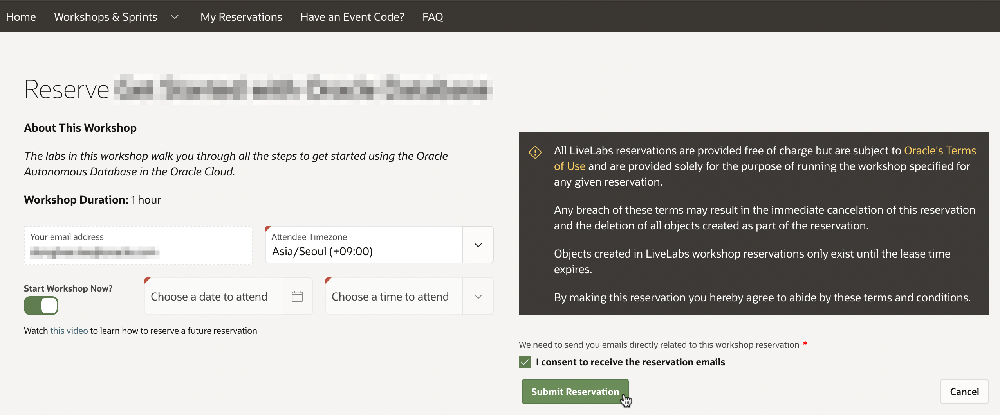
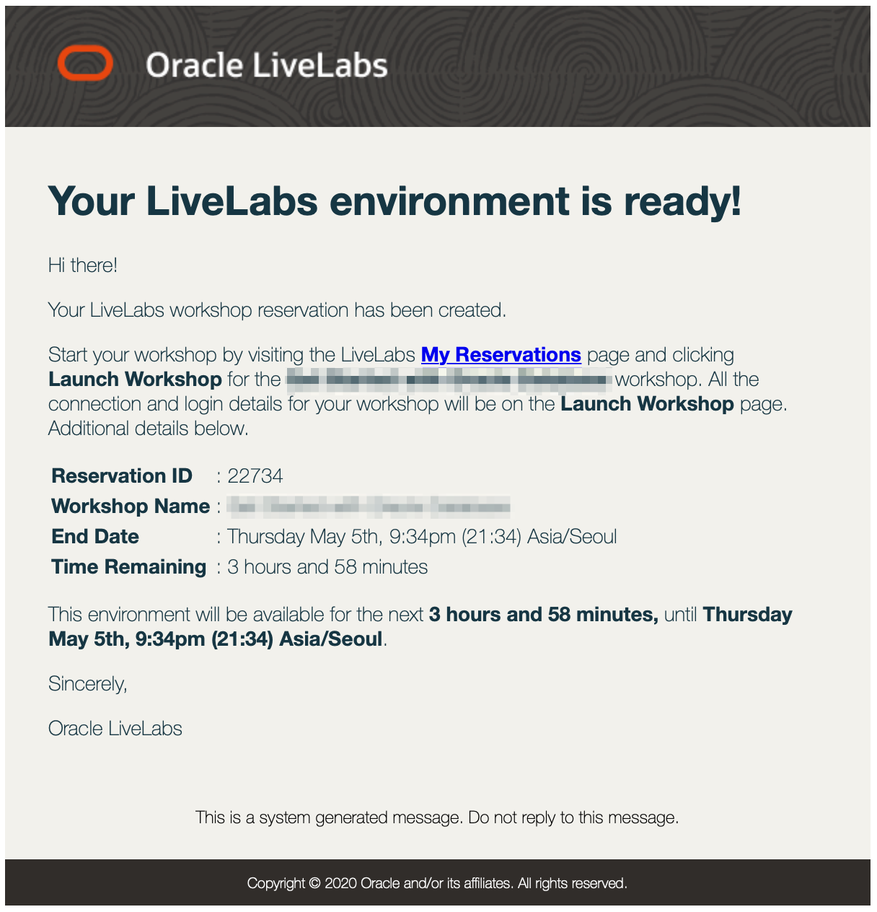
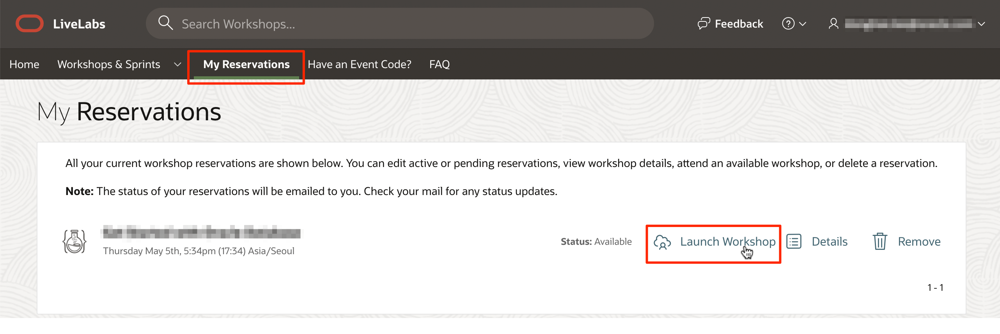
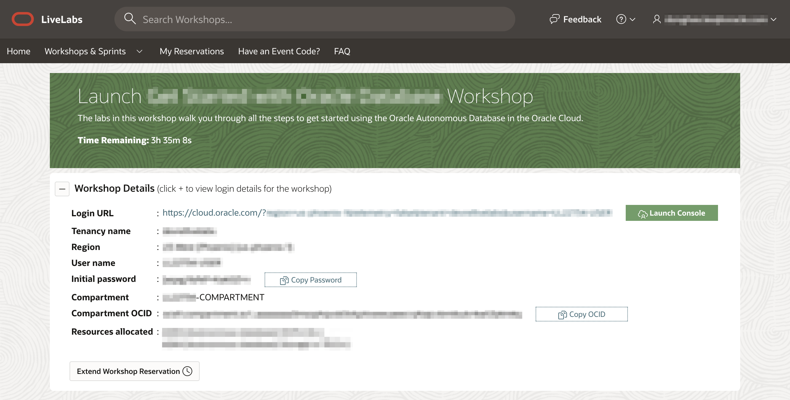
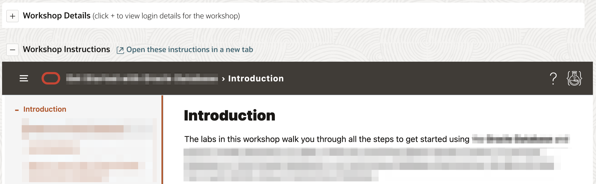

# Get Started

## Introduction

LiveLab을 시작하기 위해서는 Oracle Account와 LiveLabs 예약이 필요합니다. Oracle Account 생성은 무료이며, 예약한 LiveLabs 환경에 접속, 오라클 서포트 및 다른 공개된 오라클 컨텐츠에 접근하기 위해 필요합니다.

Oracle Account가 이미 있다면, Task 2로 건너뛰어 바로 진행합니다.

이미 실습 환경을 예약한 경우, 왼쪽 리스트에서 본 워크샵의 다음으로 건너뛰어 진행합니다!

## Task 1: Oracle Account 만들기

Oracle Account를 만드는 것은 다음 두 단계로 요약할 수 있습니다.

1. [oracle.com](https://www.oracle.com/index.html)으로 이동하여, *View Accounts*를 클릭합니다. 그리고 *Create an Account*을 선택합니다.

  

2. 아래 양식을 채운다음, *Create Account*을 클릭합니다.

  

## Task 2: 워크샵 예약 요청하기

1. [LiveLabs](http://bit.ly/golivelabs)에서, 원하는 워크샵 찾아 선택합니다. *Run On LiveLabs Sandbox*를 클릭합니다. *I consent to receive the reservation emails*을 체크하고 *Submit Reservation*을 클릭하여 워크샵을 예약합니다.

  

2. LiveLab 워크샵에 대한 예약을 한 후, 예약 요청, 환경 생성중, 환경 생성완료에 대한 메일을 Oracle Account 생성시 사용한 이메일로 각각 수신하게 될 것입니다.

  

  >**Note:** *Start Workshop Now*가 아닌 날짜, 시간으로 예약한 경우, 지정한 예약시간 직전에 한번 더 메일을 수신하게 될 것입니다.

3. LiveLabs에 로그인하여 **My Reservations**을 클릭합니다. 예약된 워크샵 중에서 환경이 준비된 상태인 것을 확인하고, **Launch Workshop**을 클릭하여 실습을 시작합니다.

  

4. Workshop Details에서 준비된 Oracle Cloud 정보가 보이고, Workshop Instructions에 실습과정이 보입니다. Workshop Details에서 **Launch Console**을 클릭하면, Oracle Cloud 로그인 페이지가 뜹니다. Workshop Details에 있는 정보를 사용하여 로그인합니다.

  

5. 처음 접속후 패스워드를 변경하면, 오라클 클라우드 콘솔에 로그인이 완료됩니다.

6. 이제, 워크샵 과정은 현재과 같이 또는 별도의 새로운 탭으로 열어서 볼 수 있습니다.

  

이제 **다음 실습을 진행**하시면 됩니다.

## Acknowledgements

- **Created By/Date** - Kay Malcolm, Database Product Management, March 2020
- **Contributors** - Rene Fontcha, Kamryn Vinson, Anoosha Pilli
- **Last Updated By/Date** - Arabella Yao, Product Manager, Database Product Management, March 2022
- **Korean Translator & Contributors** - DongHee Lee, February 2022
