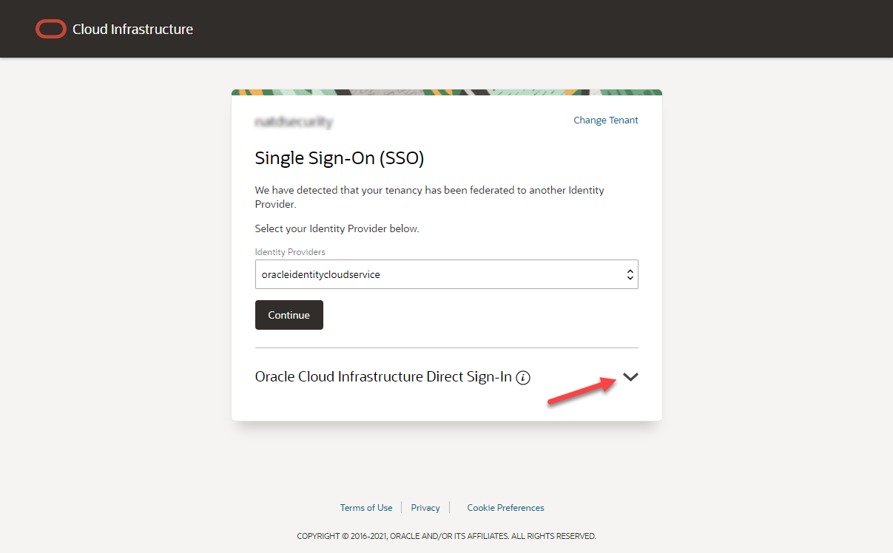
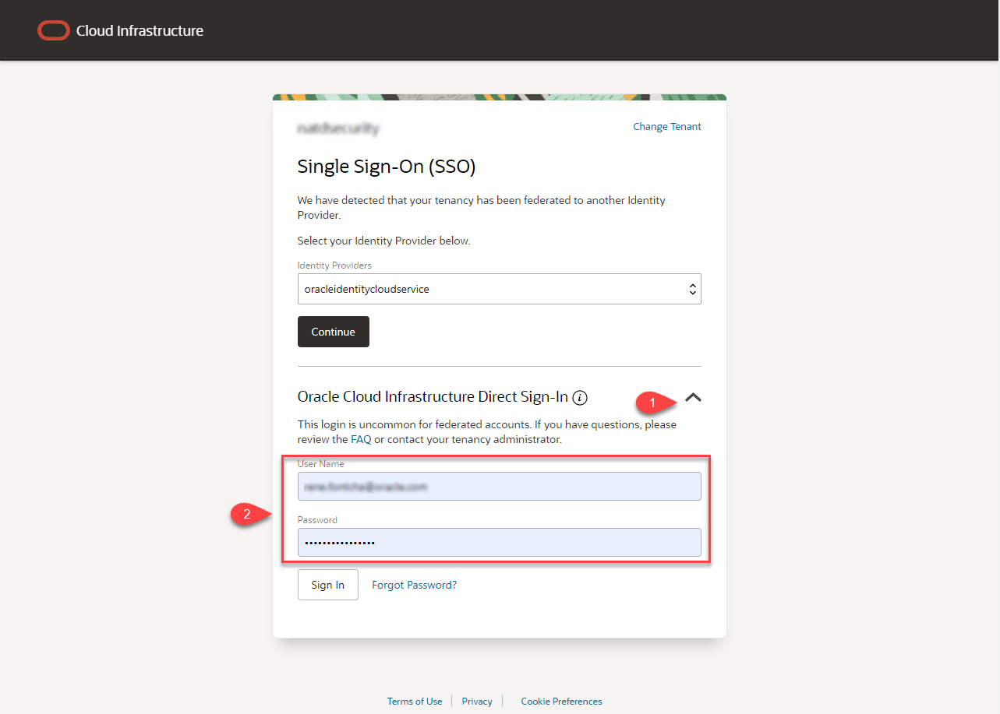
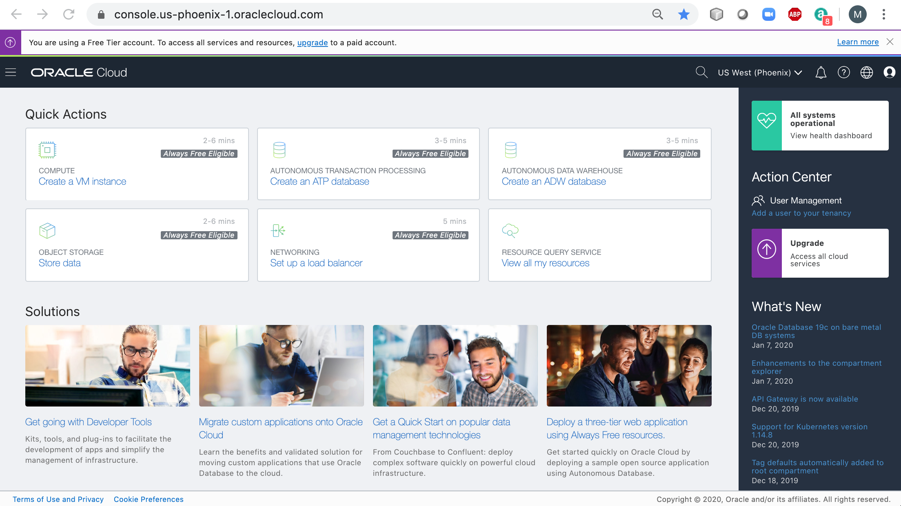

# Get Started

## Introduction

Oracle Cloud는 업계에서 가장 광범위하고 가장 통합된 클라우드 제공업체로서 퍼블릭 클라우드에서 고객 데이터 센터에 이르는 다양한 배포 옵션을 제공합니다. Oracle Cloud는 SaaS(Software as a Service), PaaS(Platform as a Service) 및 IaaS(Infrastructure as a Service) 전반에 걸쳐 동급 최고의 서비스를 제공합니다.

### 클라우드 계정 유형

두 가지 유형의 클라우드 계정을 제공합니다:

*Free Tier Account*: 무료 Oracle Cloud 프로모션에 등록하거나 유료 계정에 등록하면 환영 이메일을 받게 됩니다. 해당 이메일은 클라우드 계정 세부 정보와 로그인 자격 증명을 포함하고 있습니다. 30일간 미화 300$에 해당하는 크레딧이 사용가능한 Free Trial로 제공되며, 기간이 종료되면 Always Free 계정으로 전환되어 Always Free 자원만 사용 가능합니다.

*Oracle Cloud Paid Account*: 테넌시가 프로비저닝되면 Oracle은 로그인 자격 증명 및 URL이 포함된 이메일을 회사의 기본 관리자에게 보냅니다. 관리자는 Oracle Cloud에 액세스해야 하는 각 사람에 대한 사용자를 생성할 수 있습니다. 로그인 계정 정보는 수신된 이메일을 확인하거나 관리자에게 문의하십시오.

예상 시간: 5분

### 목표

- Oracle Cloud Account에 로그인하는 방법 알아보기

### 전제 조건

- Cloud Account Name - 테넌시 이름(관리자가 제공하거나 Oracle Cloud 환영 이메일에서 제공)
- 사용자 이름
- 비밀번호

## Task 1:  Oracle Cloud에 로그인

Oracle Cloud에서 로그아웃한 경우 다음 단계를 사용하여 다시 로그인하십시오.

1. [cloud.oracle.com](https://cloud.oracle.com)으로 이동하여 Cloud Account Name을 입력하고 **Next**을 클릭 합니다. 이전 섹션에서 계정을 만들 때 선택한 이름입니다. 귀하의 이메일 주소가 아닙니다. Cloud Account Name을 잊어버린 경우 확인 이메일을 참조하세요.

    

2. **Oracle Cloud Infrastructure Direct Sign-In** 뒤의 화살표를 확장하여 로그인 입력 필드를 보이게 합니다.

    

3. 클라우드 계정 정보를 입력하고 **Sign In**을 클릭합니다. 사용자 이름, 비밀번호를 입력하고 로그인 합니다.

    

4. 이제 Oracle Cloud에 로그인되었습니다!

    

이제 **다음 실습을 진행**하시면 됩니다.

## Acknowledgements

- **Created By/Date** - Tom McGinn, Database Product Management, March 2020
- **Contributors** - John Peach, Kamryn Vinson, Rene Fontcha
- **Last Updated By** - Tom McGinn, June 2021
- **Korean Translator & Contributors** - DongHee Lee, February 2022
