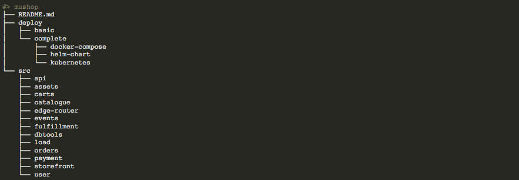
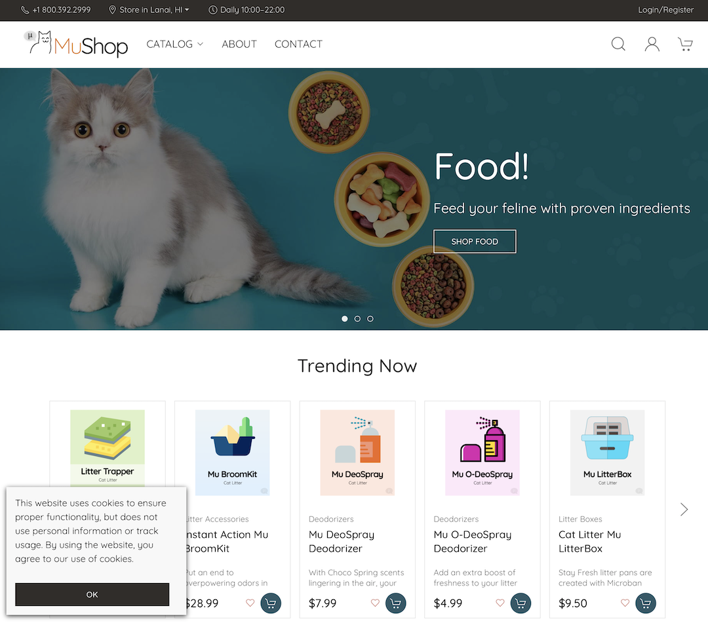

# Deploy the MuShop Application

## Introduction

MuShop 애플리케이션 배포 방식으로 Manual 배포(Docker, Kubernetes manifests 배포)부터 자동화된 배포 (Helm), 완전 자동화 배포 (Terraform)에 이르기 까지 다양한 배포 옵션을 제공합니다. 여기에서는 Helm을 이용한 배포 방식을 사용합니다.


마이크로 서비스기반 설계는 완벽한 관심사의 분리를 제공하여 개발자의 독립성을 제공합니다. 이러한 이점은 분명하지만 개발 환경에 약간의 복잡성을 가져올 수 있습니다.서비스는 필요할 때는 유연성을 제공하지만, 가능하면 동등한 구성을 지원합니다. 개발에서 운영까지 동일한 도구를 사용하는 것이 필수적입니다.

  
> *Note: 이 다이어그램에서는 여기서 다루지 않는 서비스도 포함됩니다.*

예상 시간: 25 분

### 목표

* MuShop 애플리케이션 이해하고 본인이 데모할 수 있도록 하는 것
* Helm을 통한 배포
* 애플리케이션 서비스를 외부로 개방

### 전제 조건

* Oracle Free Trial, Paid or LiveLabs Cloud Account
* Always Free는 현재 2022년 2월기준 OKE 제공하지 않습니다. Free Trial 이상이 필요합니다.
* **Setup Cloud Environment** 실습 완료

### 실습 비디오

[](youtube:n95aHQck0gA)


## Task 1: MuShop 소스코드 내려받기

1. Cloud Shell에서 다음 명령어로 MuShop 소스코드를 다운로드 받습니다.

    ````shell
    <copy>
    git clone https://github.com/TheKoguryo/oci-cloudnative.git mushop
    </copy>
    ````

    Sample response:

    ````shell
    Cloning into 'mushop'...
    remote: Enumerating objects: 23147, done.
    remote: Counting objects: 100% (5715/5715), done.
    remote: Compressing objects: 100% (1061/1061), done.
    remote: Total 23147 (delta 4948), reused 5129 (delta 4617), pack-reused 17432
    Receiving objects: 100% (23147/23147), 27.15 MiB | 10.08 MiB/s, done.
    Resolving deltas: 100% (14140/14140), done.
    ````

1. mushop 폴더로 이동합니다.

    ````shell
    <copy>
    cd mushop
    </copy>
    ````

    

    - *./deploy:* 애플리케이션 배포 관련 자원
    - *./src:* MuShop 각 마이크로서비스별 소스코드, Dockerfile 등

1. **kubectl** context를 확인합니다.

    ````shell
    <copy>
    kubectl config get-contexts
    </copy>
    ````

    Sample response:

    ````shell
    CURRENT   NAME                  CLUSTER               AUTHINFO           NAMESPACE
    *         context-c2bted2y77a   cluster-c2bted2y77a   user-c2bted2y77a
    ````

1. MuShop 애플리케이션을 위한 namespace를 생성합니다.

    ````shell
    <copy>
    kubectl create namespace mushop
    </copy>
    ````

    Sample response:

    ````shell
    namespace/mushop created
    ````

1. kubectl 명령어는 따로 설정하지 않으면 default namespace에 적용됩니다. 매 명령시 **--namespace=mushop**을 추가하는 번거러움을 없애기 위해 아래와 같이 현재 context에 미리 **--namespace=mushop**을 설정합니다. 이후 실행되는 kubectl 명령어는 따로 지정하지 않으면, mushop namespace에 실행됩니다.

    ````shell
    <copy>
    kubectl config set-context --current --namespace=mushop
    </copy>
    ````


1. **kubectl** context를 다시 확인합니다. 기본 NAMESPACE 항목이 mushop으로 변경되었습니다. 

    ````shell
    <copy>
    kubectl config get-contexts
    </copy>
    ````

    Sample response:

    ````shell
    CURRENT   NAME                  CLUSTER               AUTHINFO           NAMESPACE
    *         context-c2bted2y77a   cluster-c2bted2y77a   user-c2bted2y77a   mushop
    ````


## Task 2: Helm으로 애플리케이션 배포를 Cluster 셋업

MuShop 애플리케이션에서 제공하는 Helm Chart는 쿠버네티스 클러스터상에 다음과 같은 추가 서드 파티 애플리케이션도 함께 설치합니다. 아래의 애플리케이션들은 OCI와 연계되거나, 애플리케이션의 특정 기능을 활성화 해줍니다. 옵션을 통해 기능 활성화할 수 있으며, 여기서는 기본으로 설치되는 것만 사용하겠습니다.

| Chart | Purpose | Option | Default |
| --- | --- | --- | --- |
| [Prometheus](https://github.com/helm/charts/blob/master/stable/prometheus/README.md) | Service metrics aggregation | prometheus.enabled | true |
| [Grafana](https://github.com/helm/charts/blob/master/stable/grafana/README.md) | Infrastructure/service visualization dashboards | grafana.enabled | true |
| [Metrics Server](https://github.com/helm/charts/blob/master/stable/metrics-server/README.md) | Support for Horizontal Pod Autoscaling | metrics-server.enabled | true |
| [Ingress Nginx](https://kubernetes.github.io/ingress-nginx/) | Ingress controller and public Load Balancer | ingress-nginx.enabled | true |
| [Cert Manager](https://github.com/jetstack/cert-manager/blob/master/README.md) | x509 certificate management for Kubernetes | cert-manager.enabled | true |
| [Service Catalog](https://github.com/kubernetes-sigs/service-catalog/blob/master/charts/catalog/README.md) | Service Catalog chart utilized by Oracle Service Broker | catalog.enabled | false |


1. MuShop 유틸리티를 Namespace 생성

    ````shell
    <copy>
    kubectl create namespace mushop-utilities
    </copy>
    ````

    Sample response:

    ````shell
    namespace/mushop-utilities created
    ````

1. Helm을 사용하여 추가 설치될 서드 파티 애플리케이션 종속성 업데이트:

    ````shell
    <copy>
    helm dependency update deploy/complete/helm-chart/setup
    </copy>
    ````

    Sample response:

    ````shell
    Getting updates for unmanaged Helm repositories...
    ...Successfully got an update from the "https://kubernetes-sigs.github.io/metrics-server" chart repository
    ...Successfully got an update from the "https://kubernetes.github.io/ingress-nginx" chart repository
    ...Successfully got an update from the "https://charts.jetstack.io" chart repository
    ...Successfully got an update from the "https://kubernetes-sigs.github.io/service-catalog" chart repository
    ...Successfully got an update from the "https://grafana.github.io/helm-charts" chart repository
    ...Successfully got an update from the "https://prometheus-community.github.io/helm-charts" chart repository
    ...Successfully got an update from the "https://charts.helm.sh/stable" chart repository
    Saving 7 charts
    Downloading prometheus from repo https://prometheus-community.github.io/helm-charts
    Downloading grafana from repo https://grafana.github.io/helm-charts
    Downloading metrics-server from repo https://kubernetes-sigs.github.io/metrics-server
    Downloading ingress-nginx from repo https://kubernetes.github.io/ingress-nginx
    Downloading catalog from repo https://kubernetes-sigs.github.io/service-catalog
    Downloading cert-manager from repo https://charts.jetstack.io
    Downloading jenkins from repo https://charts.helm.sh/stable
    Deleting outdated charts
    ````

1. MuShop 유틸리티 애플리케이션 설치:

    ````shell
    <copy>
    helm install mushop-utils deploy/complete/helm-chart/setup --namespace mushop-utilities
    </copy>
    ````


## Task 3: Ingress IP 주소 확인

1. mushop-utilities에 배포된 전체 애플리케이션 확인합니다. 모든 Pod가 READY가 될때까지 기다립니다.

    ````shell
    <copy>
    kubectl get deployments --namespace mushop-utilities
    </copy>
    ````

    Sample response:

    ````shell
    NAME                                    READY   UP-TO-DATE   AVAILABLE   AGE
    mushop-utils-cert-manager               1/1     1            1           9m26s
    mushop-utils-cert-manager-cainjector    1/1     1            1           9m26s
    mushop-utils-cert-manager-webhook       1/1     1            1           9m26s
    mushop-utils-grafana                    1/1     1            1           9m26s
    mushop-utils-ingress-nginx-controller   1/1     1            1           9m26s
    mushop-utils-kube-state-metrics         1/1     1            1           9m26s
    mushop-utils-metrics-server             1/1     1            1           9m26s
    mushop-utils-prometheus-alertmanager    1/1     1            1           9m26s
    mushop-utils-prometheus-pushgateway     1/1     1            1           9m26s
    mushop-utils-prometheus-server          1/1     1            1           9m26s
    ````

2. Ingress Controller의 EXTERNAL-IP 확인:
    유틸리티 애플리케이션의 하나로 Nginx의 Ingress Controller가 설치됩니다. Nginx Ingress Controller는 OCI 로드밸런서로 노출되며, Public IP가 할당됩니다. 해당 IP로 오는 모든 요청을 쿠버네티스 Service를 통해 애플리케이션 컨테이너로 라우팅합니다.

    ````shell
    <copy>
    kubectl get svc mushop-utils-ingress-nginx-controller --namespace mushop-utilities
    </copy>
    ````

    Sample response:

    ````shell
    NAME                                    TYPE           CLUSTER-IP      EXTERNAL-IP     PORT(S)                      AGE
    mushop-utils-ingress-nginx-controller   LoadBalancer   10.96.194.130   129.xxx.xxx.xxx   80:30056/TCP,443:31381/TCP   2m18s
    ````

## Task 4: Helm을 사용하여 MuShop 애플리케이션 배포

helm이 구성 가능한 차트를 패키징하고 배포하는 방법을 제공한다는 것을 앞서 알아 봤습니다. 이제 MuShop 애플리케이션을 **Mock Mode**로 배포하겠습니다.클라우드 서비스와 연동하도록 애플리케이션은 준비되어 있지만, 여기서는 MuShop 애플리케이션에 집중하기 위해 애플리케이션에서 클라우드 서비스를 목업 모드로 처리하도록 하겠습니다.

1. "mock mode"로 MuShop 애플리케이션 배포

    ````shell
    <copy>
    helm install mushop deploy/complete/helm-chart/mushop --set global.mock.service="all"
    </copy>
    ````

1. 배포를 위해 애플리케이션 컨테이너 이미지를 받아 오는 데 처음에는 시간이 소요됩니다. 다음 명령어로 모든 Pod가 기동될때까지 기다립니다.

    ````shell
    <copy>
    kubectl get pods --watch
    </copy>
    ````

    *Note:* _watch_ 모드를 중지하려면 언제든 `CTRL-C`를 사용합니다. 단순히 Pod 리스트만 조회하려면 `kubectl get pods`을 사용합니다.

1. Helm 차트 설치가 완료되고, 모든 Pod가 기동(Running)되면, 다시 한번 Nginx Ingress Controller의 **EXTERNAL-IP**를 확인합니다.

    ````shell
    <copy>
    kubectl get svc mushop-utils-ingress-nginx-controller --namespace mushop-utilities
    </copy>
    ````

1. 브라우저로 http://< EXTERNAL-IP > 로 접속하여 MuShop Storefront로 이동합니다.

    


## Task 5: 배포된 앱 확인하기

다음은 가장 많이 사용되는 kubectl 실행 명령입니다:

* **kubectl get** - 리소스 목록을 조회할 때
* **kubectl describe** - 특정 리소스의 상세 정보를 확인할 때
* **kubectl logs** - Pod내의 컨테이너의 로그를 확인할 때
* **kubectl exec** - Pod내의 컨테이너에서 명령어 실행할 때

이러한 명령을 사용하여 애플리케이션이 배포된 시간, 현재 상태, 실행 중인 위치 및 어떠한 구성으로 되어 있는지 확인할 수 있습니다.

1. MuShop 애플리케이션의 deployment 정보 확인

    ````shell
    <copy>
    kubectl get deployments
    </copy>
    ````

    Deployment 자원을 만들때 사용할 애플리케이션의 컨테이너 이미지와 실행할 Pod 갯수(replicas)를 지정해야 합니다. 지금은 모두 1개의 Pod를 사용하고 있습니다.
    ````
    NAME                 READY   UP-TO-DATE   AVAILABLE   AGE
    mushop-api           1/1     1            1           7m51s
    mushop-assets        1/1     1            1           7m51s
    mushop-carts         1/1     1            1           7m51s
    mushop-catalogue     1/1     1            1           7m51s
    mushop-edge          1/1     1            1           7m51s
    mushop-events        1/1     1            1           7m51s
    mushop-fulfillment   1/1     1            1           7m51s
    mushop-nats          1/1     1            1           7m51s
    mushop-orders        1/1     1            1           7m51s
    mushop-payment       1/1     1            1           7m51s
    mushop-session       1/1     1            1           7m51s
    mushop-storefront    1/1     1            1           7m51s
    mushop-user          1/1     1            1           7m51s    
    ````

1. 배포된 Pod 확인

    ````shell
    <copy>
    kubectl get pods
    </copy>
    ````

    > Kubernetes는 애플리케이션 인스턴스를 호스팅할 Pod를 만듭니다. Pod는 하나 이상의 애플리케이션 컨테이너와 해당 컨테이너들을 위한 일부 공유 리소스의 그룹을 나타내는 Kubernetes에서 정의한 추상화된 단위입니다. 공유 리소스에는 다음이 포함됩니다:
    * 볼륨으로 표현되는 공유된 스토리지
    * 고유한 클러스터 IP 주소로 표현되는 네트워킹
    * 컨테이너 이미지 버전이나 사용할 특정 포트 등 각 컨테이너를 실행하는 방법에 대한 정보

    ````
    NAME                                 READY   STATUS      RESTARTS   AGE
    mushop-api-67df55b466-jqrf7          1/1     Running     0          9m58s
    mushop-assets-5d6f44b88f-89fw5       1/1     Running     0          9m58s
    mushop-assets-deploy-1-j2sp7         0/1     Completed   0          9m58s
    mushop-carts-5c97d8bf9c-mhdxr        1/1     Running     0          9m57s
    mushop-catalogue-c79d9464c-x5crv     1/1     Running     0          9m56s
    mushop-edge-8649c9b5dd-skxwd         1/1     Running     0          9m56s
    mushop-events-6f69d5cc79-4xjzt       1/1     Running     0          9m57s
    mushop-fulfillment-b59cc849-jgn2j    1/1     Running     0          9m58s
    mushop-nats-977d9d7df-7vljc          2/2     Running     0          9m58s
    mushop-orders-5f65f59497-gmzdp       1/1     Running     0          9m58s
    mushop-payment-6456f6df7-9g7mr       1/1     Running     0          9m57s
    mushop-session-678f95f767-jf5pr      1/1     Running     0          9m57s
    mushop-storefront-7c8c866d88-mcch6   1/1     Running     0          9m57s
    mushop-user-6b8b559cc6-cgqql         1/1     Running     0          9m57s    
    ````

1. 마지막으로 생성된 Pod 확인

    ````shell
    <copy>
    export POD_NAME=$(kubectl get pods -o go-template --template '{{range .items}}{{.metadata.name}}{{"\n"}}{{end}}'|awk '{print $1}'|tail -n 1) && \
    echo Using Pod: $POD_NAME
    </copy>
    ````

1. Pod내에 어떤 컨테이너가 있는지, 어떤 이미지를 사용하는 지 등을 확인

    ````shell
    <copy>
    kubectl describe pod $POD_NAME
    </copy>
    ````

1. 애플리케이션 `STDOUT` 로 보내는 출력은 컨테이너 로그를 생각하고 다음명령으로 확인 가능

    ````shell
    <copy>
    kubectl logs $POD_NAME
    </copy>
    ````

1. Pod내의 컨테이너내에서 직접 명령어 실행

    ````shell
    <copy>
    kubectl exec $POD_NAME -- env
    </copy>
    ````

1. Pod내의 컨테이너 작업 폴더 조회

    ````shell
    <copy>
    kubectl exec -it $POD_NAME -- ls
    </copy>
    ````

이제 **다음 실습을 진행**하시면 됩니다.

## Learn More

* [MuShop Github Repo](https://github.com/oracle-quickstart/oci-cloudnative)
* [MuShop Deployment documentation](https://oracle-quickstart.github.io/oci-cloudnative/cloud/)
* [Terraform Deploymment scripts](https://github.com/oracle-quickstart/oci-cloudnative/tree/master/deploy/complete/terraform)
* Full Solution deployment with one click - launches in OCI Resource Manager directly [](https://console.us-ashburn-1.oraclecloud.com/resourcemanager/stacks/create?region=home&zipUrl=https://github.com/oracle-quickstart/oci-cloudnative/releases/latest/download/mushop-stack-latest.zip)  

## Acknowledgements

* **Author** - Adao Junior
* **Contributors** -  Kay Malcolm (DB Product Management), Adao Junior
* **Last Updated By/Date** - Adao Junior, October 2020
* **Korean Translator & Contributors** - DongHee Lee, February 2022
