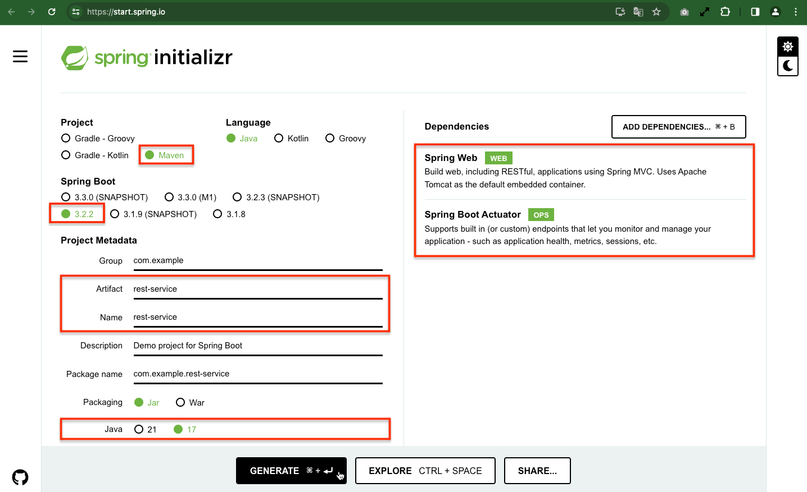
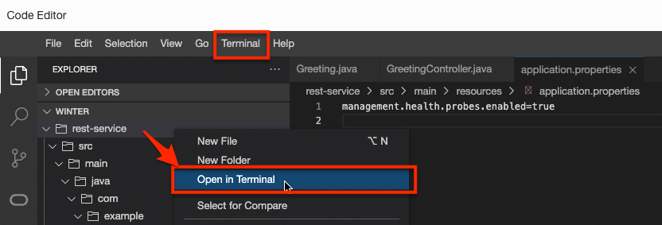
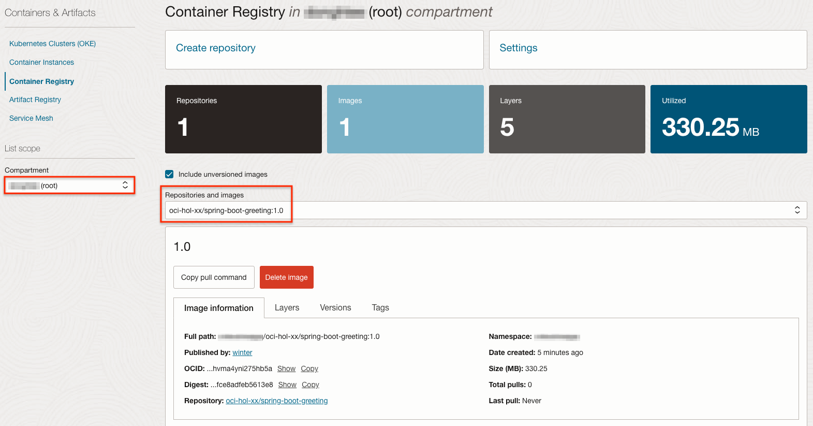

# Develop a Microservice

## Introduction

마이크로 서비스 애플리케이션 만들기 위해 자바에서는 Spring Boot를 많이 사용하고 오라클에서 지원하는 오픈소스 프레임워크인 Helidon도 사용되고 있습니다. 여기에서는 Spring Boot를 통해 마이크로 서비스를 만들고 OKE에 배포하는 과정을 통해 마이크로 서비스 개발, 컨테이너 이미지 생성, 쿠버네티스에서 구동하는 일련의 과정을 간단한 앱을 통해서 이해를 돕고자 합니다.

예상 시간: 30분

### 목표

* Spring Boot로 마이크로 서비스 만들기
* 컨테이너 이미지 만들기
* 컨테이너 이미지 레지스트리인 OCIR 등록하기
* Kubernetes인 OKE에 마이크로 서비스 배포하기

### 전제 조건

아래와 같이 코드 개발을 위한 툴이 필요합니다. 간단한 앱 개발로 여기서는 편의상 사전에 툴들이 설치된 Cloud Shell에서 진행하겠습니다.

* 선호하는 텍스트 편집기 또는 IDE 또는 Code Editor
* JDK 17 or later
* Maven 3.3+


## Task 1: Spring Boot 기반 마이크로 서비스 만들기

[Spring Initializr](https://start.spring.io)를 사용하여 기본 프로젝트 소스파일을 기반으로 개발을 하게 됩니다.
    
1. (Option #1) [Spring Initializr](https://start.spring.io)를 사용하여 기본 프로젝트 소스파일을 만듭니다.

    1) 아래 그림과 같이 프로젝트 정보(Spring Boot 4.x, Java 17)를 입력하고 **Generate**를 클릭하여 소스파일을 생성합니다.
    

    2) 다운로드 받은 파일을 Cloud Shell에 업로드 합니다.
    

            

    3) Cloud Shell에서 업로드된 파일을 unzip으로 압축해제 합니다.


2. (Option #2) Spring Initializr를 브라우저 대신 아래 명령을 통해 Cloud Shell에서 바로 기본 프로젝트 소스파일을 만듭니다.

    ````shell
    <copy>
    curl https://start.spring.io/starter.tgz -d type=maven-project -d bootVersion=4.0.1 -d baseDir=restservice -d name=rest-service -d artifactId=rest-service -d javaVersion=17 -d dependencies=web,actuator | tar -xzvf -   
    </copy>
    ````

3. **rest-service** 폴더로 이동합니다.

4. 요청에 대한 응답 메시지를 아래와 같은 JSON 메시지 응답하는 코드를 구현하겠습니다.

    ````shell
    {
        "id": 1,
        "content": "Hello, World!"
    }
    ````

    아래 코드를 복사하여 자바 클래스파일(src/main/java/com/example/restservice/Greeting.java)을 작성합니다.

    ````java
    <copy>
    package com.example.restservice;

    public class Greeting {

        private final long id;
        private final String content;

        public Greeting(long id, String content) {
            this.id = id;
            this.content = content;
        }

        public long getId() {
            return id;
        }

        public String getContent() {
            return content;
        }
    }
    </copy>
    ````

5. 코드 작성은 Cloud Shell에 있는 VI 에디터를 사용할 수도 있으며, 여기서는 OCI Code Editor 사용하겠습니다. 콘솔 오른쪽 상단에서 Code Editor를 실행합니다.

       

    - 왼쪽 Explorer 탭에서 유저 홈에서 앞서 압축 해제한 rest-service 프로젝트에 자바 클래스파일(src/main/java/com/example/restservice/Greeting.java)을 작성합니다. 이후 코드 작성도 동일한 방식으로 수행합니다.

    

6. /greeting URL로 요청을 보내면, 앞서 본 JSON 메시지 응답하도록 코드를 src/main/java/com/example/restservice/GreetingController.java 위치에 작성합니다.

    ````java
    <copy>
    package com.example.restservice;

    import java.util.concurrent.atomic.AtomicLong;

    import org.springframework.web.bind.annotation.GetMapping;
    import org.springframework.web.bind.annotation.RequestParam;
    import org.springframework.web.bind.annotation.RestController;

    @RestController
    public class GreetingController {

        private static final String template = "Hello, %s!";
        private final AtomicLong counter = new AtomicLong();

        @GetMapping("/greeting")
        public Greeting greeting(@RequestParam(value = "name", defaultValue = "World") String name) {
            return new Greeting(counter.incrementAndGet(), String.format(template, name));
        }
    }
    </copy>
    ````

7. Kubernetes에서는 컨테이너 기동후 준비시간(readiness), 헬스체크를(liveness)를 Spring Boot에 활성화하기 src/main/resources/application.properties 파일에 다음 설정을 추가합니다.

    ````shell
    <copy>    
    management.health.probes.enabled=true
    </copy>
    ````

8. Code Editor에서 Terminal을 실행합니다. 위쪽 메뉴에서 Terminal 실행후 rest-service 폴더로 이동합니다. 또는 rest-service 폴더를 우클릭하여 Terminal을 실행합니다.

    

9. 현재 JDK 버전을 확인합니다.

    ````shell
    $ java -version
    java version "11.0.29" 2025-10-21 LTS
    Java(TM) SE Runtime Environment 18.9 (build 11.0.29+8-LTS-387)
    Java HotSpot(TM) 64-Bit Server VM 18.9 (build 11.0.29+8-LTS-387, mixed mode)
    $ <copy>csruntimectl java list</copy>
    graalvmeejdk-17                                  /usr/lib64/graalvm/graalvm22-ee-java17
    oraclejdk-1.8                                     /usr/lib/jvm/jdk-1.8.0_471-oracle-x64
    * oraclejdk-11                                      /usr/lib/jvm/jdk-11.0.29-oracle-x64          
    ````
10. csruntimectl을 통해 생성한 Spring Boot 설정에 맞게 JDK 17로 변경합니다.

    ````shell
    $ <copy>csruntimectl java set graalvmeejdk-17</copy>
    The current managed java version is set to graalvmeejdk-17.

    $ java -version
    java version "17.0.10" 2024-01-16 LTS
    Java(TM) SE Runtime Environment GraalVM EE 22.3.5 (build 17.0.10+11-LTS-jvmci-22.3-b32)
    Java HotSpot(TM) 64-Bit Server VM GraalVM EE 22.3.5 (build 17.0.10+11-LTS-jvmci-22.3-b32, mixed mode, sharing)
    ````

11. Terminal에서 실행을 위해 코드를 빌드합니다.

    ````shell
    <copy>
    ./mvnw clean package
    </copy>
    ````

12. Terminal에서 빌드된 JAR 파일을 실행합니다.

    ````shell
    <copy>
    java -jar target/restservice-0.0.1-SNAPSHOT.jar
    </copy>
    ````

    아래와 같이 서비스가 빠르게 실행되고, 내장 Tomcat을 통해 8080 포트로 실행되는 것을 빠르게 실행되는 것을 알 수 있습니다.

    ````shell
    $ java -jar target/restservice-0.0.1-SNAPSHOT.jar
    

    .   ____          _            __ _ _
    /\\ / ___'_ __ _ _(_)_ __  __ _ \ \ \ \
    ( ( )\___ | '_ | '_| | '_ \/ _` | \ \ \ \
    \\/  ___)| |_)| | | | | || (_| |  ) ) ) )
    '  |____| .__|_| |_|_| |_\__, | / / / /
    =========|_|==============|___/=/_/_/_/

    :: Spring Boot ::                (v4.0.1)

    2025-12-20T15:30:00.785Z  INFO 5644 --- [restservice] [           main] c.e.restservice.RestserviceApplication   : Starting RestserviceApplication v0.0.1-SNAPSHOT using Java 17.0.10 with PID 5644 (/home/kildong_ho/restservice/target/restservice-0.0.1-SNAPSHOT.jar started by kildong_ho in /home/kildong_ho/restservice)
    2025-12-20T15:30:00.791Z  INFO 5644 --- [restservice] [           main] c.e.restservice.RestserviceApplication   : No active profile set, falling back to 1 default profile: "default"
    2025-12-20T15:30:02.085Z  INFO 5644 --- [restservice] [           main] o.s.boot.tomcat.TomcatWebServer          : Tomcat initialized with port 8080 (http)
    2025-12-20T15:30:02.097Z  INFO 5644 --- [restservice] [           main] o.apache.catalina.core.StandardService   : Starting service [Tomcat]
    2025-12-20T15:30:02.097Z  INFO 5644 --- [restservice] [           main] o.apache.catalina.core.StandardEngine    : Starting Servlet engine: [Apache Tomcat/11.0.15]
    2025-12-20T15:30:02.135Z  INFO 5644 --- [restservice] [           main] b.w.c.s.WebApplicationContextInitializer : Root WebApplicationContext: initialization completed in 1170 ms
    2025-12-20T15:30:02.806Z  INFO 5644 --- [restservice] [           main] o.s.b.a.e.web.EndpointLinksResolver      : Exposing 1 endpoint beneath base path '/actuator'
    2025-12-20T15:30:02.902Z  INFO 5644 --- [restservice] [           main] o.s.boot.tomcat.TomcatWebServer          : Tomcat started on port 8080 (http) with context path '/'
    2025-12-20T15:30:02.909Z  INFO 5644 --- [restservice] [           main] c.e.restservice.RestserviceApplication   : Started RestserviceApplication in 2.579 seconds (process running for 3.101)
    ````

11. Code Editor 메뉴에서 **Terminal** &gt; **New Terminal**을 클릭하여 Terminal을 하나 더 실행합니다.

12. 두 번째 Terminal에서 서비스를 테스트합니다.

    ````shell
    <copy>
    curl http://localhost:8080/greeting; echo
    </copy>    
    ````

    ````json
    {"id":1,"content":"Hello, World!"}    
    ````

    

13. 첫 번째 Terminal에서 실행되는 앱을 Control+C를 눌러 중지합니다.

## Task 2: Container Image 만들기

쿠버네티스에서 실행하기 위해서는 구동할 서비스 애플리케이션을 컨테이너화 하여야 합니다. Docker 클라이언트를 통해 컨테이너 이미지를 만듭니다.

1. [Getting Started | Spring Boot Docker](https://spring.io/guides/topicals/spring-boot-docker) 예시에서 보면 Dockerfile 베이스 이미지로 Docker Hub에 있는 eclipse-temurin:17-jdk-alpine 이미지를 사용합니다.

    ```shell
    # Dockerfile
    FROM eclipse-temurin:17-jdk-alpine
    VOLUME /tmp
    ARG JAR_FILE=target/*.jar
    COPY ${JAR_FILE} app.jar
    ENTRYPOINT ["java","-jar","/app.jar"]
    ```

2. OCI에서는 Java를 무료로 사용할 수 있습니다. 그에 따라 [Oracle Container Registry (OCR)](https://container-registry.oracle.com/)에서 제공하는 Java, GraalVM에 대한 Container Image도 무료로 사용할 수 있으며, 해당 이미지는 지속적으로 업데이트됩니다.

    - [High-performance Java on OCI at no additional cost](https://www.oracle.com/cloud/java/#:~:text=High%2Dperformance%20Java%20on%20OCI,interoperability%20with%20no%20performance%20penalty.)
    - [Oracle Java SE Subscription](https://www.oracle.com/a/tech/docs/javase-subscription-datasheet.pdf)

    
    

3. 그래서 여기서는 [Oracle Container Registry (OCR)](https://container-registry.oracle.com/) 에서 제공하는 Oracle GraalVM Container Image을 베이스 이미지로 사용합니다.

    프로젝트 폴더에 파일이름을 Dockerfile으로 하여 파일을 만들고 아래 내용으로 붙여 넣습니다. 

    ````shell
    <copy>
    FROM container-registry.oracle.com/graalvm/jdk:17
    WORKDIR /app
    ARG JAR_FILE=target/*.jar
    COPY ${JAR_FILE} app.jar
    ENTRYPOINT ["java","-jar","/app/app.jar"]    
    </copy>
    ````

    

4. Terminal에서 이미지를 빌드합니다.

    ````shell
    <copy>
    docker build -t spring-boot-greeting:1.0 .
    </copy>
    ````

    ````shell
    $ docker build -t spring-boot-greeting:1.0 .
    STEP 1/5: FROM container-registry.oracle.com/graalvm/jdk:17
    Trying to pull container-registry.oracle.com/graalvm/jdk:17...
    Getting image source signatures
    Copying blob 7f04b1452f8d done   | 
    Copying blob 1538e4715097 done   | 
    Copying blob 9a2d980b2d85 done   | 
    Copying config 693465b7b4 done   | 
    Writing manifest to image destination
    STEP 2/5: WORKDIR /app
    --> 9e8259e8e1f8
    STEP 3/5: ARG JAR_FILE=target/*.jar
    --> ed6456bf06e7
    STEP 4/5: COPY ${JAR_FILE} app.jar
    --> 98236f6422d9
    STEP 5/5: ENTRYPOINT ["java","-jar","/app/app.jar"]
    COMMIT spring-boot-greeting:1.0
    --> 0e73027e4852
    Successfully tagged localhost/spring-boot-greeting:1.0
    0e73027e4852df3ae55aa2fad641b48452dc9e7a4a9528e93e79b06573e547f8
    ````    

3. 현재 로컬(여기서는 Cloud Shell)에 있는 이미지를 조회합니다.

    ````shell
    $ <copy>docker images</copy>
    REPOSITORY                                TAG IMAGE ID     CREATED       SIZE
    localhost/spring-boot-greeting            1.0 0e73027e4852 2 minutes ago 735 MB
    container-registry.oracle.com/graalvm/jdk 17  693465b7b460 5 months ago  713 MB    
    ````    

## Task 3: OCIR에 이미지 등록하기

1. OCIR에 컨테이너 이미지를 푸시하기 위해서는 다음과 같은 이미지 태그 네이밍 규칙을 따라야 합니다. 규칙은 아래와 같습니다.

    > ````<OCI_REGION>.ocir.io/<TENANCY_NAMESPACE>/<REPO_NAME>:<TAG>````

    - OCI_REGION: region-key or region-identifier 둘 다 사용 가능, 서울은 icn 또는 ap-seoul-1, 춘천은 yny 또는 ap-chuncheon-1을 쓰면 됩니다.
        * 전체 리전별 주소정보는 [OCIR Available Endpoints](https://docs.oracle.com/en-us/iaas/Content/Registry/Concepts/registryprerequisites.htm#regional-availability)에서 확인하세요.
    - TENANCY_NAMESPACE: OCI 콘솔 Tenancy 상세 정보에서 Object Storage Namespace로 확인하거나, 아래 예시와 같이 Cloud Shell 또는 Code Editor Terminal에서 **oci os ns get**으로 확인합니다.

        ````shell
        $ <copy>oci os ns get</copy>
        {
            "data": "axjowrxaexxx"
        }
        ````

    - REPO_NAME: OCIR에서 Cloud Account내에서 고유하게 사용하는 저장소 이름입니다. 사용할 이미지 이름 또는 경로가 있는 경우 경로까지 포함한 이름

        * 예시) oci-hol-*xx*/spring-boot-greeting

    - TAG: 예시) 1.0

    - 작성 태그 예시

        ```shell
        # 네이밍 규칙
        <OCI_REGION>.ocir.io/<TENANCY_NAMESPACE>/<REPO_NAME>:<TAG>

        # 작성 예시
        # 각자 환경에 맞게 수정 필요
        ap-chuncheon-1.ocir.io/axjowrxaexxx/oci-hol-xx/spring-boot-greeting:1.0
        ```    

2. OCIR 등록을 위해 생성한 기존 이미지에 추가로 태그를 답니다.

    ````shell
    $ docker tag spring-boot-greeting:1.0 ap-chuncheon-1.ocir.io/axjowrxaexxx/oci-hol-xx/spring-boot-greeting:1.0
    
    $ docker images
    REPOSITORY                                                          TAG IMAGE ID     CREATED       SIZE
    ap-chuncheon-1.ocir.io/axjowrxaexxx/oci-hol-xx/spring-boot-greeting 1.0 0e73027e4852 8 minutes ago 735 MB
    localhost/spring-boot-greeting                                      1.0 0e73027e4852 8 minutes ago 735 MB
    container-registry.oracle.com/graalvm/jdk                           17  693465b7b460 5 months ago  713 MB      
    ````    

3. OCIR에 이미지를 Push 하기 위해서는 Docker CLI로 OCIR에 로그인이 필요합니다. Username 및 Password는 다음과 같습니다.
    - Docker CLI 로그인용 Username: `<TENANCY_NAMESPACE>/<USER_NAME>` 형식
        * `<USER_NAME>`: OCI 서비스 콘솔에서 유저 Profile에서 보이는 유저명
        
            * Default Identity Domain 사용시: default/kildong.hong@example.com 또는 kildong.hong@example.com
            * oracleidentitycloudservice Identity Domain 내 유저인 경우:  예, oracleidentitycloudservice/kildong.hong@example.com

              
    - Docker CLI 로그인용 Password: 사용자의 Auth Token을 사용
    
        * **유저명** 클릭후 **Tokens and keys** > **Auth tokens** > **Generate token** 을 클릭합니다. Auth Token은 생성시점에만 확인이 가능하므로 복사해서 기록해 둡니다.

         
         
         

    - 아래와 같이 Docker CLI로 로그인합니다.
        * OCI_REGION: *각자 환경에 맞게 수정 필요*, 예시에서는 ap-chuncheon-1
        * TENANCY_NAMESPACE: *각자 환경에 맞게 수정 필요*, 예시에서는 axjowrxaexxx
        * USER_NAME: *각자에 맞게 수정 필요*

        ````shell
        docker login $OCI_REGION.ocir.io -u $TENANCY_NAMESPACE/$USER_NAME
        ````

        - 실행예시
    
        ````shell
        # Identity domain: Default
        # Username: kildong.hong@example.com인 경우
        $ docker login ap-chuncheon-1.ocir.io -u axjowrxaexxx/default/kildong.hong@example.com
        Password: 
        Login Succeeded!
        ````    

4. OCIR를 위해 단 이미지 태그를 사용하여 이미지를 Push합니다.
    ````
    <copy>
    docker push $OCI_REGION.ocir.io/$TENANCY_NAMESPACE/oci-hol-xx/spring-boot-greeting:1.0
    </copy>   
    ````

    - 실행예시

    ````
    docker push ap-chuncheon-1.ocir.io/axjowrxaexxx/oci-hol-xx/spring-boot-greeting:1.0
    ````

5. OCI 콘솔에서 왼쪽 상단의 **Navigation Menu**를 클릭하고 **Developer Services**로 이동한 다음 **Container Registry**를 선택 합니다.

6. Root compartment에 Push한 이미지가 등록된 것을 볼 수 있습니다.

    > 특정 Compartment에 이미지를 Push 하기 위해서는 Push 되기 전에 OCIR에 Repository가 만들어져 있어야 합니다. 없는 경우 Root Compartment에 자동으로 Private Repository가 생성되도록 기본 설정되어 있습니다.

         

## Task 4: OKE에 마이크로 서비스 배포하기

1. OCIR에 이미지를 사용하여 OKE에 컨테이너를 기동하기 위해서는 OKE에서 OCIR 이미지에 접근하는 권한이 필요합니다. OCIR *Private* Repository로 등록했기 때문에 OKE에 접속을 위한 secret를 생성합니다. 이미 Cloud Shell에서 Docker CLI로 OCIR에 이미 로그인 했으므로 해당 정보를 이용하여 생성합니다.

    ````shell
    <copy>
    kubectl create secret docker-registry ocir-secret --docker-server=ap-chuncheon-1.ocir.io \
    --docker-username=axjowrxaexxx/default/kildong.hong@example.com \
    --docker-password='<oci-auth-token>'
    </copy>
    ````

2. 다음 YAML 파일을 이용해 OKE에 배포합니다. Load Balancer 사용도 함께 진행하기 위해 Service 자원도 함께 배포합니다.

    - 배포 파일 생성합니다. 예, 파일명: spring-boot-greeting.yaml
    
        * *`IMAGE_REGISTRY_PATH`*: *각자에 맞게 수정 필요*, 예시에서는 `ap-chuncheon-1.ocir.io/axjowrxaexxx/oci-hol-xx/spring-boot-greeting:1.0`

    ````yaml
    <copy>
    apiVersion: apps/v1
    kind: Deployment
    metadata:
      labels:
        app: spring-boot-greeting
      name: spring-boot-greeting-deployment
    spec:
      replicas: 1
      selector:
        matchLabels:
          app: spring-boot-greeting
      template:
        metadata:
          labels:
            app: spring-boot-greeting
        spec:
          containers:
          - name: spring-boot-greeting
            image: $IMAGE_REGISTRY_PATH
            imagePullPolicy: Always
          imagePullSecrets:
          - name: ocir-secret
    ---
    apiVersion: v1
    kind: Service
    metadata:
      name: spring-boot-greeting-service
      annotations:
        oci.oraclecloud.com/load-balancer-type: "lb"
        service.beta.kubernetes.io/oci-load-balancer-shape: "flexible"
        service.beta.kubernetes.io/oci-load-balancer-shape-flex-min: "10"
        service.beta.kubernetes.io/oci-load-balancer-shape-flex-max: "10"
        service.beta.kubernetes.io/oci-load-balancer-backend-protocol: "HTTP"  
    spec:
      selector:
        app: spring-boot-greeting
      ports:
        - protocol: TCP
          port: 80
          targetPort: 8080
      type: LoadBalancer
    </copy>
    ````

3. 작성한 yaml 파일을 통해 개발한 Spring Boot 앱을 배포합니다.

    ````shell
    <copy>
    kubectl apply -f spring-boot-greeting.yaml
    </copy>
    ````


4. kubectl get all 명령으로 배포된 자원을 확인합니다.

    ````shell
    <copy>
    kubectl get all
    </copy>
    ````

    ````shell
    $ kubectl get all
    NAME                                                   READY   STATUS    RESTARTS   AGE
    pod/spring-boot-greeting-deployment-5694d4c88c-fvjmr   1/1     Running   0          3m46s

    NAME                                   TYPE           CLUSTER-IP     EXTERNAL-IP      PORT(S)             AGE
    service/kubernetes                     ClusterIP      10.96.0.1      <none>           443/TCP,12250/TCP   3h25m
    service/spring-boot-greeting-service   LoadBalancer   10.96.60.197   158.xxx.xx.xxx   80:31961/TCP        3m46s

    NAME                                              READY   UP-TO-DATE   AVAILABLE   AGE
    deployment.apps/spring-boot-greeting-deployment   1/1     1            1           3m46s

    NAME                                                         DESIRED   CURRENT   READY   AGE
    replicaset.apps/spring-boot-greeting-deployment-5694d4c88c   1         1         1       3m46s
    ````

5. Pod가 정상적으로 기동하였습니다. LoadBalancer의 EXTERNAL-IP를 통해 서비스를 요청합니다.
    - EXTERNAL-IP가 `<pending>` 상태인 경우 LoadBalancer가 생성완료될때 까지 잠시 기다립니다.

    ```shell
    <copy>
    curl http://158.xxx.xxx.xxx/greeting; echo
    </copy>
    ```

    ````shell
    {"id":1,"content":"Hello, World!"}    
    ````

6. 테스트가 끝나면 자원을 정리합니다.

    ````shell
    <copy>
    kubectl delete deploy spring-boot-greeting-deployment
    kubectl delete svc spring-boot-greeting-service
    </copy>
    ````

이제 **다음 실습을 진행**하시면 됩니다.

## Learn More

* [Building a RESTful Web Service](https://spring.io/guides/gs/rest-service/)
* [Spring Boot with Docker](https://spring.io/guides/gs/spring-boot-docker/)

## Acknowledgements

- **Author** - DongHee Lee, March 2023
- **Last Updated By/Date** - DongHee Lee, December 2025
