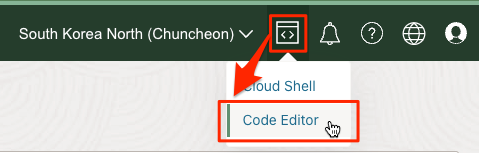
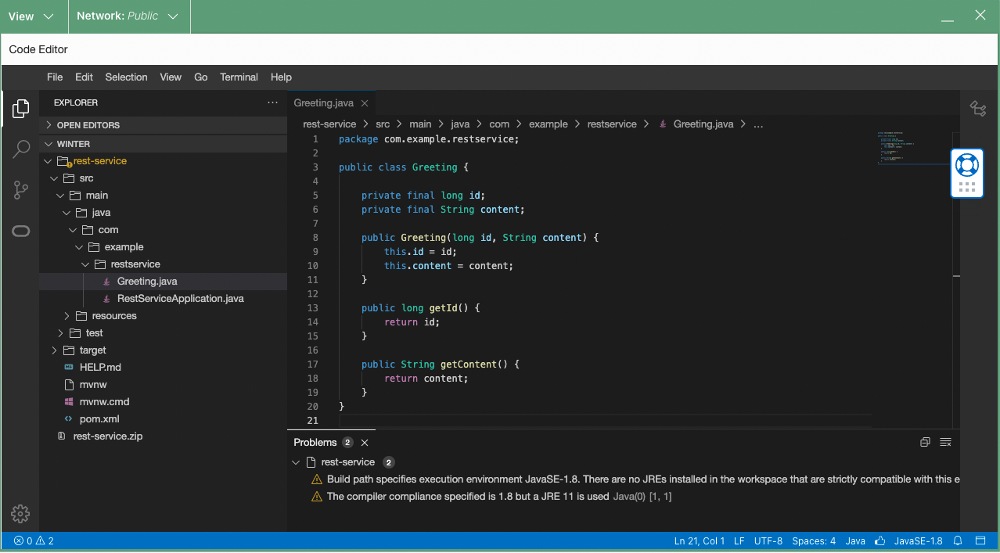
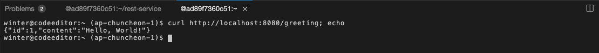
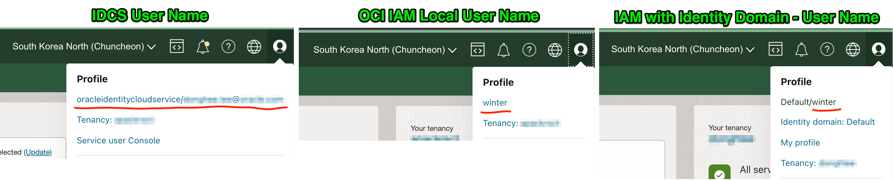

# Develop a Microservice

## Introduction

마이크로 서비스 애플리케이션 만들기 위해 자바에서는 Spring Boot를 많이 사용하고 오라클에서 지원하는 오픈소스 프레임워크인 Helidon도 사용되고 있습니다. 여기에서는 Spring Boot를 통해 마이크로 서비스를 만들고 OKE에 배포하는 과정을 통해 마이크로 서비스 개발, 컨테이너 이미지 생성, 쿠버네티스에서 구동하는 일련의 과정을 간단한 앱을 통해서 이해를 돕고자 합니다.

예상 시간: 30분

### 목표

* Spring Boot로 마이크로 서비스 만들기
* 컨테이너 이미지 만들기
* 컨테이너 이미지 레지스트리인 OCIR 등록하기
* Kubernetes인 OKE에 마이크로 서비스 배포하기

### 전제 조건

아래와 같이 코드 개발을 위한 툴이 필요합니다. 간단한 앱 개발로 여기서는 편의상 사전에 툴들이 설치된 Cloud Shell에서 진행하겠습니다.

* 선호하는 텍스트 편집기 또는 IDE 또는 Code Editor
* JDK 1.8 or later
* Maven 3.3+

### 실습 비디오

[](youtube:8XKd62hwNQg)

## Task 1: Spring Boot 기반 마이크로 서비스 만들기

[Spring Initializr](https://start.spring.io)를 사용하여 기본 프로젝트 소스파일을 기반으로 개발을 하게 됩니다.
    
1. (Option #1) [Spring Initializr](https://start.spring.io)를 사용하여 기본 프로젝트 소스파일을 만듭니다.

    1) 아래 그림과 같이 프로젝트 정보(Spring Boot 2.7.x, Java 11)를 입력하고 **Generate**를 클릭하여 소스파일을 생성합니다.
    

    2) 다운로드 받은 파일을 Cloud Shell에 업로드 합니다.
    

            

    3) Cloud Shell에서 업로드된 파일을 unzip으로 압축해제 합니다.


2. (Option #2) Spring Initializr를 브라우저 대신 아래 명령을 통해 Cloud Shell에서 바로 기본 프로젝트 소스파일을 만듭니다.

    ````
    <copy>
    curl https://start.spring.io/starter.tgz -d type=maven-project -d bootVersion=2.7.11.RELEASE -d baseDir=rest-service -d name=rest-service -d artifactId=rest-service -d javaVersion=11 -d dependencies=web,actuator | tar -xzvf -
    </copy>
    ````

3. **rest-service** 폴더로 이동합니다.

4. 요청에 대한 응답 메시지를 아래와 같은 JSON 메시지 응답하는 코드를 구현하겠습니다.

    ````
    {
        "id": 1,
        "content": "Hello, World!"
    }
    ````

    아래 코드를 복사하여 자바 클래스파일(src/main/java/com/example/restservice/Greeting.java)을 작성합니다.

    ````
    <copy>
    package com.example.restservice;

    public class Greeting {

        private final long id;
        private final String content;

        public Greeting(long id, String content) {
            this.id = id;
            this.content = content;
        }

        public long getId() {
            return id;
        }

        public String getContent() {
            return content;
        }
    }
    </copy>
    ````

5. 코드 작성은 Cloud Shell에 있는 VI 에디터를 사용할 수도 있으며, 여기서는 OCI Code Editor 사용하겠습니다. 콘솔 오른쪽 상단에서 Code Editor를 실행합니다.

    

    - 왼쪽 Explorer 탭에서 유저 홈에서 앞서 압축 해제한 rest-service 프로젝트에 자바 클래스파일(src/main/java/com/example/restservice/Greeting.java)을 작성합니다. 이후 코드 작성도 동일한 방식으로 수행합니다.

    

6. 같은 위치(src/main/java/com/example/restservice/GreetingController.java)에 GreetingController.java 파일을 작성합니다. /greeting URL로 HTTP Get 요청에 대한 처리 결과, 여기서는 응답 메시지 전달을 위한 RestController 코드입니다.

    ````
    <copy>
    package com.example.restservice;

    import java.util.concurrent.atomic.AtomicLong;

    import org.springframework.web.bind.annotation.GetMapping;
    import org.springframework.web.bind.annotation.RequestParam;
    import org.springframework.web.bind.annotation.RestController;

    @RestController
    public class GreetingController {

        private static final String template = "Hello, %s!";
        private final AtomicLong counter = new AtomicLong();

        @GetMapping("/greeting")
        public Greeting greeting(@RequestParam(value = "name", defaultValue = "World") String name) {
            return new Greeting(counter.incrementAndGet(), String.format(template, name));
        }
    }
    </copy>
    ````

7. Kubernetes에서는 컨테이너 기동후 준비시간(readiness), 헬스체크를(liveness)를 Spring Boot에 활성화하기 src/main/resources/application.properties 파일에 다음 설정을 추가합니다.

    ````
    <copy>    
    management.health.probes.enabled=true
    </copy>
    ````

8. Code Editor에서 Terminal을 실행합니다. 위쪽 메뉴에서 Terminal 실행후 rest-service 폴더로 이동합니다. 또는 rest-service 폴더를 우클릭하여 Terminal을 실행합니다.

    
    

9. Terminal에서 실행을 위해 코드를 빌드합니다.

    ````
    <copy>
    ./mvnw clean package
    </copy>
    ````

10. Terminal에서 빌드된 JAR 파일을 실행합니다.

    ````
    <copy>
    java -jar target/rest-service-0.0.1-SNAPSHOT.jar
    </copy>
    ````

    아래와 같이 서비스가 빠르게 실행되고, 내장 Tomcat을 통해 8080 포트로 실행되는 것을 빠르게 실행되는 것을 알 수 있습니다.

    ````    
    $ java -jar target/rest-service-0.0.1-SNAPSHOT.jar
    
      .   ____          _            __ _ _
     /\\ / ___'_ __ _ _(_)_ __  __ _ \ \ \ \
    ( ( )\___ | '_ | '_| | '_ \/ _` | \ \ \ \
     \\/  ___)| |_)| | | | | || (_| |  ) ) ) )
      '  |____| .__|_| |_|_| |_\__, | / / / /
     =========|_|==============|___/=/_/_/_/
     :: Spring Boot ::               (v2.7.13)
    
    2023-06-26 07:42:34.639  INFO 5332 --- [           main] c.e.restservice.RestServiceApplication   : Starting RestServiceApplication v0.0.1-SNAPSHOT using Java 11.0.17 on eff504e32675 with PID 5332 (/home/winter/rest-service/target/rest-service-0.0.1-SNAPSHOT.jar started by winter in /home/winter/rest-service)
    2023-06-26 07:42:34.659  INFO 5332 --- [           main] c.e.restservice.RestServiceApplication   : No active profile set, falling back to 1 default profile: "default"
    2023-06-26 07:42:37.114  INFO 5332 --- [           main] o.s.b.w.embedded.tomcat.TomcatWebServer  : Tomcat initialized with port(s): 8080 (http)
    2023-06-26 07:42:37.130  INFO 5332 --- [           main] o.apache.catalina.core.StandardService   : Starting service [Tomcat]
    2023-06-26 07:42:37.132  INFO 5332 --- [           main] org.apache.catalina.core.StandardEngine  : Starting Servlet engine: [Apache Tomcat/9.0.76]
    2023-06-26 07:42:37.311  INFO 5332 --- [           main] o.a.c.c.C.[Tomcat].[localhost].[/]       : Initializing Spring embedded WebApplicationContext
    2023-06-26 07:42:37.312  INFO 5332 --- [           main] w.s.c.ServletWebServerApplicationContext : Root WebApplicationContext: initialization completed in 2444 ms
    2023-06-26 07:42:38.392  INFO 5332 --- [           main] o.s.b.a.e.web.EndpointLinksResolver      : Exposing 1 endpoint(s) beneath base path '/actuator'
    2023-06-26 07:42:38.465  INFO 5332 --- [           main] o.s.b.w.embedded.tomcat.TomcatWebServer  : Tomcat started on port(s): 8080 (http) with context path ''
    2023-06-26 07:42:38.494  INFO 5332 --- [           main] c.e.restservice.RestServiceApplication   : Started RestServiceApplication in 4.986 seconds (JVM running for 5.906)
    ````

11. Code Editor 메뉴에서 **Terminal** &gt; **New Terminal**을 클릭하여 Terminal을 하나 더 실행합니다.

12. 두 번째 Terminal에서 서비스를 테스트합니다.

    ````
    <copy>
    curl http://localhost:8080/greeting; echo
    </copy>    
    ````

    ````
    {"id":1,"content":"Hello, World!"}    
    ````

    

13. 첫 번째 Terminal에서 실행되는 앱을 Control+C를 눌러 중지합니다.

## Task 2: Container Image 만들기

쿠버네티스에서 실행하기 위해서는 구동할 서비스 애플리케이션을 컨테이너화 하여야 합니다. Docker 클라이언트를 통해 컨테이너 이미지를 만듭니다.

1. 프로젝트 폴더에 Dockerfile을 아래와 같이 만듭니다. eclipse-temurin:11-jdk-alpine 베이스 이미지를 사용하여 빌드된 JAR 파일을 이미지 내부로 복사하고 java -jar로 실행하게 하는 예시입니다.

    ````
    <copy>
    FROM eclipse-temurin:11-jdk-alpine
    ARG JAR_FILE=target/*.jar
    COPY ${JAR_FILE} app.jar
    ENTRYPOINT ["java","-jar","/app.jar"]
    </copy>
    ````

2. 이미지를 빌드합니다.

    ````
    <copy>
    docker build -t spring-boot-greeting:1.0 .
    </copy>
    ````

    ````
    $ docker build -t spring-boot-greeting:1.0 .
    Sending build context to Docker daemon  20.01MB
    Step 1/4 : FROM eclipse-temurin:11-jdk-alpine
    Trying to pull repository docker.io/library/eclipse-temurin ... 
    11-jdk-alpine: Pulling from docker.io/library/eclipse-temurin
    31e352740f53: Pull complete 
    8aadc9aaa732: Pull complete 
    ebf3b64fad21: Pull complete 
    73befd8a0f35: Pull complete 
    Digest: sha256:71ea4bc5fef8a26253490d79b52bafc165a36ce2d1419ffcbf86c115b8532bae
    Status: Downloaded newer image for eclipse-temurin:11-jdk-alpine
     ---> 1bfe29d6175f
    Step 2/4 : ARG JAR_FILE=target/*.jar
     ---> Running in 676a75cc8521
    Removing intermediate container 676a75cc8521
     ---> ca789ab88c0c
    Step 3/4 : COPY ${JAR_FILE} app.jar
     ---> b15d18ced4a0
    Step 4/4 : ENTRYPOINT ["java","-jar","/app.jar"]
     ---> Running in e24a1cfee1d6
    Removing intermediate container e24a1cfee1d6
     ---> d80c787e4182
    Successfully built d80c787e4182
    Successfully tagged spring-boot-greeting:1.0
    ````    

3. 현재 로컬(여기서는 Cloud Shell)에 있는 이미지를 조회합니다.

    ````    
    $ <copy>docker images</copy>
    REPOSITORY             TAG                 IMAGE ID            CREATED             SIZE
    spring-boot-greeting   1.0                 d80c787e4182        32 seconds ago      363MB
    eclipse-temurin        11-jdk-alpine       1bfe29d6175f        11 days ago         344MB
    ````    

## Task 3: OCIR에 이미지 등록하기

1. OCIR에 컨테이너 이미지를 푸시하기 위해서는 다음과 같은 이미지 태그 네이밍 규칙을 따라야 합니다. 규칙은 아래와 같습니다.

    > ````<region-key or region-identifier>.ocir.io/<tenancy-namespace>/<repo-name>:<tag>````

    - region-key or region-identifier: 두개 다 사용 가능, 서울은 icn 또는 ap-seoul-1, 춘천은 yny 또는 ap-chuncheon-1을 쓰면 됩니다.
        * 전체 리전별 주소정보는 [OCIR Available Endpoint](https://docs.oracle.com/en-us/iaas/Content/Registry/Concepts/registryprerequisites.htm#regional-availability)에서 확인하세요.
    - tenancy-namespace: OCI 콘솔 Tenancy 상세 정보에서 Object Storage Namespace로 확인하거나, 아래 예시와 같이 Cloud Shell에서 **oci os ns get**으로 확인합니다.

        ````
        $ <copy>oci os ns get</copy>
        {
            "data": "axjowrxaexxx"
        }
        ````

    - repo-name: OCIR에서 고유하게 사용할 이름입니다. 사용할 이미지 이름, 경로가 있는 경우 경로를 포함한 이름


2. OCIR 등록을 위해 기존 이미지에 추가로 태그를 답니다.
    - OCI_REGION: *각자 환경에 맞게 수정 필요*, 예시) ap-chuncheon-1
    - TENANCY_NAMESPACE: *각자 환경에 맞게 수정 필요*, 예시) axjowrxaexxx
    - REPO_NAME: *다른 유저랑 충돌되지 않게, 각자에 맞게 수정 필요*, 예시) *oci-hol-xx*/spring-boot-greeting
    - TAG: *각자에 맞게 수정 필요*, 예시에서는 1.0

    - 편의를 위해 아래와 같이 기존 Cloud Shell 환경 변수(*`$OCI_REGION`*) 및 신규 등록(*`$TENANCY_NAMESPACE`*)하여 사용할 수 있습니다.

        ````
        <copy>
        TENANCY_NAMESPACE=`oci os ns get --query 'data' --raw-output`
        docker tag spring-boot-greeting:1.0 $OCI_REGION.ocir.io/$TENANCY_NAMESPACE/oci-hol-xx/spring-boot-greeting:1.0
        </copy>    
        ```` 

    - 실행예시

        ````
        $ TENANCY_NAMESPACE=`oci os ns get --query 'data' --raw-output`
        $ echo $TENANCY_NAMESPACE
        axjowrxaexxx
        $ echo $OCI_REGION
        ap-chuncheon-1
        $ docker tag spring-boot-greeting:1.0 $OCI_REGION.ocir.io/$TENANCY_NAMESPACE/oci-hol-xx/spring-boot-greeting:1.0
        $ docker images
        REPOSITORY                                                            TAG                 IMAGE ID            CREATED             SIZE
        ap-chuncheon-1.ocir.io/axjowrxaexxx/oci-hol-xx/spring-boot-greeting   1.0                 d80c787e4182        4 minutes ago       363MB
        spring-boot-greeting                                                  1.0                 d80c787e4182        4 minutes ago       363MB
        eclipse-temurin                                                       11-jdk-alpine       1bfe29d6175f        11 days ago         344MB        
        ````    

3. OCIR에 이미지를 Push 하기 위해서는 Docker CLI로 OCIR에 로그인이 필요합니다. Username 및 Password는 다음과 같습니다.
    - Docker CLI 로그인용 Username: `<TENANCY_NAMESPACE>/<USER_NAME>` 형식
        * `<USER_NAME>`: OCI 서비스 콘솔에서 유저 Profile에서 보이는 유저명
        
            * Default Identity Domain 사용시: Default를 제외한 이름, 예, winter

             
    - Docker CLI 로그인용 Password: 사용자의 Auth Token을 사용
    
        * **유저명** 또는 **My Profile** 클릭후 **Auth tokens** > **Generate token** 을 클릭합니다. Auth Token은 생성시점에만 확인이 가능하므로 복사해서 기록해 둡니다.

         
         
         

    - 아래와 같이 Docker CLI로 로그인합니다.
        * OCI_REGION: *각자 환경에 맞게 수정 필요*, 예시에서는 ap-chuncheon-1
        * TENANCY_NAMESPACE: *각자 환경에 맞게 수정 필요*, 예시에서는 axjowrxaexxx
        * USER_NAME: *각자에 맞게 수정 필요*, 예시에서는 winter

        ````
        docker login $OCI_REGION.ocir.io -u $TENANCY_NAMESPACE/$USER_NAME
        ````

        - 실행예시
    
        ````
        # Profile 유저명이 winter 또는 Default/winter 형식인 경우
        $ docker login ap-chuncheon-1.ocir.io -u axjowrxaexxx/winter

        # Profile 유저명이 oracleidentitycloudservice/winter@example.com 형식인 경우
        $ docker login ap-chuncheon-1.ocir.io -u axjowrxaexxx/oracleidentitycloudservice/winter@example.com        
        ````    

4. OCIR를 위해 단 이미지 태그를 사용하여 이미지를 Push합니다.
    ````
    <copy>
    docker push $OCI_REGION.ocir.io/$TENANCY_NAMESPACE/oci-hol-xx/spring-boot-greeting:1.0
    </copy>   
    ````

    - 실행예시

    ````
    docker push ap-chuncheon-1.ocir.io/axjowrxaexxx/oci-hol-xx/spring-boot-greeting:1.0
    ````

5. OCI 콘솔에서 왼쪽 상단의 **Navigation Menu**를 클릭하고 **Developer Services**로 이동한 다음 **Container Registry**를 선택 합니다.

6. Root compartment에 Push한 이미지가 등록된 것을 볼 수 있습니다.

    > 특정 Compartment에 이미지를 Push 하기 위해서는 Push 되기 전에 OCIR에 Repository가 만들어져 있어야 합니다. 없는 경우 Root Compartment에 자동으로 Private Repository가 생성되도록 기본 설정되어 있습니다.

         

## Task 4: OKE에 마이크로 서비스 배포하기

1. OCIR에 이미지를 사용하여 OKE에 컨테이너를 기동하기 위해서는 OKE에서 OCIR 이미지에 접근하는 권한이 필요합니다. OCIR Private Repository로 등록했기 때문에 OKE에 접속을 위한 secret를 생성합니다. 이미 Cloud Shell에서 Docker CLI로 OCI에 로그인 했으므로 해당 정보를 이용하여 생성합니다.

    ````
    <copy>
    kubectl create secret generic ocir-secret \
    --from-file=.dockerconfigjson=$HOME/.docker/config.json \
    --type=kubernetes.io/dockerconfigjson    
    </copy>
    ````

2. 다음 YAML 파일을 이용해 OKE에 배포합니다. Load Balancer 사용도 함께 진행하기 위해 Service 자원도 함께 배포합니다.

    - 배포 파일 생성합니다. 예, 파일명: spring-boot-greeting.yaml
    
        * *`IMAGE_REGISTRY_PATH`*: *각자에 맞게 수정 필요*, 예시에서는 `ap-chuncheon-1.ocir.io/axjowrxaexxx/oci-hol-xx/spring-boot-greeting:1.0`

    ````
    <copy>
    apiVersion: apps/v1
    kind: Deployment
    metadata:
      labels:
        app: spring-boot-greeting
      name: spring-boot-greeting-deployment
    spec:
      replicas: 1
      selector:
        matchLabels:
          app: spring-boot-greeting
      template:
        metadata:
          labels:
            app: spring-boot-greeting
        spec:
          containers:
          - name: spring-boot-greeting
            image: $IMAGE_REGISTRY_PATH
          imagePullSecrets:
          - name: ocir-secret
    ---
    apiVersion: v1
    kind: Service
    metadata:
      name: spring-boot-greeting-service
    spec:
      selector:
        app: spring-boot-greeting
      ports:
        - protocol: TCP
          port: 80
          targetPort: 8080
      type: LoadBalancer
    </copy>
    ````

3. 작성한 yaml 파일을 통해 개발한 Spring Boot 앱을 배포합니다.

    ````
    <copy>
    kubectl apply -f spring-boot-greeting.yaml
    </copy>
    ````


4. kubectl get all 명령으로 배포된 자원을 확인합니다.

    ````
    <copy>
    kubectl get all
    </copy>
    ````

    ````
    $ kubectl get all
    NAME                                                   READY   STATUS    RESTARTS   AGE
    pod/spring-boot-greeting-deployment-5d5f6c6677-r9s45   1/1     Running   0          3m41s
    
    NAME                                   TYPE           CLUSTER-IP     EXTERNAL-IP      PORT(S)             AGE
    service/kubernetes                     ClusterIP      10.96.0.1      <none>           443/TCP,12250/TCP   56m
    service/spring-boot-greeting-service   LoadBalancer   10.96.152.59   150.xx.xxx.xxx   80:30152/TCP        3m41s
    
    NAME                                              READY   UP-TO-DATE   AVAILABLE   AGE
    deployment.apps/spring-boot-greeting-deployment   1/1     1            1           3m41s
    
    NAME                                                         DESIRED   CURRENT   READY   AGE
    replicaset.apps/spring-boot-greeting-deployment-5d5f6c6677   1         1         1       3m41s    
    ````

5. Pod가 정상적으로 기동하였습니다. LoadBalancer의 EXTERNAL-IP를 통해 서비스를 요청합니다.
    - EXTERNAL-IP가 <pending> 상태인 경우 LoadBalancer가 생성완료될때 까지 잠시 기다립니다.

    ```
    <copy>
    curl http://150.xxx.xxx.xxx/greeting; echo
    </copy>
    ```

    ````
    {"id":1,"content":"Hello, World!"}    
    ````

6. 테스트가 끝나면 자원을 정리합니다.

    ````
    <copy>
    kubectl delete deploy spring-boot-greeting-deployment
    kubectl delete svc spring-boot-greeting-service
    </copy>
    ````

이제 **다음 실습을 진행**하시면 됩니다.

## Learn More

* [Building a RESTful Web Service](https://spring.io/guides/gs/rest-service/)
* [Spring Boot with Docker](https://spring.io/guides/gs/spring-boot-docker/)

## Acknowledgements

- **Author** - DongHee Lee
- **Last Updated By/Date** - DongHee Lee, June 2023
