# Deploy the App with CI/CD

## Introduction

개발 생산성 향상을 위해 지속적인 빌드 통합, 배포를 위해 CI/CD 툴을 사용합니다. OCI DevOps 서비스는 OCI에서 제공하는 CI/CD 서비스로 소스 코드 관리를 위한 Repository 부터 CI/CD를 위한 파이프라인 구성을 지원합니다.

예상 시간: 20 분

### 목표

* Git Repository 사용하기
* DevOps 서비스를 통한 CI/CD 파아프라인 구성하기

### 전제 조건

아래와 같이 코드 개발을 위한 툴이 필요합니다. 간단한 앱 개발로 여기서는 편의상 사전에 툴들이 설치된 Cloud Shell에서 진행하겠습니다.

* Git CLI

### 실습 비디오

[](youtube:2TJerSoBmTo)

## Task 1: DevOps 서비스 사용을 위한 IAM Policy 설정

DevOps 서비스를 사용하기 위해서는 DevOps 자원들에 권한 설정이 필요합니다. 공식 문서를 참조하여 권한 설정을 위한 Dynamic Group 및 Group에 대한 Policy를 설정합니다.

- 참고
    * [DevOps IAM Policies](https://docs.oracle.com/en-us/iaas/Content/devops/using/devops_iampolicies.htm#policy-examples)

아래 Dynamic Group 및 Policy는 위 문서의 예제를 기준으로 작성한 내용으로 요구사항에 따라 일부 변경이 될 수 있습니다.

### Dynamic Group 만들기

주어진 Compartment 내에서 DevOps 서비스를 사용할 수 있도록 Compartment에 대한 Dynamic Group을 먼저 생성합니다.

1. Oracle Cloud 콘솔에 로그인합니다.

2. 좌측 상단 햄버거 메뉴에서 **Identity & Security** &gt; **Identity** &gt; **Compartments**로 이동합니다.

3. DevOps 서비스를 사용할 Compartment로 이동하여 OCID를 복사해 둡니다.

4. **Identity** &gt; **Dynamic Groups**로 이동합니다.

5. **Create Dynamic Group**을 클릭합니다.

6. 복사해둔 Compartment OCID를 이용해 필요한 Dynamic Group을 만듭니다.

    - CoderepoDynamicGroup
   
        ```
        <copy>
        ALL {resource.type = 'devopsrepository', resource.compartment.id = '<YourCompartmentOCID>'}
        </copy>
        ```
   
    - ConnectionDynamicGroup

        ```bash
        <copy>
        ALL {resource.type = 'devopsconnection', resource.compartment.id = '<YourCompartmentOCID>'}
        </copy>
        ```

    - BuildDynamicGroup

        ```
        <copy>
        ALL {resource.type = 'devopsbuildpipeline', resource.compartment.id = '<YourCompartmentOCID>'}
        </copy>
        ```
   
    - DeployDynamicGroup
   
        ```
        <copy>
        ALL {resource.type = 'devopsdeploypipeline', resource.compartment.id = '<YourCompartmentOCID>'}
        </copy>
        ```
   

### DevOps 서비스를 위한 Policy 설정하기

1. **Identity** &gt; **Policies**로 이동합니다.

2. **Create Policy**을 클릭하여 새 Policy를 만듭니다.

3. **Compartment** 레벨로 다음 Policy를 만듭니다.

    - Name: 예, DevOps-compartment-policy

        ```bash
        <copy>
        Allow dynamic-group CoderepoDynamicGroup to manage devops-family in compartment <YourCompartmentName>
        Allow dynamic-group BuildDynamicGroup to manage repos in compartment <YourCompartmentName>
        Allow dynamic-group BuildDynamicGroup to read secret-family in compartment <YourCompartmentName>
        Allow dynamic-group BuildDynamicGroup to manage devops-family in compartment <YourCompartmentName>
        Allow dynamic-group BuildDynamicGroup to manage generic-artifacts in compartment <YourCompartmentName>
        Allow dynamic-group BuildDynamicGroup to use ons-topics in compartment <YourCompartmentName>
        Allow dynamic-group DeployDynamicGroup to manage all-resources in compartment <YourCompartmentName>
        Allow dynamic-group ConnectionDynamicGroup to read secret-family in compartment <YourCompartmentName>
        </copy>
        ```

4. Root Compartment 레벨로 다음 Policy를 만듭니다.

    - Name: 예, DevOps-root-policy

        OCIR에 Repository를 Push하기 전에 미리 생성하지 않으면 기본적으로 Root Compartment에 이미지가 Push됩니다. 이때 권한으로 에러가 발생하며, Root Compartment에도 허용하고자 하면 다음을 추가합니다.
        ````
        <copy>
        Allow dynamic-group BuildDynamicGroup to manage repos in tenancy
        </copy>
        ````


## Task 2: DevOps 프로젝트 만들기

### Notification Topic 만들기

DevOps 파이프 라인 실행이 발생하는 주요 이벤트를 알려주기 위한 용도로 Notification Topic 설정이 필요합니다.  DevOps 프로젝트 생성시 필수 요구 사항이라 미리 만듭니다

1. 좌측 상단 햄버거 메뉴에서 **Developer Services** &gt; **Application Integration** &gt; **Notifications**으로 이동합니다.

2. **Create Topic**을 클릭하여 Topic을 생성합니다.

    - Name: 예, oci-hol-devops-topic

3. Notification을 위해 생성한 Topic 이벤트를 가져갈 Subscrition을 일단 생략합니다. 필요시 구성하시면 됩니다.

### DevOps 프로젝트 만들기

1. 좌측 상단 햄버거 메뉴에서 **Developer Services** &gt; **DevOps**로 이동합니다.

2. 프로젝트 생성을 위해 **Projects**로 이동하여 **Create DevOps project**를 클릭합니다.

3. 생성 정보를 입력하여 프로젝트를 만듭니다.

    - **Project name**: 예, oci-hol-devops-project
    - **Notification Topic**: 앞서 생성한 Topic 선택

    

5. 프로젝트 생성완료

### Enable Logging

> 프로젝트 생성 직후 Enable Logging 관련 정보가 보이는 것을 볼 수 있습니다. 설명문에서 보는 것 처럼 Logging을 활성화하지 않을 경우, 파이프라인 실행 화면에서 오른쪽에 보이는 실행 로그가 안보입니다. 그래서 Enable Logging은 필수입니다. 
    

1. Project Overview에서 Enable Log을 클릭하거나 왼쪽 메뉴에서 Logs를 클릭합니다.

    

2. 로그를 활성화 버튼을 토글합니다.

    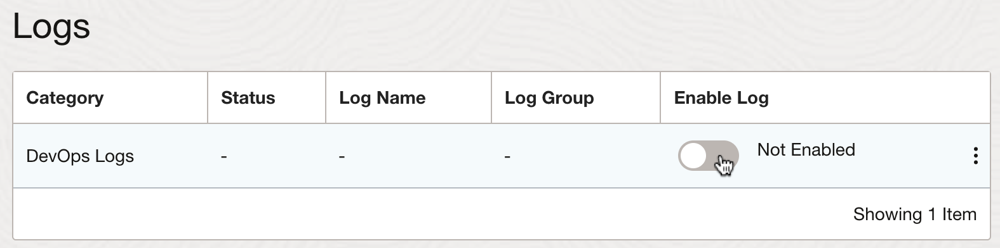

3. 대상 Compartment에 이미 Log Group이 있는 경우 나열된 것 중에 선택이 가능합니다. 미리 생성된 Log Group이 없는 경우 아래와 같이 자동입력된 정보를 바탕으로 Enable Log 버튼 클릭시 새로 Log Group과 Log가 만들어 지게 됩니다. 필요시 설정을 수정하고 그렇치 않으면, **Enable Log** 버튼을 클릭합니다.

    


## Task 3: Code Repository를 사용하여 애플리케이션 코드 관리하기

시각적 효과를 위해 MuShop Storefront UI앱을 기준으로 진행하겠습니다.

1. 코드 저장소 생성을 위해 왼쪽 메뉴에서 **Code Repositories**를 클릭합니다.

2. **Create repository**를 클릭하여 저장소를 만듭니다.

    - Repository name: 예, mushop-storefront-code-repo

3. 생성된 코드 저장소 입니다. 일반적인 Git Repository입니다.

4. Git URL을 확인합니다.

    
    

5. Cloud Shell에서 복사한 주소를 사용해 git clone 명령어를 통해 복제합니다.

    ````
    git clone <YourClonewithHTTPS URL>
    ```

    > 이때 사용자 인증이 필요합니다. HTTPS기반 사용자 인증시 아래 유저명 형식과 AuthToken을 사용합니다. 
    - 인증 유저명
        - Oracle Identity Cloud Service상의 유저: `<tenancy-name>/oracleidentitycloudservice/<username>`
        - OCI Local 유저: `<tenancy-name>/<username>`
        - OCIR과는 달리 **tenancy-namespace가 아닌 tenancy-name인 것에 주의합니다.**
    - AuthToken: OCIR때 사용한 AuthToken 또는 유저 프로파일에서 생성한 AuthToken을 그대로 사용합니다.

6. 이미 개발된 Storefront 소스를 가져와 Clone한 저장소로 옮깁니다.

    ````
    <copy>
    wget https://github.com/TheKoguryo/MuShop-storefront/archive/refs/tags/v2022.03.tar.gz
    tar -xvzf v2022.03.tar.gz --strip-components=1 -C mushop-storefront-code-repo/
    </copy>
    ````

7. 코드를 Code Repository에 Push 합니다.

    > 
    Cloud Shell에서 처음 Git을 사용하는 경우 push 하기 전이 아래처럼 사용자정보를 설정합니다.
    ````
    git config --global user.email "you@example.com"
    git config --global user.name "Your Name"
    ````
    GIT URL을 HTTPS로 사용하는 경우 매번 인증이 필요합니다. 이를 줄이기 위해 아래처럼 캐쉬를 설정합니다.
    ````
    <copy>
    git config --global credential.helper cache

    # 캐시 유효기간을 10시간=36000초로 변경
    git config --global credential.helper 'cache --timeout=36000'
    </copy>
    ````

    ````
    <copy>    
    cd mushop-storefront-code-repo
    git add .
    git commit -m "init"
    git push
    </copy>
    ````


8. Push가 완료되면 아래와 같이 Code Repository에 코드가 반영되어 있습니다. 이후 CI/CD 파이프라인을 생성한후 아래 코드를 변경하면, 파이프라인이 실행되어 Storefront UI가 변경될 것입니다.

    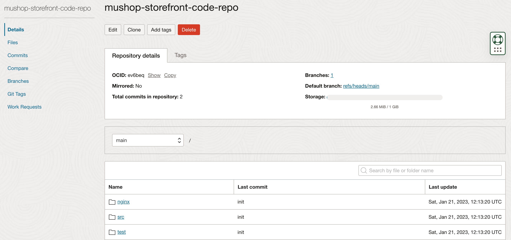


## Task 4: Build Pipeline 만들기

### Build Pipeline 만들기

CI/CD 중에 코드를 빌드하여 배포 산출물을 만드는 CI 과정에 해당되는 부분을 Build Pipeline을 통해 구성이 가능합니다.

1. **DevOps 프로젝트 페이지**로 이동하여 왼쪽 메뉴의 **Build Pipelines**로 이동합니다.

2. **Create build pipeline**을 클릭하여 파이프라인을 생성합니다.

    - Name: 예, mushop-storefront-build-pipeline

3. 생성된 파이프라인을 클릭합니다.

4. 그림과 같이 Stage를 추가하여 파이프라인 흐름을 구성할 수 있습니다. **Add Stage**를 클릭합니다.

5. 제공 Stage

    - **Managed Build**: 빌드스펙에 정의된 내용에 따라 빌드 과정을 실행합니다.
    - **Delivery Artifacts**: 빌드 산출물(예, 컨테이너 이미지)를 Artifact Repository에 저장합니다.
    - **Trigger Deployment**: 빌드가 끝나고 Deployment Pipeline을 호출합니다.
    - **Wait**: 일정시간 대기합니다.
    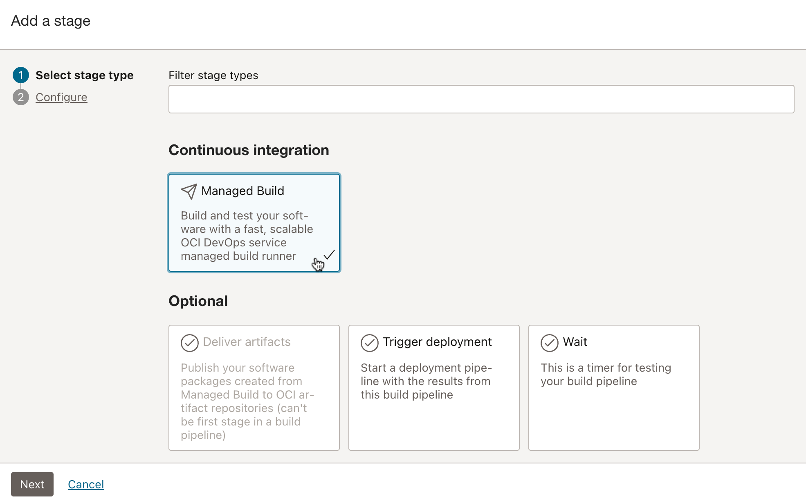

### Build Stage 만들기

1. 빌드를 위해 먼저 **Managed Build** Stage를 추가합니다.

2. Managed Build Stage 설정

    - **Stage name**: 예, build-stage
    - **Build Spec File Path**: 빌드 스크립트 경로를 지정합니다. 기본적으로 소스 루트에 있는 build_spec.yaml을 파일을 사용합니다.
    - **Primary Code Repository**: 빌드할 메인 소스가 있는 코드 저장소를 지정합니다.
        * Source: OCI Code Repository에서 앞서 만든 Code Repository를 선택
        * Build Source Name: 예, mushop-storefront-source
    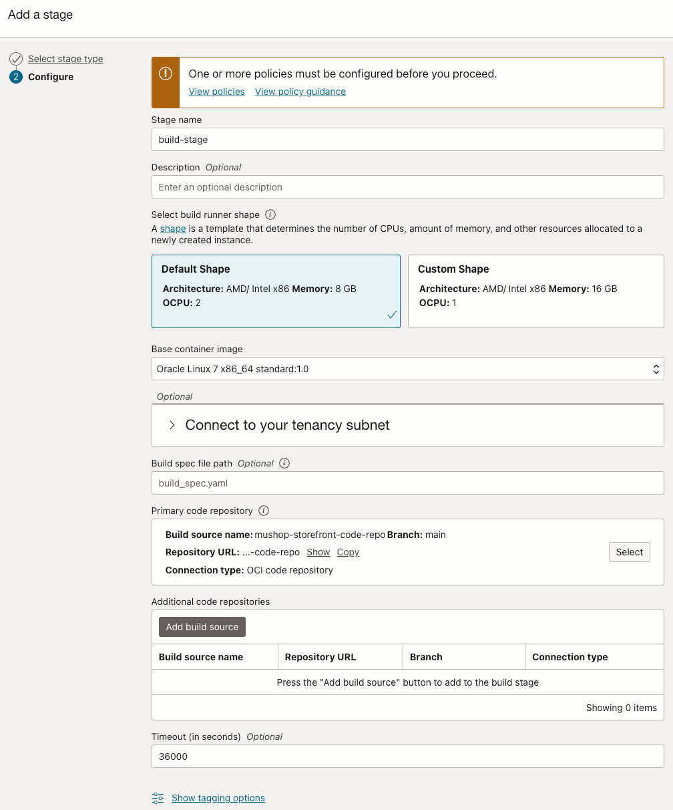

3. 설정된 Stage를 **Add**를 클릭하여 추가합니다.

4. 아래 예시와 같이 소스 코드 변경시 빌드 파이프라인은 수행하기 위해서는 Build Spec의 정의가 필요합니다.

    

5. Build Spec 정의

    - 개발한 소스 코드의 root 경로에 build_spec.yaml을 다음과 같이 정의하고 코드 저장소에 저장합니다.
        * 참조 문서4 - https://docs.oracle.com/en-us/iaas/Content/devops/using/build_specs.htm

    - build_spec.yaml

      ```
      <copy>
      version: 0.1
      component: build
      timeoutInSeconds: 6000
      shell: bash
      env:
        variables:
          appName: "mushop-storefront"
      
        exportedVariables:
          - APP_NAME
          - OCIR_PATH
          - TAG
      
      steps:
        - type: Command
          name: "Init exportedVariables"
          timeoutInSeconds: 4000
          command: |
            APP_NAME=`grep '"name"' package.json | cut -d '"' -f 4 | head -n 1`
         
        - type: Command
          name: "Build Source"
          timeoutInSeconds: 4000
          command: |
            echo none
                 
        - type: Command
          name: "Define Image Tag - Commit ID"
          timeoutInSeconds: 30
          command: |
            COMMIT_ID=`echo ${OCI_TRIGGER_COMMIT_HASH} | cut -c 1-7`
            BUILDRUN_HASH=`echo ${OCI_BUILD_RUN_ID} | rev | cut -c 1-7`
            [ -z "$COMMIT_ID" ] && TAG=$BUILDRUN_HASH || TAG=$COMMIT_ID
      
        - type: Command
          name: "Define OCIR Path"
          timeoutInSeconds: 30
          command: |
            TENANCY_NAMESPACE=`oci os ns get --query data --raw-output`
            REPO_NAME=$appName
            OCIR_PATH=$OCI_RESOURCE_PRINCIPAL_REGION.ocir.io/$TENANCY_NAMESPACE/$REPO_NAME
      
        - type: Command
          timeoutInSeconds: 400
          name: "Containerize"
          command: |
            export DOCKER_BUILDKIT=1
            docker build -t new-generated-image .
            docker images
      
        - type: Command
          name: "Check exportedVariables"
          timeoutInSeconds: 30
          command: |  
            [ -z "$APP_NAME" ] && APP_NAME=unknown          
            [ -z "$OCIR_PATH" ] && OCIR_PATH=unknown    
            [ -z "$TAG" ] && TAG=unknown
            echo "APP_NAME: " $APP_NAME      
            echo "OCIR_PATH: " $OCIR_PATH
            echo "TAG: " $TAG
      
      outputArtifacts:
        - name: output-image
          type: DOCKER_IMAGE
          location: new-generated-image    
      </copy>          
      ```

    - 생성한 build_spec.yaml을 Code Repository에 반영합니다.

        ````
        <copy>
        git add build_spec.yaml
        git commit -m "add build_spec.yaml"
        git push
        </copy>
        ````

6. Start Manual Run을 통해 다시 실행하면 아래와 같이 스크립트가 수행되는 것을 볼 수 있습니다.

    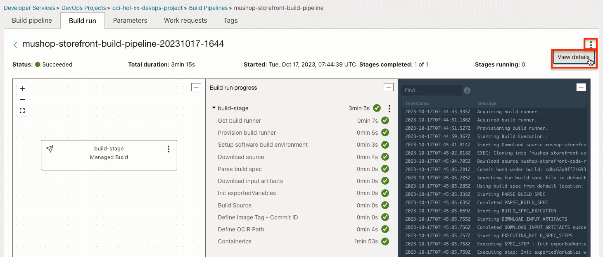

7. ExportVariables 확인

    실행 결과 화면에서 오른쪽 위쪽 점3개를 클릭하여 상세 화면으로 이동하면 Build Output에서 실행결과로 나온 변수값을 볼 수 있습니다. 이 변수들은 이후 Stage 또는 연결되어 호출된 Deployment Pipeline으로 전달되어 사용할 수 있게 됩니다.

    

### 컨테이너 이미지 OCIR 등록 Stage 만들기

1. Build Pipeline 탭으로 이동합니다.

2. 플러스 버튼을 클릭하여 build-stage 다음에 stage를 추가합니다.

   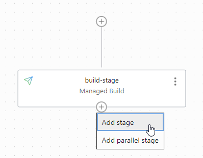

3. Delivery Artifact Stage를 선택합니다.

4. stage 이름을 입력하고 Create Artifact를 선택합니다.

   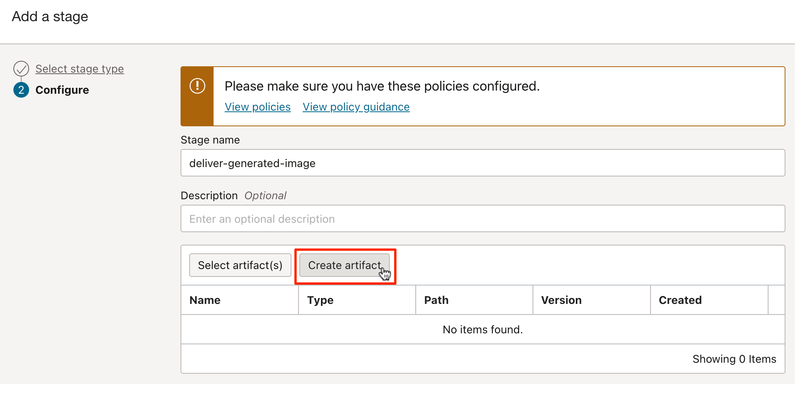

5. Container image 유형으로 Artifact 추가합니다.

    - 이미지 경로: docker tag를 달때 사용하는 이미지 경로입니다. 직접 입력해도 되지만 여기서는 build-stage에서 넘어온 exportedVariable을 사용합니다
    - Name: `generated_image_with_tag`
    - Image Path: `${OCIR_PATH}:${TAG}`

    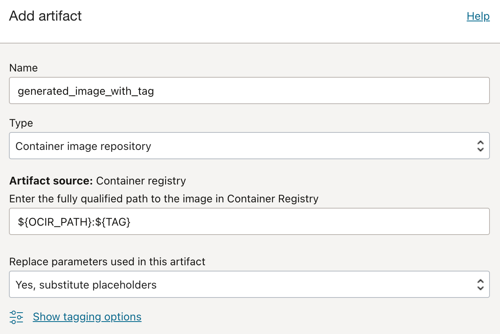

6. 같은 방식으로 하나 더 추가 합니다.

    - Name: `generated_image_with_latest`
    - Image Path: ${OCIR_PATH}:latest

7. Artifact 매핑

    - Associate Artifact에서 방금 추가한 2개의 Artifact에 실제 컨테이너 이미지 파일을 매핑해 줍니다. 앞서 build-stage에서 build_spec.yaml에서 정의한 outputArtifacts의 이름을 입력합니다.

        ```
        outputArtifacts:
          - name: output-image
            type: DOCKER_IMAGE
            location: new-generated-image 
        ```

    

8. 이제 delivery stage까지 추가하였습니다.

9. 파이프라인을 다시 실행해 봅니다. 실제 소스코드로 빌드된 컨테이너 이미지가 OCIR에 자동으로 등록됩니다.

    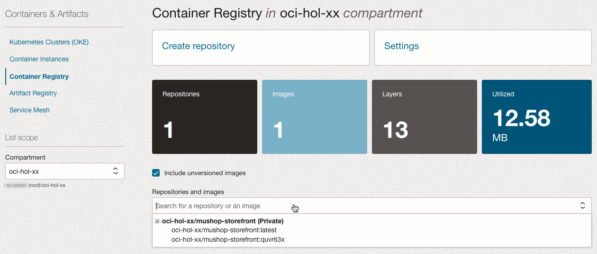


## Task 5: Deploy Pipeline 만들기

### Deploy Pipeline 만들기

CI/CD 중에 빌드된 산출물을 가지고 실제 서버에 배포하는 CD 과정에 해당되는 부분을 Deployment Pipeline을 통해 구성이 가능합니다.

1. **DevOps 프로젝트 페이지**로 이동하여 왼쪽 메뉴의 **Deployment Pipelines**로 이동합니다.

2. **Create pipeline**을 클릭하여 파이프라인을 생성합니다.

    - Name: 예, mushop-storefront-deployment-pipeline

3. 생성된 파이프라인을 클릭합니다.

4. **Add Stage**를 클릭하여 Stage를 추가합니다.

5. 제공 Stage

    - **Deploy**: OKE, Compute 인스턴스 배포, Oracle Function에 배포 기능을 제공합니다.
    - **Control**: 승인 대기, 트래픽 변경, 대기 등을 지원합니다.
    - **Integration**: 커스텀 로직 수행을 위한 Oracle Function 실행을 지원합니다.

    

6. 아직 manifest 파일가 필요함을 확인하고, 취소하고 다음으로 넘어갑니다.

### Kubernetes에 배포할 manifest 파일 준비

Kubernetes에 배포할 Stage 유형을 사용하기 위해서는 사전에 배포할 manifest yaml 파일을 준비해야 합니다.

1. **DevOps 프로젝트 페이지**로 이동하여 왼쪽 메뉴의 **Artifacts**로 이동합니다.

2. Artifacts로 앞서 빌드 파이프라인 만들때 등록한 2개가 있는 것을 볼수 있습니다. 여기에 등록된 Artifact는 재사용이 가능합니다.

    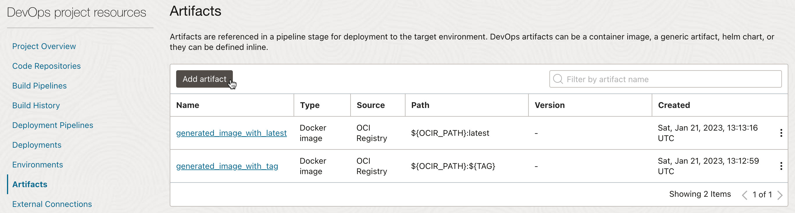

3. manifest 파일을 등록하기 위해 Add artifact를 클릭합니다.

4. 4 가지 등록 유형을 제공합니다. 이중에 **Kubernetes manifest**를 선택합니다.

    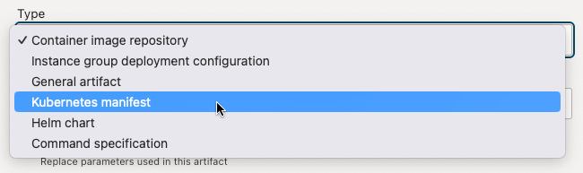

5. Kubernetes manifest 유형에는 Artifact Source로 2가지 유형을 지원합니다.

    - Artifact Registry Repository: Container Registry로 OCIR을 제공하고 있듯시 Artifact Registry를 서비스로 제공하고 있습니다. 그곳에 있는 자원을 참조할 경우에 선택합니다.
    - Inline: 인라인은 현재 DevOps 프로젝트에 있는 여기 Artifact에 직접 입력하는 것을 말합니다.

6. Artifact Source로 Inline 유형으로 다음과 같이 등록합니다.

    - Name: 예, `k8s_mushop_storefront_deploy_template`

        

    - Value

        앞 서와 같이 build-stage에서 export한 변수값들을 사용할 수 있습니다. 아래 값은 `kubectl get deploy mushop-storefront -o yaml'한 값에서 managed-field만 제외한 값입니다.
        추가로 OCIR 접속을 위한 image secret과 image url에 build-stage에서의 결과값을 사용하게만 변경합니다.

        ```
        <copy>
        apiVersion: apps/v1
        kind: Deployment
        metadata:
          annotations:
            meta.helm.sh/release-name: mushop
            meta.helm.sh/release-namespace: mushop
          labels:
            app.kubernetes.io/instance: mushop
            app.kubernetes.io/managed-by: Helm
            app.kubernetes.io/name: storefront
            app.kubernetes.io/version: 2.3.0
            helm.sh/chart: storefront-0.2.0
          name: mushop-storefront
          namespace: mushop
        spec:
          progressDeadlineSeconds: 600
          replicas: 1
          revisionHistoryLimit: 10
          selector:
            matchLabels:
              app: storefront
              app.kubernetes.io/instance: mushop
              app.kubernetes.io/name: storefront
          strategy:
            rollingUpdate:
              maxSurge: 25%
              maxUnavailable: 25%
            type: RollingUpdate
          template:
            metadata:
              annotations:
                sidecar.istio.io/rewriteAppHTTPProbers: "true"
              creationTimestamp: null
              labels:
                app: storefront
                app.kubernetes.io/instance: mushop
                app.kubernetes.io/name: storefront
                version: "2.3"
            spec:
              imagePullSecrets:
              - name: ocir-secret
              containers:
              - env:
                - name: ODA_ENABLED
                  value: "false"
                - name: ODA_URI
                - name: ODA_CHANNEL_ID
                - name: ODA_SECRET
                - name: ODA_USER_INIT_MESSAGE
                image: ${OCIR_PATH}:${TAG}
                imagePullPolicy: Always
                livenessProbe:
                  failureThreshold: 3
                  httpGet:
                    path: /
                    port: http-alt
                    scheme: HTTP
                  periodSeconds: 10
                  successThreshold: 1
                  timeoutSeconds: 1
                name: storefront
                ports:
                - containerPort: 8080
                  name: http-alt
                  protocol: TCP
                - containerPort: 8888
                  name: status
                  protocol: TCP
                readinessProbe:
                  failureThreshold: 3
                  httpGet:
                    path: /
                    port: http-alt
                    scheme: HTTP
                  periodSeconds: 10
                  successThreshold: 1
                  timeoutSeconds: 1
                resources:
                  limits:
                    cpu: 300m
                    memory: 300Mi
                  requests:
                    cpu: 100m
                    memory: 100Mi
                securityContext:
                  capabilities:
                    add:
                    - NET_BIND_SERVICE
                    - CHOWN
                    - SETGID
                    - SETUID
                    drop:
                    - all
                  readOnlyRootFilesystem: true
                  runAsNonRoot: true
                  runAsUser: 101
                terminationMessagePath: /dev/termination-log
                terminationMessagePolicy: File
                volumeMounts:
                - mountPath: /tmp
                  name: tmp-volume
              dnsPolicy: ClusterFirst
              restartPolicy: Always
              schedulerName: default-scheduler
              securityContext: {}
              terminationGracePeriodSeconds: 30
              volumes:
              - emptyDir:
                  medium: Memory
                name: tmp-volume
        </copy>        
        ```

7. Cloud Shell로 돌아가 배포될 mushop namespace에 ocir-secret을 이전과 같은 방법으로 만듭니다.

    ````
    <copy>
    kubectl create secret generic ocir-secret \
    --from-file=.dockerconfigjson=$HOME/.docker/config.json \
    --type=kubernetes.io/dockerconfigjson -n mushop
    </copy>
    ````

### Kubernetes Environment 등록하기

1. **DevOps 프로젝트 페이지**로 이동하여 왼쪽 메뉴의 **Enviroments**로 이동하여 배포할 OKE 환경을 등록합니다.

2. OKE 유형을 선택합니다.

   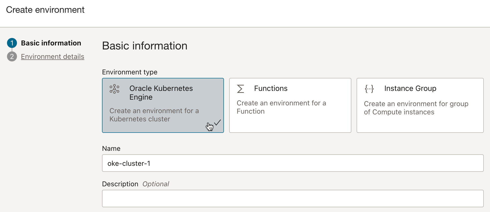

3. 배포할 클러스터를 선택합니다.

   

   
### Kubernetes manifest 배포 Stage 만들기

1. 등록한 Deployment Pipeline 설정 페이지로 이동합니다.

2. **Add Stage**를 클릭하여 **Apply manifest to your Kubernetes cluster** Stage를 추가합니다.

3. 배포할 환경 및 manifest 파일을 선택합니다

    - Name: 예, apply-manifest-to-oke-stage

    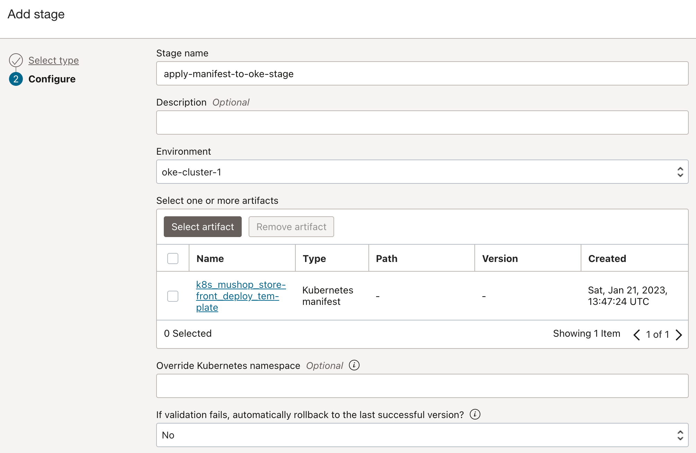

4. 파이프라인 완성

    


### Build Pipeline에서 Deployment Pipeline 호출하기

앞서 만든 Build Pipeline에서 컨테이너 이미지 까지 OCIR에 등록하고 나면, OKE에 배포할 Deployment Pipeline을 기동되어야 전체 빌드에서 배포까지가 완료됩니다. 이제 Deployment Pipeline을 등록하였으므로, Build Pipeline에서 호출할 수 있습니다.

1. 앞서 만든 **Build Pipelines**으로 이동합니다.

2. 파이프라인 마지막에 Stage를 추가합니다.

3. **Trigger Deployment** 유형을 선택합니다.

4. 설정한 Deployment Pipeline을 지정합니다.

   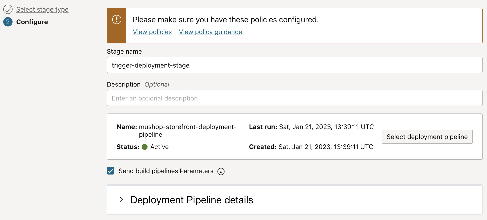

5. 전체 흐름이 완료되었습니다.

   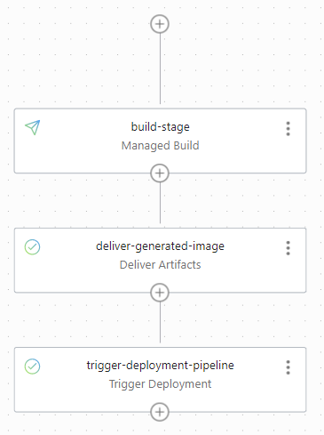


### Trigger 설정하기

지금 까지는 테스트를 하기 위해 Build Pipeline에서 Start Manual Run을 통해 시작하였습니다. 실제로는 개발자가 코드를 코드 저장소에 반영이 될 때 자동으로 빌드, 배포 파이프라인이 동작할 필요가 있습니다. Trigger는 코드 저장소에 발생한 이벤트를 통해 빌드 파이프라인을 시작하게 하는 역할을 하게 됩니다.

1. **DevOps 프로젝트 페이지**로 이동하여 왼쪽 메뉴의 **Trigger**로 이동합니다.

2. **Create trigger**을 클릭합니다.

3. Trigger를 설정합니다.

    - **Name**: 예, mushop-storefront-trigger
    - **Source Code Repository**: OCI Code Repository, GitHub, GitLab 연동을 지원하며, 예제에서는 앞서 만든 OCI Code Repository상의 mushop-storefront-repo를 선택합니다.
    - **Actions**: 트리거링 되었을 때 호출하는 액션으로 작성한 빌드 파이프라인인 mushop-storefront-build-pipeline을 선택합니다.
 
        

4. 설정이 완료되었습니다.

### 테스트

1. Trigger에서 지정한 소스 코드에 임의의 변경사항을 발생시키고 Code Repository에 반영합니다.

2. MuShop 웹 화면에서 다음 오픈 시간을 변경하기 위해 Cloud Shell에서 다음 파일을 수정하고 반영합니다.

    

    src/templates/data/_data.pug 에서 openingHours 시간의 값을 원하시는 시간으로 변경합니다.
    ````
    -
      var shopInfo = {
        phone: '+1 800.392.2999',
        email: 'example@example.com',
        address: 'Lanai, Hawaii 96763',
        openingHours: 'Daily 10:00–18:00',
        storeLogoText: 'μShop',
        storeName: 'MuShop',
        latitude: 20.7379498,
        longitude: -156.8871740
      }
      ...    
    ````

3. 코드를 Code Repository에 Push 합니다.

    ````
    <copy>    
    git add .
    git commit -m "update opening-hours"
    git push
    </copy>
    ````


4. 빌드 실행 내역을 보면, 그림과 같이 Trigger 된것은 Commit ID가 함께 보이며, Code Repository와 링크되어 있습니다.

    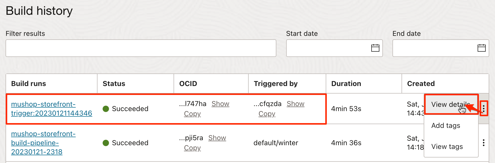

    - Commit ID를 클릭하면 Code Repository상의 코드 변경 분을 확인할 수 있습니다.

    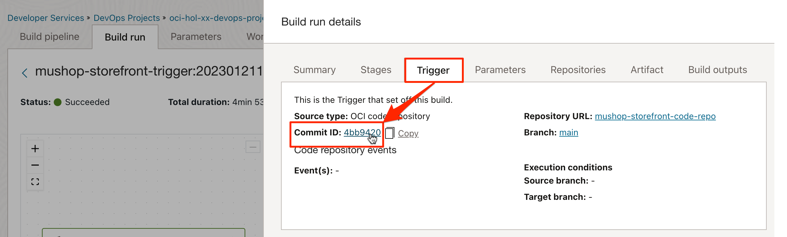

5. 빌드 파이프라인이 정상적으로 코드 빌드 부터 컨테이너 이미지 생성, 배포 파이프라인 호출까지 실행되었습니다.

    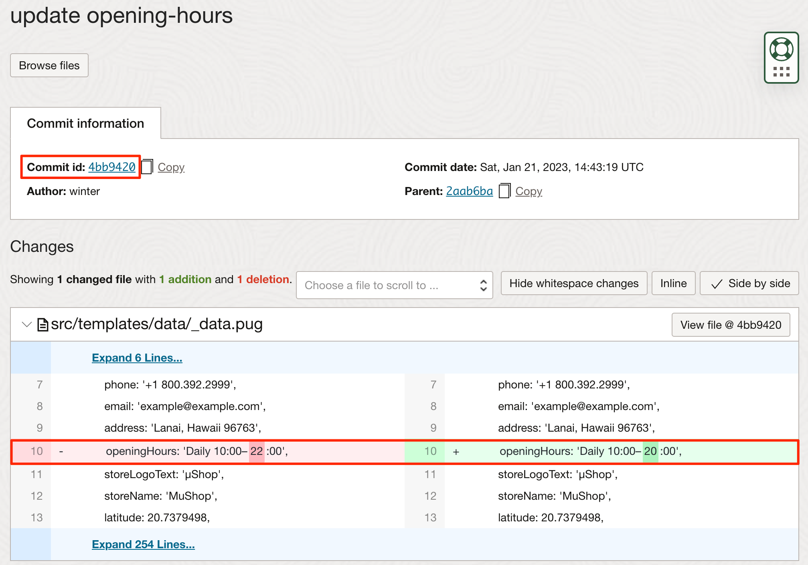

6. 배포 파이프라인도 정상 실행되었습니다.

    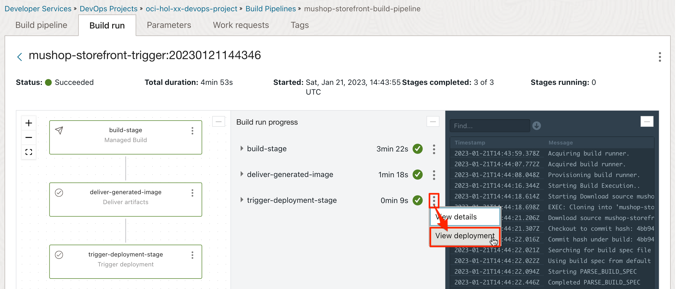

7. OKE 클러스터를 조회해 보면 정상 배포 되었습니다.


    Pod가 새롭게 배포되었고, 이미지 주소가 새로 생성된 것으로 태그가 Commit ID와 동일함을 알수있습니다.
    ```
    $ kubectl get pod
    NAME                                 READY   STATUS    RESTARTS   AGE
    mushop-api-67df55b466-lp4t8          1/1     Running   0          26h
    mushop-assets-5d6f44b88f-rcqj6       1/1     Running   0          26h
    mushop-carts-5c97d8bf9c-g9snm        1/1     Running   0          26h
    mushop-catalogue-c79d9464c-lhmcf     1/1     Running   0          26h
    mushop-edge-8649c9b5dd-rfkjq         1/1     Running   0          26h
    mushop-events-6f69d5cc79-mb6p5       1/1     Running   0          26h
    mushop-fulfillment-b59cc849-gkmmn    1/1     Running   0          26h
    mushop-nats-977d9d7df-ghlkv          2/2     Running   0          26h
    mushop-orders-5f65f59497-tbjvw       1/1     Running   0          26h
    mushop-payment-6456f6df7-5kskr       1/1     Running   0          26h
    mushop-session-678f95f767-8mk5d      1/1     Running   0          26h
    mushop-storefront-7c44fb67c6-p6vcq   1/1     Running   0          8m47s
    mushop-user-6b8b559cc6-j6slq         1/1     Running   0          26h
    $ kubectl describe pod mushop-storefront-7c44fb67c6-p6vcq | grep image
      Normal  Pulling    9m5s  kubelet            Pulling image "ap-chuncheon-1.ocir.io/axjowrxaetht/mushop-storefront:4039165"
      Normal  Pulled     9m4s  kubelet            Successfully pulled image "ap-chuncheon-1.ocir.io/axjowrxaetht/mushop-storefront:4039165" in 838.067082ms
    ```

8. 서비스 주소로 접속시 정상 동작을 확인할 수 있습니다.
 
    


이제 **다음 실습을 진행**하시면 됩니다.

## Learn More

* [DevOps Build Specification](https://docs.oracle.com/en-us/iaas/Content/devops/using/build_specs.htm)

## Acknowledgements

* **Author** - DongHee Lee, February 2022
