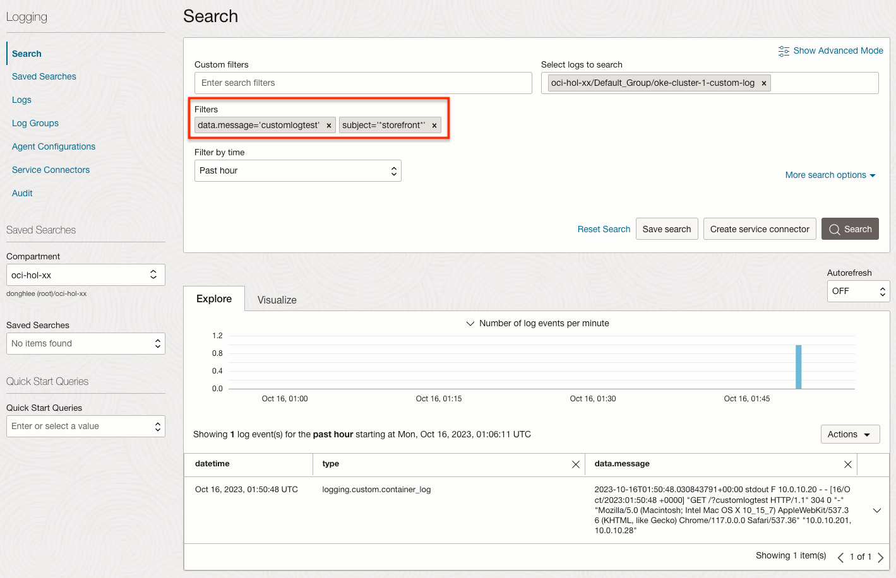
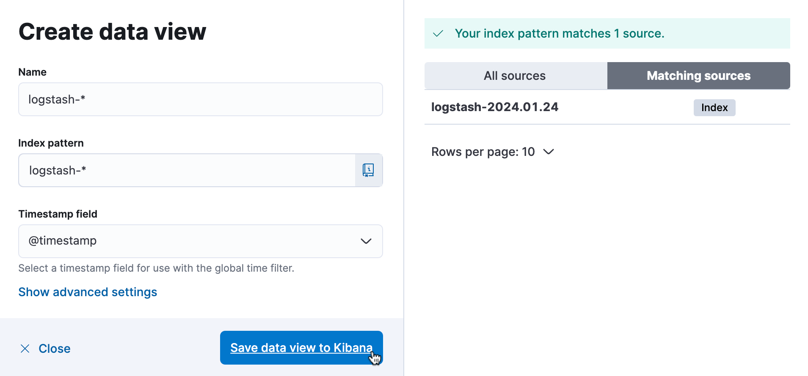
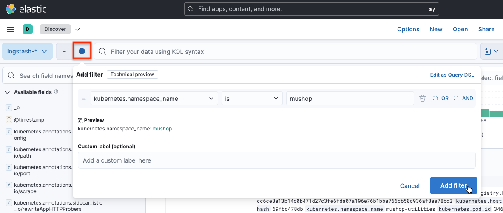

# Monitor the Log

## Introduction

Observability는 로그와 매트릭, 트레이스(추적)를 조합하여 현재 시스템의 상태를 이해하고 설명하는 데 도움을 줍니다. 시스템에 대한 가시성을 높이는데 도움을 줍니다.

예상 시간: Task 1 기준 - 30 분

### 목표

* OCI Logging 서비스를 사용하여 OKE 로그 모니터링 하는 법 익히기
* OSS ElasticSearch/Kibana로 OKE 로그 모니터링 하는 법 익히기

### 전제 조건

* **Lab 4: Deploy the MuShop Application** 완료하고 현재 앱이 실행 중일 것

### 실습 비디오

[](youtube:L3gRfDFpesk)

## Task 1: OCI Logging 서비스

### *Worker Node에 대한 Dynamic Group 만들기*

*Dynamic Group 생성은 관련 OCI IAM 권한이 필요합니다. 권한이 없는 경우 관리자 또는 워크샵 진행자에게 요청하거나, 제공하는 Dynamic Group을 사용합니다.*

> 고정된 Compute 인스턴스들이 아닌, OKE 클러스터에 의해 동적으로 생성되는 Worker Node용 Compute 인스턴스들에 대해서 OCI Logging 서비스을 통해 로깅을 할 수 있는 권한을 부여하기 위한 사전 작업으로, Worker Node용 Compute 인스턴스들의 Dynamic Group을 만드는 과정입니다.

1. OCI 콘솔에 로그인합니다.

2. 좌측 상단 햄버거 메뉴에서 **Identity & Security** &gt; **Identity** &gt; **Compartments**로 이동합니다.

3. OKE 클러스터가 있는 Compartment의 OCID를 확인하고 복사해 둡니다.

4. 좌측 **Dynamic Group** 메뉴로 이동합니다. 또는 좌측 **Domain** &gt; **Default Domain**으로 이동한 후, **Dynamic Group** 메뉴로 이동합니다.

5. 아래 규칙을 가진 Dynamic Group을 만듭니다.

    - Name: 예) oke-instance-dynamic-group

    ````
    <copy>    
    All {instance.compartment.id = '<compartment-ocid>'}
    </copy>    
    ````

### Dynamic Group에 대한 OCI Logging 서비스 권한 부여하기

1. 좌측 **Policy** 메뉴로 이동하여 아래 규칙을 가진 Policy을 만듭니다. 방금 생성한 Dynamic Group에 대한 Policy를 만듭니다. 

    - Name: 예) oke-logging-policy
    - Description: 예) oke-logging-policy
    - Policy

        ````
        <copy>
        allow dynamic-group <dynamic-group-name> to use log-content in compartment <compartment-name>
        </copy>    
        ````

        * 예시 - Identity Domain을 사용하는 경우
        ````
        <copy>
        allow dynamic-group 'Default'/'oke-instance-dynamic-group' to use log-content in compartment oci-hol-xx
        </copy>    
        ````
    
        * 예시 - Identity Domain을 사용하지 않은 경우
        ````
        <copy>
        allow dynamic-group oke-instance-dynamic-group to use log-content in compartment oci-hol-xx
        </copy>    
        ````    


### Log Group 만들기

Log Group은 로그들을 관리하는 말 그대로 로그의 묶음 단위 입니다. 커스텀 로그를 만들기 위해 먼저 만듭니다.

1. 좌측 상단 햄버거 메뉴에서 **Observability** **&** **Management** &gt; **Logging** &gt; **Log Groups**로 이동합니다.

2. Create Log Group을 클릭하여 로그 그룹을 만듭니다.

    - Name: 예) Default_Group

### Custom Log 만들기

Custom Log는 커스텀 애플리케이션에서 수집하는 로그에 매핑되는 것입니다. Custom Log를 정의하고, 이에 대한 로그 수집기를 정의합니다.

1. **Resources** &gt; **Logs** 메뉴로 이동하여 **Create custom log**를 클릭합니다.

2. 로그 이름과 필요하면 고급옵션에 있는 보관 주기 등을 설정하여 custom log를 만듭니다.

    - Name: 예) oke-cluster-1-custom-log

3. 다음 단계에 있는 Agent는 이해를 돕고자 별도로 설정합니다. 여기서는 일단 **Add configuration later** 선택

### Agent Configuration 설정

Agent Configuration는 로그를 수집하는 agent를 설정하는 부분입니다.

1. **Logging** &gt; **Agent Configurations** 메뉴로 이동하여 **Create agent config**를 클릭합니다.

2. Name: 예) oke-cluster-1-agent-conf

3. Description: 예) oke-cluster-1-agent-conf

4. 대상 Host Group을 앞서 만든 Dynamic Group으로 지정합니다.

    

5. Agent 설정 부분에서 로그가 위치한 경로 및 수집된 로그의 전달 위치를 지정합니다.

    - log input: 
        * input type: Log path
        * input name: 예) container_log
        * File Paths: **/var/log/containers/*.log**

            - OKE 상에 있는 Pod들은 Worker Node 상에 **/var/log/containers/*.log**에 로그가 쓰여집니다.
            - **입력하고 엔터키를 꼭 칩니다.**

    - log destination: 수집한 로그를 전달한 앞서 생성한 custom log 이름을 지정합니다.

    


### 로깅 테스트

1. Cloud Shell로 이동합니다.

1. MuShop 앱 접속을 위해 Nginx Ingress Controller의 Load Balancer IP를 다시 확인합니다.

    ````
    <copy>    
    kubectl get svc -n mushop-utilities
    </copy>    
    ````

    결과 예시
    ````
    NAME                                              TYPE           CLUSTER-IP      EXTERNAL-IP    PORT(S)                      AGE
    ...
    mushop-utils-ingress-nginx-controller             LoadBalancer   10.96.153.161   138.xxx.xxx.xxx   80:30636/TCP,443:30140/TCP   6d22h
    ...    
    ````

1. Mushop UI이 store-front Pod의 로그를 조회합니다. app: storefront 레이블을 기준으로 로그를 조회합니다.

    ````
    <copy>
    kubectl logs -lapp=storefront -f --tail=10
    </copy>
    ````

1. 확인된 IP를 통해 이전에 배포된 MuShop 앱을 접속해 봅니다. 테스트를 위해 URL에 테스트용 값을 추가합니다. 예, ?customlogtest

    MuShop 앱 테스트 URL 한번만 접속할 경우 구간내에 Log Flush가 안될 수도 있으니 테스트를 위해 여러번 반복 접속합니다.

    

1. 발생한 POD 로그는 다음과 같습니다.

    ````
    $ kubectl logs -lapp=storefront -f --tail=10
    ...
    10.244.0.10 - - [18/Jan/2023:15:16:03 +0000] "GET /?customlogtest HTTP/1.1" 304 0 "-" "Mozilla/5.0 (Macintosh; Intel Mac OS X 10_15_7) AppleWebKit/537.36 (KHTML, like Gecko) Chrome/108.0.0.0 Safari/537.36" "10.244.1.0, 10.244.0.134"
    ...
    ````

1. OCI 서비스 콘솔에서 **Observability & Management** &gt; **Logging** &gt; **Search** 화면으로 다시 돌아갑니다.

1. Custom filters 항목에서 `GET /?customlogtest'를 검색값으로 조회하면 됩니다. **Custom filters에 값을 입력하고 엔터키를 꼭 칩니다.**

   

1. 검색된 로그 데이터를 확인할 수 있습니다.

    - Log Agent를 통해 수집되는 주기가 있어 조회될때까지 5분 내외가 걸릴 수 있습니다.
    - 앞서 MuShop 앱 테스트 URL 한번만 접속한 경우 구간내에 Log Flush가 안되어 계속 기다려도 로그 조회가 안될 수 있으니, 테스트 URL 여러번 반복 접속합니다.   

    


## Task 2: OSS ElasticSearch/Kibana (선택사항)

### 실습 비디오

[](youtube:HvxxkpJYvA4)


### Elastic Search + Kibana 설치

1. 설치용 namespace를 만듭니다.

    ```
    <copy>
    kubectl create ns logging
    </copy>    
    ```

2. Helm Chart를 통해 설치하기 위해 저장소를 등록합니다. 본 예제에서는 Bitnami Helm Chart 저장소를 사용합니다.

    ```
    <copy>    
    helm repo add bitnami https://charts.bitnami.com/bitnami
    </copy>       
    ```

3. Lab 3, 4에서 사용하던 values.yaml과 중복되지 않도록 다른 폴더에서 진행합니다.

4. 배포 설정값 정의
 
    ElasticSearch Helm Chart 배포시 사용할 values.yaml 파일을 만듭니다.
    - 다음 values.yaml은 kibana를 함께 설치하고, kibana 접근 URL을 이전 장에서 설치한 nginx ingress controller를 사용하는 예시입니다.

 
    ```yaml
    <copy>   
    cat <<EOF > values.yaml
    global:
      kibanaEnabled: true
    kibana:
      ingress:
        enabled: true
        pathType: Prefix
        hostname: "*"
        path: /kibana(/|$)(.*)
        annotations:
          kubernetes.io/ingress.class: nginx
        tls: false
      configuration:
        server:
          basePath: /kibana
          rewriteBasePath: true
    EOF
    </copy>      
    ```

    - 추가적인 사용자 설정이 필요한 경우, 대상 Chart에서 제공하는 파라미터를 참고하여 values.yaml을 작성할 수 있습니다.
        * https://github.com/bitnami/charts/tree/master/bitnami/elasticsearch/#parameters

5. elasticsearch helm chart 설치

    ```
    <copy>    
    helm install elasticsearch -f values.yaml bitnami/elasticsearch --version 19.9.5 -n logging
    </copy>
    ```

6. 설치

    아래와 같이 설치되며, 실제 컨테이너가 기동하는 데 까지 약간의 시간이 걸립니다.
 
    ```
    $ helm install elasticsearch -f values.yaml bitnami/elasticsearch --version 19.9.5 -n logging
    NAME: elasticsearch
    ...
      Elasticsearch can be accessed within the cluster on port 9200 at elasticsearch.logging.svc.cluster.local
    
      To access from outside the cluster execute the following commands:
    
        kubectl port-forward --namespace logging svc/elasticsearch 9200:9200 &
        curl http://127.0.0.1:9200/
    ```

7. 설치된 elastic search 내부 주소와 포트를 확인합니다. 이후 fluentbit에서 로그 전송을 위해 사용할 주소입니다.
    - 주소: elasticsearch.logging.svc.cluster.local
    - 포트: 9200

8. Pod가 모두 기동할때 까지 기다립니다.

    ````
    <copy>
    kubectl get pod -n logging --watch
    </copy>    
    ````

9. 설정값이 잘못되어 재설치가 필요한 경우 다음 명령으로 먼저 삭제하고 재설치합니다.

    ```
    <copy>    
    helm delete elasticsearch -n logging
    </copy>
    ```

### Fluent Bit 구성

참고 문서

- https://docs.fluentbit.io/manual/installation/kubernetes#installation

1. FluentBit Helm Chart 저장소를 추가합니다.

    ```
    <copy>
    helm repo add fluent https://fluent.github.io/helm-charts
    </copy>
    ```

2. ElasticSearch로 로그를 포워딩하기 위한 설정값을 작성합니다.

    - Replace_Dots On: 다음과 같이 labels의 key에 app.kubernetes.io와 같이 *.*이 포함된 경우 ElasticSearch 전송시 오류가 발생합니다. 이를 방지하기 위해 추가합니다.

        ```
        apiVersion: v1
        kind: Pod
        metadata:
          ...
          labels:
            ...
            app.kubernetes.io/name: storefront
            ...
        ```    


    - Suppress\_Type\_Name On: ElasticSearch 8에서 _type 관련 오류가 발생하는 것을 방지하기 위해 추가합니다.
        * [Removal of mapping types](https://www.elastic.co/guide/en/elasticsearch/reference/current/removal-of-types.html#_schedule_for_removal_of_mapping_types)

    ````
    <copy>
    cat <<EOF > myvalues.yaml
    config:
      outputs: |
        [OUTPUT]
            Name es
            Match *
            Host elasticsearch.logging.svc.cluster.local
            Port 9200
            tls Off
            tls.verify Off
            Retry_Limit False
            Logstash_Format On
            Logstash_Prefix logstash
            Trace_Error On
            Replace_Dots On
            Suppress_Type_Name On
    EOF
    
    </copy>
    ````


3. OKE 클러스터에 FluentBit을 설치합니다.

    ```
    <copy>
    helm upgrade --install fluent-bit fluent/fluent-bit -f myvalues.yaml -n logging 
    </copy>
    ```


### Kibana 설정

1. ingress controller의 주소를 확인합니다.

    ```
    $ <copy>kubectl get ingress -n logging</copy>
    NAME                   CLASS    HOSTS   ADDRESS        PORTS   AGE
    elasticsearch-kibana   none     *       138.x.xxx.xx   80      56m
    ```

2. 설치한 kibana을 웹 브라우저로 접속합니다. nginx ingress controller 로 지정한 주소로 접속합니다.

    - 예, http://138.x.xxx.xx/kibana

3. Welcome to Elastic 화면이 나오면 Explore on my own을 클릭하여 홈으로 이동합니다.

4. 왼쪽 상단 **내비게이션 메뉴**에서 **Analytics** &gt; **Discover** 를 클릭합니다.

    

5. 인덱스 패턴을 만들기 위해 Create data view를 클릭합니다.

6. 인덱스 패턴을 생성합니다.

    오른쪽에서 보듯이 FluentD에서 전송된 로그는 logstash-로 시작합니다.

    - Name: logstash-*
    - Index pattern: logstash-*
    - Timestamp field: @timestamp

    

7. 생성한 인덱스 패턴을 통해 수집된 로그를 확인할 수 있습니다.

8. 테스트를 위해 MuShop을 접속합니다.

    - 예, http://138.xxx.xxx.xxx/?efk-test

9. 로그 확인

    ````
    $ kubectl logs -lapp=storefront -f --tail=10
    ...
    10.244.0.57 - - [27/Jun/2023:02:58:10 +0000] "GET /?efk-test HTTP/1.1" 304 0 "-" "Mozilla/5.0 (Macintosh; Intel Mac OS X 10_15_7) AppleWebKit/537.36 (KHTML, like Gecko) Chrome/114.0.0.0 Safari/537.36" "10.244.1.0, 10.244.0.133"    
    ...
    ````

10. 테스트 앱의 로그를 확인하기 위해 필터링을 위해 **+** 아이콘을 클릭한후 **kubernetes.namespace_name=mushop** 로 지정합니다.

    

11. **+** 아이콘을 클릭한후 **kubernetes.container_name=storefront** 도 추가합니다.

12. 아래와 같이 kibana에서 테스트 앱의 로그를 확인할 수 있습니다.

    

13. EFK를 통해 OKE 상의 로그를 수집하는 예시였습니다. EFK에 대한 상세 내용은 제품 관련 홈페이지와 커뮤니티 사이트를 참고하기 바랍니다.


이제 **다음 실습을 진행**하시면 됩니다.

## Learn More

## Acknowledgements

- **Author** - DongHee Lee
- **Last Updated By/Date** - DongHee Lee, June 2023
