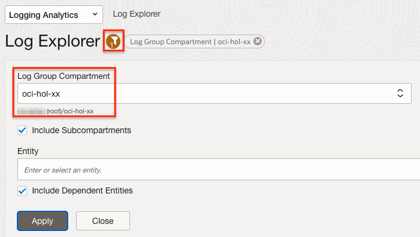
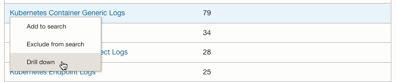
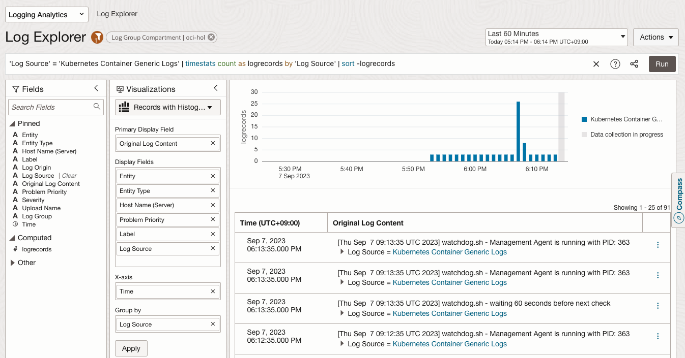
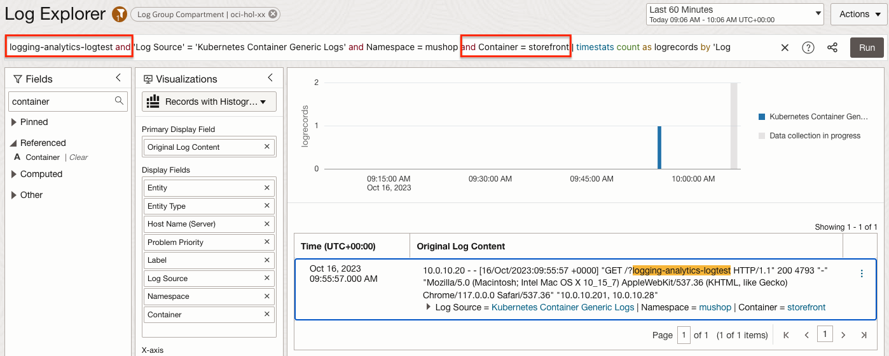
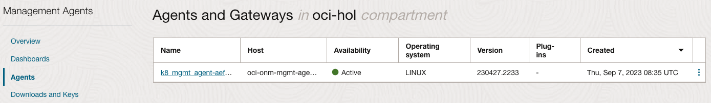
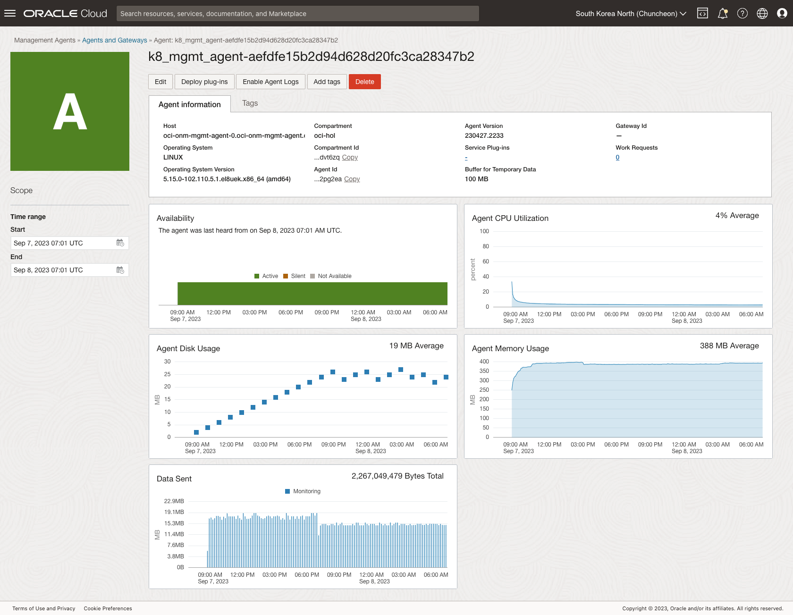

# Monitor the Log

## Introduction

Observability는 로그와 매트릭, 트레이스(추적)를 조합하여 현재 시스템의 상태를 이해하고 설명하는 데 도움을 줍니다. 시스템에 대한 가시성을 높이는데 도움을 줍니다.

예상 시간: Task 1 기준 - 30 분

### 목표

* OCI Logging Analytics로 OKE 로그 모니터링 하는 법 익히기
* OSS ElasticSearch/Kibana로 OKE 로그 모니터링 하는 법 익히기 (선택사항)
* OCI Logging 서비스를 사용하여 OKE 로그 모니터링 하는 법 익히기 (선택사항)

### 전제 조건

* **Lab 4: Deploy the MuShop Application** 완료하고 현재 앱이 실행 중일 것


### OKE 로그

쿠버네티스에서 발생하는 로그는 크게 두 가지로 볼 수 있습니다. 쿠버네티스 프로세스에서 발생하는 로그와 컨테이너 애플리케이션에서 발생하는 로그입니다.

- **OKE(Container Engine for Kubernetes) 쿠버네티스 프로세스 로그**

    * Control Plane 영역에 있는 로그로, 2023년 9월부터 OCI 서비스 로그를 OKE에 대해서도 지원하기 시작하여, OKE 쿠버네티스 프로세스(kube-scheduler, kube-controller-manager, cloud-controller-manager, and kube-apiserver)의 로그를 *OCI Logging* 서비스의 *Service Log* 형식으로 OCI Logging 서비스에서 수집할 수 있습니다.
    * 타 로그모니터링 시스템에 전달이 필요한 경우, OCI Logging 수집된 로그를 Service Connector를 통해 타 시스템으로 전달합니다.

- **OKE 상의 컨테이너 애플리케이션 로그**: 컨테이너 애플리케이션의 로그를 수집을 위해서는 일반적으로 Agent를 설치하여 로그를 수집하며, 사용을 원하는 각 로그 모니터링 시스템에서 요구하는 방식으로 설치 구성합니다.

    * OCI Logging 서비스: Custom Log 형식을 지원하여, Worker Node에 Agent 설치하고, OCI Logging 서비스에서 수집하는 기능을 제공합니다.
    * OCI Logging Analytics: 전문 로그 분석 서비스로 로그 수집, 분석하능 기능을 제공합니다.
    * ElasticSearch/Kibana: 컨테이너 로그 모니터링으로 많이 사용하는 솔루션으로, Fluent Bit 또는 FluentD를 통해 로그 수집하고 모니터링합니다. 
    * OCI OpenSearch 서비스: ElasticSearch의 라이선스 문제로 분기된 OpenSearch를 OCI 제공하는 서비스입니다. ElasticSearch와 동일한 방식으로 Fluent Bit 또는 FluentD를 통해 로그 수집하고 모니터링합니다. 

## Task 1: OCI Logging Analytics

### OCI Kubernetes Monitoring Solution

OCI Logging Analytics에서 지원하는 방법에 맞춰 컨테이너 로그도 입수(ingest) 할 수 있지만 관련 구성 및 설정이 필요합니다. OCI Kubernetes Monitoring Solution는 OCI Logging Analytics, OCI Monitoring, OCI Management Agent 와 FluentD를 통해 Kubernetes를 모니터링을 한 번의 설치로 자동화하는 솔루션으로 오픈소스 형태로 제공하고 있습니다. 

- [GitHub - OCI Kubernetes Monitoring Solution](https://github.com/oracle-quickstart/oci-kubernetes-monitoring)

[Monitor Kubernetes and OKE clusters with OCI Logging Analytics](https://docs.oracle.com/ko/solutions/kubernetes-oke-logging-analytics/index.html) 문서에서 아키텍처를 보면, 로그 수집을 위해 컴포넌트로 FluentD Collector와 Logging Analytics FluentD Plugin이 설치되어 쿠버네티스 상의 로그를 수집합니다.


### OCI Logging Analytics가 활성화

*설치전에 대상 Region에 OCI Logging Analytics가 활성화되어 있어야 합니다. 내비게이션 메뉴에서 **Observability & Management** > **Logging Analytics** 화면으로 이동하여, 활성화되었는지 확인합니다. 활성화되지 않은 경우 먼저 활성화합니다.*


### OCI Kubernetes Monitoring Solution 설치

OCI 마켓플레이스를 통해 설치하거나, GitHub 리파지토리 소스를 통해 Resource Manager, Terraform, Helm 등으로 설치할 수 있습니다.

여기서는 OCI Logging Analytics에서 제공하는 기능을 통해 설치합니다. OCI Console에서 설치하면, Resource Manager를 통해 설치되게 됩니다.

1. 필요한 IAM Policy와 OKE내 모듈 자동 설치를 위해 *편의상 관리자로* OCI Console에 로그인하여 설치합니다.

2. Logging Analytics 아래 Solutions > Kubernetes 항목으로 이동합니다.

3. 오른쪽 위 Connect cluster를 클릭합니다.

    

4. 대상 쿠버네티스로 OKE를 선택합니다.

    

5. 테넌시내에 조회되는 OKE 클러스터 중에 모니터링할 대상 클러스터를 선택합니다.

    

6. 설치에 필요한 IAM Policy와 OKE내에 모듈을 자동으로 설치하는 방법을 선택합니다. 단, Metric Server는 Mushop 설치시 이미 설치되었으므로 선택 해제합니다.

    

7. 설치가 완료될때까지 기다립니다.

    

8. 모니터링 대상으로 등록된 것을 볼 수 있습니다. 연결된 클러스터를 선택합니다.

    

9. Cluster, Workload, Node, Pod 뷰로 정보를 확인할 수 있습니다. 주요 항목기준으로 모니터링할 수 있습니다.

    

10. 대상으로 지정된 OKE 클러스터내 설치된 자원을 확인합니다.

    - helm chart로 설치된 것을 확인할 수 있습니다.

        ```shell
        $ <copy>helm list -n default -o yaml</copy>
        - app_version: 3.0.0
        chart: oci-onm-4.1.2
        name: oci-kubernetes-monitoring
        namespace: default
        revision: "1"
        status: deployed
        updated: 2025-12-22 09:12:51.390469333 +0000 UTC        
        ```

    - oci-onm 네임스페이스에 관련 Pod가 설치되었습니다.

        ```shell
        $ <copy>kubectl get pod -n oci-onm</copy>
        NAME                               READY   STATUS      RESTARTS   AGE
        oci-onm-discovery-29439915-7s6j8   0/1     Completed   0          7m51s
        oci-onm-discovery-29439920-q4q4v   0/1     Completed   0          2m51s
        oci-onm-logan-bxlzj                1/1     Running     0          9m59s
        oci-onm-logan-g8w4z                1/1     Running     0          9m59s
        oci-onm-logan-tcpconnect-4ltrz     1/1     Running     0          9m59s
        oci-onm-logan-tcpconnect-cxzgr     1/1     Running     0          9m59s
        oci-onm-logan-tcpconnect-nq2t6     1/1     Running     0          9m59s
        oci-onm-logan-w4bdl                1/1     Running     0          9m59s
        oci-onm-mgmt-agent-0               1/1     Running     0          9m59s
        ```

11. OCI 콘솔에서 IAM에서 확인해 보면, 아래와 같이 Dynamic Group 및 Policy이 만들어집니다. Log & Object Collection Pods가 있는 Worker Nodes 그룹에게 OCI Logging Analytics에 로그를 업로드할 권한을 부여합니다.

     - Dynamic Group: oci-kubernetes-monitoring-xxx...

         ```shell
         Match any rules defined below
         
         # Rule 1
         ALL {instance.compartment.id = 'ocid1.compartment.oc1..aaaaa_____32sa'}
         
         # Rule 2
         ALL {resource.type='managementagent', resource.compartment.id='ocid1.compartment.oc1..aaaaa_____32sa'}
         ```

     - Policy: oci-kubernetes-monitoring-yyy...

         - OCI Logging Anaytics Comparment로 선택한 Compartment에 생성됨
    
         ```shell
         Allow dynamic-group oci-kubernetes-monitoring-xxx... to {LOG_ANALYTICS_LOG_GROUP_UPLOAD_LOGS} in compartment id ocid1.compartment.oc1..aaaaa_____32sa
         ...      
         ```

12. 로그 수집을 위한 OCI Logging Group과 OCI Logging, Connector Hub도 함께 생성됩니다. 전체 생성되는 자원 내역은 Resource Manager에서 생성된 Stack resources로 확인하기 바랍니다.

    


### Logging Analytics - 로그 모니터링

1. OCI 콘솔로 이동합니다.

2. 왼쪽 위 내비게이션 메뉴에서 **Observability & Management** > **Logging Analytics** > **Log Explorer**으로 이동합니다.

3. 필터에서 Log Group Compartment를 원하는 대상으로 선택합니다.

     

4. 기본값으로 파이 차트 형식으로 보여 줍니다. 대상 클러스터에서 수집된 여러가지 소스에서 수집된 로그를 보여줍니다.

     

5. Worker Node 로그 및 사전 정의한 Kubernetes 로그이외에 애플리케이션 로그를 확인하기 위해 Kubernetes Container Generic Logs를 드릴 다운합니다.

     

6. 클라스터상의 수집된 컨테이너 로그들을 볼수 있습니다.

     

7. 필터링을 위해 *Search Fields*에 namespace로 검색합니다. 검색 결과 중에서 Namespace를 클릭하면 현재 검색된 로그들을 Namespace 단위로 카운트가 보입니다. 여기서 mushop namespace를 선택하고 적용합니다.

     

8. 검색 쿼리가 아래와 같이 변경되었습니다. 아래와 같이 직접 `and Namespace = mushop`를 입력하여도 됩니다.

     ```shell
     'Log Source' = 'Kubernetes Container Generic Logs' and Namespace = mushop | timestats count as logrecords by 'Log Source' | sort -logrecords     
     ```

9. MuShop 앱 접속을 위해 Nginx Ingress Controller의 Load Balancer IP를 다시 확인합니다.

    ````
    <copy>    
    kubectl get svc -n mushop-utilities
    </copy>    
    ````

    결과 예시
    ````
    NAME                                              TYPE           CLUSTER-IP      EXTERNAL-IP    PORT(S)                      AGE
    ...
    mushop-utils-ingress-nginx-controller             LoadBalancer   10.96.153.161   138.xxx.xxx.xxx   80:30636/TCP,443:30140/TCP   6d22h
    ...    
    ````

10. Mushop UI인 store-front Pod의 로그를 조회합니다. app: storefront 레이블을 기준으로 로그를 조회합니다.

    ````
    <copy>
    kubectl logs -lapp=storefront -f --tail=10
    </copy>
    ````

11. 확인된 IP를 통해 이전에 배포된 MuShop 앱을 접속해 봅니다. 테스트를 위해 URL에 테스트용 값을 추가합니다. 예, /?logging-analytics-logtest

    

12. 발생한 POD 로그는 다음과 같습니다.

    ````
    $ kubectl logs -lapp=storefront -f --tail=10
    ...
    10.0.10.104 - - [22/Dec/2025:11:23:48 +0000] "GET /?logging-analytics-logtest HTTP/1.1" 200 4793 "-" "Mozilla/5.0 (Macintosh; Intel Mac OS X 10_15_7) AppleWebKit/537.36 (KHTML, like Gecko) Chrome/143.0.0.0 Safari/537.36" "10.0.10.77, 10.0.10.169"    
    ...
    ````

13. 결과가 많으면, 쿼리에 검색조건을 추가하여 다시 검색합니다. `and Container = storefront and logging-analytics-logtest`

    ```
    <copy>
    'Log Source' = 'Kubernetes Container Generic Logs' and Namespace = mushop and Container = storefront and logging-analytics-logtest | timestats count as logrecords by 'Log Source' | sort -logrecords
    </copy>
    ```

     


### Logging Analytics - Dashboard

1. **Logging Analytics** > **Dashboard**로 이동합니다.

2. Oracle Kubernetes Engine (OKE) Cluster Overview 대쉬보드가 보입니다. 클릭합니다.

    

3. 클러스터 주요항목을 대쉬보드로 볼 수 있습니다. 위젯 각 항목을 클릭하면, 해당 조건 기준으로, 로그를 확인할 수 있습니다.

    


### Management Agent 및 메트릭 확인

OCI Kubernetes Monitoring Solution 버전이 올라가면서 OCI Kubernetes Monitoring Solution 설치시 OCI Management Agent도 함께 설치되어, OCI Monitoring상에 추가적으로 대상 쿠버네티스 클러스터에서 수집된 메트릭을 제공합니다.

1. 쿠버네티스 클러스스터에 설치된 자원을 다시 조회해 보면, mgmt-agent가 설치된 것을 알 수 있습니다.

    ```shell
    $ <copy>kubectl get pod -n oci-onm</copy>
    NAME                               READY   STATUS      RESTARTS   AGE
    oci-onm-discovery-29439915-7s6j8   0/1     Completed   0          7m51s
    oci-onm-discovery-29439920-q4q4v   0/1     Completed   0          2m51s
    oci-onm-logan-bxlzj                1/1     Running     0          9m59s
    oci-onm-logan-g8w4z                1/1     Running     0          9m59s
    oci-onm-logan-tcpconnect-4ltrz     1/1     Running     0          9m59s
    oci-onm-logan-tcpconnect-cxzgr     1/1     Running     0          9m59s
    oci-onm-logan-tcpconnect-nq2t6     1/1     Running     0          9m59s
    oci-onm-logan-w4bdl                1/1     Running     0          9m59s
    oci-onm-mgmt-agent-0               1/1     Running     0          9m59s
    ```

2. OCI 콘솔에 로그인합니다.

3. 왼쪽 위 내비게이션 메뉴에서  **Observability & Management** > **Management Agents** > **Agent**로 이동합니다.

4. Agent가 등록된 것을 확인합니다.

     

5. 등록된 Agent를 클릭하면, 설치된 Agent의 현재 상태를 확인할 수 있습니다. 필요하면, 왼쪽 Time range에서 조회 시간을 6시간으로 변경합니다.

     

6. 내비게이션 메뉴에서  **Observability & Management** > **Monitoring** > **Metrics Explorer**로 이동합니다.

7. 화면 아래 Query 부분으로 이동합니다. Management Agent 설치로 인해 Metric namespace에 `mgmtagent_kubernetes_metrics`가 추가되었습니다. 선택하면 Metric name에서 제공하는 메트릭들을 볼 수 있습니다.

     

7. OKE에 설치된 Agent Pod를 통해 수집된 메트릭을 OCI Monitoring상의 메트릭으로 제공하는 것을 확인했습니다. 이를 사용해 OCI에서 제공하는 메트릭 모니터링, 알람 설정 등을 하거나, Logging Analytics 상의 대쉬보드로 구성하는 등 추가적인 모니터링 관련 설정을 할 수 있습니다.

## Task 2: Elastic Cloud on Kubernetes(ECK) (선택사항)

### Elastic Search + Kibana 설치

1. Helm Chart를 통해 설치하기 위해 저장소를 등록합니다. 

    ```shell
    <copy>
    helm repo add elastic https://helm.elastic.co
    helm repo update
    </copy>
    ```

2. ECK Operator를 설치합니다.

    ```shell
    $ <copy>helm install elastic-operator elastic/eck-operator -n elastic-system --create-namespace</copy>

    NAME: elastic-operator
    LAST DEPLOYED: Wed Dec 24 08:43:30 2025
    NAMESPACE: elastic-system
    STATUS: deployed
    REVISION: 1
    TEST SUITE: None
    NOTES:
    1. Inspect the operator logs by running the following command:
    kubectl logs -n elastic-system sts/elastic-operator
    ```

3. 설치용 namespace를 만듭니다.

    ```shell
    <copy>kubectl create ns logging</copy>
    ```

4. Elasticsearch cluster를 설치합니다.

    ```shell
    <copy>
    cat <<EOF | kubectl apply -f -
    apiVersion: elasticsearch.k8s.elastic.co/v1
    kind: Elasticsearch
    metadata:
      namespace: logging
      name: quickstart
    spec:
      version: 9.2.3
      nodeSets:
      - name: default
        count: 1
        config:
          node.store.allow_mmap: false
    EOF
    </copy>
    ```

5. Kibana instance를 설치합니다.

    ```shell
    <copy>
    cat <<EOF | kubectl apply -f -
    apiVersion: kibana.k8s.elastic.co/v1
    kind: Kibana
    metadata:
      namespace: logging
      name: quickstart
    spec:
      version: 9.2.3
      count: 1
      elasticsearchRef:
        name: quickstart
      http:
        tls:
          selfSignedCertificate:
            disabled: true
      config:
        server:
          basePath: /kibana
          rewriteBasePath: true
    EOF
    </copy>
    ```

6. Kibana에 Ingress로 접근설정합니다.

    ```shell
    <copy>
    cat <<EOF | kubectl apply -f -
    apiVersion: networking.k8s.io/v1
    kind: Ingress
    metadata:
      namespace: logging
      name: kibana-ingress
    spec:
      ingressClassName: nginx
      rules:
      - http:
          paths:
          - path: /kibana(/|$)(.*)
            pathType: ImplementationSpecific
            backend:
              service:
                name: quickstart-kb-http
                port:
                  number: 5601             
    EOF
    </copy>
    ```

7. `superuser` 역할의 `elastic` 유저의 패스워드 확인하기

    ```shell
    <copy>
    kubectl get secret quickstart-es-elastic-user -o=jsonpath='{.data.elastic}' -n logging | base64 --decode; echo
    </copy>
    ```

8. ingress controller의 주소를 확인합니다.

    ```shell
    $ <copy>kubectl get ingress -n logging</copy>
    NAME             CLASS   HOSTS   ADDRESS         PORTS   AGE
    kibana-ingress   nginx   *       140.xxx.xx.xx   80      5m33s    
    ```

9. 설치한 kibana을 웹 브라우저로 접속합니다. nginx ingress controller 로 지정한 주소로 접속합니다.

    - 예, http://140.x.xxx.xx/kibana

10. `elastic` 유저로 접속이 되는지 확인합니다.

11. Welcome to Elastic 화면이 나오면 Explore on my own을 클릭하여 홈으로 이동합니다.

12. 왼쪽 상단 내비게이션 메뉴에서 Management > Stack Management를 클릭하고 다시 Security > Roles 메뉴를 클릭합니다.

    - 또는 http://140.x.xxx.xx/kibana/app/management/security/roles

13. 새 Role을 만듭니다.

    - Role name: `fluentbit_writer`
    - Index privileges
        * Indices: `logstash-*`
        * Privileges: `write`, `create-index`, `create`

14. 새 User를 만듭니다.

    - User name: `fluentbit`
    - Full name: `Fluent Bit Log Writer`
    - Password: 
    - Roles: `fluentbit_writer`

### Fluent Bit 구성

참고 문서

- https://docs.fluentbit.io/manual/installation/downloads/kubernetes#installation

1. FluentBit Helm Chart 저장소를 추가합니다.

    ```shell
    <copy>
    helm repo add fluent https://fluent.github.io/helm-charts
    </copy>
    ```

2. ElasticSearch로 로그를 포워딩하기 위한 설정값을 작성합니다.

    - Replace_Dots On: 다음과 같이 labels의 key에 app.kubernetes.io와 같이 *.*이 포함된 경우 ElasticSearch 전송시 오류가 발생합니다. 이를 방지하기 위해 추가합니다.

        ```shell
        apiVersion: v1
        kind: Pod
        metadata:
          ...
          labels:
            ...
            app.kubernetes.io/name: storefront
            ...
        ```    


    - Suppress\_Type\_Name On: ElasticSearch 8에서 _type 관련 오류가 발생하는 것을 방지하기 위해 추가합니다.
        * [Removal of mapping types](https://www.elastic.co/guide/en/elasticsearch/reference/current/removal-of-types.html#_schedule_for_removal_of_mapping_types)

    ````shell
    <copy>
    cat <<EOF > myvalues.yaml
    config:
    outputs: |
        [OUTPUT]
            Name es
            Match *
            Host quickstart-es-internal-http.logging.svc.cluster.local
            Port 9200
            tls On
            tls.verify Off
            HTTP_User fluentbit
            HTTP_Passwd STRONG_PASSWORD
            Retry_Limit False
            Logstash_Format On
            Logstash_Prefix logstash
            Trace_Error On
            Replace_Dots On
            Suppress_Type_Name On
    EOF
    </copy>
    ````

3. `HTTP_Passwd`는 설정값으로 변경합니다.

    - `HTTP_API_Key` 방식도 지원하나, 테스트 당시 es 아웃풋 플러그인에서 `cb_es_flush()`시 오류발생하여, User/Password 방식을 사용하였습니다.


4. OKE 클러스터에 FluentBit을 설치합니다.

    ```shell
    <copy>
    helm upgrade --install fluent-bit fluent/fluent-bit -f myvalues.yaml -n logging 
    </copy>
    ```

5. Pod가 정상 기동하는 지 확인합니다.

    ```shell
    $ kubectl get pod -n logging
    NAME                            READY   STATUS    RESTARTS   AGE
    fluent-bit-jg8w5                1/1     Running   0          30s
    fluent-bit-qzxpd                1/1     Running   0          30s
    fluent-bit-wbv45                1/1     Running   0          30s
    ...
    ```

### Kibana 설정

1. 설치한 kibana을 웹 브라우저로 다시 접속합니다.

    - 예, http://140.x.xxx.xx/kibana

2. 왼쪽 상단 **내비게이션 메뉴**에서 **Elasticsearch** &gt; **Index Management** 를 클릭합니다.

3. `logstash-*`로 시작하는 인덱스가 생성된 것을 확인합니다.

4. 왼쪽 상단 **내비게이션 메뉴**에서 **Analytics** &gt; **Discovery** 를 클릭합니다.

5. 인덱스 패턴을 만들기 위해 Create data view를 클릭합니다.

    

6. 인덱스 패턴을 생성합니다.

    오른쪽에서 보듯이 Fluent Bit에서 전송된 로그는 logstash-로 시작합니다.

    - Name: logstash-*
    - Index pattern: logstash-*
    - Timestamp field: @timestamp

    

7. 생성한 인덱스 패턴을 통해 수집된 로그를 확인할 수 있습니다.

8. 테스트를 위해 MuShop 웹페이지를 다음과 같이 접속합니다.

    - 예, http://140.xxx.xxx.xxx/?efk-test-2

9. 로그 확인

    ````shell
    $ <copy>kubectl logs -lapp=storefront -f --tail=10</copy>
    ...
    10.0.10.35 - - [02/Jan/2026:07:54:25 +0000] "GET /?efk-test-2 HTTP/1.1" 200 4793 "-" "Mozilla/5.0 (Macintosh; Intel Mac OS X 10_15_7) AppleWebKit/537.36 (KHTML, like Gecko) Chrome/143.0.0.0 Safari/537.36" "10.0.10.201, 10.0.10.110"
    ...
    ````

10. 테스트 앱의 로그를 확인하기 위해 필터링을 위해 **+** 아이콘을 클릭한후 **kubernetes.namespace_name, is, mushop** 으로로 지정합니다.

    

11. **+** 아이콘을 클릭한후 **kubernetes.container_name, is, storefront** 도 추가합니다.

12. 아래와 같이 kibana에서 테스트 앱의 로그를 확인할 수 있습니다.

    

13. EFK를 통해 OKE 상의 로그를 수집하는 예시였습니다. EFK에 대한 상세 내용은 제품 관련 홈페이지와 커뮤니티 사이트를 참고하기 바랍니다.

    - [Elastic Cloud on Kubernetes](https://www.elastic.co/docs/deploy-manage/deploy/cloud-on-k8s/install-using-helm-chart)
    - [Fluent Bit: Official Manual > Send logs to Elasticsearch](https://docs.fluentbit.io/manual/data-pipeline/outputs/elasticsearch)


## Task 3: OCI Logging 서비스 (선택사항)

### Worker Node에 대한 Dynamic Group 만들기

*Dynamic Group 생성은 관련 OCI IAM 권한이 필요합니다. 권한이 없는 경우 관리자 또는 워크샵 진행자에게 요청하거나, 제공하는 Dynamic Group을 사용합니다.*

> OKE 클러스터상의 Worker 노드들에 OCI Logging Agent를 설치되고 해당 Agent가 OCI Logging 서비스로 로그를 보내야 합니다. Worker 노드들은 스케일 인/아웃에 따라 동적으로 생성, 삭제 되기 때문에 Dynamic Group을 통해 지정하고, 해당 Dynamic Group에 OCI Logging 서비스에 대한 로그 쓰기 권한을 부여하는 과정입니다.

1. OCI 콘솔에 로그인합니다.

2. 좌측 상단 햄버거 메뉴에서 **Identity & Security** &gt; **Identity** &gt; **Compartments**로 이동합니다.

3. OKE 클러스터가 있는 Compartment의 OCID를 확인하고 복사해 둡니다.

4. 메뉴에서 **Domain** &gt; **Default Domain**으로 이동한 후, **Dynamic groups** 탭으로 이동합니다.

5. 아래 규칙을 가진 Dynamic Group을 만듭니다. `<compartment-ocid>`는 복사해둔 OCID로 변경합니다.

    - Name: 예) oke-instance-dynamic-group

    ````shell
    <copy>    
    All {instance.compartment.id = '<compartment-ocid>'}
    </copy>    
    ````

### Dynamic Group에 대한 OCI Logging 서비스 권한 부여하기

1. 좌측 **Policies** 메뉴로 이동하여 아래 규칙을 가진 Policy을 만듭니다. 방금 생성한 Dynamic Group에 대한 Policy를 만듭니다. 

    - Name: 예) oke-logging-policy
    - Description: 예) oke-logging-policy
    - Policy

        ````shell
        <copy>
        allow dynamic-group <dynamic-group-name> to use log-content in compartment <compartment-name>
        </copy>    
        ````

        * 예시
        ````shell
        <copy>
        allow dynamic-group 'Default'/'oke-instance-dynamic-group' to use log-content in compartment oci-hol-xx
        </copy>    
        ````

### Log Group 만들기

Log Group은 로그들을 관리하는 말 그대로 로그의 묶음 단위 입니다. 커스텀 로그를 만들기 위해 Log Group을 먼저 만듭니다.

1. 좌측 상단 햄버거 메뉴에서 **Observability** **&** **Management** &gt; **Logging** &gt; **Log Groups**로 이동합니다.

2. Create log group을 클릭하여 로그 그룹을 만듭니다.

    - Name: 예) Default_Group

### Custom Log 만들기

Custom Log는 커스텀 애플리케이션에서 수집하는 로그에 매핑되는 것입니다. Custom Log를 정의하고, 이에 대한 로그 수집기를 정의합니다.

1. 만든 Default_Group의 Logs 탭으로 이동하여, **Create custom log**를 클릭합니다.

2. 로그 이름을 입력합니다. 필요하면 고급옵션(Show additional options)을 클릭하여, 보관 주기 변경합니다.

    - Name: 예) oke-cluster-1-custom-log

3. 다음 단계에 있는 Agent 설정은 이해를 돕고자 별도로 설정합니다. 여기서는 일단 **Add configuration later** 선택하여, Log를 바로 생성합니다. 

### Agent Configuration 설정

Agent Configuration는 로그를 수집하는 agent를 설정하는 부분입니다.

Logging > Agent Configurations 메뉴로 이동하여 Create agent config를 클릭합니다.

1. Configuration Name: 예) oke-cluster-1-agent-conf

2. Description: 예) oke-cluster-1-agent-conf

3. 대상 Host Group을 앞서 만든 Dynamic Group으로 지정합니다. `Enable domain select`을 해제하고, 앞서 만든 Dynamic Group을 선택합니다.

    

4. Agent 설정 부분에서 로그가 위치한 경로 및 수집된 로그의 전달 위치를 지정합니다.

    - log input: 
        * input type: Log path
        * input name: 예) container_log
        * File Paths: **/var/log/containers/*.log**

            - OKE 상에 있는 Pod들은 Worker Node 상에 **/var/log/containers/*.log**에 로그가 쓰여집니다.
            - **입력하고 엔터키를 꼭 칩니다.**

    - log destination: 수집한 로그를 전달한 앞서 생성한 custom log 이름을 지정합니다.

    

5. 생성합니다.

### 로깅 테스트

1. Cloud Shell로 이동합니다.

2. MuShop 앱 접속을 위해 Nginx Ingress Controller의 Load Balancer IP를 다시 확인합니다.

    ````shell
    <copy>    
    kubectl get svc -n mushop-utilities
    </copy>    
    ````

    결과 예시
    ````shell
    NAME                                              TYPE           CLUSTER-IP      EXTERNAL-IP    PORT(S)                      AGE
    ...
    mushop-utils-ingress-nginx-controller             LoadBalancer   10.96.153.161   138.xxx.xxx.xxx   80:30636/TCP,443:30140/TCP   6d22h
    ...    
    ````

3. Mushop UI이 store-front Pod의 로그를 조회합니다. app: storefront 레이블을 기준으로 로그를 조회합니다.

    ````shell
    <copy>
    kubectl logs -lapp=storefront -f --tail=10
    </copy>
    ````

4. 확인된 IP를 통해 이전에 배포된 MuShop 앱을 접속해 봅니다. 테스트를 위해 URL에 테스트용 값을 추가합니다. 예, /?oci-logging-test

    MuShop 앱 테스트 URL 한번만 접속할 경우 구간내에 Log Flush가 안될 수도 있으니 테스트를 위해 여러번 반복 접속합니다.

    

5. 발생한 POD 로그는 다음과 같습니다.

    ````shell
    $ kubectl logs -lapp=storefront -f --tail=10
    ...
    10.0.10.35 - - [02/Jan/2026:10:09:33 +0000] "GET /?customlogtest HTTP/1.1" 200 4793 "-" "Mozilla/5.0 (Macintosh; Intel Mac OS X 10_15_7) AppleWebKit/537.36 (KHTML, like Gecko) Chrome/143.0.0.0 Safari/537.36" "10.0.10.201, 10.0.10.110"
    10.0.10.35 - - [02/Jan/2026:10:09:33 +0000] "GET /styles/uikit-fce7374622.css HTTP/1.1" 200 18666 "http://168.107.26.125/?customlogtest" "Mozilla/5.0 (Macintosh; Intel Mac OS X 10_15_7) AppleWebKit/537.36 (KHTML, like Gecko) Chrome/143.0.0.0 Safari/537.36" "10.0.10.201, 10.0.10.110" 
    ...
    ````

6. OCI 콘솔에서 Agent 설정에서 Explorer log 탭을 클릭합니다. 또는 Default_Group 로그 그룹에서 만든 oke-cluster-custom-log에서 Explore log 탭을 클릭합니다.

7. Agent를 구성하면, 최초 각 Worker Node에 Oracle Cloud Agent 중에서 Custom Logs Monitoring가 설치되어 Running 되고, 수집된 로그가 Flush 되기까지 약간이 시간이 걸립니다.

8. 로그 수집이 확인되면, Explore with log search를 클릭하여, 검색화면으로 이동합니다.

9. Custom filters 항목에서 `subject='*storefront*'` 검색값으로 *여백없이 입력하고 엔터키를 누릅니다.* subject는 대상 로그 파일 전체 경로입니다.

    

10. Custom filters 항목에서 `data.message='"customlogtest HTTP"'` 검색값으로 *여백없이 *입력하고 엔터키를 누릅니다.* data.message는 컨테이너 로그 필드입니다.

    

11. 검색된 로그 항목을 펼치면, JSON 포맷 형태로 로그 데이터를 확인할 수 있습니다.

    - Worker Node에 처음 Agent가 설치되면, 초기 설치 구성시간이 걸립니다. 
    - Log Agent를 통해 수집되는 주기가 있어 조회될때까지 5분 내외가 걸릴 수 있습니다.
    - 앞서 MuShop 앱 테스트 URL 한번만 접속한 경우 구간내에 Log Flush가 안되어 계속 기다려도 로그 조회가 안될 수 있으니, 테스트 URL 여러번 반복 접속합니다.   

    

12. 검색된 로그 데이터를 확인할 수 있습니다.

    

이제 **다음 실습을 진행**하시면 됩니다.


## Acknowledgements

- **Author** - DongHee Lee
- **Last Updated By/Date** - DongHee Lee, January 2026
