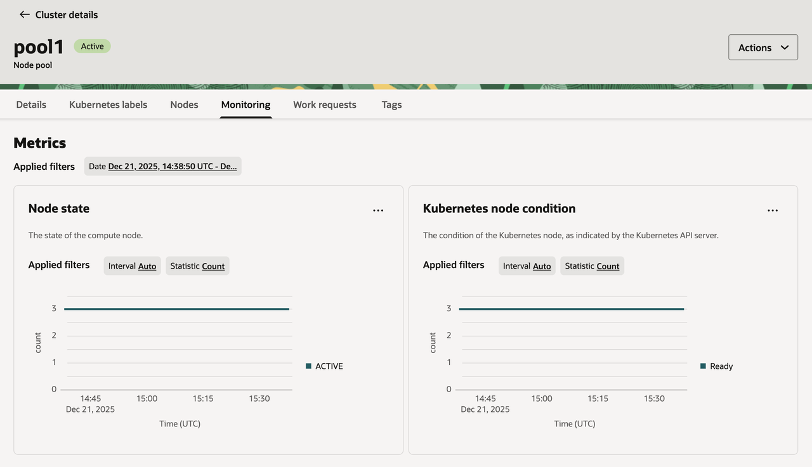
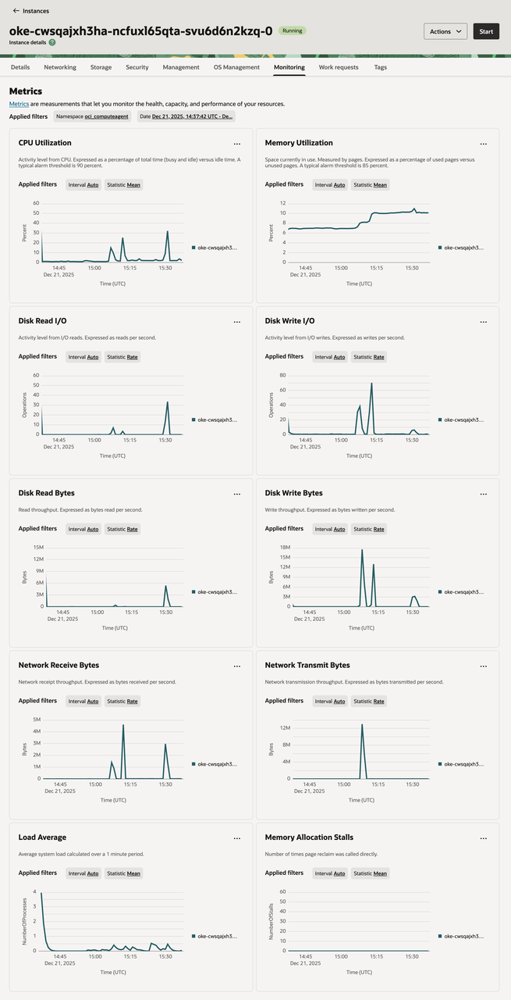
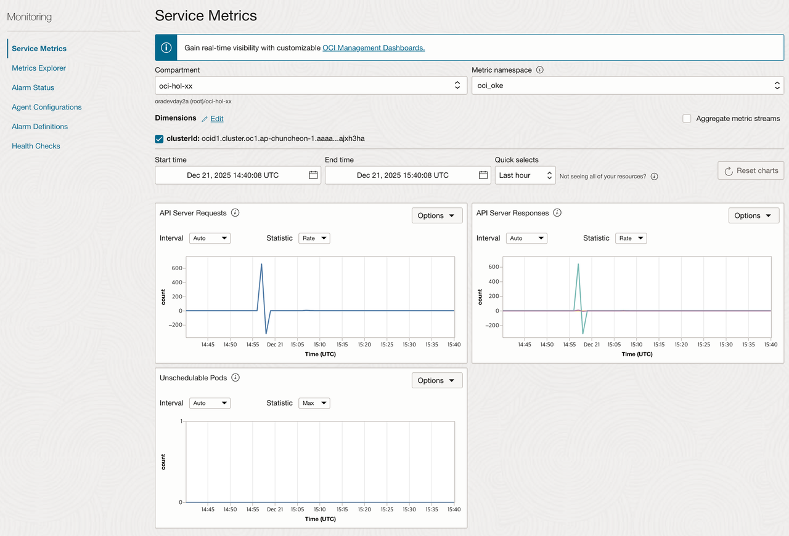
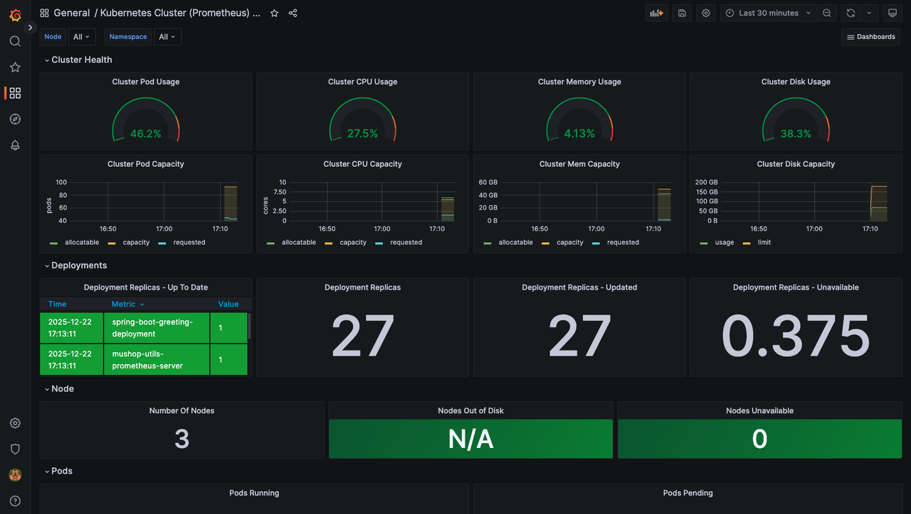

# Monitor the deployment

## Introduction

Observability는 로그와 매트릭, 트레이스(추적)를 조합하여 현재 시스템의 상태를 이해하고 설명하는 데 도움을 줍니다. 시스템에 대한 가시성을 높이는데 도움을 줍니다.

예상 시간: 25 분

### 목표

* OCI 모니터링 콘솔 화면을 통해서 OKE Cluster, Node Pool, Worker Node의 상태 체크하는 법 익히기
* OSS Grafana 대시보드 사용하는 법 익히기

### 전제 조건

* **Lab 4: Deploy the MuShop Application** 완료하고 현재 앱이 실행 중일 것

### 실습 비디오

[](youtube:XMkLtydlc3Y)


## Task 1: OKE Metrics 보기

### OKE Cluster Metrics

1. 왼쪽 상단의 **Navigation Menu**를 클릭하고 **Developer Services**로 이동한 다음 **Kubernetes Clusters (OKE)**를 선택 합니다.

2. 대상 클러스터를 클릭합니다.

3. **Resources &gt; Metrics** 에서 다음 메트릭을 확인할 수 있습니다.

    * Unschedulable Pods: Pod를 스케쥴하기 위한 리소스가 충분하지 않은 경우 노드풀 확장 작업을 트리거하는데 사용할 수 있는 수치

    

### OKE Node Pool Metrics

1. 대상 클러스터 화면에서 **Resources &gt; Node pools** 을 클릭합니다.

2. 대상 노드풀 이름을 클릭합니다.

3. **Resources &gt; Metrics** 에서 다음 노드풀내의 노드에 대한 메트릭을 확인할 수 있습니다.

    * Node State: Worker 노드가 OCI Compute Service를 통해서 Active 상태로 인지될 때
    * Kubernetes Node condition: Worker 노드가 Kubernetes API Server를 통해서 Ready 상태로 인지될 때

    

### OKE Worker Node Metrics

1. 노드풀 화면에서 **Resources &gt; Nodes** 를 클릭합니다.

2. 대상 노드를 클릭합니다.

3. **Resources &gt; Metrics** 에서 해당 노드(Compute 인스턴스)에 대한 메트릭을 확인할 수 있습니다.

    * CPU Utilization
    * Memory Utilization
    * Disk Read I/O / Write IO
    * Disk Read Bytes / Write Bytes
    * Network Receive Bytes / Transmit Bytes
    * Load Average / Memory Allocation Stalls

    

### OCI Monitoring

1. OKE Cluster Metrics과 Node Pool Metrics은 Observability & Management에서도 확인할 수 있습니다.

2. 왼쪽 상단의 **Navigation Menu**를 클릭하고 **Observability & Management**로 이동한 다음 **Monitoring**를 선택 합니다.

3. 메트릭 네임스페이서에서 **oci_oke**을 선택합니다.

    

4. 몇 가지 추가 메트릭을 제공합니다. OCI Monitoring에서 제공하는 기능을 통해 쿼리하거나, 조건에 따른 알람을 설정할 수 있습니다.


## Task 2: OSS Grafana 모니터링

Lab 4에서 Helm Chart를 활용하여 Prometheus/Grafana를 이미 설치하였습니다. OKE에 설치된 Grafana 대시보드에 접속해 보겠습니다.

1. 우측 상단의 Cloud Shell 아이콘을 클릭하여 Cloud Shell로 들어갑니다.

2. **mushop-utils**가 설치되었는지 확인을 위해 Helm release를 조회합니다.

    ````shell
    <copy>
    helm list --all-namespaces
    </copy>
    ````

    Sample response:

    ````shell
    NAME            NAMESPACE               REVISION        UPDATED                                 STATUS          CHART                   APP VERSION
    mushop          mushop                  1               2023-01-17 09:47:21.427865968 +0000 UTC deployed        mushop-0.1.2            1.0        
    mushop-utils    mushop-utilities        1               2023-01-17 09:43:36.887044059 +0000 UTC deployed        mushop-setup-0.0.2      1.0      
    ````

3. **mushop-utils** 에서 Grafana 설치 정보 확인합니다. 다음에서 하는 접속 주소, 암호확인 방법을 확인할 수 있습니다.

    ````shell
    <copy>
    helm status mushop-utils --namespace mushop-utilities
    </copy>
    ````

4. Ingress Controller에 할당된 EXTERNAL-IP 확인 (EXTERNAL-IP 메모)

    ````shell
    <copy>
    kubectl get svc mushop-utils-ingress-nginx-controller --namespace mushop-utilities
    </copy>
    ````

5. 자동 생성된 Grafana **admin** 패스워드 확인

    ````shell
    <copy>
    kubectl get secret -n mushop-utilities mushop-utils-grafana \
    -o jsonpath="{.data.admin-password}" | base64 --decode ; echo
    </copy>
    ````

6. 브라우저를 통해서 **https**://< EXTERNAL-IP >/grafana로 접속

7. **admin**/**< password >** 정보로 로그인

    

8. Grafana 메인 화면에서 **General / Home**을 선택합니다.

    

9. `Kubernetes Cluster` 대시보드를 선택합니다.

    *Note:* Mushop은 mushop-utils 차트의 일부로 대시보드를 미리 로드합니다.

    

10. Kubernetes Cluster 대시보드를 확인합니다.

    

11. Kubernetes Cluster 외 다른 대시보드도 선택해서 확인해 봅니다.

### 대쉬보드 임포트

> *Note:* [Grafana 커뮤니티](https://grafana.com/grafana/dashboards?dataSource=prometheus)에서 다른 대시보드를 설치하거나 직접 만들 수 있습니다.

- 쿠버네티스 업그레이드로 인한 일부 메트릭 변경 되었습니다. 수정된 다음 대쉬보드를 임포트하면 정상적으로 보입니다.

    * [Kubernetes Cluster (Prometheus) - OKE](https://raw.githubusercontent.com/TheKoguryo/grafana-dashboard/main/mushop/kubernetes-cluster-prometheus-oke.json)
    * [Kubernetes Pods (Prometheus) - OKE](https://raw.githubusercontent.com/TheKoguryo/grafana-dashboard/main/mushop/kubernetes-pods-prometheus-oke.json)
    * [Spring Boot Statistics - OKE](https://raw.githubusercontent.com/TheKoguryo/grafana-dashboard/main/mushop/spring-boot-statistics-oke.json)

1. **Dashboard** > **Browse** 를 클릭합니다.

    

2. 오른쪽 **Import** 버튼을 클릭합니다.

3. Grafana.com에 있는 대쉬보드를 추가하거나, JSON 파일을 직접 업로드 할 수 있습니다. 여기서는 위에 수정한 대쉬보드를 복사해서 추가합니다.

    

4. 임포트합니다.

    

5. 추가된 대쉬보드를 볼 수 있습니다.

## Task 3: Autoscaling (선택사항)

*HPA를 통한 Pod Autoscaling은 Kubernetes의 기본 기능으로 본 실습 작업을 진행하시는 것은 잔여 실습시간 여유에 따른 선택적 진행하시면 됩니다.*

Deployment를 스케일아웃하면 새 Pod가 생성되고 사용 가능한 자원이 있는 노드에 스케쥴되어 배치되어 변경된 갯수로 Pod의 갯수로 조정되게 됩니다. Kubernetes는 수평, 수직 오토스케일링을 지원합니다. 자세한 설명은 [Horizontal Pod Autoscaling](https://kubernetes.io/docs/user-guide/horizontal-pod-autoscaling/)을 참조하세요.

배포된 MuShop 애플리케이션은 배포시 사용한 Helm Chart에 HPA를 이미 구성한 상태로 아래와 같이 바로 확인가능합니다.

> HPA가 동작하기 위해서는 CPU, Memory 사용량 정보를 가져오기 위한 Metric Server 설치가 필요합니다. 앞선 MuShop 유틸리티 배포시 이미 배포되어 있습니다. 신규 클러스터에 설치하려면 관련 OKE 문서[(Deploying the Kubernetes Metrics Server on a Cluster Using Kubectl)](https://docs.oracle.com/en-us/iaas/Content/ContEng/Tasks/contengdeployingmetricsserver.htm)를 참고하여 설치합니다.

1. Metric Server가 설치된 경우 아래 명령으로 CPU, Memory 사용량을 확인할 수 있습니다. Kubernetes HPA는 기본 CPU, Memory 사용량을 기반으로 오토스케일링을 할 수 있습니다.

    ```
    $ kubectl top pod
    NAME                                  CPU(cores)   MEMORY(bytes)   
    mushop-api-99f4cd58b-44smh            1m           14Mi            
    mushop-assets-7dddf887d5-l6lpq        1m           8Mi             
    mushop-carts-7f764bfcc-zsp49          1m           108Mi           
    mushop-catalogue-57df57fc4f-l9qvl     6m           22Mi            
    mushop-edge-7674d5484d-qrsc5          1m           20Mi            
    mushop-events-765696cbf7-nrmlg        1m           6Mi             
    mushop-fulfillment-6d568c7fb5-bs5b4   1m           57Mi            
    mushop-nats-8678987b7c-wdm5r          1m           25Mi            
    mushop-orders-c9bdbdbfc-gzqxj         3m           361Mi           
    mushop-payment-65f68f8dff-zqrzv       1m           7Mi             
    mushop-session-6484c5d995-2lwqc       1m           7Mi             
    mushop-storefront-5c4d8d4844-g56rg    1m           1Mi             
    mushop-user-5d58f6694b-cs7kd          1m           68Mi
    ```

2. MuShop 애플리케이션의 현재 스케일링 설정 및 Replicas 수 확인

    ````shell
    <copy>
    kubectl get hpa
    </copy>
    ````

    Sample response:

    ````shell
    NAME                REFERENCE                      TARGETS   MINPODS   MAXPODS   REPLICAS   AGE
    mushop-api          Deployment/mushop-api          1%/70%    1         10        1          3h35m
    mushop-assets       Deployment/mushop-assets       1%/70%    1         10        1          3h35m
    mushop-catalogue    Deployment/mushop-catalogue    4%/70%    1         10        1          3h35m
    mushop-edge         Deployment/mushop-edge         2%/70%    1         10        1          3h35m
    mushop-events       Deployment/mushop-events       1%/70%    1         10        1          3h35m
    mushop-storefront   Deployment/mushop-storefront   1%/70%    1         10        1          3h35m
    mushop-user         Deployment/mushop-user         1%/70%    1         10        1          3h35m
    ````

    노드의 Shape에 따라 TARGETS에서 현재 사용량이 `1%`정도로 낮을 수 있고, Replicas 수는 `1` 정도로 낮게 설정되어 있는 것을 확인할 수 있습니다.

3. HPA 설정을 확인해 보면 Pod의 CPU 기준으로 70%가 넘으면 스케일하는 기준임을 알 수 있습니다.

    ````shell
    <copy>
    kubectl describe hpa mushop-api
    </copy>
    ````

    ````
    Name:                                                  mushop-api
    Namespace:                                             mushop
    Labels:                                                app.kubernetes.io/managed-by=Helm
    Annotations:                                           meta.helm.sh/release-name: mushop
                                                           meta.helm.sh/release-namespace: mushop
    CreationTimestamp:                                     Mon, 07 Mar 2022 01:59:56 +0000
    Reference:                                             Deployment/mushop-api
    Metrics:                                               ( current / target )
      resource cpu on pods  (as a percentage of request):  1% (1m) / 70%
    Min replicas:                                          1
    Max replicas:                                          10
    Deployment pods:                                       1 current / 1 desired
    Conditions:
      Type            Status  Reason              Message
      ----            ------  ------              -------
      AbleToScale     True    ReadyForNewScale    recommended size matches current size
      ScalingActive   True    ValidMetricFound    the HPA was able to successfully calculate a replica count from cpu resource utilization (percentage of request)
      ScalingLimited  False   DesiredWithinRange  the desired count is within the acceptable range
    Events:           <none>
    ````

4. 배포(Deployments)에 의해서 생성된 ReplicaSet 확인

    ````shell
    <copy>
    kubectl get rs
    </copy>
    ````

    Sample response:

    ````shell
    NAME                           DESIRED   CURRENT   READY   AGE
    mushop-api-67df55b466          1         1         1       3h37m
    mushop-assets-5d6f44b88f       1         1         1       3h37m
    mushop-carts-5c97d8bf9c        1         1         1       3h37m
    mushop-catalogue-c79d9464c     1         1         1       3h37m
    mushop-edge-8649c9b5dd         1         1         1       3h37m
    mushop-events-6f69d5cc79       1         1         1       3h37m
    mushop-fulfillment-b59cc849    1         1         1       3h37m
    mushop-nats-977d9d7df          1         1         1       3h37m
    mushop-orders-5f65f59497       1         1         1       3h37m
    mushop-payment-6456f6df7       1         1         1       3h37m
    mushop-session-678f95f767      1         1         1       3h37m
    mushop-storefront-7c8c866d88   1         1         1       3h37m
    mushop-user-6b8b559cc6         1         1         1       3h37m
    ````

5. 부하를 주기 위한 시뮬레이션 앱을 배포

    ````shell
    <copy>
    kubectl create -f https://raw.githubusercontent.com/oracle-quickstart/oci-cloudnative/master/src/load/load-dep.yaml
    </copy>
    ````

6. 몇 분정도 대기 후 HPA Metrics 확인

    ````shell
    <copy>
    kubectl get hpa
    </copy>
    ````

    Sample response:

    ````shell
    NAME                REFERENCE                      TARGETS   MINPODS   MAXPODS   REPLICAS   AGE
    mushop-api          Deployment/mushop-api          60%/70%   1         10        2          3h40m
    mushop-assets       Deployment/mushop-assets       1%/70%    1         10        1          3h40m
    mushop-catalogue    Deployment/mushop-catalogue    6%/70%    1         10        1          3h40m
    mushop-edge         Deployment/mushop-edge         96%/70%   1         10        2          3h40m
    mushop-events       Deployment/mushop-events       3%/70%    1         10        1          3h40m
    mushop-storefront   Deployment/mushop-storefront   14%/70%   1         10        1          3h40m
    mushop-user         Deployment/mushop-user         1%/70%    1         10        1          3h40m
    ````

    TARGETS에 있는 현재 값이 증가하여 목표치를 넘었는지 Replicas 수가 증가하기 시작했는지 확인

     *참고:* 클러스터 Worker 노드의 Shape에 따라 사용량이 더 낮거나 높을 수 있습니다.

7. HPA 확인해 보면 스케일 이벤트가 발생한 것을 알 수 있습니다.

    ````
    winter@cloudshell:~ (ap-chuncheon-1)$ kubectl describe hpa mushop-api
    Name:                                                  mushop-api
    Namespace:                                             mushop
    ...
    Events:
      Type    Reason             Age    From                       Message
      ----    ------             ----   ----                       -------
      Normal  SuccessfulRescale  3m10s  horizontal-pod-autoscaler  New size: 2; reason: cpu resource utilization (percentage of request) above target    
    ````

8. 부하 시뮬레이터 삭제

    ````shell
    <copy>
    kubectl delete -f https://raw.githubusercontent.com/oracle-quickstart/oci-cloudnative/master/src/load/load-dep.yaml
    </copy>
    ````

    몇 분 후 부하가 감소하고 대상의 리소스 사용량이 감소합니다. 이 시점에서 Kubernetes는 **scale down**을 시작하고 Replicas 수를 최소로 되돌립니다.

이제 **다음 실습을 진행**하시면 됩니다.

## Acknowledgements

* **Author** - DongHee Lee, Adao Junior
* **Korean Translator & Contributors** - DongHee Lee, February 2022
- **Last Updated By/Date** - DongHee Lee, January 2023
