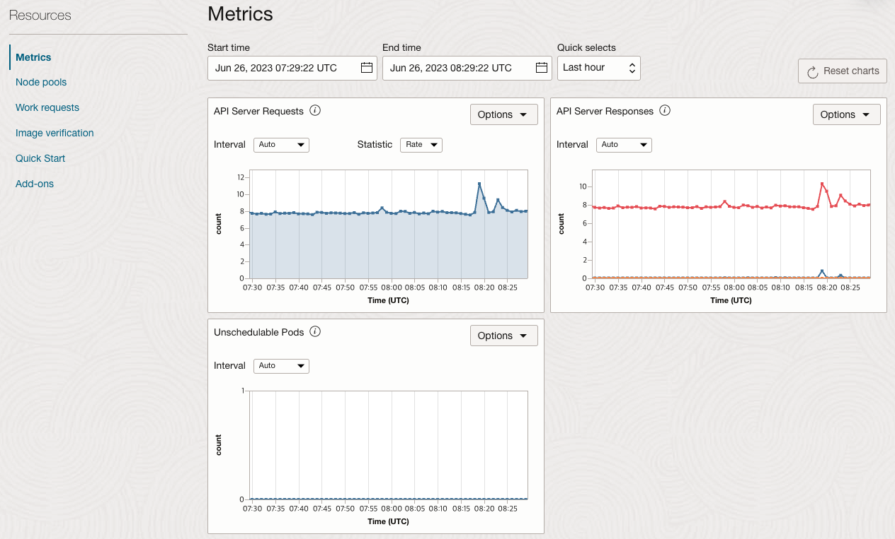

# Monitor the deployment

## Introduction

Observability는 로그와 매트릭, 트레이스(추적)를 조합하여 현재 시스템의 상태를 이해하고 설명하는 데 도움을 줍니다. 시스템에 대한 가시성을 높이는데 도움을 줍니다.

예상 시간: 20 분

### 목표

* OCI 모니터링 콘솔 화면을 통해서 OKE Cluster, Node Pool, Worker Node의 상태 체크하는 법 익히기
* OSS Grafana 대시보드 사용하는 법 익히기

### 전제 조건

* **Lab 4: Deploy the MuShop Application** 완료하고 현재 앱이 실행 중일 것

### 실습 비디오

[](youtube:XMkLtydlc3Y)


## Task 1: OKE Metrics 보기

1. *OKE Cluster Metrics:* **Developer Services &gt; Kubernetes Clusters &gt; <클러스터 이름>** 로 이동

2. **Resources &gt; Metrics** 에서 다음 메트릭을 확인

    * Unschedulable Pods: Pod를 스케쥴하기 위한 리소스가 충분하지 않은 경우 노드풀 확장 작업을 트리거하는데 사용할 수 있는 수치

    

3. 이러한 매트릭은 OCI Monitoring 콘솔(**Observability & Management > Monitoring**)에서 **oci_oke**라는 메트릭 네임스페이스를 통해서 볼 수 있습니다. OCI Monitoring 콘솔에서는 더 많은 메트릭을 제공하고 이를 통해 쿼리, 알람 등을 추가할 수 있습니다.


4. *OKE Node Pool Metrics:* **Developer Services &gt; Kubernetes Clusters &gt; <클러스터 이름> &gt; Node Pools &gt; <노드풀 이름>** 로 이동

    다음의 노드풀 매트릭스 정보 확인:

    * Node State: Worker 노드가 OCI Compute Service를 통해서 Active 상태로 인지될 때
    * Node condition: Worker 노드가 Kubernetes API Server를 통해서 Ready 상태로 인지될 때

    

5. *OKE Worker Node Metrics:* **Resources &lt; Nodes &lt; <노드 이름>** 로 이동

    Compute 인스턴스에 대한 메트릭으로 다음의 노드 매트릭스 정보 확인:

    * CPU Utilization
    * Memory Utilization
    * Disk Read I/O / Write IO
    * Disk Read Bytes / Write Bytes
    * Network Receive Bytes / Transmit Bytes
    * Load Average / Memory Allocation Stalls

    


## Task 2: OSS Grafana 모니터링

Lab 4에서 Helm Chart를 활용하여 Prometheus/Grafana를 이미 설치하였습니다. OKE에 설치된 Grafana 대시보드에 접속해 보겠습니다.

1. 우측 상단의 Cloud Shell 아이콘을 클릭하여 Cloud Shell로 들어갑니다.

2. **mushop-utils**가 설치되었는지 확인을 위해 Helm release를 조회합니다.

    ````shell
    <copy>
    helm list --all-namespaces
    </copy>
    ````

    Sample response:

    ````shell
    NAME            NAMESPACE               REVISION        UPDATED                                 STATUS          CHART                   APP VERSION
    mushop          mushop                  1               2022-03-07 01:59:54.525415391 +0000 UTC deployed        mushop-0.1.2            1.0        
    mushop-utils    mushop-utilities        1               2022-03-07 01:53:39.822426 +0000 UTC    deployed        mushop-setup-0.0.2      1.0        
    ````

3. **mushop-utils** 에서 Grafana 설치 정보 확인합니다. 다음에서 하는 접속 주소, 암호확인 방법을 확인할 수 있습니다.

    ````shell
    <copy>
    helm status mushop-utils --namespace mushop-utilities
    </copy>
    ````

4. Ingress Controller에 할당된 EXTERNAL-IP 확인 (EXTERNAL-IP 메모)

    ````shell
    <copy>
    kubectl get svc mushop-utils-ingress-nginx-controller --namespace mushop-utilities
    </copy>
    ````

5. 자동 생성된 Grafana **admin** 패스워드 확인

    ````shell
    <copy>
    kubectl get secret -n mushop-utilities mushop-utils-grafana \
    -o jsonpath="{.data.admin-password}" | base64 --decode ; echo
    </copy>
    ````

6. 브라우저를 통해서 **https**://< EXTERNAL-IP >/grafana로 접속

7. **admin**/**< password >** 정보로 로그인

    

8. Grafana 메인 화면에서 **General / Home**을 선택합니다.

    

9. `Kubernetes Cluster` 대시보드를 선택합니다.

    *Note:* Mushop은 mushop-utils 차트의 일부로 대시보드를 미리 로드합니다.

    

10. Kubernetes Cluster 대시보드를 확인합니다.

    

11. Kubernetes Cluster 외 다른 대시보드도 선택해서 확인해 봅니다.

    *Note:* [Grafana 커뮤니티](https://grafana.com/grafana/dashboards?dataSource=prometheus)에서 다른 대시보드를 설치하거나 직접 만들 수 있습니다.

    - 쿠버네티스 업그레이드로 인한 일부 메트릭 변경 되었습니다. 수정된 다음 대쉬보드를 임포트하면 정상적으로 보입니다.
        * [Kubernetes Cluster (Prometheus) - OKE](https://raw.githubusercontent.com/TheKoguryo/grafana-dashboard/main/mushop/kubernetes-cluster-prometheus-oke.json)
        * [Kubernetes Pods (Prometheus) - OKE](https://raw.githubusercontent.com/TheKoguryo/grafana-dashboard/main/mushop/kubernetes-pods-prometheus-oke.json)
        * [Spring Boot Statistics - OKE](https://raw.githubusercontent.com/TheKoguryo/grafana-dashboard/main/mushop/spring-boot-statistics-oke.json)


## Task 3: Autoscaling

Deployment를 스케일아웃하면 새 Pod가 생성되고 사용 가능한 자원이 있는 노드에 스케쥴되어 배치되어 변경된 갯수로 Pod의 갯수로 조정되게 됩니다. Kubernetes는 수평, 수직 오토스케일링을 지원합니다. 자세한 설명은 [Horizontal Pod Autoscaling](https://kubernetes.io/docs/user-guide/horizontal-pod-autoscaling/)을 참조하세요.

배포된 MuShop 애플리케이션은 배포시 사용한 Helm Chart에 HPA를 이미 구성한 상태로 아래와 같이 바로 확인가능합니다.

> HPA가 동작하기 위해서는 CPU, Memory 사용량 정보를 가져오기 위한 Metric Server 설치가 필요합니다. 앞선 MuShop 유틸리티 배포시 이미 배포되어 있습니다. 신규 클러스터에 설치하려면 관련 OKE 문서[(Deploying the Kubernetes Metrics Server on a Cluster Using Kubectl)](https://docs.oracle.com/en-us/iaas/Content/ContEng/Tasks/contengdeployingmetricsserver.htm)를 참고하여 설치합니다.

1. MuShop 애플리케이션의 현재 스케일링 설정 및 Replicas 수 확인

    ````shell
    <copy>
    kubectl get hpa
    </copy>
    ````

    Sample response:

    ````shell
    NAME                REFERENCE                      TARGETS   MINPODS   MAXPODS   REPLICAS   AGE
    mushop-api          Deployment/mushop-api          1%/70%    1         10        1          3h35m
    mushop-assets       Deployment/mushop-assets       1%/70%    1         10        1          3h35m
    mushop-catalogue    Deployment/mushop-catalogue    4%/70%    1         10        1          3h35m
    mushop-edge         Deployment/mushop-edge         2%/70%    1         10        1          3h35m
    mushop-events       Deployment/mushop-events       1%/70%    1         10        1          3h35m
    mushop-storefront   Deployment/mushop-storefront   1%/70%    1         10        1          3h35m
    mushop-user         Deployment/mushop-user         1%/70%    1         10        1          3h35m
    ````

    노드의 Shape에 따라 TARGETS에서 현재 사용량이 `1%`정도로 낮을 수 있고, Replicas 수는 `1` 정도로 낮게 설정되어 있는 것을 확인할 수 있습니다.

1. HPA 설정을 확인해 보면 Pod의 CPU 기준으로 70%가 넘으면 스케일하는 기준임을 알 수 있습니다.

    ````shell
    <copy>
    kubectl describe hpa mushop-api
    </copy>
    ````

    ````
    Name:                                                  mushop-api
    Namespace:                                             mushop
    Labels:                                                app.kubernetes.io/managed-by=Helm
    Annotations:                                           meta.helm.sh/release-name: mushop
                                                           meta.helm.sh/release-namespace: mushop
    CreationTimestamp:                                     Mon, 07 Mar 2022 01:59:56 +0000
    Reference:                                             Deployment/mushop-api
    Metrics:                                               ( current / target )
      resource cpu on pods  (as a percentage of request):  1% (1m) / 70%
    Min replicas:                                          1
    Max replicas:                                          10
    Deployment pods:                                       1 current / 1 desired
    Conditions:
      Type            Status  Reason              Message
      ----            ------  ------              -------
      AbleToScale     True    ReadyForNewScale    recommended size matches current size
      ScalingActive   True    ValidMetricFound    the HPA was able to successfully calculate a replica count from cpu resource utilization (percentage of request)
      ScalingLimited  False   DesiredWithinRange  the desired count is within the acceptable range
    Events:           <none>
    ````

1. 배포(Deployments)에 의해서 생성된 ReplicaSet 확인

    ````shell
    <copy>
    kubectl get rs
    </copy>
    ````

    Sample response:

    ````shell
    NAME                           DESIRED   CURRENT   READY   AGE
    mushop-api-67df55b466          1         1         1       3h37m
    mushop-assets-5d6f44b88f       1         1         1       3h37m
    mushop-carts-5c97d8bf9c        1         1         1       3h37m
    mushop-catalogue-c79d9464c     1         1         1       3h37m
    mushop-edge-8649c9b5dd         1         1         1       3h37m
    mushop-events-6f69d5cc79       1         1         1       3h37m
    mushop-fulfillment-b59cc849    1         1         1       3h37m
    mushop-nats-977d9d7df          1         1         1       3h37m
    mushop-orders-5f65f59497       1         1         1       3h37m
    mushop-payment-6456f6df7       1         1         1       3h37m
    mushop-session-678f95f767      1         1         1       3h37m
    mushop-storefront-7c8c866d88   1         1         1       3h37m
    mushop-user-6b8b559cc6         1         1         1       3h37m
    ````

1. 부하를 주기 위한 시뮬레이션 앱을 배포

    ````shell
    <copy>
    kubectl create -f https://raw.githubusercontent.com/oracle-quickstart/oci-cloudnative/master/src/load/load-dep.yaml
    </copy>
    ````

1. 몇 분정도 대기 후 HPA Metrics 확인

    ````shell
    <copy>
    kubectl get hpa
    </copy>
    ````

    Sample response:

    ````shell
    NAME                REFERENCE                      TARGETS   MINPODS   MAXPODS   REPLICAS   AGE
    mushop-api          Deployment/mushop-api          60%/70%   1         10        2          3h40m
    mushop-assets       Deployment/mushop-assets       1%/70%    1         10        1          3h40m
    mushop-catalogue    Deployment/mushop-catalogue    6%/70%    1         10        1          3h40m
    mushop-edge         Deployment/mushop-edge         96%/70%   1         10        2          3h40m
    mushop-events       Deployment/mushop-events       3%/70%    1         10        1          3h40m
    mushop-storefront   Deployment/mushop-storefront   14%/70%   1         10        1          3h40m
    mushop-user         Deployment/mushop-user         1%/70%    1         10        1          3h40m
    ````

    TARGETS에 있는 현재 값이 증가하여 목표치를 넘었는지 Replicas 수가 증가하기 시작했는지 확인

     *참고:* 클러스터 Worker 노드의 Shape에 따라 사용량이 더 낮거나 높을 수 있습니다.

1. HPA 확인해 보면 스케일 이벤트가 발생한 것을 알 수 있습니다.

    ````
    winter@cloudshell:~ (ap-chuncheon-1)$ kubectl describe hpa mushop-api
    Name:                                                  mushop-api
    Namespace:                                             mushop
    ...
    Events:
      Type    Reason             Age    From                       Message
      ----    ------             ----   ----                       -------
      Normal  SuccessfulRescale  3m10s  horizontal-pod-autoscaler  New size: 2; reason: cpu resource utilization (percentage of request) above target    
    ````

1. 부하 시뮬레이터 삭제

    ````shell
    <copy>
    kubectl delete -f https://raw.githubusercontent.com/oracle-quickstart/oci-cloudnative/master/src/load/load-dep.yaml
    </copy>
    ````

    몇 분 후 부하가 감소하고 대상의 리소스 사용량이 감소합니다. 이 시점에서 Kubernetes는 **scale down**을 시작하고 Replicas 수를 최소로 되돌립니다.

이제 **다음 실습을 진행**하시면 됩니다.

## Acknowledgements

* **Author** - Adao Junior
* **Contributors** - Adao Junior
* **Last Updated By/Date** - Adao Junior, October 2020
* **Korean Translator & Contributors** - DongHee Lee, February 2022
