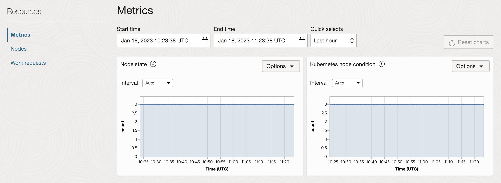
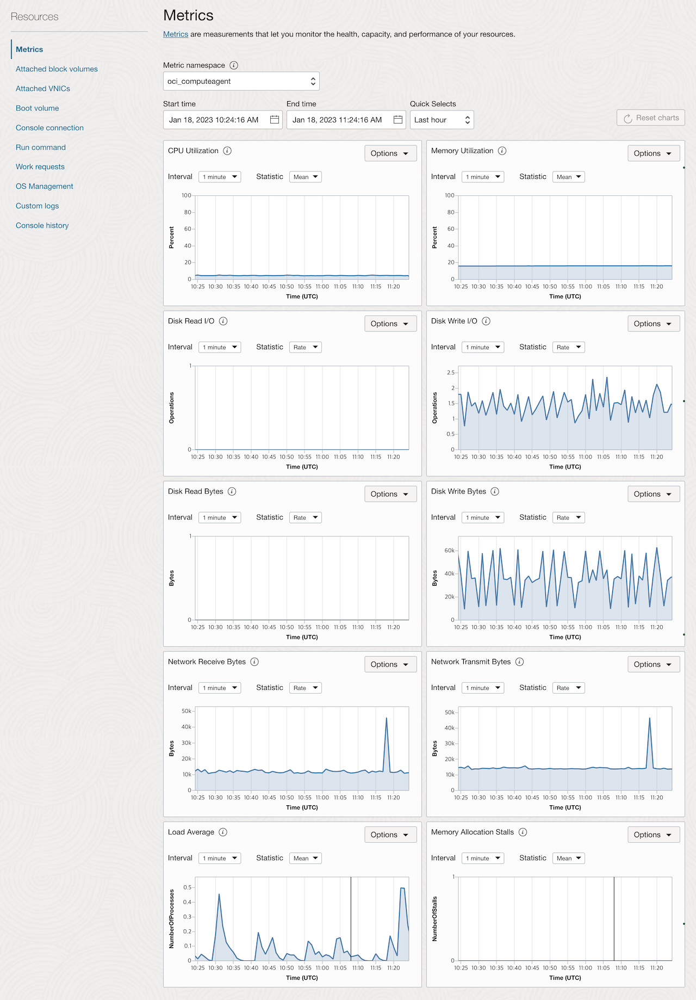
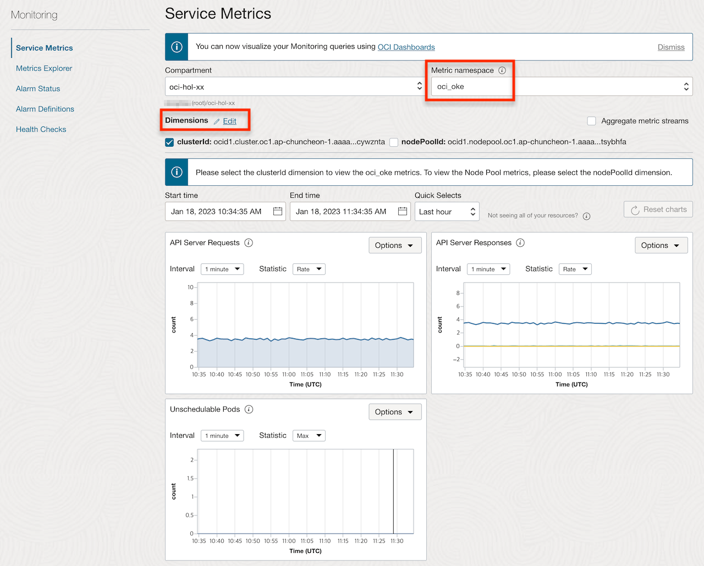
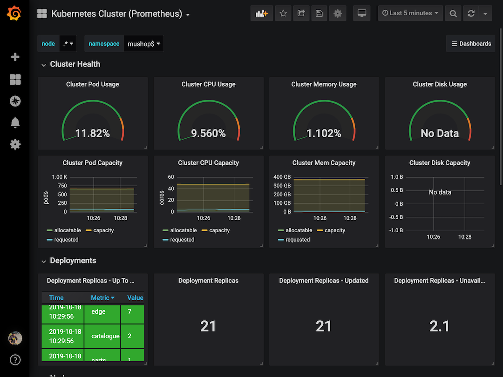

# Monitor the deployment

## Introduction

Observability는 로그와 매트릭, 트레이스(추적)를 조합하여 현재 시스템의 상태를 이해하고 설명하는 데 도움을 줍니다. 시스템에 대한 가시성을 높이는데 도움을 줍니다.

예상 시간: 25 분

### 목표

* OCI 모니터링 콘솔 화면을 통해서 OKE Cluster, Node Pool, Worker Node의 상태 체크하는 법 익히기
* OSS Grafana 대시보드 사용하는 법 익히기

### 전제 조건

* **Lab 4: Deploy the MuShop Application** 완료하고 현재 앱이 실행 중일 것

### 실습 비디오

[](youtube:XMkLtydlc3Y)


## Task 1: OKE Metrics 보기

### OKE Cluster Metrics

1. 왼쪽 상단의 **Navigation Menu**를 클릭하고 **Developer Services**로 이동한 다음 **Kubernetes Clusters (OKE)**를 선택 합니다.

2. 대상 클러스터를 클릭합니다.

3. **Resources &gt; Metrics** 에서 다음 메트릭을 확인할 수 있습니다.

    * API Server Requests: Kubernetes API 서버가 수신한 요청수
    * API Server Responses: Kubernetes API 서버의 응답 유형별 초당 응답 수
    * Unschedulable Pods: Pod를 스케쥴하기 위한 리소스가 충분하지 않은 경우 노드풀 확장 작업을 트리거하는데 사용할 수 있는 수치

    

### OKE Node Pool Metrics

1. 대상 클러스터 화면에서 **Resources &gt; Node pools** 을 클릭합니다.

2. 대상 노드풀 이름을 클릭합니다.

3. **Resources &gt; Metrics** 에서 다음 노드풀내의 노드에 대한 메트릭을 확인할 수 있습니다.

    * Node State: Worker 노드가 OCI Compute Service를 통해서 Active 상태로 인지될 때
    * Kubernetes Node condition: Worker 노드가 Kubernetes API Server를 통해서 Ready 상태로 인지될 때

    

### OKE Worker Node Metrics

1. 노드풀 화면에서 **Resources &gt; Nodes** 를 클릭합니다.

2. 대상 노드를 클릭합니다.

3. **Resources &gt; Metrics** 에서 해당 노드(Compute 인스턴스)에 대한 메트릭을 확인할 수 있습니다.

    * CPU Utilization
    * Memory Utilization
    * Disk Read I/O / Write IO
    * Disk Read Bytes / Write Bytes
    * Network Receive Bytes / Transmit Bytes
    * Load Average / Memory Allocation Stalls

    

### OCI Monitoring

1. OKE Cluster Metrics과 Node Pool Metrics은 Observability & Management에서도 확인할 수 있습니다.

2. 왼쪽 상단의 **Navigation Menu**를 클릭하고 **Observability & Management**로 이동한 다음 **Monitoring**를 선택 합니다.

3. 메트릭 네임스페이스에서 **oci_oke**을 선택합니다. Dimensions에서 대상 OKE Cluster ID를 선택합니다.

    

4. 몇 가지 추가 메트릭을 제공합니다. OCI Monitoring에서 제공하는 기능을 통해 쿼리하거나, 조건에 따른 알람을 설정할 수 있습니다.


## Task 2: OSS Grafana 모니터링

Lab 4에서 Helm Chart를 활용하여 Prometheus/Grafana를 이미 설치하였습니다. OKE에 설치된 Grafana 대시보드에 접속해 보겠습니다.

1. 우측 상단의 Cloud Shell 아이콘을 클릭하여 Cloud Shell로 들어갑니다.

2. **mushop-utils**가 설치되었는지 확인을 위해 Helm release를 조회합니다.

    ````shell
    <copy>
    helm list --all-namespaces
    </copy>
    ````

    Sample response:

    ````shell
    NAME            NAMESPACE               REVISION        UPDATED                                 STATUS          CHART                   APP VERSION
    mushop          mushop                  1               2023-06-26 08:22:16.734411354 +0000 UTC deployed        mushop-0.2.1            2.0        
    mushop-utils    mushop-utilities        1               2023-06-26 08:18:08.724959532 +0000 UTC deployed        mushop-setup-0.0.2      1.0    
    ````

3. **mushop-utils** 에서 Grafana 설치 정보 확인합니다. 다음에서 하는 접속 주소와 관리자암호를 찾는 방법을 확인할 수 있습니다.

    ````shell
    <copy>
    helm status mushop-utils --namespace mushop-utilities
    </copy>
    ````

4. Ingress Controller에 할당된 EXTERNAL-IP 확인 (EXTERNAL-IP 메모)

    ````shell
    <copy>
    kubectl get svc mushop-utils-ingress-nginx-controller --namespace mushop-utilities
    </copy>
    ````

5. 자동 생성된 Grafana **admin** 패스워드 확인

    ````shell
    <copy>
    kubectl get secret -n mushop-utilities mushop-utils-grafana \
    -o jsonpath="{.data.admin-password}" | base64 --decode ; echo
    </copy>
    ````

6. 브라우저를 통해서 **https**://< EXTERNAL-IP >/grafana로 접속

7. **admin**/**< password >** 정보로 로그인

    

8. Grafana 메인 화면에서 **General / Home**을 선택합니다.

    

9. `Kubernetes Cluster` 대시보드를 선택합니다.

    *Note:* Mushop은 mushop-utils 차트의 일부로 대시보드를 미리 로드합니다.

    

10. Kubernetes Cluster 대시보드를 확인합니다.

    

11. Kubernetes Cluster 외 다른 대시보드도 선택해서 확인해 봅니다.

### 대쉬보드 임포트

> *Note:* [Grafana 커뮤니티](https://grafana.com/grafana/dashboards?dataSource=prometheus)에서 다른 대시보드를 설치하거나 직접 만들 수 있습니다.

- 쿠버네티스 업그레이드로 인한 일부 메트릭 변경 되었습니다. 수정된 다음 대쉬보드를 임포트하면 정상적으로 보입니다.

    * [Kubernetes Cluster (Prometheus) - OKE](https://raw.githubusercontent.com/TheKoguryo/grafana-dashboard/main/mushop/kubernetes-cluster-prometheus-oke.json)
    * [Kubernetes Pods (Prometheus) - OKE](https://raw.githubusercontent.com/TheKoguryo/grafana-dashboard/main/mushop/kubernetes-pods-prometheus-oke.json)
    * [Spring Boot Statistics - OKE](https://raw.githubusercontent.com/TheKoguryo/grafana-dashboard/main/mushop/spring-boot-statistics-oke.json)

1. **Dashboard** > **Browse** 를 클릭합니다.

    

2. 오른쪽 **Import** 버튼을 클릭합니다.

3. Grafana.com에 있는 대쉬보드를 추가하거나, JSON 파일을 직접 업로드 할 수 있습니다. 여기서는 위에 수정한 대쉬보드를 복사해서 추가합니다.

    

4. 임포트합니다.

    

5. 추가된 대쉬보드를 볼 수 있습니다.


이제 **다음 실습을 진행**하시면 됩니다.

## Acknowledgements

* **Author** - DongHee Lee, Adao Junior
* **Korean Translator & Contributors** - DongHee Lee, February 2022
- **Last Updated By/Date** - DongHee Lee, June 2023
