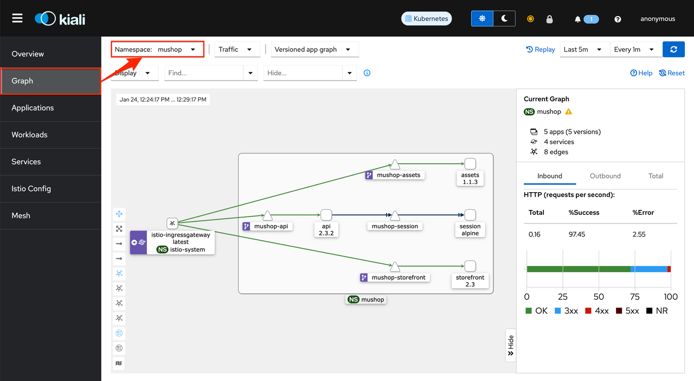
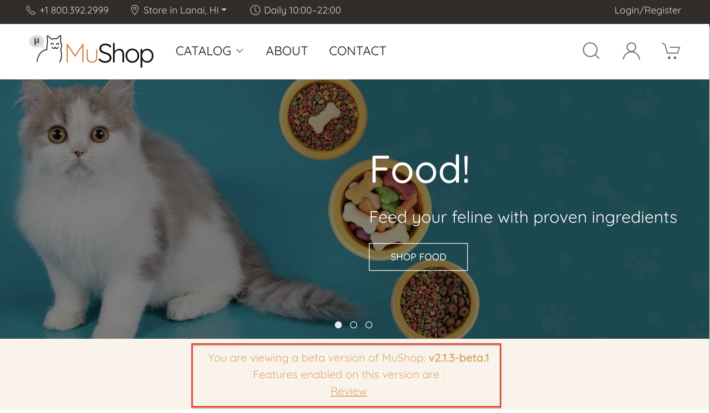

# Use Service Mesh (Optional)

## Introduction

컨테이너 기반의 최신 어플리케이션들을 마이크로 서비스 아키텍처를 사용하는 경우가 늘어나고 있습니다. 분산된 마이크로 서비스들간의 통신, 보안, 모니터링을 어플리케이션 코드 변경 없이 지원하는 서비스 메쉬 중에 가장 많이 사용되는 Istio에 대해서 확인해 봅니다.

- [Istio service mesh](https://istio.io/)

예상 시간: 20 분

### 목표

* Service Mesh 이해하기

### 전제 조건

* **Lab 4: Deploy the MuShop Application** 완료하고 현재 앱이 실행 중일 것

### 실습 비디오

[](youtube:Es__wypgoNI)

## Task 1: Istio 설치

1. Cloud Shell에 접속합니다.

2. Istio 다운로드

    ```
    <copy>
    curl -L https://istio.io/downloadIstio | ISTIO_VERSION=1.13.2 TARGET_ARCH=x86_64 sh -
    </copy>
    ```

3. Istio 경로로 이동

    ```
    <copy>
    cd istio-1.13.2
    </copy>
    ```

4. PATH 환경 변수에 추가

    ```
    <copy>
    export PATH=$PWD/bin:$PATH
    </copy>
    ```

5. 사전검증 실행

    ```
    <copy>
    istioctl x precheck
    </copy>
    ```

6. demo 프로파일로 설치합니다.

    > Istio는 default, demo, minimal, sds 및 remote 프로파일은 제공하고 있습니다. demo 프로파일은 모든 컴포넌트를 포함하고 있는 기능 확인을 위한 데모 설치를 위한 프로파일입니다.

    ```
    <copy>
    istioctl install --set profile=demo
    </copy>
    ```

    ````
    This will install the Istio 1.13.2 demo profile with ["Istio core" "Istiod" "Ingress gateways" "Egress gateways"] components into the cluster. Proceed? (y/N) y
    ✔ Istio core installed 
    ✔ Istiod installed
    ✔ Ingress gateways installed
    ✔ Egress gateways installed
    ✔ Installation complete
    ...
    ````    

7. istio-system 네임스페이스에 설치가 된 것을 알 수 있습니다.
    
    ````
    <copy>
    kubectl get all -n istio-system
    </copy>
    ````

8. 이중화를 위해 스케일합니다.
    
    ````
    <copy>
    kubectl scale --replicas=2 deployment -n istio-system istio-egressgateway
    kubectl scale --replicas=2 deployment -n istio-system istio-ingressgateway
    kubectl scale --replicas=2 deployment -n istio-system istiod
    </copy>
    ````

## Task 2: MuShop에 Istio 활성화하기

1. 레이블 달기

    ````
    <copy>
    kubectl label namespace mushop istio-injection=enabled
    </copy>
    ````

2. 기 배포된 Pod 삭제후 반영하기

    ````
    <copy>
    kubectl delete pod --all -n mushop
    </copy>
    ````

    mushop 모든 Pod를 삭제하면 Self-Healing으로 재생성되면서 모든 Pod가 istio-proxy 컨이너가 추가 되어 컨터이너 수가 하나씩 증가한 걸 볼 수 있습니다.
    ````
    <copy>
    kubectl get pod -n mushop
    </copy>
    ````
    
    ````
    NAME                                READY   STATUS    RESTARTS   AGE
    mushop-api-67df55b466-n7cng         2/2     Running   0          3m21s
    mushop-assets-5d6f44b88f-956fs      2/2     Running   0          3m21s
    mushop-carts-5c97d8bf9c-lwqv4       2/2     Running   0          3m20s
    mushop-catalogue-c79d9464c-pfqnr    2/2     Running   0          3m20s
    mushop-edge-8649c9b5dd-llgv7        2/2     Running   0          3m20s
    mushop-events-6f69d5cc79-vj8fc      2/2     Running   0          3m20s
    mushop-fulfillment-b59cc849-mnmcs   2/2     Running   0          3m20s
    mushop-nats-977d9d7df-qcg8r         3/3     Running   0          3m20s
    mushop-orders-5f65f59497-nvkgw      2/2     Running   0          3m20s
    mushop-payment-6456f6df7-xn85n      2/2     Running   0          3m20s
    mushop-session-678f95f767-fhv2k     2/2     Running   0          3m20s
    mushop-storefront-c9b9d5695-5pkbf   2/2     Running   0          3m20s
    mushop-user-6b8b559cc6-4rwx5        2/2     Running   0          3m20s
    ````

3. Gateway 자원 만들기

    istio가 설치되면 ingress-gateway가 설치됩니다. 아래 Gateway를 만들어 외부에서 서비스 메쉬로 들어오는 부분에 대한 수신부 규칙을 정의합니다.
    ````
    <copy>
    cat << EOF | kubectl apply -f -
    apiVersion: networking.istio.io/v1alpha3
    kind: Gateway
    metadata:
      name: gateway
      namespace: mushop
    spec:
      selector:
        istio: ingressgateway
      servers:
        - port:
            number: 80
            name: http
            protocol: HTTP
          hosts:
            - '*'
    EOF
    </copy>
    ````

4. Virtual Service 만들기

    Ingress Gateway를 통해 Istio로 들어온 요청에 대해 어떤 서비스로 라우팅할 지를 Virtual Service를 통해 정의합니다.

    ````
    <copy>
    cat <<EOF | kubectl apply -f -
    apiVersion: networking.istio.io/v1alpha3
    kind: VirtualService
    metadata:
      name: edge
      namespace: mushop
    spec:
      hosts:
        - '*'
      gateways:
        - gateway
      http:
      - match:
        - uri:
            prefix: /api
        route:
        - destination:
            host: mushop-api.mushop.svc.cluster.local
      - match:
        - uri:
            prefix: /assets
        rewrite:
          uri: /
        route:
        - destination:
            host: mushop-assets.mushop.svc.cluster.local
      - route:
        - destination:
            host: mushop-storefront.mushop.svc.cluster.local
            port:
              number: 80
    EOF
    </copy>
    ````

5. Istio ingress gateway의 EXTERNAL-IP 확인하기

    ````
    <copy>
    kubectl get svc istio-ingressgateway -n istio-system
    </copy>
    ````

    ````
    NAME                   TYPE           CLUSTER-IP    EXTERNAL-IP     PORT(S)                                                                      AGE
    istio-ingressgateway   LoadBalancer   10.96.38.45   138.xxx.xxx.xxx 15021:31918/TCP,80:31451/TCP,443:32368/TCP,31400:32514/TCP,15443:31424/TCP   27m    
    ````    

6. 브라우저로 확인된 EXTERNAL-IP로 접속합니다.

7. 웹페이지로 접속해 보면 요청이 Pod내 기존 컨테이너로 수신된 요청이 동일 Pod내 istio-proxy를 거쳐 다른 Pod로 요청되는 것 알 수 있습니다.

    ````
    <copy>
    kubectl logs -l app=storefront -c istio-proxy -f
    </copy>
    ````

    ````
    2022-03-10T07:58:52.847225Z     info    Readiness succeeded in 1.353523447s
    2022-03-10T07:58:52.847748Z     info    Envoy proxy is ready
    [2022-03-10T08:01:06.859Z] "GET / HTTP/1.1" 200 - via_upstream - "-" 0 4780 1 1 "10.179.86.8,10.244.1.0" "Mozilla/5.0 (Macintosh; Intel Mac OS X 10_15_7) AppleWebKit/537.36 (KHTML, like Gecko) Chrome/98.0.4758.80 Safari/537.36" "137068b0-3a6d-9e4b-91c4-9787a5af72e0" "138.xxx.xxx.xxx" "10.244.1.32:8080" inbound|8080|| 127.0.0.6:59333 10.244.1.32:8080 10.244.1.0:0 outbound_.80_._.mushop-storefront.mushop.svc.cluster.local default
    [2022-03-10T08:01:07.070Z] "GET /styles/shop-583cb7afd2.css HTTP/1.1" 200 - via_upstream - "-" 0 4963 1 0 "10.179.86.8,10.244.1.0" "Mozilla/5.0 (Macintosh; Intel Mac OS X 10_15_7) AppleWebKit/537.36 (KHTML, like Gecko) Chrome/98.0.4758.80 Safari/537.36" "75bd63de-4266-907d-b18f-1edbc754a437" "138.xxx.xxx.xxx" "10.244.1.32:8080" inbound|8080|| 127.0.0.6:59333 10.244.1.32:8080 10.244.1.0:0 outbound_.80_._.mushop-storefront.mushop.svc.cluster.local default
    ...
    ````

## Task 3: 서비스 메쉬 시각화

분산환경에서 클라이언트의 요청에 대한 서비스 들간의 호출 정보를 시각화를 Kiali를 통해 제공하고 있습니다.

- https://istio.io/latest/docs/tasks/observability/kiali/

1. Kiali 설치

    kiali를 위해 prometheus addon도 함께 설치합니다.
    ```
    <copy>
    kubectl apply -f https://raw.githubusercontent.com/istio/istio/release-1.13/samples/addons/prometheus.yaml
    kubectl apply -f https://raw.githubusercontent.com/istio/istio/release-1.13/samples/addons/kiali.yaml
    </copy>
    ```

2. 설치된 Kiali 페이지를 외부에서 접근
    - 공식 문서를 참고하여 외부 접속을 설정합니다.
        - [Istio Addons 원격접속 설정](https://istio.io/latest/docs/tasks/observability/gateways/#option-2-insecure-access-http)

3. 외부 접속 설정 예시

    - 설정을 위한 도메인이 없는 경우 아래와 같기 nip.io를 테스트용도로 사용합니다. nio.io는 /etc/hosts 파일 등록 대신 https://nip.io/ 에 설명된 것 처럼 별도 설정하지 않아도 10.0.0.1.nip.io을 10.0.0.1와 같은 주소형식 자동으로 매핑해줍니다.

        ```
        <copy>
        export INGRESS_HOST=$(kubectl -n istio-system get service istio-ingressgateway -o jsonpath='{.status.loadBalancer.ingress[0].ip}')
        export INGRESS_DOMAIN=${INGRESS_HOST}.nip.io
        </copy>
        ```

    - 외부 접속 오픈

        ```
        <copy>
        cat <<EOF | kubectl apply -f -
        apiVersion: networking.istio.io/v1alpha3
        kind: Gateway
        metadata:
          name: kiali-gateway
          namespace: istio-system
        spec:
          selector:
            istio: ingressgateway
          servers:
          - port:
              number: 80
              name: http-kiali
              protocol: HTTP
            hosts:
            - "kiali.${INGRESS_DOMAIN}"
        ---
        apiVersion: networking.istio.io/v1alpha3
        kind: VirtualService
        metadata:
          name: kiali-vs
          namespace: istio-system
        spec:
          hosts:
          - "kiali.${INGRESS_DOMAIN}"
          gateways:
          - kiali-gateway
          http:
          - route:
            - destination:
                host: kiali
                port:
                  number: 20001
        ---
        apiVersion: networking.istio.io/v1alpha3
        kind: DestinationRule
        metadata:
          name: kiali
          namespace: istio-system
        spec:
          host: kiali
          trafficPolicy:
            tls:
              mode: DISABLE
        ---
        EOF
        </copy>
        ```

5. Kiali 대쉬보드 접속 주소 확인하고 브라우저로 접속합니다.

    ````
    <copy>
    echo kiali.${INGRESS_DOMAIN}
    </copy>
    ````

    ````
    kiali.138.xxx.xxx.xxx.nip.io
    ````

6. 테스트를 위해 MuShop 웹페이지에 접속하여 메뉴들을 클릭합니다. 앞서와 동일하게 istio-ingress gateway의 EXTERNAL-IP로 접속하면 됩니다.

7. Kiali 대쉬보드에서 내비게이션 메뉴에서 Graph으로 이동하여, mushop 네임스페이스를 선택하면 서비스 간의 호출 정보를 시각화해서 볼 수 있습니다. 

   


## Task 4: 신규 서비스를 위한 가중치 기반 라우팅

1. MuShop Storefront UI의 새 앱은 2.1.3-beta.1을 추가로 배포합니다.

    ````
    <copy>
    cat << EOF | kubectl apply -f -
    apiVersion: apps/v1
    kind: Deployment
    metadata:
      labels:
        app.kubernetes.io/instance: mushop
        app.kubernetes.io/name: storefront
      name: mushop-storefrontv2
      namespace: mushop
    spec:
      replicas: 1
      selector:
        matchLabels:
          app: storefront
          app.kubernetes.io/instance: mushop
          app.kubernetes.io/name: storefront
      template:
        metadata:
          labels:
            app: storefront
            app.kubernetes.io/instance: mushop
            app.kubernetes.io/name: storefront
            version: 2.1.3-beta.1
        spec:
          containers:
          - image: iad.ocir.io/oracle/ateam/mushop-storefront:2.1.3-beta.1
            imagePullPolicy: Always
            name: storefront
    EOF
    </copy>
    ````
    
    배포되는 새 버전은 그림과 같이 Review 관련 내용이 추가되었습니다.
    

2. Destination Rule을 정의하여 기존앱은 original, 신규 앱은 beta로 지정합니다.

    ````
    <copy>
    cat <<EOF | kubectl apply -f -
    apiVersion: networking.istio.io/v1alpha3
    kind: DestinationRule
    metadata:
      name: reviews-destination
    spec:
      host: mushop-storefront.mushop.svc.cluster.local
      subsets:
      - name: original
        labels:
          version: '2.3'
      - name: beta
        labels:
          version: '2.1.3-beta.1'
    EOF
    </copy>
    ````


2. 앞서 만든 Virtual Service에 Destination Rule을 변경합니다. 기존 앱과 베타 앱간 9:1로 분배하는 예시입니다.

    Ingress Gateway를 통해 Istio로 들어온 요청에 대해 어떤 서비스로 라우팅할 지를 Virtual Service를 통해 정의합니다.

    ````
    <copy>
    cat <<EOF | kubectl apply -f -
    apiVersion: networking.istio.io/v1alpha3
    kind: VirtualService
    metadata:
      name: edge
      namespace: mushop
    spec:
      hosts:
        - '*'
      gateways:
        - gateway
      http:
      - match:
        - uri:
            prefix: /api
        route:
        - destination:
            host: mushop-api.mushop.svc.cluster.local
      - match:
        - uri:
            prefix: /assets
        rewrite:
          uri: /
        route:
        - destination:
            host: mushop-assets.mushop.svc.cluster.local
      - route:
        - destination:
            host: mushop-storefront.mushop.svc.cluster.local
            port:
              number: 80            
            subset: original
          weight: 90
        - destination:
            host: mushop-storefront.mushop.svc.cluster.local
            port:
              number: 80            
            subset: beta
          weight: 10              
    EOF
    </copy>
    ````

3. 앞서와 동일하게 istio-ingress gateway의 EXTERNAL-IP로 접속하여 테스트합니다. 

    health check 로그를 제외하고 로그를 다음과 같이 조회합니다.
    ````
    <copy>
    kubectl logs -lapp=storefront -f --prefix | grep -v "kube-probe"
    </copy>
    ````

    한번만 pod/mushop-storefrontv2-689f9ffbff-g8z76이고 나머지는 다른 pod/mushop-storefront-5bb5cb4bc8-22h7l 요청이 간 것을 알 수 있습니다.
    ````    
    [pod/mushop-storefrontv2-689f9ffbff-g8z76/storefront] 127.0.0.6 - - [10/Mar/2022:09:39:54 +0000] "GET /index.html HTTP/1.1" 200 4593 "-" "Mozilla/5.0 (Macintosh; Intel Mac OS X 10_15_7) AppleWebKit/537.36 (KHTML, like Gecko) Chrome/98.0.4758.80 Safari/537.36" "10.179.86.8,10.244.0.129"
    [pod/mushop-storefront-5bb5cb4bc8-22h7l/storefront] 127.0.0.6 - - [10/Mar/2022:09:39:54 +0000] "GET /index.html HTTP/1.1" 200 4793 "-" "Mozilla/5.0 (Macintosh; Intel Mac OS X 10_15_7) AppleWebKit/537.36 (KHTML, like Gecko) Chrome/98.0.4758.80 Safari/537.36" "10.179.86.8,10.244.1.0"
    [pod/mushop-storefront-5bb5cb4bc8-22h7l/storefront] 127.0.0.6 - - [10/Mar/2022:09:39:55 +0000] "GET /index.html HTTP/1.1" 304 0 "-" "Mozilla/5.0 (Macintosh; Intel Mac OS X 10_15_7) AppleWebKit/537.36 (KHTML, like Gecko) Chrome/98.0.4758.80 Safari/537.36" "10.179.86.8,10.244.0.129"
    [pod/mushop-storefront-5bb5cb4bc8-22h7l/storefront] 127.0.0.6 - - [10/Mar/2022:09:39:56 +0000] "GET /index.html HTTP/1.1" 304 0 "-" "Mozilla/5.0 (Macintosh; Intel Mac OS X 10_15_7) AppleWebKit/537.36 (KHTML, like Gecko) Chrome/98.0.4758.80 Safari/537.36" "10.179.86.8,10.244.1.0"
    [pod/mushop-storefront-5bb5cb4bc8-22h7l/storefront] 127.0.0.6 - - [10/Mar/2022:09:39:57 +0000] "GET /index.html HTTP/1.1" 304 0 "-" "Mozilla/5.0 (Macintosh; Intel Mac OS X 10_15_7) AppleWebKit/537.36 (KHTML, like Gecko) Chrome/98.0.4758.80 Safari/537.36" "10.179.86.8,10.244.0.129"
    [pod/mushop-storefront-5bb5cb4bc8-22h7l/storefront] 127.0.0.6 - - [10/Mar/2022:09:39:58 +0000] "GET /index.html HTTP/1.1" 304 0 "-" "Mozilla/5.0 (Macintosh; Intel Mac OS X 10_15_7) AppleWebKit/537.36 (KHTML, like Gecko) Chrome/98.0.4758.80 Safari/537.36" "10.179.86.8,10.244.1.0"
    [pod/mushop-storefront-5bb5cb4bc8-22h7l/storefront] 127.0.0.6 - - [10/Mar/2022:09:39:59 +0000] "GET /index.html HTTP/1.1" 304 0 "-" "Mozilla/5.0 (Macintosh; Intel Mac OS X 10_15_7) AppleWebKit/537.36 (KHTML, like Gecko) Chrome/98.0.4758.80 Safari/537.36" "10.179.86.8,10.244.1.0"
    [pod/mushop-storefront-5bb5cb4bc8-22h7l/storefront] 127.0.0.6 - - [10/Mar/2022:09:40:00 +0000] "GET /index.html HTTP/1.1" 304 0 "-" "Mozilla/5.0 (Macintosh; Intel Mac OS X 10_15_7) AppleWebKit/537.36 (KHTML, like Gecko) Chrome/98.0.4758.80 Safari/537.36" "10.179.86.8,10.244.1.0"
    [pod/mushop-storefront-5bb5cb4bc8-22h7l/storefront] 127.0.0.6 - - [10/Mar/2022:09:40:00 +0000] "GET /index.html HTTP/1.1" 304 0 "-" "Mozilla/5.0 (Macintosh; Intel Mac OS X 10_15_7) AppleWebKit/537.36 (KHTML, like Gecko) Chrome/98.0.4758.80 Safari/537.36" "10.179.86.8,10.244.1.0"
    [pod/mushop-storefront-5bb5cb4bc8-22h7l/storefront] 127.0.0.6 - - [10/Mar/2022:09:40:01 +0000] "GET /index.html HTTP/1.1" 304 0 "-" "Mozilla/5.0 (Macintosh; Intel Mac OS X 10_15_7) AppleWebKit/537.36 (KHTML, like Gecko) Chrome/98.0.4758.80 Safari/537.36" "10.179.86.8,10.244.0.129"   
    ```` 

4. Service Mesh의 가중치 기반 라우팅 규칙을 통해 신규 서비스 전에 일부 부하만을 전달하여 테스트 할 수 있습니다.

이제 **다음 실습을 진행**하시면 됩니다.

## Learn More

## Acknowledgements

* **Author** - DongHee Lee, February 2022
