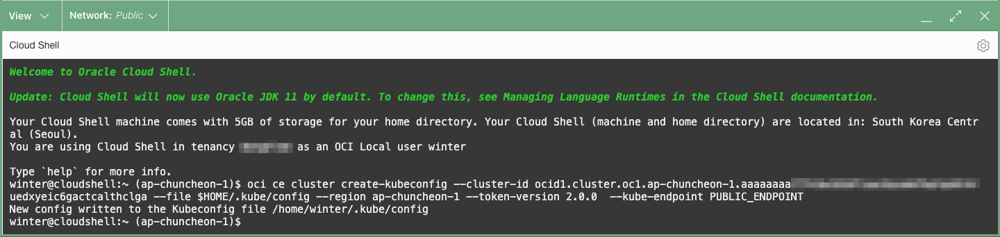

# Setup Cloud Environment

## Introduction

운영 엔지니어의 역할을 맡게 됩니다. 마이크로서비스 애플리케이션을 배포하는 데 사용할 Oracle 클라우드 환경을 만듭니다. 이 환경은 클라우드 구획 내에 포함되며 구획 내 통신은 가상 클라우드 네트워크(VCN)를 통해 이루어집니다. 구획과 VCN은 전체 환경을 격리하고 보호합니다. Oracle Container Engine for Kubernetes(OKE)으로 Kubernetes 클러스터를 만들것입니다.

예상 시간: 20분

### 목표

- OCI 테넌시에 로그인합니다.
- Oracle Cloud Infrastructure(OCI) 구성 요소를 설정합니다.

**필요한 모든 자격 증명을 기록하는 메모 페이지를 만드는 것을 권장합니다.**

### 전제 조건

- Oracle Cloud Trial Account 또는 Paid Account

### 실습 비디오

[](youtube:sF-9e6yHBHI)


## Task 1: OCI 테넌시 로그인

   OCI 대시보드에 로그인하여 리소스 생성에 필요한 정보를 확인합니다.

1. 로그인을 하시면 아래와 같은 페이지를 보실 수 있습니다.

  


## Task 2: 기본 OCI 인프라 설정

1. 왼쪽 상단 의 **Navigation Menu**를 클릭하고 **Identity & Security**으로 이동한 다음 **Compartments** 을 선택합니다.

   

1. 이 화면에서 compartments 목록이 표시되면 **Create Compartment**를 클릭합니다.

   

1. 다음을 입력:
      - Name: **oci-hol***-xx* 입력합니다.
      - Description: 설명을 입력합니다(예: oci-hol for user *xx*)
      - Parent Compartment: 이 Compartment가 속할 상위 Compartment를 선택합니다. 기본값은 루트 Compartment(즉 테넌시).
      - **Create Compartment** 클릭 합니다.

      

1. 콘솔 상단에서 Cloud Shell 아이콘을 클릭합니다. Cloud Shell에서 실행되는 OCI CLI는 Cloud Shell이 ​​시작될 때 콘솔의 Region 선택 메뉴에서 선택한 Region에 대해 명령을 실행합니다.

  

  


## Task 3: OKE Kubernetes 클러스터 생성

1. 왼쪽 상단의 **Navigation Menu**를 클릭하고 **Developer Services**로 이동한 다음 **Kubernetes Clusters (OKE)**를 선택 합니다.

    

1. **oci-hol** Compartment에 있는지 확인 하고 **Create Cluster**을 클릭 합니다.

  

1. Virtual Cloud Network (VCN), Internet Gateway (IG), NAT Gateway (NAT), 워커 노드를 위한 Regional Subnet, 로드 밸런서를 위한 Regional Subnet 같은 새 네트워크 리소스와 함께 새 클러스터를 생성하도록 Quick Create을 선택합니다. 그리고 **Submit** 선택합니다.

   

1. 생성 정보를 아래와 같이 입력합니다.
    - Name: 예, **oke-cluster-1**
    - Kubernetes version: 예, v1.24.1을 선택
        * *뒷부분에 있는 업그레이드 실습을 위해, 여기서는 최신 버전 하나 아래 버전을 선택합니다.*
        * 2023년 1월 기준, v1.25.4, *v1.24.1*, v1.23.4 중 v1.24.1 선택

    - Image: *동일한 버전 선택*, 예, 1.24.1
    - 다른 값들은 기본값으로 유지합니다.
    - Show advanced options: 필요시, Worker Node의 Boot Volume 사이즈, Node 접속용 SSH Key 등록 등을 할 수 있습니다.
    
    


1. 생성될 클러스터 정보를 검토하고 **Create Cluster**를 클릭합니다.

   

1. 일단 시작되면 클러스터가 *완전히 프로비저닝되고 Active 상태로 표시하는 데 일반적으로 3개 노드기준, 약 10-15분이 걸립니다.*

    

## Task 4: OKE Kubernetes 클러스터 접근을 위한 Cloud Shell 설정

1. **Clusters** 목록에서 방금 생성한 클러스터를 선택한 다음 **Access Cluster** 버튼을 클릭합니다.

   

1. Cloud Shell이 ​​아직 열려 있지 않으면 Cloud Shell을 시작하고 복사한 명령을 Cloud Shell 터미널에 붙여 실행하여 kubeconfig을 만듭니다.

   

   

1. 다음 `kubectl` 명령을 사용하여 kubectl 클라이언트 및 kubernetes 서버의 버전을 확인하십시오.

    ````shell
    <copy>
    kubectl version
    </copy>
    ````

1. 다음 `kubectl` 명령을 사용하여 Worker 노드 정보를 조회하고 _Ready_ 상태인지 확인하십시오..

    ````shell
    <copy>
    kubectl get nodes
    </copy>
    ````

    ````shell
    NAME          STATUS   ROLES   AGE     VERSION
    10.0.10.160   Ready    node    3m50s   v1.24.1
    10.0.10.20    Ready    node    3m27s   v1.24.1
    10.0.10.222   Ready    node    3m22s   v1.24.1
    ````

이제 **다음 실습을 진행**하시면 됩니다.

## Acknowledgements

- **Author** - DongHee Lee
- **Last Updated By/Date** - DongHee Lee, January 2023
