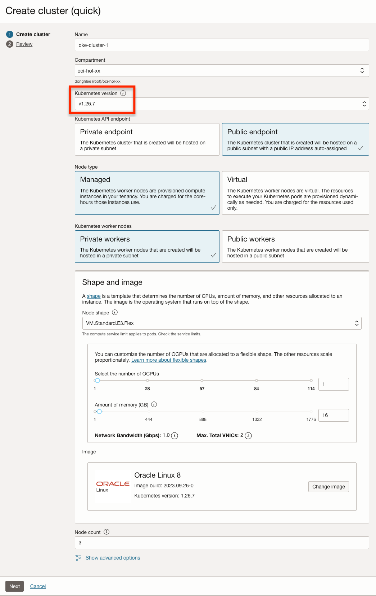

# Setup Cloud Environment

## Introduction

운영 엔지니어의 역할을 맡게 됩니다. 마이크로서비스 애플리케이션을 배포하는 데 사용할 Oracle 클라우드 환경을 만듭니다. 이 환경은 클라우드 구획 내에 포함되며 구획 내 통신은 가상 클라우드 네트워크(VCN)를 통해 이루어집니다. 구획과 VCN은 전체 환경을 격리하고 보호합니다. Oracle Container Engine for Kubernetes(OKE)으로 Kubernetes 클러스터를 만들것입니다.

예상 시간: 15분

### 목표

- OCI 테넌시에 로그인합니다.
- Oracle Cloud Infrastructure(OCI) 구성 요소를 설정합니다.

**필요한 모든 자격 증명을 기록하는 메모 페이지를 만드는 것을 권장합니다.**

### 전제 조건

- Oracle Cloud Trial Account 또는 Paid Account

### 실습 비디오

[](youtube:sF-9e6yHBHI)


## Task 1: OCI 테넌시 로그인

   OCI 대시보드에 로그인하여 리소스 생성에 필요한 정보를 확인합니다.

1. 로그인을 하시면 아래와 같은 페이지를 보실 수 있습니다.

  


## Task 2: 기본 OCI 인프라 설정

1. 왼쪽 상단 의 **Navigation Menu**를 클릭하고 **Identity & Security**으로 이동한 다음 **Compartments** 을 선택합니다.

   

1. 이 화면에서 compartments 목록이 표시되면 **Create Compartment**를 클릭합니다.

   

1. 다음을 입력:
      - Name: **"oci-hol".** 입력합니다.
      - Description: 설명을 입력합니다(예: "oci-hol").
      - Parent Compartment: 이 Compartment가 속할 상위 Compartment를 선택합니다. 기본값은 루트 Compartment(즉 테넌시).
      - **Create Compartment** 클릭 합니다.

      

1. 콘솔 상단에서 Cloud Shell 아이콘을 클릭합니다. Cloud Shell에서 실행되는 OCI CLI는 Cloud Shell이 ​​시작될 때 콘솔의 Region 선택 메뉴에서 선택한 Region에 대해 명령을 실행합니다.

  

  


## Task 3: OKE Kubernetes 클러스터 생성

1. 왼쪽 상단의 **Navigation Menu**를 클릭하고 **Developer Services**로 이동한 다음 **Kubernetes Clusters (OKE)**를 선택 합니다.

    

1. **oci-hol** Compartment에 있는지 확인 하고 **Create Cluster**을 클릭 합니다.

  

1. Virtual Cloud Network (VCN), Internet Gateway (IG), NAT Gateway (NAT), 워커 노드를 위한 Regional Subnet, 로드 밸런서를 위한 Regional Subnet 같은 새 네트워크 리소스와 함께 새 클러스터를 생성하도록 Quick Create을 선택합니다. 그리고 **Launch Workflow** 선택합니다.

   

1. 원하는 이름(예, **oke-cluster-1**)을 입력하고 다른 값들은 기본값으로 유지합니다. *본 워크샵에서는 Kubernetes API 엔드포인트를 Private Endpoint로 선택하지 마십시오.* Private Endpoint를 선택하는 경우 kubectl 명령을 사용하기 위해서 Private IP로 접근이 가능한 bastion 서버가 필요하게 됩니다. 현재 Cloud Shell에서는 접근이 되지 않습니다.. (선택사항으로 Worker Node에 대해 Public IP를 부여하여 외부에서 접근하고자 하는 경우에 **Public Workers**를 선택할 수 있습니다. 필요한 경우 고급옵션에서 Worker Node에 SSH 접근시 필요한 Public Key를 입력합니다.) 필요한 경우 노드 수를 기본 3개에서 늘리거나, 줄입니다.
      > 이후 업그레이드 실습을 위해, 여기서는 최신 버전 하나 아래 버전을 선택합니다. 
      작성일 기준, 여기서는 1.20.8을 설치하고, 이후 업그레이드 실습에서는 새 버전으로 1.20.11, 1.21.5 출시된 상황을 가정하고 있습니다.

   

1. 생성될 클러스터 정보를 검토하고 **Create Cluster**를 클릭합니다.

   

1. 일단 시작되면 클러스터가 완전히 프로비저닝되고 Active 상태로 표시하는 데 일반적으로 약 5-10분이 걸립니다.


## Task 4: OKE Kubernetes 클러스터 접근을 위한 Cloud Shell 설정

1. **Clusters** 목록에서 방금 생성한 클러스터를 선택한 다음 **Access Cluster** 버튼을 클릭합니다.

   

1. **Cloud Shell Access**가 선택된 상태로 둡니다. Cloud Shell이 ​​아직 열려 있지 않으면 Cloud Shell을 시작하고 kubeconfig을 만들기 위한 명령을 복사하여 Cloud Shell 터미널에 붙여 실행합니다.

   

   

1. 다음 `kubectl` 명령을 사용하여 OKE 클러스터에 액세스할 수 있는지 확인하십시오.

    ````shell
    <copy>
    kubectl get cs
    </copy>
    ````

    ````shell
    NAME                 STATUS    MESSAGE             ERROR
    controller-manager   Healthy   ok                  
    scheduler            Healthy   ok                  
    etcd-0               Healthy   {"health":"true"}
    ````

1. 다음 `kubectl` 명령을 사용하여 kubectl 클라이언트 및 kubernetes 서버의 버전을 확인하십시오.

    ````shell
    <copy>
    kubectl version
    </copy>
    ````

1. 다음 `kubectl` 명령을 사용하여 Worker 노드 정보를 조회하고 _Ready_ 상태인지 확인하십시오..

    ````shell
    <copy>
    kubectl get nodes
    </copy>
    ````

    ````shell
    NAME          STATUS   ROLES   AGE   VERSION
    10.0.10.140   Ready    node    40m   v1.20.8
    10.0.10.221   Ready    node    40m   v1.20.8
    10.0.10.59    Ready    node    40m   v1.20.8
    ````

이제 **다음 실습을 진행**하시면 됩니다.

## Acknowledgements

- **Author** - Satyajeet Joshi
- **Contributors** -  Kamryn Vinson, Adao Junior
- **Last Updated By/Date** - Adao Junior, April 2021
- **Korean Translator & Contributors** - DongHee Lee, February 2022
