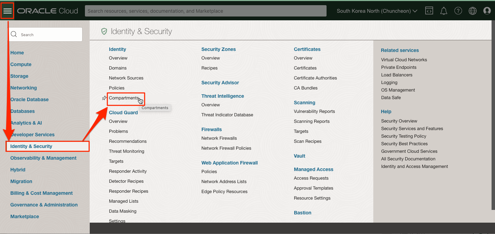
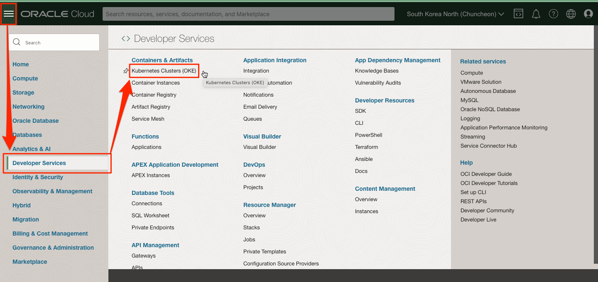
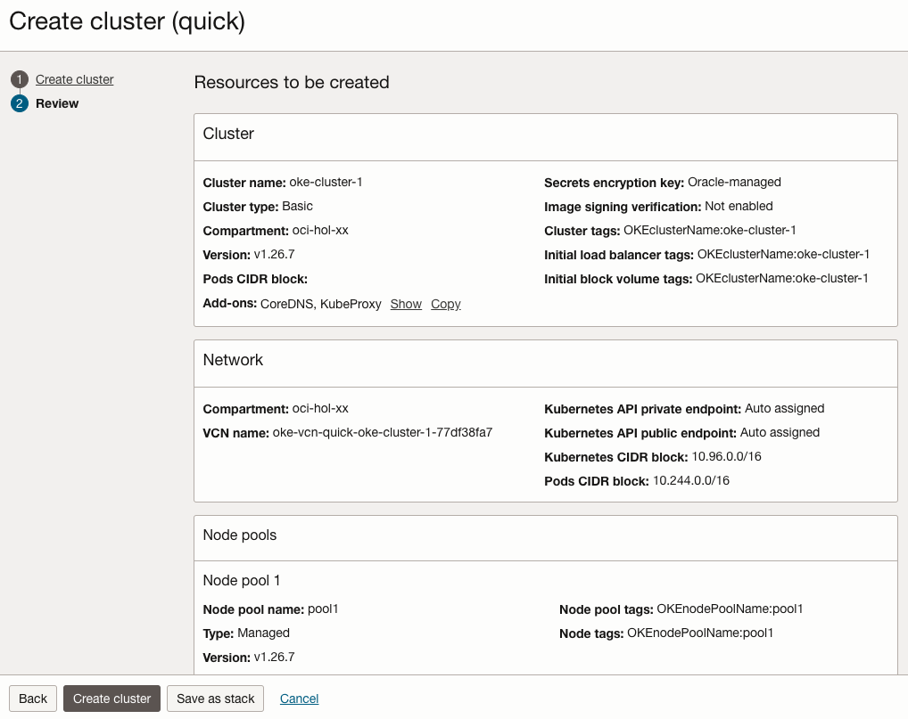
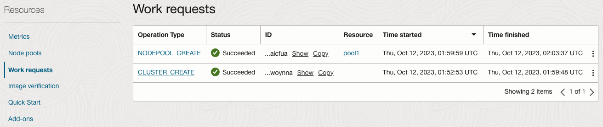
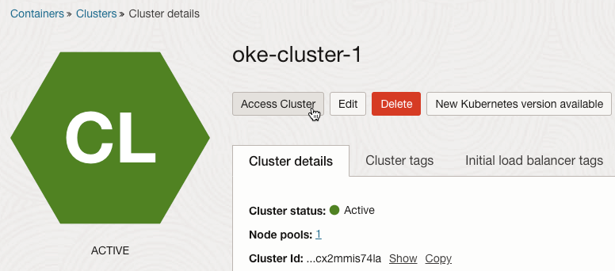

# Setup Cloud Environment

## Introduction

운영 엔지니어의 역할을 맡게 됩니다. 마이크로서비스 애플리케이션을 배포하는 데 사용할 Oracle 클라우드 환경을 만듭니다. 이 환경은 클라우드 구획 내에 포함되며 구획 내 통신은 가상 클라우드 네트워크(VCN)를 통해 이루어집니다. 구획과 VCN은 전체 환경을 격리하고 보호합니다. Oracle Container Engine for Kubernetes(OKE)으로 Kubernetes 클러스터를 만들것입니다.

예상 시간: 20분

### 목표

- OCI 테넌시에 로그인합니다.
- Oracle Cloud Infrastructure(OCI) 구성 요소를 설정합니다.

**필요한 모든 자격 증명을 기록하는 메모 페이지를 만드는 것을 권장합니다.**

### 전제 조건

- Oracle Cloud Trial Account 또는 Paid Account

### 실습 비디오

[](youtube:sF-9e6yHBHI)


## Task 1: OCI 테넌시 로그인

   OCI 대시보드에 로그인하여 리소스 생성에 필요한 정보를 확인합니다.

1. 로그인을 하시면 아래와 같은 페이지를 보실 수 있습니다.

  


## Task 2: 기본 OCI 인프라 설정

1. 왼쪽 상단의 **Navigation Menu**를 클릭하고 **Identity & Security**으로 이동한 다음 **Compartments** 을 선택합니다.

   

1. 이 화면에서 compartments 목록이 표시되면 **Create Compartment**를 클릭합니다.

   

1. 다음을 입력:
      - Name: **oci-hol***-xx* 입력합니다.
      - Description: 설명을 입력합니다(예: oci-hol for user *xx*)
      - Parent Compartment: 이 Compartment가 속할 상위 Compartment를 선택합니다. 기본값은 루트 Compartment(즉 테넌시).
      - **Create Compartment** 클릭 합니다.

      


## Task 3: 실습을 위한 Policy 생성

*서비스를 사용하기 위한 권한을 설정합니다. 테넌시 기준의 Policy를 포함하고 있기 때문에 관리자로 로그인하여 수행하여야 합니다.*

> Policy 구문은 유저가 아닌 그룹에 대해 적용할 수 있습니다. 원하는 사용자가 속한 그룹이 없는 경우 [Create a group](https://docs.cloud.oracle.com/en-us/iaas/Content/Identity/Tasks/managinggroups.htm#To)을 참조하여 먼저 그룹을 만들어 유저를 할당합니다.

1. 왼쪽 상단의 **Navigation Menu**를 클릭하고 **Identity & Security**으로 이동한 다음 **Identity** > **Policies** 을 선택합니다.

     

2. **Create Policy** 클릭

3. 이후 실습을 위해 다음 Policy를 추가합니다.

     - Name: oke-lab-policy*-xx* 입력합니다.
     - Description: Policy for OKE Labs for oci-hol-*xx* compartment
     - Compartment: **root compartment**를 선택
     - Policy:

         * `<group-name>`: Policy를 적용할 사용자 그룹을 선택합니다. 예, 'Default'/'oci-group'
         * `<compartment-name>`: Policy가 적용될 Compartment를 앞서 만든 Compartment로 선택합니다. 예) oci-hol-*xx*

     ```
     # OKE
     Allow group <group-name> to manage instance-family in  compartment <compartment-name>
     Allow group <group-name> to use subnets in  compartment <compartment-name>
     Allow group <group-name> to manage virtual-network-family in  compartment <compartment-name>
     Allow group <group-name> to inspect compartments in  compartment <compartment-name>
     Allow group <group-name> to use vnics in  compartment <compartment-name>
     Allow group <group-name> to use network-security-groups  in  compartment <compartment-name>
     Allow group <group-name> to use private-ips  in  compartment <compartment-name>
     Allow group <group-name> to manage public-ips  in  compartment  <compartment-name>
     Allow group <group-name> to manage cluster-family in compartment <compartment-name>
     
     # OCIR 
     Allow group <group-name> to manage repos in tenancy where ANY {request.permission = 'REPOSITORY_INSPECT', request.permission = 'REPOSITORY_READ', request.permission = 'REPOSITORY_CREATE', request.permission = 'REPOSITORY_UPDATE'}
     
     # Monitoring
     Allow group <group-name> to read metrics in compartment <compartment-name>
     
     # Logging
     Allow group <group-name> to manage log-groups in compartment <compartment-name>
     Allow group <group-name> to use log-content in compartment <compartment-name>
     Allow group <group-name> to read audit-events in compartment <compartment-name>
     Allow group <group-name> to manage unified-configuration in compartment <compartment-name>
     Allow group <group-name> to inspect dynamic-groups in tenancy

     # Resource Manager
     Allow group <group-name> to manage orm-family in compartment <compartment-name>
     Allow group <group-name> to read orm-family in tenancy
     Allow group <group-name> to inspect announcements in tenancy
     Allow group <group-name> to inspect tenancies in tenancy

     # OCI Kubernetes Monitoring Solution
     Allow group <group-name> to manage loganalytics-features-family in compartment <compartment-name>
     Allow group <group-name> to manage loganalytics-resources-family in compartment <compartment-name>
     Allow group <group-name> to manage management-dashboard-family in compartment <compartment-name>
     Allow group <group-name> to manage management-agent-install-keys in compartment <compartment-name>
     Allow group <group-name> to manage dynamic-groups in tenancy
     Allow group <group-name> to manage loganalytics-query in tenancy
     Allow group <group-name> to inspect loganalytics-field in tenancy
     Allow group <group-name> to read management-agents in compartment <compartment-name>
     Allow group <group-name> to read alarms in compartment <compartment-name>
     Allow group <group-name> to manage policy in compartment <compartment-name>
     Allow group <group-name> to inspect compartments in tenancy
     Allow group <group-name> to inspect loganalytics-ondemand-upload in tenancy
     Allow group <group-name> to inspect loganalytics-lookup in tenancy
     Allow group <group-name> to inspect loganalytics-label in tenancy
     Allow group <group-name> to inspect loganalytics-parser in tenancy
     Allow group <group-name> to inspect loganalytics-source in tenancy

     # DevOps
     Allow group <group-name> to manage devops-family in compartment <compartment-name>
     Allow group <group-name> to manage ons-family in compartment <compartment-name>
     ```

4. **Create**를 클릭하여 생성합니다.


## Task 4: OKE Kubernetes 클러스터 생성

1. 왼쪽 상단의 **Navigation Menu**를 클릭하고 **Developer Services**로 이동한 다음 **Kubernetes Clusters (OKE)**를 선택 합니다.

    

1. **oci-hol**-*xx* Compartment에 있는지 확인 하고 **Create Cluster**을 클릭 합니다.

  

1. Virtual Cloud Network (VCN), Internet Gateway (IG), NAT Gateway (NAT), 워커 노드를 위한 Regional Subnet, 로드 밸런서를 위한 Regional Subnet 같은 새 네트워크 리소스와 함께 새 클러스터를 생성하도록 Quick Create을 선택합니다. 그리고 **Submit** 선택합니다.

   

<if type="default">
1. 생성 정보를 아래와 같이 입력합니다.
    - Name: 예, **oke-cluster-1**
    - Kubernetes version:
        * *이후 업그레이드 실습을 위해, 1.26.x을 선택합니다.*
        * 2024년 1월 기준, 1.26, 1.27, 1.28 중 *1.26.x* 선택

    - Image:
        * 클러스터와 동일한 버전 선택, 예, 1.26.x

    - 다른 값들은 기본값으로 유지합니다.
    - Node type: Managed 선택
        * **Managed**: Worker Node가 Compute 인스턴스로 생성되며, SSH로 접근이 가능한 일반적인 쿠버네티스 노드입니다.
        * **Virtual**: Serverless로 가상 Worker Node를 사용하며, OCI가 관리합니다.
    - Show advanced options: 필요시, Worker Node의 Boot Volume 사이즈, Node 접속용 SSH Key 등록 등을 할 수 있습니다.
    
    
</if>
<if type="for-istio">
1. 생성 정보를 아래와 같이 입력합니다.
    - Name: 예, **oke-cluster-1**
    - Kubernetes version:
        * *이후 업그레이드 실습을 위해, 중간 버전인 1.26.x을 선택합니다.*
        * 2024년 1월 기준, 1.26, 1.27, 1.28 중 *1.26.x* 선택

    - Image:
        * 클러스터와 동일한 버전 선택, 예, 1.26.x
        * *Oracle Linux 7* 선택, 이미지 목록을 *제일 아래로 스크롤 후* 처음 만나는 7.x 버전 중에서 선택합니다.

    - 다른 값들은 기본값으로 유지합니다.
    - Node type: Managed 선택
        * **Managed**: Worker Node가 Compute 인스턴스로 생성되며, SSH로 접근이 가능한 일반적인 쿠버네티스 노드입니다.
        * **Virtual**: Serverless로 가상 Worker Node를 사용하며, OCI가 관리합니다.
    - Show advanced options: 필요시, Worker Node의 Boot Volume 사이즈, Node 접속용 SSH Key 등록 등을 할 수 있습니다.
    
    

    - *기본 선택되는 OCI VCN-Native Pod Networking CNI에서 Istio를 사용하기 위해서는 작성일 기준으로 Kubernetes 1.26 이상, Oracle Linux 7 이어야만 합니다. 이후 Service Mesh를 실습하기 위해서 해당 조건으로 클러스터를 생성합니다.*

        * [Installing Istio Service Mesh on OKE](https://docs.oracle.com/en-us/iaas/Content/ContEng/Tasks/contengistio-intro-topic.htm)

</if>

1. 클러스터 생성 정보를 모두 입력하였습니다. 아래 Next를 클릭

1. 기본적으로 Enhanced Cluster 타입이 선택됩니다. 여기서는 Basic Cluster 사용을 위해 화면 아래 Basic Cluster Confirmation에서 *Create a Basic cluster*를 클릭합니다

    

1. 생성될 클러스터 정보를 검토하고 **Create Cluster**를 클릭합니다.

    

1. 일단 시작되면 클러스터가 *완전히 프로비저닝되고 Active 상태로 표시하는 데 일반적으로 3개 노드기준, 약 10-15분이 걸립니다.*

    

### Basic Cluster vs Enhanced Cluster 설명

OKE 클러스터를 만들때 두 가지 클러스터 타입중에서 선택해서 만들 수 있습니다. 이번 워크샵에서는 Basic Cluster으로 기본으로 진행합니다. Enhanced Cluster와의 차이점은 다음과 같습니다.

- Basic Cluster: Enhanced Cluster 출시 이전에 유형 선택 옵션없이 만들어 지던 기본 클러스터 유형으로 Kubernetes, OKE의 코어 기능을 모두 지원합니다.

    * 클러스터 생성이후에 Enhanced Cluster로 업그레이드 할 수 있습니다. 반대로 다운그레이드는 불가합니다.

- Enhanced Cluster: [2023년 3월 14일 - Enhanced clusters now available](https://docs.oracle.com/en-us/iaas/releasenotes/changes/8488d7da-0794-47be-a75c-9a094f4b8d45/)에 따라 출시되었습니다. Basic Cluster에서 제공하지 않는 다음 기능들을 제공합니다.

    * *Virtual Nodes*: Worker Nodes로 Virtual Nodes를 사용할 수 있습니다. Serverless로 Worker Nodes에 대한 스케일, 업그레이드, 트러블슈팅 등 관리에 대한 부담이 감소하게 됩니다.
    * *Cluster Add-On*: Basic Cluster 에도 필수 애드온(예, CoreDNS, cube-proxy, CNI)이 설치됩니다. 여기에 추가하여 Enhanced Cluster에서는 추가 애드온들을 제공하며, 사용자가 선택하여 설치하고, 오라클이 자동 업그레이드 하는 기능을 제공합니다. 추가 애드온들은 점차 확대해 간다고 합니다.
    * *Workload Identity*: 애플리케이션 컨테이너 Pod에서 OCI 자원에 대해 API Call을 하는 경우, OCI Policy로 권한 설정이 필요합니다. 기본적으로는 애플리케이션내에서 User 인증을 사용하는 방법 또는 Worker Nodes 그룹에 대해 권한 설정하는 방법이 있습니다. 여기에서 추가해 Workload Identity는 Pod 단위로 권한 설정을 지원합니다.
    * *More Worker Nodes*: Basic Cluster는 클러스터당 최대 1000개의 Managed Nodes를 지원합니다. Enhance Cluster에서는 클러스터당 최대 2000개까지, 더 많은 노드를 지원합니다.
    * *SLA*: Oracle Cloud Infrastructure Service Level Agreement (SLA)에 따라 Kubernetes API Server의 Availiability가 만족하지 않는 경우 보상합니다.
    * *Node cycling when updating or upgrading node pools*: Worker Node 속성 변경시, 버전 업그레이드시 서비스 무중단을 위해 기존 Worker Nodes를 순차적으로 교체해 주는 작업이 필요합니다. Enhanced Cluster에서는 관리 편의를 위한 자동화된 Node Cycling 기능을 제공합니다.

> Basic Cluster는 Cluster에 대한 비용, Control Plane Nodes에 대한 비용이 발생하지 않습니다. Enhanced Cluster는 Cluster 당 비용이 발생합니다. Enhanced Cluster의 Kubernetes API Server(on Control Plane)에 대한 SLA에 제공과 추가 기능 제공에 대한 비용으로 생각할 수 있습니다.

## Task 5: OKE Kubernetes 클러스터 접근을 위한 Cloud Shell 설정

1. 콘솔 상단에서 Cloud Shell 아이콘을 클릭합니다. Cloud Shell에서 실행되는 OCI CLI는 Cloud Shell이 ​​시작될 때 콘솔의 Region 선택 메뉴에서 선택한 Region에 대해 명령을 실행합니다.

  

  

2. **Clusters** 목록에서 방금 생성한 클러스터를 선택한 다음 **Access Cluster** 버튼을 클릭합니다.

   

3. 복사한 명령을 Cloud Shell 터미널에 붙여 실행하여 kubeconfig을 만듭니다.

   

   

4. 다음 `kubectl` 명령을 사용하여 kubectl 클라이언트 및 kubernetes 서버의 버전을 확인하십시오.

    ````shell
    <copy>
    kubectl version --short
    </copy>
    ````

5. 다음 `kubectl` 명령을 사용하여 Worker 노드 정보를 조회하고 _Ready_ 상태인지 확인하십시오..

    ````shell
    <copy>
    kubectl get nodes
    </copy>
    ````

    ````shell
    NAME          STATUS   ROLES   AGE     VERSION
    10.0.10.121   Ready    node    5m3s    v1.26.7
    10.0.10.229   Ready    node    4m40s   v1.26.7
    10.0.10.23    Ready    node    5m11s   v1.26.7
    ````

이제 **다음 실습을 진행**하시면 됩니다.

## Acknowledgements

- **Author** - DongHee Lee
- **Last Updated By/Date** - DongHee Lee, January 2024
