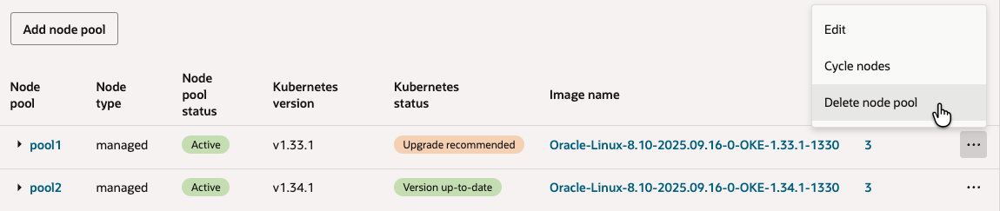

# Upgrade the Cluster

## Introduction

Kubernetes 버전은 x.y.z로 표현되며, 각각 x는 메이저, y는 마이너, z는 패치 버전을 뜻하며, 오픈소스 Kubernetes도 현재 버전과 그 이전 2개 버전까지를 지원하고 있습니다. OKE 또한 OKE가 지원하는 최신버전 기준, 그 이전 2개의 마이너 버전까지 지원하고 있습니다. 새로운 버전이 나오게 되면 OCI Release Note, Oracle Cloud Console 공지, 관리자에 메일이 발송 등을 통해 공지 됩니다.

- 메일공지 예시

    

- 현재 지원 버전은 다음 링크를 참조합니다.

    [Supported Versions of Kubernetes](https://docs.oracle.com/en-us/iaas/Content/ContEng/Concepts/contengaboutk8sversions.htm)

OKE 새 버전이 출시되면 버전 업그레이드는 다음 절차를 따릅니다.

1. Control Plane 업그레이드
    - Oracle Cloud 콘솔에서 OKE 클러스터 단위를 업그레이드하면 Control Plane만 업그레이드됨
    - 오라클이 관리하는 영역으로 다운타임 없이 자동으로 업그레이드 됨
    - OKE 클러스터를 업그레이드 하면, 즉 Control Plane이 업그레이드하면 이전 버전으로 다시 다운그레이드 할 수 없음
2. Worker Node 업그레이드
    - Oracle Cloud 콘솔에서 Node Pool 단위로 업그레이드
    - 업그레이드 방식
        - in-place 업그레이드
            1. 대상이 되는 기존 Node Pool은 OCI 콘솔에서 버전 업그레이드, 실제 Node가 자동으로 업그레이드 되지 않음
            2. kubectl drain 명령으로 특정 노드에 신규 컨테이너가 생기는 것을 방지함
            2. OCI 서비스 콘솔에서 drain한 Node를 종료(Terminate) 시킴
            2. Node 자가치유에 의해 신규 Node가 자동으로 생성되며, 생성된 신규노드는 Node Pool에서 지정한 업그레이드 된 버전
            2. 기존 노드에 대해서 순서대로 모두 진행
        - out-of-place 업그레이드
            1. 신규 버전의 Node Pool 추가 생성
            2. kubectl 명령으로 기존 Node Pool에 있는 Node 제거, Kubernetes에 의해 컨테이너가 모두 이동하면, Node 삭제하는 방식으로 하나씩 진행
            3. 기존 Node가 모두 제거되면, 기존 Node Pool 삭제
  
예상 시간: 20 분

### 목표

* 클러스터 업그레이드 절차 이해

### 전제 조건

* **Lab 4: Deploy the MuShop Application** 완료하고 현재 앱이 실행 중일 것
* 배포된 앱들이 구동중인 상황에서 업그레이드 과정 확인을 위해 이전 앱들이 실행 중일 것

### 실습 비디오

[](youtube:fC2d7IfRn2s)


## Task 1: OKE 클러스터 버전 업그레이드(Control Plane 업그레이드)

> 위와 같이 1.20.8 버전을 사용 중에 새로운 버전이 출시되었다고 가정합니다. 그러면 앞서 설명한 것과 같이 기술지원 정책에 따라 기존 버전은 30일간 지원하기 때문에, 그동안 버전 검증후 업그레이드가 필요합니다. OCI가 강제적으로 업그레이드를 하지는 않습니다.
- [Supported Versions of Kubernetes](https://docs.oracle.com/en-us/iaas/Content/ContEng/Concepts/contengaboutk8sversions.htm)

1. 업그레이드가 가능하면, OKE 클러스터 상세 화면에서 **Upgrade Available** 버튼이 활성화 됩니다.

    

2. Upgrade Available 버튼을 클릭하면 다음과 같이 안내 문구와 함께 업그레이드를 시작할 수 있습니다.
   최신 버전인 v1.21.5을 선택하도록 하겠습니다.

    

3. 버전을 선택하고 아래 **Upgrade** 버튼을 클릭하여 업그레이드를 시작합니다.

4. 클러스터 상태가 UPDATING으로 표시되고 업그레이드가 진행됩니다. 오라클이 관리하는 Control Plane이 내부적으로 순차적으로 업그레이드가 발생합니다. 실제 애플리케이션이 동작하는 Worker Node는 아직 어떤 작업도 수행되지 않습니다.

5. 테스트 시점에는 10~15분 후에 업그레이드 완료되었습니다.

    


## Task 2: Worker Node 업그레이드 (out-of-place 업그레이드)

OKE 클러스터가 업그레이드로 인해 Control Plane 만 업그레이드 된 상태이며, 이제 Node Pool 단위로 업그레이드 가능한 상태입니다. out-of-place 업그레이드 방식은 업그레이드 버전의 Node Pool 신규 생성, 기존 Node Pool의 모든 노드 Drain, 기존 Node Pool 삭제 순으로 업그레이드 합니다.

### 새 버전의 Node Pool 만들기

1. OKE 클러스터 상세 페이지로 이동합니다.

2. **Resources** &gt; **Node Pools** 로 이동합니다.

3. 그림과 같이 기존 버전의 Node Pool이 있는 상태에서 신규 Node Pool 추가를 위해 **Add Node Pool**을 클릭합니다.

    

4. 신규 Node Pool 정보를 입력하여 생성합니다. 여기서는 예시로 같은 1.20.x 대의 최신 버전으로 업그레이드 합니다.

    - Name: 예, pool2
    - Version: 새 버전 선택
    - Kubernetes Labels: 기본적으로 name으로 라벨이 추가됩니다. 예, name=pool2
    - 나머지 항목: 새롭게 생성할 Worker Node 정보를 입력합니다.
        - Shape: Node VM 유형
        - Number of nodes: 노드 수
        - Placement Configuration: Node가 위치할 AD, Subnet 선택(예, **oke-nodesubnet-~~**)
        - Add an SSH key: Node VM에 SSH 접속시 사용할 키의 Private Key    

        

5. 추가 된 Node Pool을 OCI 서비스 콘솔 확인할 수 있습니다. Node Pool이 추가되고 Worker Node가 Ready 될때까지 완료되어야 합니다. 테스트 환경에서 3대 기준 6분 정도 소요되었습니다.

### 기존 Node Pool의 모든 노드 Drain

요구사항에 따라 기존 앱을 Node Selector를 사용하여, 일부 앱만 신규 노드로 이관할 수도 있습니다. 여기서는 노드 별로 순차적으로 이동하는 경우에 해당됩니다.

1. 구동 중인 앱들이 기존 Node Pool에서 동작하고 있습니다. 아래는 mushop 네임스페이스 기준이며, 전체를 보면 기존 노드인 유저가 배포한 앱은 기존 노드들에 분산되어 있는 걸 볼 수 있습니다.

     ````
     <copy>
     # Worker Node 조회
     kubectl get nodes -L name --sort-by=.metadata.labels.name
     
     # Pod가 배포된 Worker Node 함께 확인하기
     kubectl get pod -o wide
     </copy>
     ````
     ````
     winter@cloudshell:~ (ap-chuncheon-1)$ kubectl get nodes -L name --sort-by=.metadata.labels.name
     NAME          STATUS   ROLES   AGE     VERSION    NAME
     10.0.10.43    Ready    node    4d      v1.20.8    oke-cluster-1
     10.0.10.68    Ready    node    4d      v1.20.8    oke-cluster-1
     10.0.10.84    Ready    node    4d      v1.20.8    oke-cluster-1
     10.0.10.166   Ready    node    5m50s   v1.20.11   pool2
     10.0.10.24    Ready    node    6m13s   v1.20.11   pool2
     10.0.10.252   Ready    node    5m55s   v1.20.11   pool2
     winter@cloudshell:~ (ap-chuncheon-1)$ kubectl get pod -o wide
     NAME                                   READY   STATUS    RESTARTS   AGE   IP             NODE         NOMINATED NODE   READINESS GATES
     mushop-api-67df55b466-n7cng            2/2     Running   0          24h   10.244.0.160   10.0.10.68   <none>           <none>
     mushop-assets-5d6f44b88f-956fs         2/2     Running   0          24h   10.244.0.159   10.0.10.68   <none>           <none>
     mushop-carts-5c97d8bf9c-lwqv4          2/2     Running   0          24h   10.244.0.161   10.0.10.68   <none>           <none>
     mushop-catalogue-c79d9464c-pfqnr       2/2     Running   1          24h   10.244.1.26    10.0.10.43   <none>           <none>
     mushop-edge-8649c9b5dd-llgv7           2/2     Running   0          24h   10.244.1.27    10.0.10.43   <none>           <none>
     mushop-events-6f69d5cc79-vj8fc         2/2     Running   0          24h   10.244.1.28    10.0.10.43   <none>           <none>
     mushop-fulfillment-b59cc849-mnmcs      2/2     Running   0          24h   10.244.0.162   10.0.10.68   <none>           <none>
     mushop-nats-977d9d7df-qcg8r            3/3     Running   0          24h   10.244.1.29    10.0.10.43   <none>           <none>
     mushop-orders-5f65f59497-nvkgw         2/2     Running   0          24h   10.244.0.163   10.0.10.68   <none>           <none>
     mushop-payment-6456f6df7-xn85n         2/2     Running   0          24h   10.244.0.164   10.0.10.68   <none>           <none>
     mushop-session-678f95f767-fhv2k        2/2     Running   0          24h   10.244.1.30    10.0.10.43   <none>           <none>
     mushop-storefront-5bb5cb4bc8-22h7l     2/2     Running   0          23h   10.244.1.32    10.0.10.43   <none>           <none>
     mushop-storefrontv2-689f9ffbff-g8z76   2/2     Running   0          22h   10.244.1.33    10.0.10.43   <none>           <none>
     mushop-user-6b8b559cc6-4rwx5           2/2     Running   0          24h   10.244.1.31    10.0.10.43   <none>           <none>
     ````

2. 아래와 같이 하나의 노드를 스케줄에서 제외시킵니다.

    ````
    <copy>
    kubectl drain <node_name> --ignore-daemonsets --delete-emptydir-data
    </copy>
    ````
    > drain은 대상 노드에 배포되어 있는 모든 Pod들을 (시스템상 삭제할 수 없는 것 제외) 삭제합니다. 삭제된 Pod 들은 다른 노드 다시 스케줄링 됩니다.

    실행결과
    ````
    winter@cloudshell:~ (ap-chuncheon-1)$ kubectl drain 10.0.10.43 --ignore-daemonsets --delete-emptydir-data
    node/10.0.10.43 already cordoned
    WARNING: ignoring DaemonSet-managed Pods: kube-system/csi-oci-node-9p7jk, kube-system/fluentd-nvd6q, kube-system/kube-flannel-ds-s8cww, kube-system/kube-proxy-2r4m2, kube-system/proxymux-client-gxgbz, mushop-utilities/mushop-utils-prometheus-node-exporter-rj447
    evicting pod mushop/mushop-user-6b8b559cc6-4rwx5
    evicting pod mushop/mushop-catalogue-c79d9464c-pfqnr
    ...
    evicting pod logging/elasticsearch-master-2
    I0311 08:23:18.234938    1758 request.go:655] Throttling request took 1.13616577s, request: GET:https://138.xxx.xxx.xxx:6443/api/v1/namespaces/mushop/pods/mushop-storefront-5bb5cb4bc8-22h7l
    pod/elasticsearch-coordinating-only-1 evicted
    ...
    I0311 08:23:28.434935    1758 request.go:655] Throttling request took 1.992929428s, request: GET:https://138.xxx.xxx.xxx:6443/api/v1/namespaces/mushop/pods/mushop-nats-977d9d7df-qcg8r
    pod/mushop-nats-977d9d7df-qcg8r evicted
    ...
    node/10.0.10.43 evicted
    ````

    > Pod가 emptyDir을 사용하는 경우 OKE 문서 가이드에 따라 --ignore-daemonsets 옵션만 사용하는 경우 삭제시 다음과 같은 오류가 발생합니다. 여기서는 elasticsearch가 사용하여 에러가 발생하였습니다. emptyDir은 임시데이터를 저장하기 위해 사용해야 하며 저장이 필요한 공간은 Persistent Volume을 사용해야 합니다.
        ````
        $ kubectl drain 10.0.10.43 --ignore-daemonsets
        node/10.0.10.43 cordoned
        error: unable to drain node "10.0.10.43", aborting command...
        
        There are pending nodes to be drained:
         10.0.10.43
        error: cannot delete Pods with local storage (use --delete-emptydir-data to override): logging/elasticsearch-coordinating-only-1, mushop/mushop-catalogue-c79d9464c-pfqnr, mushop/mushop-edge-8649c9b5dd-llgv7, mushop/mushop-events-6f69d5cc79-vj8fc, mushop/mushop-nats-977d9d7df-qcg8r, mushop/mushop-session-678f95f767-fhv2k, mushop/mushop-storefront-5bb5cb4bc8-22h7l, mushop/mushop-storefrontv2-689f9ffbff-g8z76, mushop/mushop-user-6b8b559cc6-4rwx5
        ````

3. 아래와 같이 43번 노드가 컨테이너 스케줄링에서 제외된 것을 볼 수 있습니다. POD가 다른 Node로 다 이동한 걸 확인후 다음 작업으로 진행합니다. 여기서는 catalogue, edge 등등의 Pod가 43에서 각각 166, 252 노드로 이동했습니다.

    ````
    winter@cloudshell:~ (ap-chuncheon-1)$ kubectl get nodes -L name --sort-by=.metadata.labels.name
    NAME          STATUS                     ROLES   AGE    VERSION    NAME
    10.0.10.43    Ready,SchedulingDisabled   node    4d1h   v1.20.8    oke-cluster-1
    10.0.10.68    Ready                      node    4d1h   v1.20.8    oke-cluster-1
    10.0.10.84    Ready                      node    4d1h   v1.20.8    oke-cluster-1
    10.0.10.166   Ready                      node    48m    v1.20.11   pool2
    10.0.10.24    Ready                      node    48m    v1.20.11   pool2
    10.0.10.252   Ready                      node    48m    v1.20.11   pool2
    winter@cloudshell:~ (ap-chuncheon-1)$ kubectl get pod -o wide
    NAME                                   READY   STATUS    RESTARTS   AGE     IP             NODE          NOMINATED NODE   READINESS GATES
    mushop-api-67df55b466-n7cng            2/2     Running   0          24h     10.244.0.160   10.0.10.68    <none>           <none>
    mushop-assets-5d6f44b88f-956fs         2/2     Running   0          24h     10.244.0.159   10.0.10.68    <none>           <none>
    mushop-carts-5c97d8bf9c-lwqv4          2/2     Running   0          24h     10.244.0.161   10.0.10.68    <none>           <none>
    mushop-catalogue-c79d9464c-vz56f       2/2     Running   0          3m52s   10.244.2.131   10.0.10.166   <none>           <none>
    mushop-edge-8649c9b5dd-xnb5k           2/2     Running   0          3m52s   10.244.2.5     10.0.10.252   <none>           <none>
    mushop-events-6f69d5cc79-c5lxj         2/2     Running   0          3m52s   10.244.2.132   10.0.10.166   <none>           <none>
    ...
    ````

4. 이동한 Pod 들이 모두 Running 상태임을 확인하고 나머지 기존 Node Pool에 있는 Node들도 drain합니다.

    ````
    winter@cloudshell:~ (ap-chuncheon-1)$ kubectl get nodes -L name --sort-by=.metadata.labels.name
    NAME          STATUS                     ROLES   AGE    VERSION    NAME
    10.0.10.43    Ready,SchedulingDisabled   node    4d1h   v1.20.8    oke-cluster-1
    10.0.10.68    Ready,SchedulingDisabled   node    4d1h   v1.20.8    oke-cluster-1
    10.0.10.84    Ready,SchedulingDisabled   node    4d1h   v1.20.8    oke-cluster-1
    10.0.10.166   Ready                      node    77m    v1.20.11   pool2
    10.0.10.24    Ready                      node    78m    v1.20.11   pool2
    10.0.10.252   Ready                      node    77m    v1.20.11   pool2
    ````


### 기존 Node Pool 삭제

1. 기존 Node Pool에 있는 모든 Node들이 스케줄에서 제외되어 더이상 사용되지 않습니다. OCI 서비스 콘솔에서  Node Pools로 이동하여 기존 Node Pool을 삭제합니다.

    

2. 업그레이드가 완료되었습니다.

    ````
    winter@cloudshell:~ (ap-chuncheon-1)$ kubectl get nodes -L name --sort-by=.metadata.labels.name
    NAME          STATUS                     ROLES   AGE    VERSION    NAME
    10.0.10.166   Ready                      node    77m    v1.20.11   pool2
    10.0.10.24    Ready                      node    78m    v1.20.11   pool2
    10.0.10.252   Ready                      node    77m    v1.20.11   pool2
    ````

이제 **다음 실습을 진행**하시면 됩니다.

## Learn More

## Acknowledgements

* **Author** - DongHee Lee, February 2022