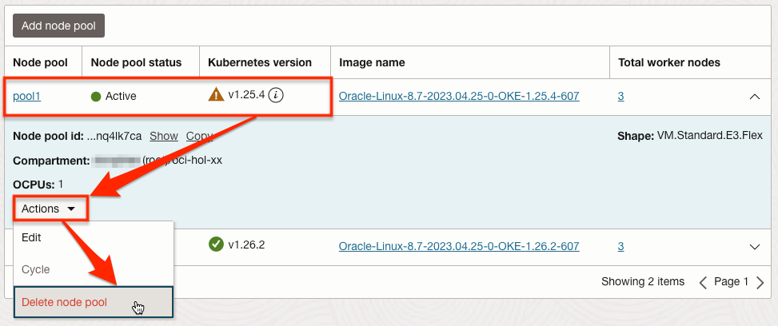
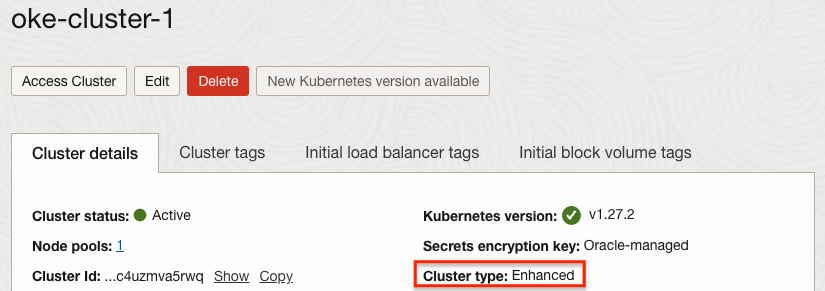
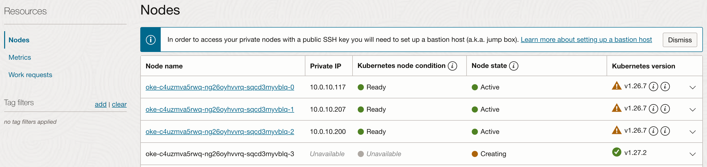
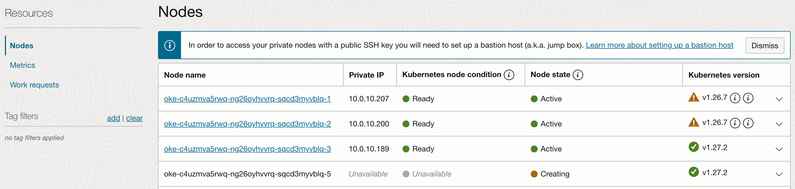
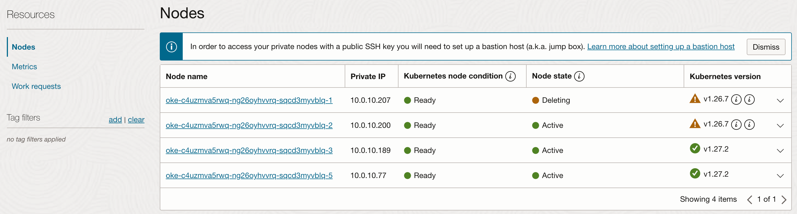
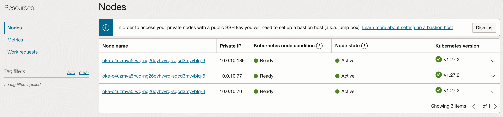

# Upgrade the Cluster

## Introduction

Kubernetes 버전은 x.y.z로 표현되며, 각각 x는 메이저, y는 마이너, z는 패치 버전을 뜻하며, 오픈소스 Kubernetes도 현재 버전과 그 이전 2개 버전까지를 지원하고 있습니다. OKE 또한 OKE가 지원하는 최신버전 기준, 그 이전 2개의 마이너 버전까지 지원하고 있습니다. 새로운 버전이 나오게 되면 OCI Release Note, Oracle Cloud Console 공지, 관리자에 메일이 발송 등을 통해 공지 됩니다.

- 메일공지 예시

    

- 현재 지원 버전은 다음 링크를 참조합니다.

    [Supported Versions of Kubernetes](https://docs.oracle.com/en-us/iaas/Content/ContEng/Concepts/contengaboutk8sversions.htm)

OKE 새 버전이 출시되면 버전 업그레이드는 다음 절차를 따릅니다.

1. Control Plane 업그레이드
    - Oracle Cloud 콘솔에서 OKE 클러스터 단위를 업그레이드하면 Control Plane만 업그레이드됨
    - Control Plane은 오라클이 관리하는 영역으로 업그레이드는 다운타임 없이 진행됨
    - OKE 클러스터를 업그레이드 하면, 즉 Control Plane이 업그레이드하면 이전 버전으로 다시 다운그레이드 할 수 없음

2. Worker Node 업그레이드
    - Oracle Cloud 콘솔에서 Node Pool 단위로 업그레이드
    - 업그레이드 방식

        - out-of-place 업그레이드
            1. 신규 버전의 Node Pool 추가 생성
            2. kubectl drain 명령으로 기존 노드에 신규 컨테이너가 생기는 것을 방지하고, 다른 노드로 이동 시킴
            3. drain된 노드상의 기존 컨테이너들이 모두 이동하면, 해당 Node 삭제
            4. 기존 Node가 모두 제거되면, 기존 Node Pool 삭제

        - in-place 업그레이드
            1. 기존 Node Pool을 콘솔에서 버전 업그레이드, Node Pool에 속한 기존 Node에는 변경이 없으며, 신규 생성되는 Node는 새 버전으로 구성됨
            2. kubectl drain 명령으로 특정 노드에 신규 컨테이너가 생기는 것을 방지함
            3. OCI 서비스 콘솔에서 drain한 Node를 종료(Terminate) 시킴
            4. Node 자가치유에 의해 신규 Node가 자동으로 생성되며, 생성된 신규노드는 Node Pool에서 지정한 업그레이드 된 버전
            5. 기존 노드에 대해서 순서대로 모두 진행

        - Node Cycling
            Node Cycling를 실행하면 in-place 업그레이드를 자동화하여 실행됩니다. 노드 하나씩 순차적으로 업그레이드 합니다.

        Task 2, Task 3 중에 원하는 방식으로 업그레이드 하시면 됩니다. 


예상 시간: 40 분

### 목표

* 클러스터 업그레이드 절차 이해

### 전제 조건

* **Lab 4: Deploy the MuShop Application** 완료하고 현재 앱이 실행 중일 것
* 배포된 앱들이 구동중인 상황에서 업그레이드 과정 확인을 위해 이전 앱들이 실행 중일 것

### 실습 비디오

[](youtube:fC2d7IfRn2s)


## Task 1: OKE 클러스터 버전 업그레이드(Control Plane 업그레이드)

> 새로운 버전이 출시되면, 기술지원 정책에 따라, 지원이 만료되는 버전은 30일내에 업그레이드가 필요합니다. 그동안 버전 검증후 업그레이드하면 됩니다. 그렇다고 OCI가 강제적으로 업그레이드를 하지는 않습니다. 예를 들어 2023년 4월 기준, 1.23.4 사용 중에, 1.26.2 버전이 출시되는 경우, 지원 버전은 이제 1.26, 1.25, 1.24의 세 버전으로 변경되기 때문에, 1.23 버전은 지원이 종료되며, 일반적으로 30일간의 유예기간을 둡니다. 자세한 사항은 아래 링크를 참조하세요. 
- [Supported Versions of Kubernetes](https://docs.oracle.com/en-us/iaas/Content/ContEng/Concepts/contengaboutk8sversions.htm)

1. 업그레이드가 가능하면, OKE 클러스터 상세 화면에서 **New Kubernetes version available** 버튼이 활성화 됩니다.

    

2. New Kubernetes version available 버튼을 클릭하면 다음과 같이 안내 문구와 함께 업그레이드를 시작할 수 있습니다.
   최신 버전인 v1.26.2을 선택하도록 하겠습니다.

    

3. 버전을 선택하고 아래 **Upgrade** 버튼을 클릭하여 업그레이드를 시작합니다.

4. 클러스터 상태가 UPDATING으로 표시되고 업그레이드가 진행됩니다. 오라클이 관리하는 Control Plane이 내부적으로 순차적으로 업그레이드 됩니다.

5. 테스트 시점에는 10~15분 후에 업그레이드 완료되었습니다.

    


## Task 2: Worker Node 업그레이드 방법 #1 (out-of-place 업그레이드)

OKE 클러스터가 업그레이드로 인해 Control Plane 만 업그레이드 된 상태이며, 이제 Node Pool 단위로 업그레이드 가능한 상태입니다. out-of-place 업그레이드 방식은 업그레이드 버전의 Node Pool 신규 생성, 기존 Node Pool의 모든 노드 Drain, 기존 Node Pool 삭제 순으로 업그레이드 합니다.

### 새 버전의 Node Pool 만들기

1. OKE 클러스터 상세 페이지로 이동합니다.

2. **Resources** &gt; **Node Pools** 로 이동합니다.

3. 그림과 같이 기존 버전의 Node Pool이 있는 상태에서 신규 Node Pool 추가를 위해 **Add Node Pool**을 클릭합니다.

    

4. 신규 Node Pool 정보를 입력하여 생성합니다. 여기서는 예시로 최신 버전으로 업그레이드 합니다.

    - Name: 예, *pool2*
    - Version: *새 버전 선택*, 예, v1.26.2

        

    - Placement configuration
        - 기존 Node Pool과 동일하게 Node가 위치한 AD, Subnet 선택
        - Worker node subnet: Worker Node가 속할 Subnet, Quick Start로 생성된 클러스터일 경우, **oke-nodesubnet-~~** 선택

        

    - Shape & Image
        - Shape: 새롭게 생성할 Worker Node VM 유형
        - Image: OKE Worker Node 중에서 선택한 버전과 동일한 Kubernetes version 선택

        

    - Node pool options
        - Node counts: 노드 수

    - 나머지 항목: 새롭게 생성할 Worker Node 정보를 입력합니다.
        - Add an SSH key: Node VM에 SSH 접속시 사용할 키의 Private Key
        - 노드 Boot Volume 사이즈 등등 필요시 추가 변경할 수 있습니다.


5. 추가 된 Node Pool을 OCI 서비스 콘솔 확인할 수 있습니다. Node Pool이 추가되고 Worker Node가 Ready 될때까지 완료되어야 합니다. 테스트 환경에서 3대 기준 8분 정도 소요되었습니다.

    ````
    # Worker Node 조회
    <copy>
    kubectl get nodes -L name --sort-by=.metadata.labels.name
    </copy>
    ````
    ````
    $ kubectl get nodes -L name --sort-by=.metadata.labels.name
    NAME          STATUS   ROLES   AGE     VERSION   NAME
    10.0.10.149   Ready    node    22h     v1.25.4   oke-cluster-1
    10.0.10.184   Ready    node    22h     v1.25.4   oke-cluster-1
    10.0.10.81    Ready    node    22h     v1.25.4   oke-cluster-1
    10.0.10.143   Ready    node    112s    v1.26.2   pool2
    10.0.10.194   Ready    node    2m20s   v1.26.2   pool2
    10.0.10.232   Ready    node    2m20s   v1.26.2   pool2
     ````

### 기존 Node Pool의 모든 노드 Drain

요구사항에 따라 기존 앱을 Node Selector를 사용하여, 일부 앱만 신규 노드로 이관할 수도 있습니다. 여기서는 노드 별로 순차적으로 이동하는 경우에 해당됩니다.

1. 구동 중인 앱들이 기존 Node Pool에서 동작하고 있습니다. 아래는 mushop 네임스페이스 기준이며, 전체를 보면 기존 노드인 유저가 배포한 앱은 기존 노드들에 분산되어 있는 걸 볼 수 있습니다.

    ````
    # Pod가 배포된 Worker Node 함께 확인하기
    <copy> 
    kubectl get pod -o wide
    </copy>
    ````
    ````
    $ kubectl get pod -o wide
    NAME                                   READY   STATUS    RESTARTS   AGE   IP             NODE          NOMINATED NODE   READINESS GATES
    mushop-api-76987596f9-d7g5m            2/2     Running   0          60m   10.244.1.73    10.0.10.184   <none>           <none>
    mushop-assets-69f64f855d-fv652         2/2     Running   0          60m   10.244.0.199   10.0.10.149   <none>           <none>
    mushop-carts-76b7749849-cg6rk          2/2     Running   0          60m   10.244.0.200   10.0.10.149   <none>           <none>
    mushop-catalogue-d558b5bdf-dz9nm       2/2     Running   0          60m   10.244.0.201   10.0.10.149   <none>           <none>
    mushop-edge-7956f7c59-sml75            2/2     Running   0          60m   10.244.0.67    10.0.10.81    <none>           <none>
    mushop-events-79c547c7f6-cq8p2         2/2     Running   0          60m   10.244.1.72    10.0.10.184   <none>           <none>
    mushop-fulfillment-6db464bbf6-l4v5l    2/2     Running   0          60m   10.244.0.203   10.0.10.149   <none>           <none>
    mushop-nats-c4846c7b8-tqxds            3/3     Running   0          60m   10.244.0.204   10.0.10.149   <none>           <none>
    mushop-orders-68647fb849-rljpg         2/2     Running   0          60m   10.244.0.202   10.0.10.149   <none>           <none>
    mushop-payment-7bc5b8f776-bkxg8        2/2     Running   0          60m   10.244.1.75    10.0.10.184   <none>           <none>
    mushop-session-66bc9df4b8-hd6jg        2/2     Running   0          60m   10.244.1.74    10.0.10.184   <none>           <none>
    mushop-storefront-5688d8784f-zz6xr     2/2     Running   0          55m   10.244.1.76    10.0.10.184   <none>           <none>
    mushop-storefrontv2-7d9b59ccf6-dqxpd   2/2     Running   0          49m   10.244.0.72    10.0.10.81    <none>           <none>
    mushop-user-d65d84fcb-dg6cc            2/2     Running   0          60m   10.244.0.69    10.0.10.81    <none>           <none>
    ````

2. 아래와 같이 기존 버전의 Node Pool에 있는 노드 하나를 스케줄에서 제외시킵니다.

    ````
    <copy>
    kubectl drain --ignore-daemonsets --delete-emptydir-data <node_name> 
    </copy>
    ````
    > drain은 대상 노드에 배포되어 있는 모든 Pod들을 (시스템상 삭제할 수 없는 것 제외) 삭제합니다. 삭제된 Pod 들은 다른 노드 다시 스케줄링 됩니다.

    실행결과
    ````
    $ kubectl drain --ignore-daemonsets --delete-emptydir-data 10.0.10.149
    node/10.0.10.149 cordoned
    Warning: ignoring DaemonSet-managed Pods: istio-system/istio-cni-node-8mhsv, kube-system/csi-oci-node-zgcqn, kube-system/kube-flannel-ds-rdztj, kube-system/kube-proxy-pj59l, kube-system/proxymux-client-4ftvc, logging/fluent-bit-btshh, mushop-utilities/mushop-utils-prometheus-node-exporter-fwhxs
    ...
    evicting pod mushop/mushop-assets-69f64f855d-fv652
    evicting pod mushop/mushop-carts-76b7749849-cg6rk
    ...
    pod/mushop-assets-69f64f855d-fv652 evicted
    pod/mushop-carts-76b7749849-cg6rk evicted
    node/10.0.10.149 drained
    ````

    > Pod가 emptyDir을 사용하는 경우 OKE 문서 가이드에 따라 --ignore-daemonsets 옵션만 사용하는 경우 삭제시 다음과 같은 오류가 발생합니다. 여기서는 elasticsearch가 사용하여 에러가 발생하였습니다. emptyDir은 임시데이터를 저장하기 위해 사용해야 하며 저장이 필요한 공간은 Persistent Volume을 사용해야 합니다.
        ````
        $ kubectl drain --ignore-daemonsets 10.0.10.184
        node/10.0.10.184 cordoned
        error: unable to drain node "10.0.10.184", aborting command...
        
        There are pending nodes to be drained:
         10.0.10.184
        error: cannot delete Pods with local storage (use --delete-emptydir-data to override): logging/elasticsearch-coordinating-only-1, mushop/mushop-catalogue-c79d9464c-pfqnr, mushop/mushop-edge-8649c9b5dd-llgv7, mushop/mushop-events-6f69d5cc79-vj8fc, mushop/mushop-nats-977d9d7df-qcg8r, mushop/mushop-session-678f95f767-fhv2k, mushop/mushop-storefront-5bb5cb4bc8-22h7l, mushop/mushop-storefrontv2-689f9ffbff-g8z76, mushop/mushop-user-6b8b559cc6-4rwx5
        ````

3. 아래와 같이 184번 노드가 컨테이너 스케줄링에서 제외(SchedulingDisabled)된 것을 볼 수 있습니다.

    ```
    $ <copy>kubectl get nodes -L name --sort-by=.metadata.labels.name</copy>
    NAME          STATUS                     ROLES   AGE     VERSION   NAME
    10.0.10.149   Ready,SchedulingDisabled   node    22h     v1.25.4   oke-cluster-1
    10.0.10.184   Ready                      node    22h     v1.25.4   oke-cluster-1
    10.0.10.81    Ready                      node    22h     v1.25.4   oke-cluster-1
    10.0.10.143   Ready                      node    8m48s   v1.26.2   pool2
    10.0.10.194   Ready                      node    9m16s   v1.26.2   pool2
    10.0.10.232   Ready                      node    9m16s   v1.26.2   pool2
    ```

4. 이동한 Pod 들이 모두 Running 상태임을 확인합니다. 확인후 다음 작업으로 진행합니다. 

    ```
    # Running 상태가 아닌 Pod 찾기
    <copy>
    kubectl get pods --field-selector status.phase!=Running --all-namespaces
    </copy>
    ```

5. 나머지 기존 Node Pool에 있는 Node(예, 184, 81)들도 같은 방식으로 drain합니다.

    ````
    <copy>
    kubectl drain --ignore-daemonsets --delete-emptydir-data <node_name> 
    </copy>
    ````

    ````
    $ <copy>kubectl get nodes -L name --sort-by=.metadata.labels.name</copy>
    NAME          STATUS                     ROLES   AGE   VERSION   NAME
    10.0.10.149   Ready,SchedulingDisabled   node    22h   v1.25.4   oke-cluster-1
    10.0.10.184   Ready,SchedulingDisabled   node    22h   v1.25.4   oke-cluster-1
    10.0.10.81    Ready,SchedulingDisabled   node    22h   v1.25.4   oke-cluster-1
    10.0.10.143   Ready                      node    13m   v1.26.2   pool2
    10.0.10.194   Ready                      node    14m   v1.26.2   pool2
    10.0.10.232   Ready                      node    14m   v1.26.2   pool2
    ````

6. 이동한 Pod 들이 모두 Running 상태가 되고, 버전 업그레이드가 완료되었습니다.

    ```
    $ <copy>kubectl get pods --field-selector status.phase!=Running --all-namespaces</copy>
    No resources found
    ```

### 기존 Node Pool 삭제

1. 기존 Node Pool에 있는 모든 Node들이 스케줄에서 제외되어 더이상 사용되지 않습니다. OCI 서비스 콘솔에서  Node Pools로 이동하여 기존 Node Pool을 삭제합니다.

    

2. 확인창이 뜨면 확인후 Delete를 클릭합니다.

3. 업그레이드가 완료되었습니다.

    ````
    $ <copy>kubectl get nodes -L name --sort-by=.metadata.labels.name</copy>
    NAME          STATUS                     ROLES   AGE   VERSION   NAME
    10.0.10.143   Ready                      node    13m   v1.26.2   pool2
    10.0.10.194   Ready                      node    14m   v1.26.2   pool2
    10.0.10.232   Ready                      node    14m   v1.26.2   pool2    
    ````

## Task 3: Worker Node 업그레이드 방법 #2 (in-place 업그레이드)

아래 순서로 진행됩니다. 여기는 직접 실습하지는 않습니다. 기존 Node Pool에서 기존 Node 삭제, 신규 Node를 추가하는 방식으로 번거럽지만, 자원을 아끼면서 업그레이드 할 수 있습니다.

1. 기존 Node Pool을 콘솔에서 버전 업그레이드, Node Pool에 속한 기존 Node에는 변경이 없으며, 신규 생성되는 Node는 새 버전으로 구성됨
2. kubectl drain 명령으로 특정 노드에 신규 컨테이너가 생기는 것을 방지함
3. OCI 서비스 콘솔에서 drain한 Node를 종료(Terminate) 시킴
4. Node 자가치유에 의해 신규 Node가 자동으로 생성되며, 생성된 신규노드는 Node Pool에서 지정한 업그레이드 된 버전
5. 기존 노드에 대해서 순서대로 모두 진행

## Task 4: Worker Node 업그레이드 방법 #3 (On-Demand Node Cycling 업그레이드)

노드 사이클링 방식 업그레이드는 in-place 업그레이드를 자동으로 수행한다고 생각하면 됩니다.

### Enhanced Cluster로 업그레이드

1. 사용중인 OKE 클러스터가 Basic Cluster 인 경우 클러스터 상세 정보에 있는 **Upgrade to Enhanced Cluster** 버튼을 클릭하여 업그레이드합니다.

    

2. 업그레이드 결과

    

lab 1에서 설명한 것 처럼 Enhanced Cluster는 Cluster 당 비용이 발생하지만, 추가적인 기능들을 제공합니다.

### Node Pool 업그레이드

1. 업그레이드 하려는 Node Pool의 상세 페이지로 이동합니다.

2. 수정을 위해 Edit를 클릭하면, 오른쪽에 수정 페이지가 뜹니다. Version 항목에, 클러스터 버전과 Node Pool의 버전이 표시되며, 업그레이드 가능한 버전이 표시됩니다.

3. 클러스터와 동일한 1.26.2로 선택하고 Save Change를 클릭하여 저장합니다.

4. Resources > Work Requests에 가서 보면, 15초 정도 지난뒤 Node Pool 업그레이드가 완료됩니다.

5. 아직 실제 Worker Node가 업그레이드 된 것은 아닙니다.

    

### Node Cycling

1. Node Pool 상세화면에서 Cycle nodes를 클릭합니다.

    

2. Cycle nodes 방식을 지정할 수 있습니다.

    

    - Maximum surge: 동시에 최대 몇 개의 새 노드를 만들지 지정합니다.
    - Maximum unavailable: 동시에 최대 몇 개 기존 노드를 사용불가 상태로 변경해도 괜찮을 지를 지정합니다.
    - 예시
        * 새 노드 생성후, 기존 노드 제거 방식: 새 노드가 준비되면, 기존 노드를 제거(cordons, drains, terminates) 방식이라, 안정적이지만, 일시적으로 Node Pool에 지정한 노드 수 보다 더 많은 상황이 발생하여, 비용이 추가 발생할 수 있습니다. 설정 예, maxSurge=1, maxUnavailable=0
        * 기존 노드 제거후, 새 노드 생성 방식: 기존 노드를 제거(cordons, drains, terminates)하고 새 노드를 생성하는 방식이라, Node Pool에 지정한 노드 수에서, 즉 비용이 늘어나지 않는 상태에서 업데이트/업그레이드 할 수 있음. 하지만, 기존 노드에서 제거된 Pod들은 나머지 기존 노드에 이관된 상태라, 새 노드가 준비되는 시점에는 해당 노드에는 애플리케이션 Pod가 위치하지 않을 수 도 있음. 설정 예, maxSurge=1, maxUnavailable=1
        * 미입력시, 디폴트 값은 maxSurge=1, maxUnavailable=0 입니다.

3. maxSurge=1, maxUnavailable=0로 Cycle nodes를 수행합니다.

4. 설정한 규칙에 따라 업그레이드된 버전으로 새 노드가 먼저 생성됩니다.

    

5. 새 노드가 준비가 되면, 기존 노드 하나가 스케줄링에서 제외됩니다.

    ```
    $ kubectl get nodes
    NAME          STATUS                     ROLES   AGE   VERSION
    10.0.10.143   Ready                      node    2m    v1.26.2
    10.0.10.149   Ready,SchedulingDisabled   node    25h   v1.25.4
    10.0.10.184   Ready                      node    25h   v1.25.4
    10.0.10.81    Ready                      node    25h   v1.25.4
    ```

6. 다음으로 기존 노드 하나가 삭제되기 시작합니다.

    ```
    $ kubectl get nodes
    10.0.10.143   Ready                      node    3m22s v1.26.2
    10.0.10.184   Ready                      node    25h   v1.25.4
    10.0.10.81    Ready                      node    25h   v1.25.4
    ```

7. 기존 노드 하나가 삭제되면, 다시 새 노드를 생성합니다.

    

8. 새 노드가 준비되면, 다시 스케줄링 제외, 노드 삭제 순으로 동일한 순서로 모든 노드를 업그레이드 할때까지 계속 진행됩니다.

    ```
    $ kubectl get nodes
    10.0.10.142   Ready                      node    2m12s v1.26.2
    10.0.10.143   Ready                      node    7m6s  v1.26.2
    10.0.10.184   Ready                      node    25h   v1.25.4
    10.0.10.81    Ready,SchedulingDisabled   node    25h   v1.25.4
    ```

    

9. 업그레이드가 완료되었습니다.

    ```
    $ kubectl get nodes
    10.0.10.142   Ready                      node    13m   v1.26.2
    10.0.10.143   Ready                      node    17m   v1.26.2
    10.0.10.185   Ready                      node    7m37s v1.26.2
    ```

    

10. Node cycling을 이용하면, 매뉴얼로 직접 이관하는 것에 비해 자동화된 업그레이드를 통해 보다 편리하게 업그레이드 할 수 있습니다.

> 안정적으로 업그레이드하면서, 노드 수가 많을 때 빠르게 진행하기 위해서는 배포된 애플리케이션의 특성에 따라 설정이 필요합니다. 또한 Disruption Budget for your Application을 통해 애플리케이션 자체이 대해서도 안정적인 이관에 대해 사전에 고려하여 설계하여야 합니다.

이제 **다음 실습을 진행**하시면 됩니다.

## Learn More

## Acknowledgements

- **Author** - DongHee Lee
- **Last Updated By/Date** - DongHee Lee, June 2023
