# Get Started - Register for an Oracle Cloud Free Tier Account

## Introduction

Before you begin the workshop, you need access to an Oracle Cloud account. This lab shows you how to create an Oracle Cloud Free Tier account and sign in to your tenancy.

Estimated Time: 5 minutes

### Existing Cloud Accounts

If you already have access to an Oracle Cloud account, skip to **Task 2** to sign in to your cloud tenancy.

### Objectives

In this lab, you will:

- Create an Oracle Cloud Free Tier account.
- Sign in to your Oracle Cloud account.

### Prerequisites

This lab assumes you have:

- A valid email address.
- The ability to receive SMS text verification, if your email address is not recognized.

## Task 1: Create Your Free Trial Account

If you already have a cloud account, skip to **Task 2**.

1. Open a web browser and go to the Oracle Cloud account registration form at [oracle.com/cloud/free](https://signup.cloud.oracle.com).

2. On the registration page, enter the requested information.

    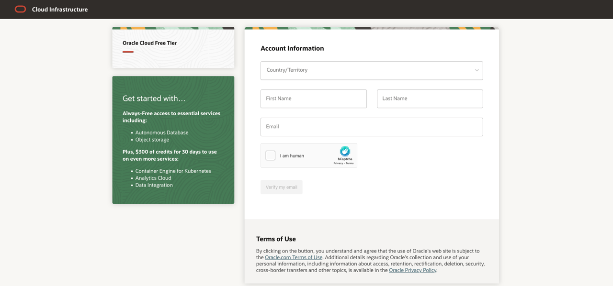

3. Enter the following information to create your Oracle Cloud Free Tier account:

    - Choose your **Country**.
    - Enter your **Name** and **Email**.
    - Use hCaptcha to verify your identity.

4. After you enter a valid email address, select **Verify my email**. If you see the **Special Oracle Offer** dialog box, select **Select Offer**.

5. Enter the following account information:

    - Choose a **Password**.
    - Enter your **Company Name**.
    - Review your **Cloud Account Name**. The name is generated automatically, but you can change it. Remember this value because you need it to sign in later.
    - Choose a **Home Region**. You cannot change the Home Region after sign-up.
    - Select **Continue**.

    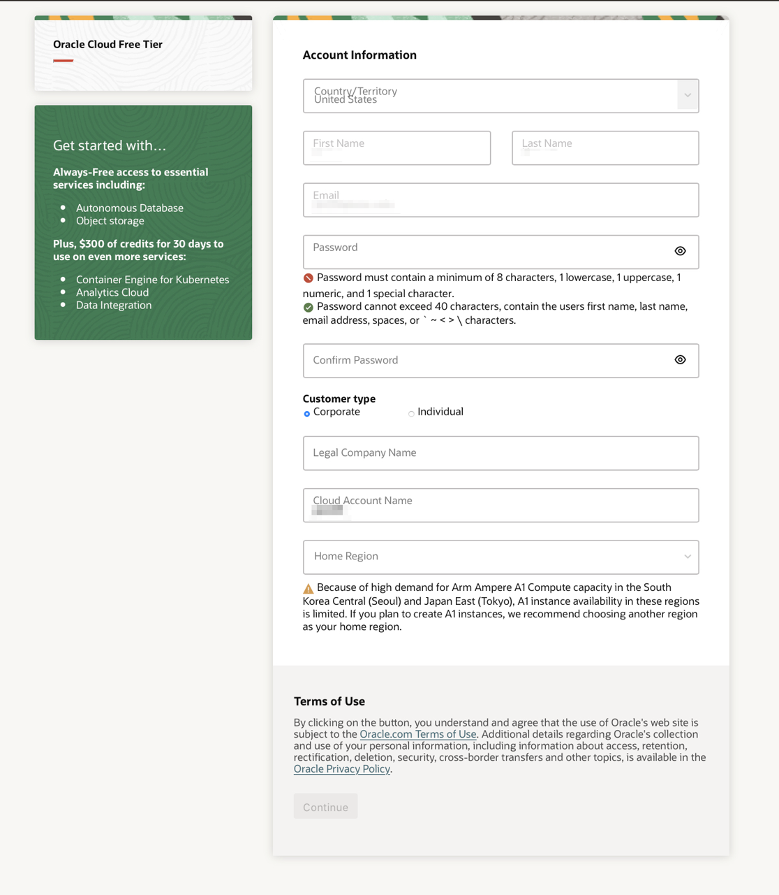

6. Enter your address information. Choose your country, enter a phone number, and select **Continue**.

    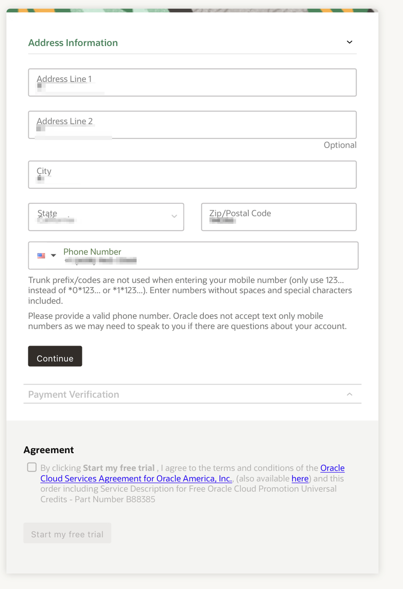

7. Review and accept the agreement, then select **Start my free trial**.

    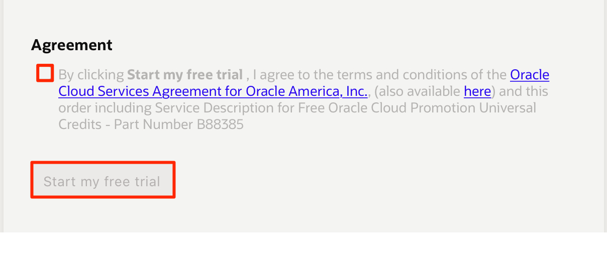

8. Wait for account provisioning to finish. When your account is ready, Oracle Cloud opens the sign-in page. You also receive an email from Oracle with your cloud account name and username.

## Task 2: Sign in to Your Account

If you have signed out of Oracle Cloud, use these steps to sign back in.

1. Go to [cloud.oracle.com](https://cloud.oracle.com), enter your Cloud Account Name, and select **Next**.

    This is the cloud account name you chose when you created the account. It is not your email address. If you forgot the name, check the confirmation email from Oracle.

    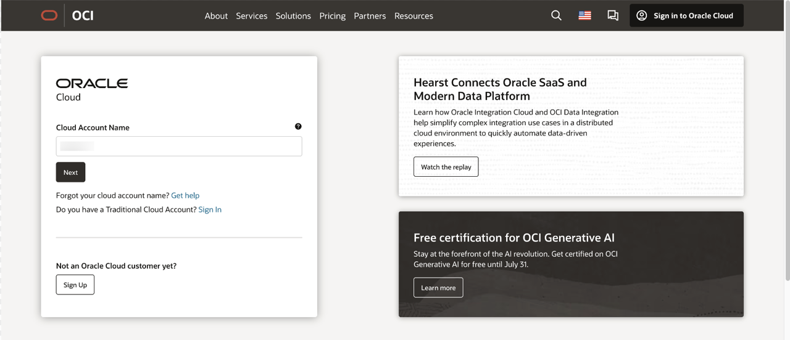

2. Select **Continue** to show the login fields.

    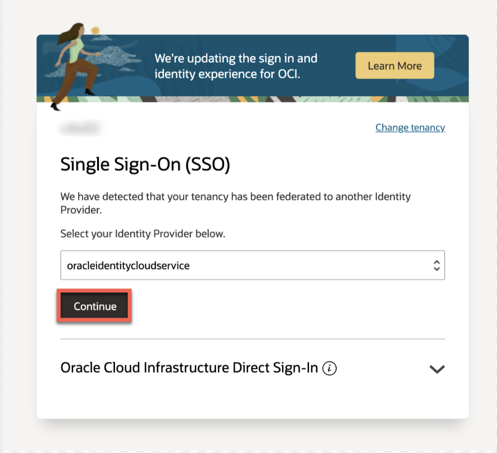

3. Enter your Oracle Cloud credentials and select **Sign In**.

    Your username is your email address. The password is the password you chose when you signed up for the account.

    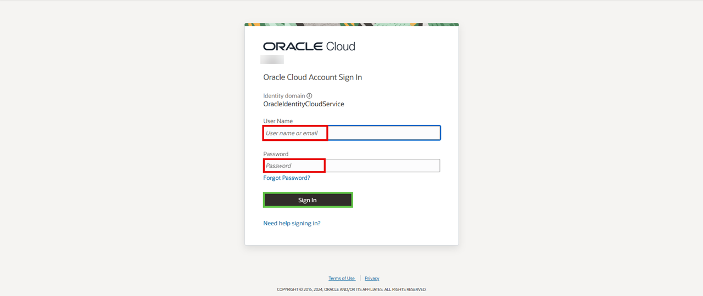

4. If prompted, select **Enable Secure Verification**. For more information, see [Managing Multifactor Authentication](https://docs.oracle.com/en-us/iaas/Content/Identity/Tasks/usingmfa.htm).

    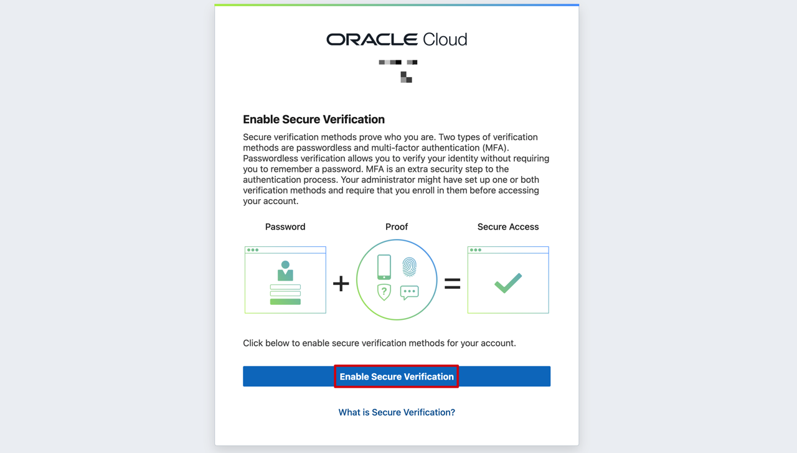

5. Select a secure verification method, such as **Mobile App** or **FIDO Authenticator**.

    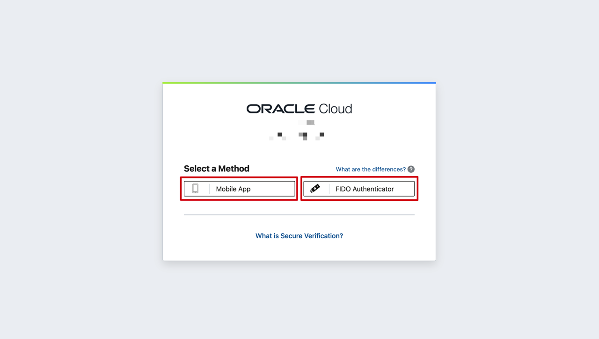

6. Configure the method you selected:

    - **Mobile App** - Follow the on-screen steps to set up authentication.

        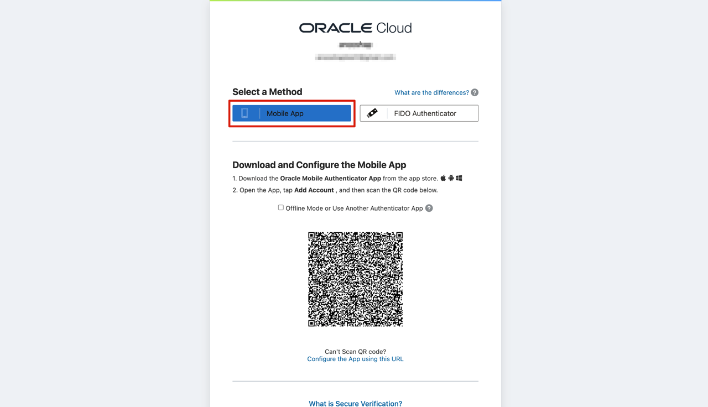

    - **FIDO Authenticator** - Select **Setup** and follow the on-screen steps.

        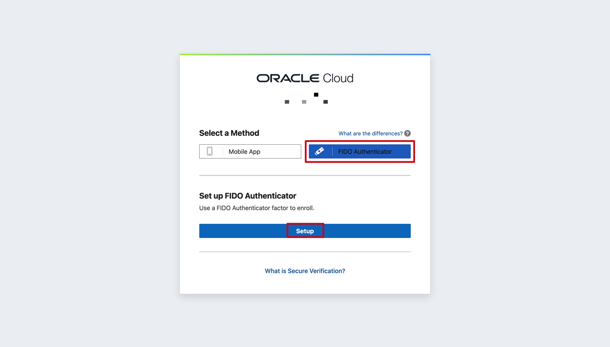

7. After you verify authentication, you are signed in to Oracle Cloud.

    

You may now **proceed to the next lab**.

## Acknowledgements

- **Created By/Date** - Anoosha Pilli, Product Manager, February 2021
- **Contributors** - Madhusudhan Rao, Arabella Yao
- **Last Updated By** - Abby Mulry, November 2025
