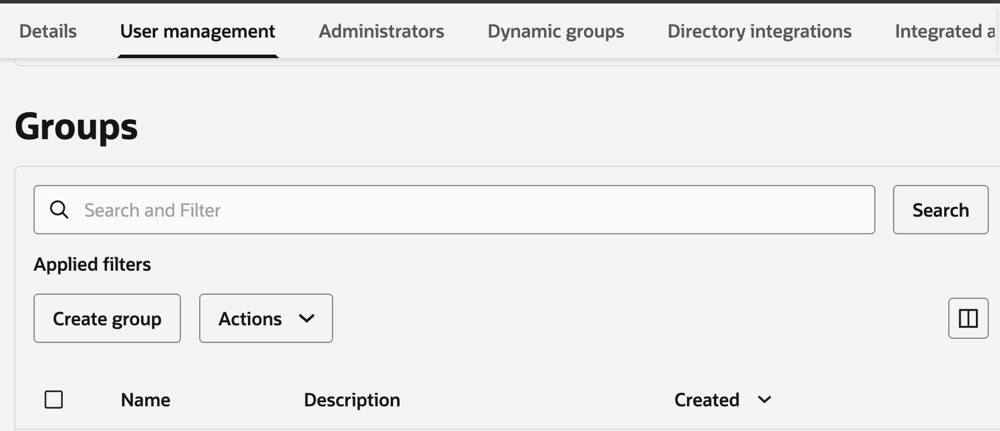

# Setup

## Introduction

In this lab, you prepare the OCI tenancy for the Example Motors support agent. The application needs access to OCI Enterprise AI, Object Storage, Autonomous AI Database, Database Tools, and Vault secrets.

Estimated Time: 20 minutes

### Objectives

In this lab, you will:

- Choose the compartment and region used by the workshop
- Create the IAM policies required by the workshop user, vector connector, and semantic store

### Prerequisites

This lab assumes you have:

- Completed the Get Started lab
- Permission to create IAM policies in the tenancy
- Permission to create a compartment
- Permission to create resources in the workshop compartment

## Task 1: Select a compartment and region

Please Keep a text file handy with the following configuration parameters and update it as we create new resources (we will update and reference values from this file as we progress through the workshop):

```text
<copy>
Workshop compartment name:
Workshop compartment OCID:
Workshop region:
Workshop users group name: example-motors-workshop-users
Vector store connector dynamic group name: generativeaivectorconnector
Semantic store dynamic group name: generativeaisemanticstore
Project OCID:
Object Storage bucket: car-manufacturer-manuals
Unstructured vector store: car-operation
Unstructured vector store OCID:
Autonomous AI Database OCID:
Database user: ADMIN
Vault OCID:
Database Tools enrichment connection OCID:
Database Tools query connection OCID:
ADMIN password secret OCID:
Structured semantic store OCID:
</copy>
```

1. Login to the OCI Console.

2. Create or select a compartment for this workshop.

    Use one compartment for all workshop resources. Compartments organize resources and scope IAM policies. They also make cleanup simpler after the lab.

    If you already have a compartment for this workshop, select it and record its name.

    If you need to create a compartment:

    - In the Console navigation menu, go to **Identity & Security**, then **Compartments**.
    - Click **Create compartment**.
    - Enter the following values:

        ```text
        Name: Hybrid-Model-HOL
        Description: Compartment for the OCI Hybrid GenAI Support Agent workshop
        Parent compartment: <parent-compartment> (usually the root compartment)
        ```

    - Click **Create compartment**.
    - Confirm that the new compartment appears in the compartment list.
    - Copy the compartment's name and OCID to the text file to the `Workshop compartment name` and `Workshop compartment OCID` parameters respectively.

    > **Note**: Create **every** workshop resource in this same compartment.

3. Choose the workshop region.

    Select a region where the Generative AI models you plan to use are available. Review [OCI Generative AI model endpoint regions](https://docs.oracle.com/en-us/iaas/Content/generative-ai/model-endpoint-regions.htm). Choose a region that exposes the required models, then select it from the Console region menu. The sample app used in this lab defaults to models which are available in the Ashburn region. If you select a different region, please remember to update the application `.env` file to use models which are available in your selected region according to the link above.

    > **Note**: Create **every** workshop resource in this same region.

## Task 2: Create IAM dynamic groups and policies

> **Note:** This workshop assumes that you have administrative permissions. If you do not, you may need to have an administrator help you with the following steps.

1. In the Console navigation menu, go to **Identity & Security**, then **Domains**.

2. Select the identity domain that your user belongs to (Make sure to select the right compartment, this would usually be the **root** compartment). This domain will usually be the **Default** domain but this might be different for your case.

3. Create or select an IAM group for workshop users.

    - In your domain screen, select **User management**.
    - Under **Groups**, click **Create group**.

        

    - Name the group: `example-motors-workshop-users`.
    - Under **Users**, check your user name to add yourself to this group.
    - Click **Create**.
    - If you didn't use the default name, update the new group name as the `Workshop users group name` parameter in our text file.

4. Create a dynamic group for the Object Storage data sync connector. This group will represent the vector store's sync connector service which processes our file data and will allow us to govern what it can do.

    - Back in the domain details page, select the **Dynamic groups** tab.
    - Click **Create dynamic group**.
    - Name the group: `generativeaivectorconnector`.
    - Copy & paste the group rule to the **Rule 1** text box:

        ```text
        <copy>
        ALL {resource.type = 'generativeaivectorconnector'}
        </copy>
        ```

    - Click **Create**.
    - If you didn't use the default name for this dynamic group, record this dynamic group name as the `Vector store connector dynamic group name` parameter in our text file.

5. Create another dynamic group for the structured semantic store. This group will represent the semantic store service which processes our database data and will allow us to govern what it can do.

    - Click **Create dynamic group**.
    - Name the dynamic group: `generativeaisemanticstore`.
    - Copy & paste the group rule to the **Rule 1** text box:

        ```text
        <copy>
        ALL {resource.type = 'generativeaisemanticstore'}
        </copy>
        ```

    - Click **Create**.
    - If you didn't use the default name for this dynamic group, record this dynamic group name as the `Semantic store dynamic group name` parameter in our text file.

6. Go to **Identity & Security**, then **Policies**.

7. Create a policy in the workshop compartment for the workshop user group.

    > **Note:** If you are an administrator on this tenancy, this step is technically not required as you already have all of the required permissions. However, for production use-cases it is recommended to limit the required permissions to the minimum required.

    - Click **Create Policy**
    - Name the policy `example-motors-users-policy`.
    - Choose a description (for example: `Permissions for the users of the Example Motors hands-on-lab`).
    - Click **Show manual editor**.
    - Paste the following policy in the **Policy Builder** textbox while replacing `<group-name>` and `<workshop-compartment>` with your values for `Workshop users group name` and `Workshop compartment` respectively:

    ```text
    <copy>
    Allow group <group-name> to manage generative-ai-family in compartment <workshop-compartment>
    Allow group <group-name> to manage object-family in compartment <workshop-compartment>
    Allow group <group-name> to manage autonomous-database-family in compartment <workshop-compartment>
    Allow group <group-name> to manage database-tools-family in compartment <workshop-compartment>
    Allow group <group-name> to manage vaults in compartment <workshop-compartment>
    Allow group <group-name> to manage keys in compartment <workshop-compartment>
    Allow group <group-name> to manage secret-family in compartment <workshop-compartment>
    Allow group <group-name> to read secret-bundles in compartment <workshop-compartment>
    </copy>
    ```

    - Click **Create**.

8. Repeat the above instructions and create a policy for the Object Storage data sync connector.

    - Name the policy: `example-motors-sync-connector-policy`.
    - Choose a description (for example: `Permissions for the Example Motors sync connector`).
    - Use the following policy replacing `<workshop-compartment>` with your workshop compartment name and `<generative-ai-vector-connector>` with the value recorded for `Vector store connector dynamic group name`:

    ```text
    <copy>
    Allow dynamic-group <generative-ai-vector-connector> to read object-family in compartment <workshop-compartment>
    </copy>
    ```

9. Repeat the above instructions and create a policy for the the structured semantic store.

    - Name the policy: `example-motors-semantic-store-policy`.
    - Choose a description (for example: `Permissions for the Example Motors semantic store`).
    - Use the following policy replacing `<workshop-compartment>` with your workshop compartment name and `<generative-ai-semantic-store>` with the value recorded for `Semantic store dynamic group name`:

    ```text
    <copy>
    Allow dynamic-group <generative-ai-semantic-store> to use database-tools-family in compartment <workshop-compartment>
    Allow dynamic-group <generative-ai-semantic-store> to read secret-bundles in compartment <workshop-compartment>
    Allow dynamic-group <generative-ai-semantic-store> to inspect autonomous-database-family in compartment <workshop-compartment>
    Allow dynamic-group <generative-ai-semantic-store> to use generative-ai-family in compartment <workshop-compartment>
    </copy>
    ```

> **Note:** It may take a few minutes for IAM policy to take effect.

You may now **proceed to the next lab**.

## Learn More

- [OCI Generative AI QuickStart for Enterprise AI Agents](https://docs.oracle.com/en-us/iaas/Content/generative-ai/get-started-agents.htm)
- [OCI Generative AI model endpoint regions](https://docs.oracle.com/en-us/iaas/Content/generative-ai/model-endpoint-regions.htm)
- [Managing IAM policies](https://docs.oracle.com/en-us/iaas/Content/Identity/Concepts/policies.htm)

## Acknowledgements

- **Author** - Julien Lehmann - Product Marketing Manager, Yanir Shahak - Senior Principal Software Engineer
