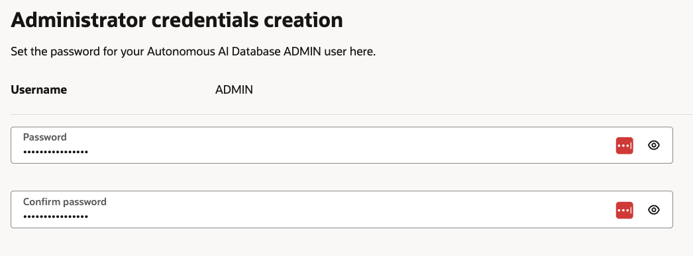
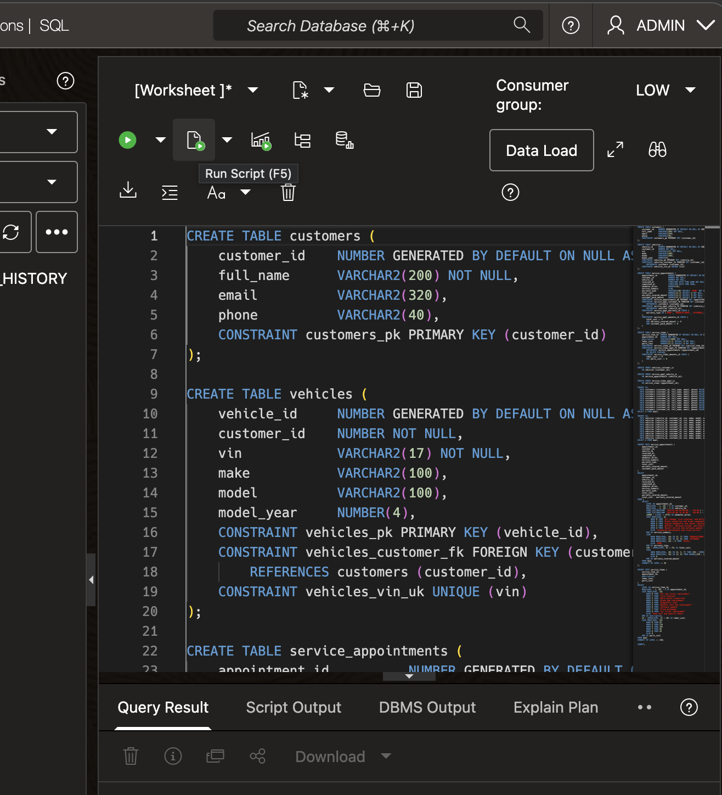
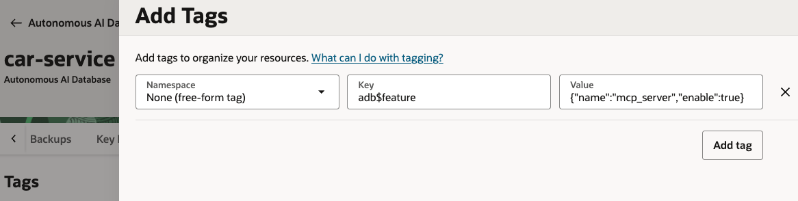

# Service Database

## Introduction

In this lab, you create the structured data source for the Example Motors support agent. The Autonomous AI Database stores customer, vehicle, service appointment, and service item records. The sample app uses the OCI Enterprise AI NL2SQL to generate SQL against this schema and the ADB MCP Server to execute the SQL and retrieve the data.

Estimated Time: 30 minutes

### Objectives

In this lab, you will:

- Create an Autonomous AI Database
- Load the workshop schema and sample service data
- Create the `EXECUTE_SQL` tool used by the sample app
- Enable the ADB MCP Server

### Prerequisites

This lab assumes you have:

- Completed the Setup lab
- Permission to create an Autonomous AI Database

## Task 1: Create the Autonomous AI Database

1. In the Console navigation menu, go to **Oracle AI Database**, then **Autonomous AI Databases**.

2. Select the workshop compartment.

    

3. Click **Create Autonomous AI Database**.

4. Enter the following values:

    ```text
    Display name: car-service
    Database name: CARSERVICE
    Compartment: <workshop-compartment>
    Workload type: Transaction Processing
    ```

    

5. Toggle **Developer** ON.

6. Select database version **26ai**.

7. Set the ADMIN password. Please select a none trivial value for this password (at least 10 characters and include uppercase, lowercase, numeric and special characters). Save this password in a secure place. We will need it later in the workshop.

    > **Note:** For this prototype workshop, we will use the default `ADMIN` user for the schema, Database Tools connections, and ADB MCP access. In production environments, it is recommended to create a less privileged database user and grant it only permissions required by the application.

    

8. For workshop simplicity, choose **Secure access from everywhere**.

    > **Note:** This will make the database accessible from the public internet. This is not the optimal configuration for production environments.

    

9. Click **Create**.

10. Wait until the database lifecycle state is `Available`.

11. In the database **General information** page, copy the database OCID and save it in your text file as the value for `Autonomous AI Database OCID`.

## Task 2: Load the workshop schema and sample service data

> **Note:** This workshop uses `ADMIN` for prototyping purposes. For production environments, create a less privileged user. Grant only the permissions needed for schema ownership, read-only SQL execution, and MCP tool access.

1. Open the `car-service` Autonomous AI Database.

1. Click **Database Actions**.

1. Select **SQL**.

1. Download the [database setup file](./files/customer-service-appointments.sql)

1. Open the file in a any text or code editor and copy its contents into the SQL worksheet.

1. Run the script (make sure you select the **Run Script** button and not the **Run Statement** button).

    

1. Confirm that the script finishes without errors. The output should look similar to the following:

    ```text
    Table CUSTOMERS created.
    Elapsed: 00:00:00.035

    Table VEHICLES created.
    Elapsed: 00:00:00.040

    Table SERVICE_APPOINTMENTS created.
    Elapsed: 00:00:00.042

    Table SERVICE_ITEMS created.
    Elapsed: 00:00:00.033

    Index VEHICLES_CUSTOMER_IX created.
    Elapsed: 00:00:00.013

    Index SERVICE_APPT_VEHICLE_IX created.
    Elapsed: 00:00:00.010

    Index SERVICE_ITEMS_APPT_IX created.
    Elapsed: 00:00:00.011

    10 rows inserted.
    Elapsed: 00:00:00.053

    10 rows inserted.
    Elapsed: 00:00:00.047

    30 rows inserted.
    Elapsed: 00:00:00.094

    100 rows inserted.
    Elapsed: 00:00:00.034

    Commit complete.
    Elapsed: 00:00:00.003
    ```

## Task 5: Create the SQL execution tool

In order for the ADB MCP server to retrieve data from the database for us, we need to provide it with a tool.

1. Download the [SQL execution tool setup file](./files/sql-execution-tool.sql).

1. Open the file in a any text or code editor and copy its contents into the SQL worksheet (make sure nothing is left from the previous set of statements).

1. Run the script (make sure you select the **Run Script** button and not the **Run Statement** button).

1. Confirm that the script finishes without errors. The output should look similar to the following:

    ```text
    Function EXECUTE_SQL compiled
    Elapsed: 00:00:00.081


    PL/SQL procedure successfully completed.
    Elapsed: 00:00:00.964
    ```

## Task 4: Enable ADB MCP Server

1. Return to the Autonomous AI Database details page in the OCI Console.

2. Select the **Tags** tab (you may need to scroll the tabs to see it as it is the last).

3. Click **Add** to add this free-form tag:

    ```text
    Key: adb$feature
    Value: {"name":"mcp_server","enable":true}
    ```

    

4. Click **Add**.

5. The app will call the endpoint with this pattern:

    ```text
    https://dataaccess.adb.<workshop-region>.oraclecloudapps.com/adb/mcp/v1/databases/<database-ocid>
    ```

At this stage, we have an Autonomous AI Database instance, complete with a schema, data as well as a running MCP server which will allow us to query the database directly by our support agent.

You may now **proceed to the next lab**.

## Learn More

- [Provision Autonomous Database](https://docs.oracle.com/en-us/iaas/autonomous-database-serverless/doc/autonomous-provision.html)
- [Use ADB MCP Server](https://docs.oracle.com/en/cloud/paas/autonomous-database/serverless/adbsb/use-mcp-server.html)
- [Database Actions SQL worksheet](https://docs.oracle.com/en/cloud/paas/autonomous-database/serverless/adbsb/sql-worksheet.html)

## Acknowledgements

- **Author** - Julien Lehmann, Product Marketing Manager, Yanir Shahak, Senior Principal Software Engineer
