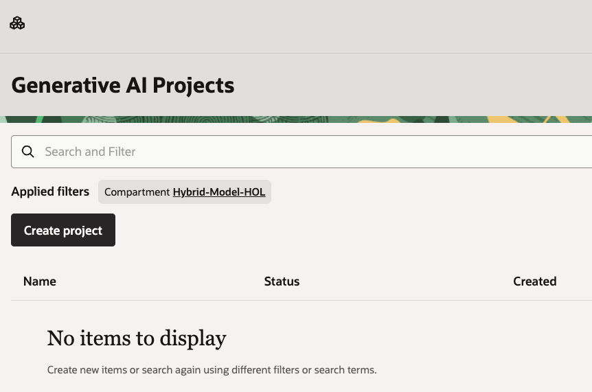
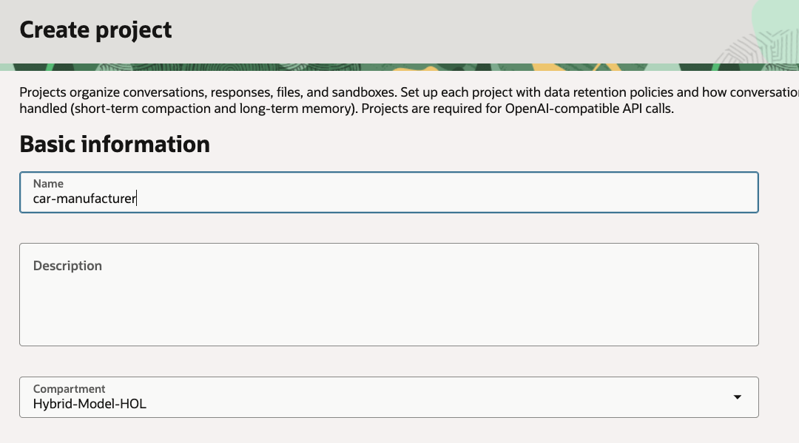
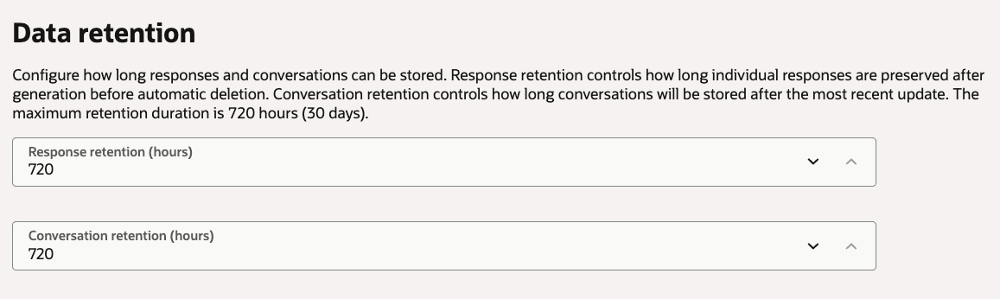
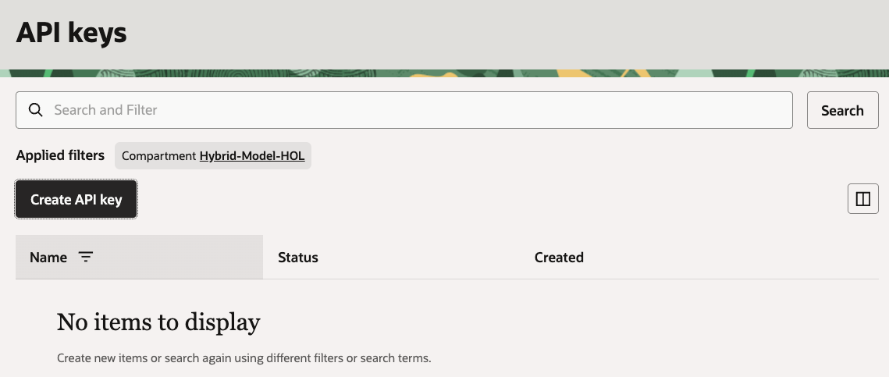
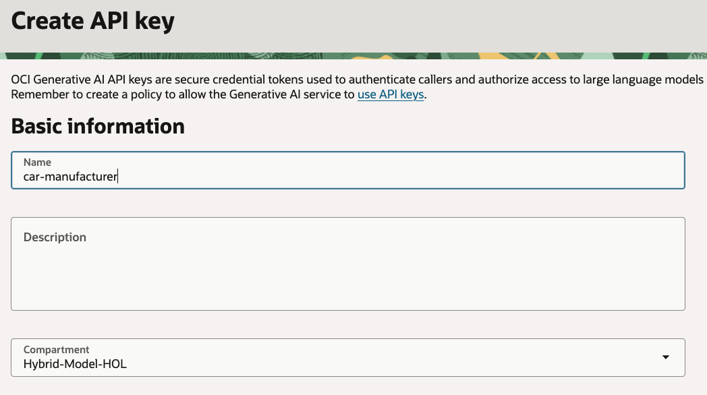
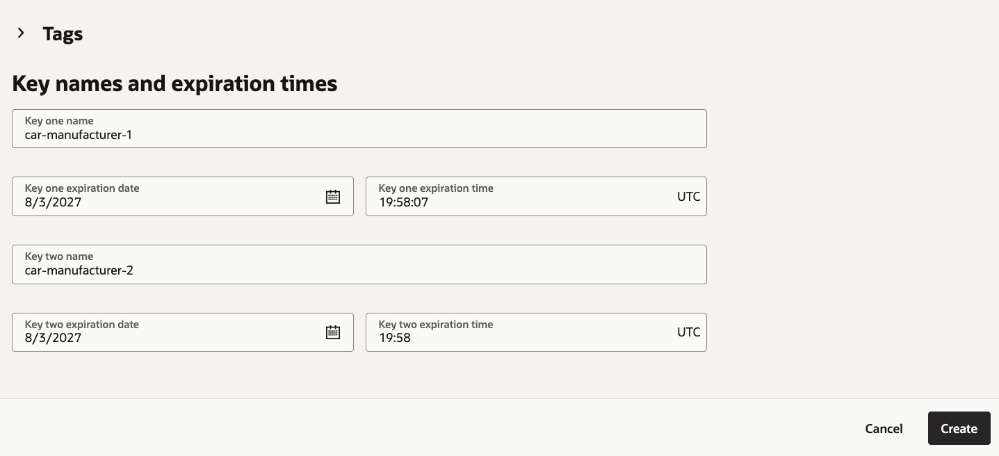
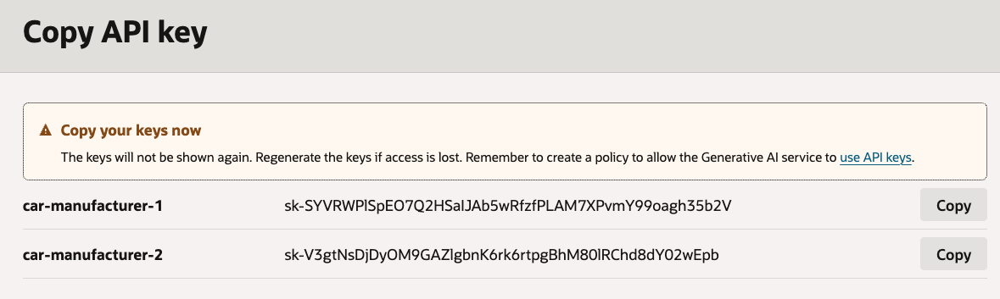

# Setup

## Introduction

In this lab, you prepare the OCI tenancy for the Example Motors support agent. The application needs access to OCI Enterprise AI, Object Storage, Autonomous AI Database, Database Tools, and Vault secrets.

Estimated Time: 20 minutes

### Objectives

In this lab, you will:

- Choose the compartment and regions used by the workshop
- Create the IAM policies required by the user, vector connector, and semantic store
- Create the OCI Enterprise AI project for the app
- Create a Generative AI API key when using API key authentication

### Prerequisites

This lab assumes you have:

- Completed the Get Started lab
- Permission to create IAM policies in the tenancy
- Permission to create resources in the workshop compartment

## Task 1: Record workshop values

1. Open the OCI Console.

2. Select or create a compartment for this workshop.

    Use one compartment for all resources. The examples use:

    ```text
    Hybrid-Model-HOL
    ```

3. Choose a Generative AI region.

    Use one supported region for the OCI Enterprise AI project, vector store, semantic store, and LLM calls. The examples use:

    ```text
    us-chicago-1
    ```

4. Choose an Autonomous Database region.

    The sample app supports a separate ADB MCP region through `OCI_ADB_MCP_REGION`. The examples use:

    ```text
    us-ashburn-1
    ```

5. Keep these names for the rest of the workshop:

    ```text
    Project: car-manufacturer
    Object Storage bucket: car-manufacturer-manuals
    Unstructured vector store: car-operation
    Autonomous AI Database: car-service
    Database user: ADB_MCP_USER
    Database Tools enrichment connection: car-service-enrichment
    Database Tools query connection: car-service-query
    Structured semantic store: car-manufacturer-service
    ```

## Task 2: Create IAM dynamic groups and policies

1. In the Console navigation menu, go to **Identity & Security**, then **Domains**.

2. Open the identity domain that contains your workshop user.

3. Create or select an IAM group for workshop users.

    Add your user to this group. The examples use:

    ```text
    example-motors-workshop-users
    ```

4. Go to **Identity & Security**, then **Dynamic Groups**.

5. Create a dynamic group named `generativeaivectorconnector`.

    Use this matching rule:

    ```text
    ALL {resource.type = 'generativeaivectorconnector'}
    ```

6. Create a dynamic group named `generativeaisemanticstore`.

    Use this matching rule:

    ```text
    ALL {resource.type = 'generativeaisemanticstore'}
    ```

7. Go to **Identity & Security**, then **Policies**.

8. Create a policy in the workshop compartment for the workshop user group.

    Replace `<group-name>` and `<compartment-name>` with your values:

    ```text
    Allow group <group-name> to manage generative-ai-family in compartment <compartment-name>
    Allow group <group-name> to manage object-family in compartment <compartment-name>
    Allow group <group-name> to manage autonomous-database-family in compartment <compartment-name>
    Allow group <group-name> to manage database-tools-family in compartment <compartment-name>
    Allow group <group-name> to manage vaults in compartment <compartment-name>
    Allow group <group-name> to manage keys in compartment <compartment-name>
    Allow group <group-name> to manage secret-family in compartment <compartment-name>
    Allow group <group-name> to read secret-bundles in compartment <compartment-name>
    ```

9. Create a policy for the Object Storage data sync connector.

    Replace `<compartment-name>` with your workshop compartment:

    ```text
    Allow dynamic-group generativeaivectorconnector to read object-family in compartment <compartment-name>
    ```

10. Create a policy for the structured semantic store.

    Replace `<compartment-name>` with your workshop compartment:

    ```text
    Allow dynamic-group generativeaisemanticstore to use database-tools-family in compartment <compartment-name>
    Allow dynamic-group generativeaisemanticstore to read secret-bundles in compartment <compartment-name>
    Allow dynamic-group generativeaisemanticstore to inspect autonomous-database-family in compartment <compartment-name>
    Allow dynamic-group generativeaisemanticstore to use generative-ai-family in compartment <compartment-name>
    ```

11. Wait a few minutes for IAM policy propagation before creating the vector store and semantic store.

## Task 3: Create the OCI Enterprise AI project

1. In the Console navigation menu, go to **Analytics & AI**, then **Generative AI**.

2. Under **Generative AI**, select **Projects**.

    

3. Click **Create project**.

4. Enter the following values:

    ```text
    Name: car-manufacturer
    Description: Example Motors support agent project
    Compartment: <workshop-compartment>
    ```

    

5. Configure response and conversation retention for the workshop.

    Use the console defaults unless your organization requires shorter retention.

    

6. Click **Create**.

7. Open the project and copy the project OCID.

    You will use it later as:

    ```text
    OCI_GENAI_PROJECT_OCID
    ```

## Task 4: Create a Generative AI API key

1. Stay in **Analytics & AI**, **Generative AI**.

2. Select **API keys**.

    

3. Click **Create API key**.

4. Enter the following values:

    ```text
    Name: car-manufacturer
    Description: API key for the Example Motors sample app
    Compartment: <workshop-compartment>
    ```

    

5. Set the key expiration fields for the workshop duration.

    

6. Click **Create**.

7. Copy the key value immediately.

    The Console shows the key only once.

    

8. Store the value securely.

    You will use it later as:

    ```text
    OCI_GENAI_API_KEY
    ```

9. If you prefer OCI CLI session authentication, you can skip the API key at runtime and set:

    ```text
    OCI_GENAI_AUTH=session
    OCI_PROFILE=DEFAULT
    ```

You may now **proceed to the next lab**.

## Learn More

- [OCI Generative AI QuickStart for Enterprise AI Agents](https://docs.oracle.com/en-us/iaas/Content/generative-ai/get-started-agents.htm)
- [Managing IAM policies](https://docs.oracle.com/en-us/iaas/Content/Identity/Concepts/policies.htm)
- [Regions and availability domains](https://docs.oracle.com/en-us/iaas/Content/General/Concepts/regions.htm)

## Acknowledgements

- **Author** - Julien Lehmann, Product Marketing Manager, Yanir Shahak, Senior Principal Software Engineer
