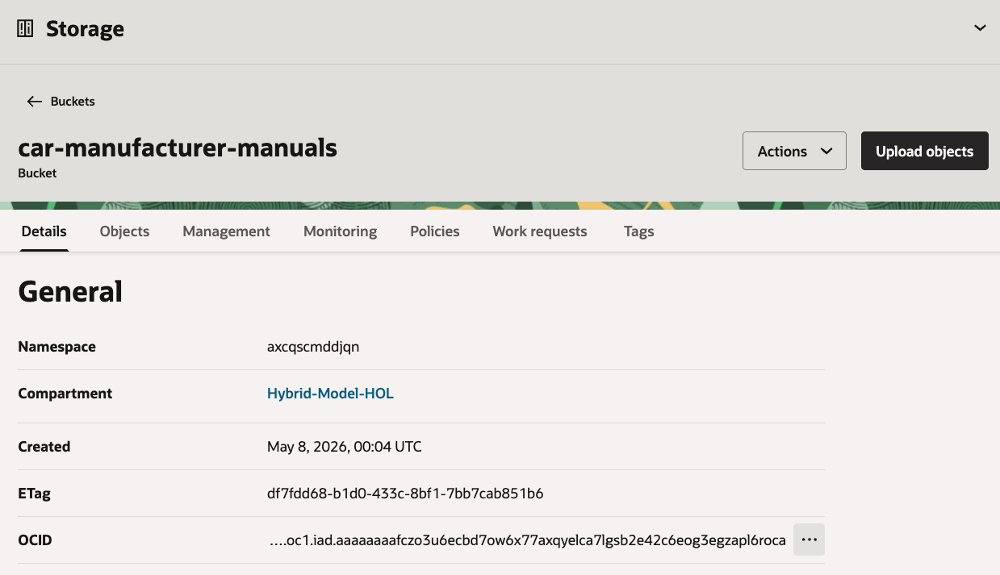

# Unstructured RAG

## Introduction

In this lab, you create the unstructured retrieval source for the Example Motors support agent. The source document is a PDF pairing guide for the Example Motors infotainment system. The app attaches the resulting vector store to OCI Generative AI Responses API requests through the `file_search` tool.

Estimated Time: 25 minutes

### Objectives

In this lab, you will:

- Create an Object Storage bucket for vehicle manuals
- Upload the infotainment pairing guide PDF
- Create an unstructured vector store
- Create and run a data sync connector
- Record the vector store ID for the sample app

### Prerequisites

This lab assumes you have:

- Completed the Setup lab
- A workshop compartment with the required IAM policies
- The PDF file `4-unstructured-rag/files/talexion-infotainment-pairing-guide.pdf`

## Task 1: Create the manual bucket

1. In the Console navigation menu, go to **Storage**, then **Buckets**.

2. Select the workshop compartment.

3. Click **Create bucket**.

4. Enter the following values:

    ```text
    Bucket name: car-manufacturer-manuals
    Default storage tier: Standard
    Visibility: Private
    Emit object events: Disabled
    Object versioning: Disabled
    ```

    

5. Click **Create bucket**.

6. Open the bucket from the bucket list.

    

7. On the bucket details page, record the namespace and bucket name.

    

## Task 2: Upload the infotainment PDF

1. In the `car-manufacturer-manuals` bucket, click **Upload objects**.

2. Drag or select this file:

    ```text
    4-unstructured-rag/files/talexion-infotainment-pairing-guide.pdf
    ```

    

3. Review the file upload list.

    

4. Click **Upload objects**.

5. Wait for the upload to complete.

    

6. Confirm that the bucket contains the PDF.

    

## Task 3: Create the unstructured vector store

1. In the Console navigation menu, go to **Analytics & AI**, then **Generative AI**.

2. Select **Vector stores**.

    

3. Click **Create vector store**.

4. Enter the following values:

    ```text
    Name: car-operation
    Description: Example Motors infotainment and operation manuals
    Compartment: <workshop-compartment>
    Data source type: Unstructured data
    ```

    

5. Click **Create**.

6. Wait until the vector store status is `Completed`.

    

7. Open the vector store details page.

    

8. Copy the vector store ID.

    You will use this value later as:

    ```text
    OCI_GENAI_VECTOR_STORE_IDS
    ```

## Task 4: Create the data sync connector

1. In the `car-operation` vector store, select the **Data sync connectors** tab.

2. Click **Create data sync connector**.

    

3. Enter the following values:

    ```text
    Name: car-manuals
    Object Storage bucket: car-manufacturer-manuals
    Object prefix: leave blank
    ```

4. Select the uploaded PDF file from the bucket.

    

5. Click **Create**.

6. Confirm that the data sync connector appears in the list.

    

7. Open the data sync connector details page.

    

## Task 5: Run and verify data sync

1. In the vector store details page, open the **Data sync** tab.

    

2. Click **Perform Data Sync**.

3. Enter the following value:

    ```text
    Name: car-manuals
    ```

    

4. Click **Perform**.

5. Wait until the data sync job reaches a completed state.

    

6. Return to the vector store details page.

7. Confirm that the file count is at least `1`.

8. Save the vector store ID with your workshop notes.

You may now **proceed to the next lab**.

## Learn More

- [Managing Object Storage buckets](https://docs.oracle.com/en-us/iaas/Content/Object/Tasks/managingbuckets.htm)
- [Uploading objects to Object Storage](https://docs.oracle.com/en-us/iaas/Content/Object/Tasks/managingobjects.htm)
- [OCI Generative AI QuickStart for vector stores and file search](https://docs.oracle.com/en-us/iaas/Content/generative-ai/get-started-agents.htm)

## Acknowledgements

- **Author** - Julien Lehmann, Product Marketing Manager, Yanir Shahak, Senior Principal Software Engineer
