# Unstructured RAG

## Introduction

In this lab, you create the unstructured retrieval source for the Example Motors support agent. You will seed the vector store created in this section with a source document. This document is a PDF mobile bluetooth pairing guide for the Example Motors infotainment system. The app will query the vector store using the OCI Enterprise AI Responses API by leveraging the the built in `file_search` tool.

Estimated Time: 25 minutes

### Objectives

In this lab, you will:

- Create an Object Storage bucket for storing vehicle manuals
- Upload the infotainment pairing guide PDF
- Create an unstructured vector store
- Create and run a data sync connector
- Record the vector store ID for the sample app

### Prerequisites

This lab assumes you have:

- Completed the Setup lab

## Task 1: Create the vehicle manuals bucket

1. In the Console navigation menu, go to **Storage**, then **Buckets**.

2. Select the workshop compartment.

3. Click **Create bucket**.

4. Name the bucket: `car-manufacturer-manuals` (update the text file if you choose a different name).

    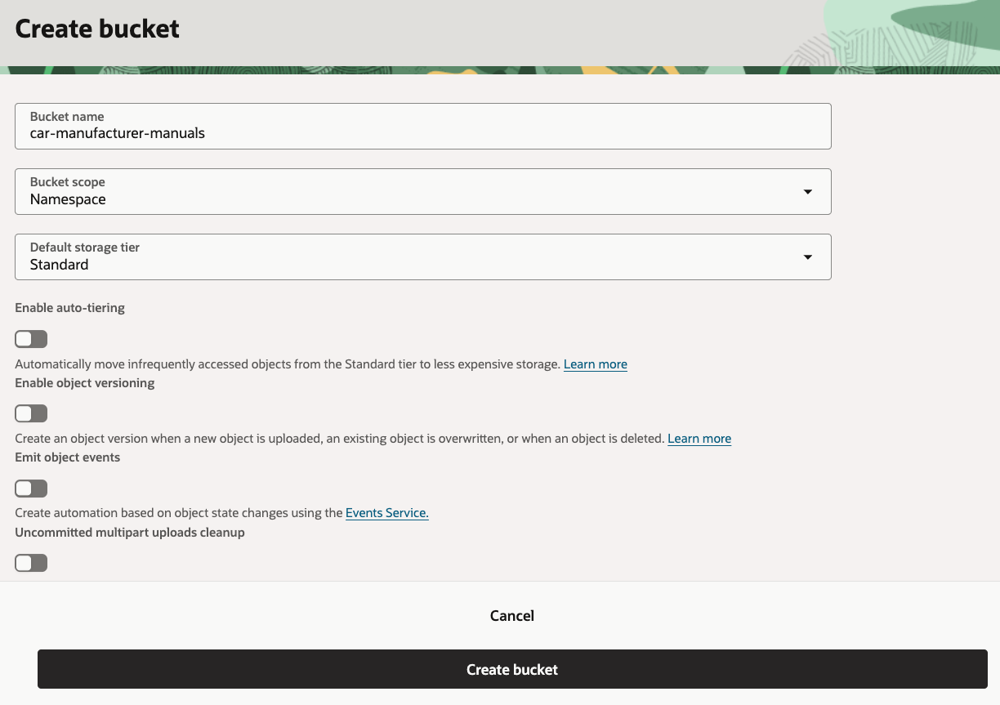

5. Click **Create bucket**.

6. Open the bucket from the bucket list.

    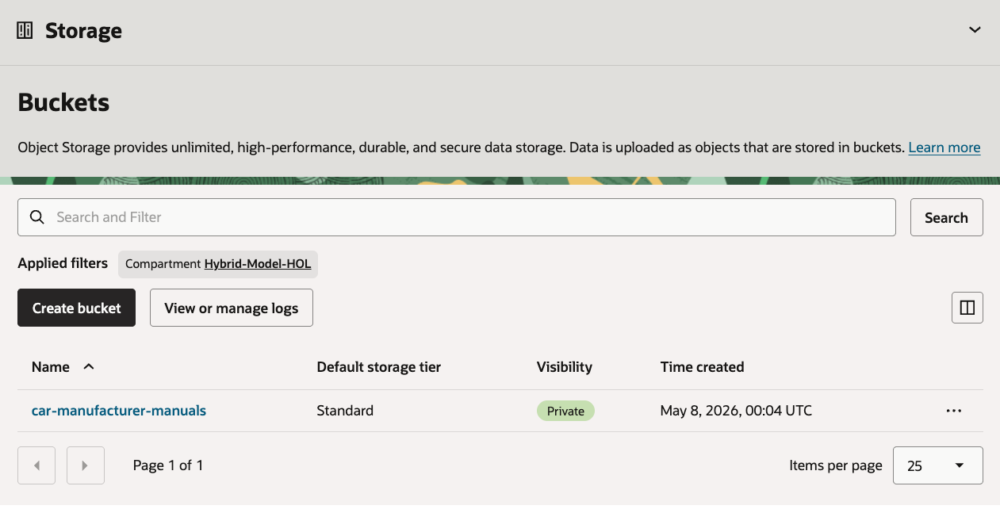

## Task 2: Upload the infotainment PDF

1. In the `car-manufacturer-manuals` bucket, click **Upload objects**.

2. Upload the PDF file

    - Download the [manual file](./files/talexion-infotainment-pairing-guide.pdf).
    - Drag the file from your **Download** folder to the **Drop a file or select one** section.
    - Click **Next**.

    

3. Review the file upload list.

    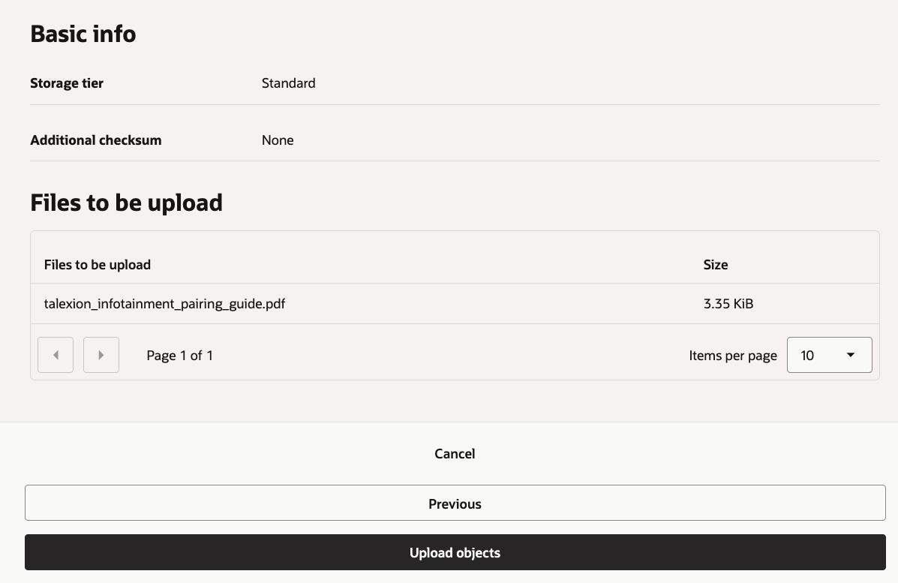

4. Click **Upload objects**.

5. Wait for the upload to complete & click **Close**.

    

6. Confirm that the bucket contains the PDF by clicking the **Objects** tab.

    

## Task 3: Create the unstructured vector store

1. In the Console navigation menu, go to **Analytics & AI**, then **Generative AI**.

2. Select **Vector stores**.

    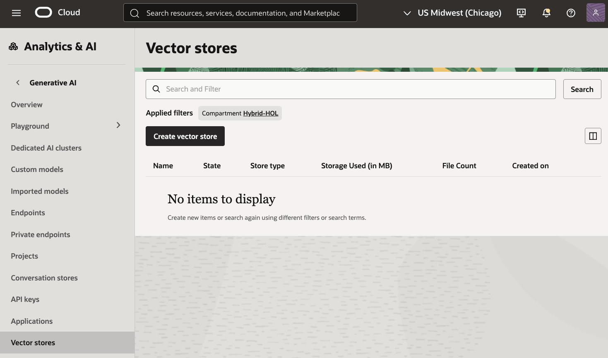

3. Click **Create vector store**.

4. Enter the following values:

    ```text
    Name: car-operation
    Description: Example Motors infotainment and operation manuals
    ```

    - If you chose a different name for the vector store, please update the `Unstructured vector store` parameter in our text file.
    - Select the workshop compartment.
    - Under **Data source type** Select **Unstructured data**.

    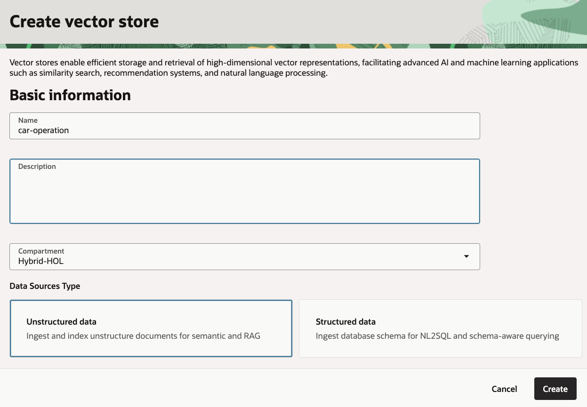

5. Click **Create**.

6. Wait until the vector store status is `Completed`.

    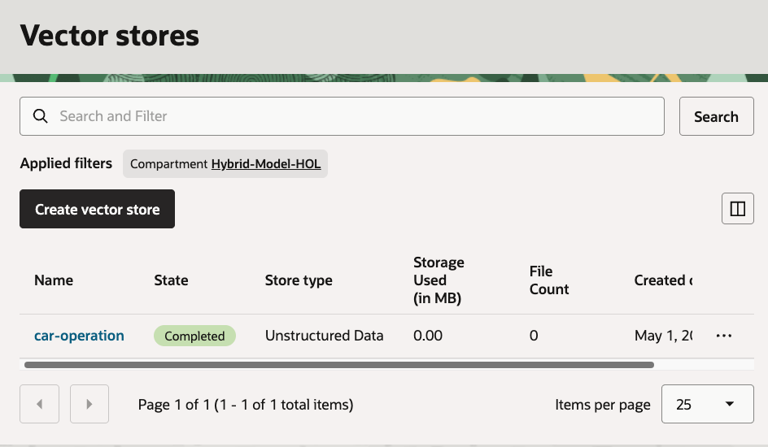

7. Open the vector store details page.

    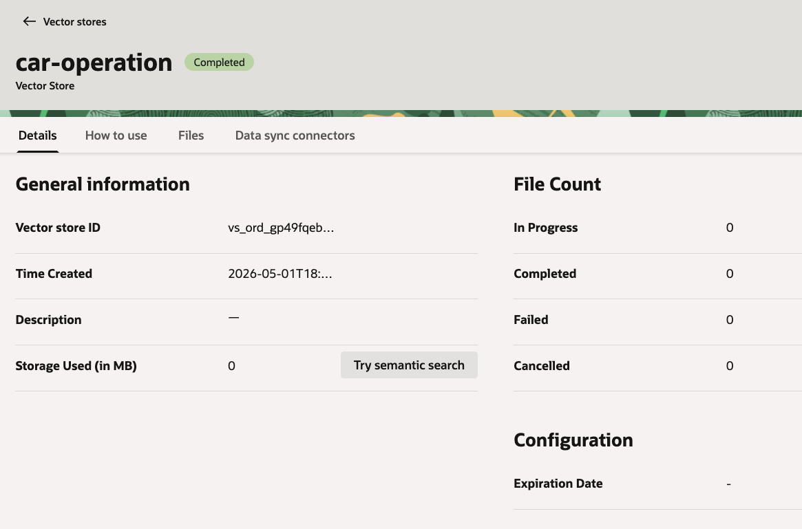

8. Copy the vector store ID & update the value for `Unstructured vector store OCID` in the text file.

## Task 4: Create the data sync connector

1. In the vector store, select the **Data sync connectors** tab.

2. Click **Create data sync connector**.

    

3. Data sync connector configuration:

    - Name: car-manuals
    - Compartment: Select the workshop compartment.
    - Bucket: car-manufacturer-manuals
    - Turn **Select all in bucket** on.

    

4. Click **Create**.

5. Confirm that the data sync connector appears in the list.

    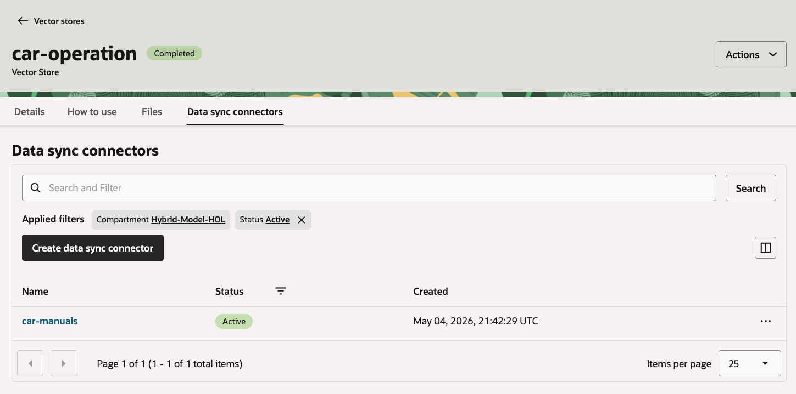

6. Open the data sync connector details page.

    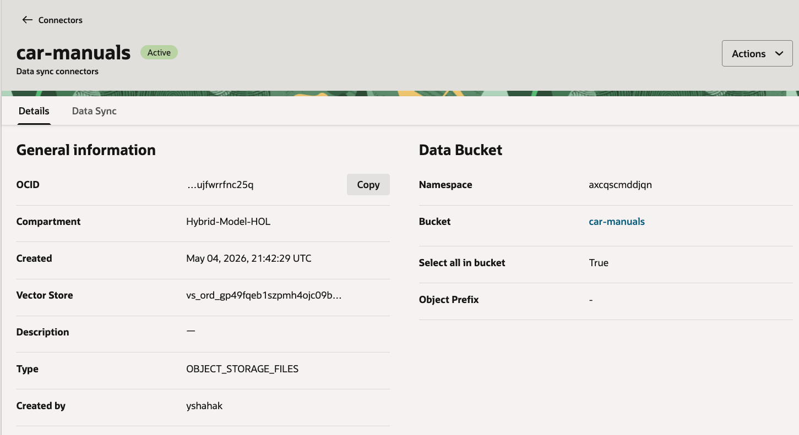

7. Open the **Data sync** tab.

    

8. Under the **Data Sync Jobs** list, click **Perform Data Sync**.

9. Name the data sync job: `car-manuals`

    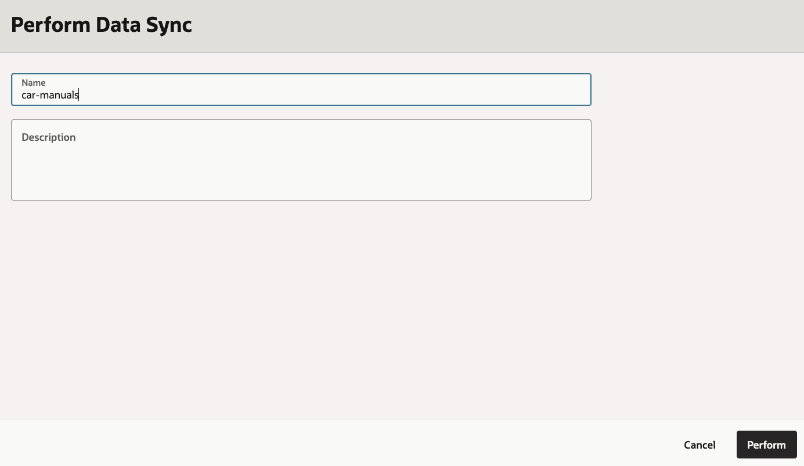

10. Click **Perform**.

11. Wait until the data sync job reaches a completed state.

    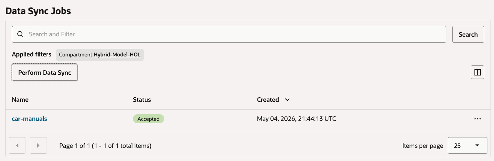

12. Return to the vector store details page.

13. Confirm that the file count is at least `1`.

14. Save the vector store ID with your workshop notes.

You may now **proceed to the next lab**.

## Learn More

- [Managing Object Storage buckets](https://docs.oracle.com/en-us/iaas/Content/Object/Tasks/managingbuckets.htm)
- [Uploading objects to Object Storage](https://docs.oracle.com/en-us/iaas/Content/Object/Tasks/managingobjects.htm)
- [OCI Generative AI QuickStart for vector stores and file search](https://docs.oracle.com/en-us/iaas/Content/generative-ai/get-started-agents.htm)

## Acknowledgements

- **Author** - Julien Lehmann - Product Marketing Manager, Yanir Shahak - Senior Principal Software Engineer
