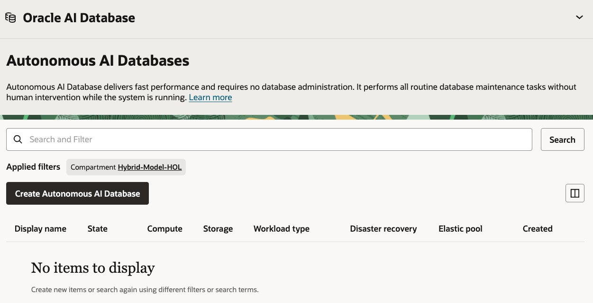
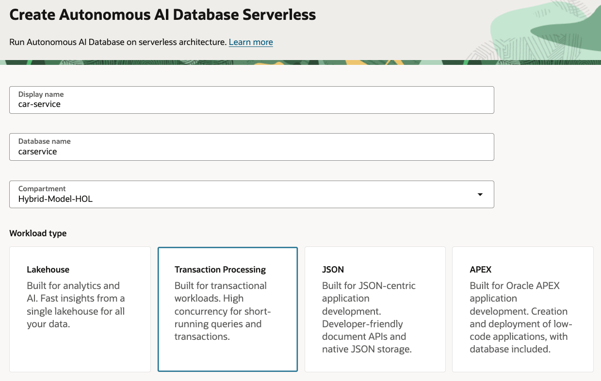
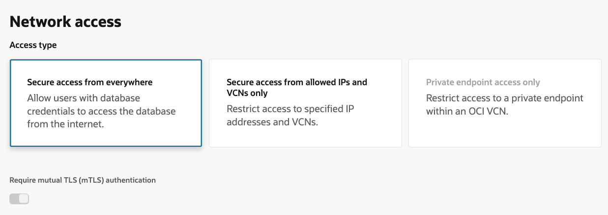

# Service Database

## Introduction

In this lab, you create the structured data source for the Example Motors support agent. The Autonomous AI Database stores customer, vehicle, service appointment, and service item records. The sample app uses OCI NL2SQL to generate SQL against this schema and ADB MCP Server to execute the SQL.

Estimated Time: 30 minutes

### Objectives

In this lab, you will:

- Create an Autonomous AI Database
- Create the `ADB_MCP_USER` database user
- Load the workshop schema and sample service data
- Enable ADB MCP Server
- Create or grant the `EXECUTE_SQL` tool expected by the sample app

### Prerequisites

This lab assumes you have:

- Completed the Setup lab
- Permission to create an Autonomous AI Database
- The SQL setup file `5-service-database/files/customer-service-appointments.sql`

## Task 1: Create the Autonomous AI Database

1. In the Console navigation menu, go to **Oracle Database**, then **Autonomous AI Databases**.

2. Select the workshop compartment.

    

3. Click **Create Autonomous AI Database**.

4. Enter the following values:

    ```text
    Display name: car-service
    Database name: CARSERVICE
    Compartment: <workshop-compartment>
    Workload type: Transaction Processing
    ```

    

5. Set the ADMIN password.

    Save this password in a secure place. You will use it only to create the workshop database user.

    

6. For workshop simplicity, choose **Secure access from everywhere**.

    

7. Complete the wizard and click **Create Autonomous AI Database**.

8. Wait until the database lifecycle state is `Available`.

9. Open the database details page and copy the database OCID.

    You will use this value later as:

    ```text
    OCI_ADB_DATABASE_OCID
    ```

## Task 2: Create the database user

1. Open the `car-service` Autonomous AI Database.

2. Click **Database Actions**.

3. Sign in as `ADMIN`.

4. Open **SQL**.

5. Create the workshop user.

    Replace `<password>` with the password you will later store in Vault:

    ```sql
    CREATE USER ADB_MCP_USER IDENTIFIED BY "<password>";
    GRANT CREATE SESSION TO ADB_MCP_USER;
    GRANT CREATE TABLE TO ADB_MCP_USER;
    GRANT CREATE VIEW TO ADB_MCP_USER;
    GRANT CREATE PROCEDURE TO ADB_MCP_USER;
    GRANT UNLIMITED TABLESPACE TO ADB_MCP_USER;
    ```

6. Sign out of Database Actions.

7. Sign back in as `ADB_MCP_USER`.

## Task 3: Load the service schema and data

1. In Database Actions, open **SQL** as `ADB_MCP_USER`.

2. Open the SQL setup file:

    ```text
    5-service-database/files/customer-service-appointments.sql
    ```

3. Paste the full file into the SQL worksheet.

4. Run the script.

5. Confirm that the script finishes without errors.

6. Verify the row counts.

    ```sql
    SELECT 'customers' AS table_name, COUNT(*) AS row_count FROM customers
    UNION ALL
    SELECT 'vehicles', COUNT(*) FROM vehicles
    UNION ALL
    SELECT 'service_appointments', COUNT(*) FROM service_appointments
    UNION ALL
    SELECT 'service_items', COUNT(*) FROM service_items;
    ```

7. Confirm these row counts:

    ```text
    customers: 10
    vehicles: 10
    service_appointments: 30
    service_items: 100
    ```

8. Run a customer-scoped test query.

    ```sql
    SELECT
        c.customer_id,
        c.full_name,
        v.model,
        sa.received_at,
        sa.service_summary,
        sa.warranty_type,
        sa.total_cost,
        sa.customer_paid_amount
    FROM customers c
    JOIN vehicles v
        ON v.customer_id = c.customer_id
    JOIN service_appointments sa
        ON sa.customer_id = c.customer_id
        AND sa.vehicle_id = v.vehicle_id
    WHERE c.customer_id = 7
    ORDER BY sa.received_at;
    ```

9. Confirm that the query returns service records for Grace Lee.

## Task 4: Enable ADB MCP Server

1. Return to the Autonomous AI Database details page in the OCI Console.

2. Open **More actions**, then **Tags**.

3. Add this free-form tag:

    ```text
    Key: adb$feature
    Value: {"name":"mcp_server","enable":true}
    ```

4. Save the tag.

5. Wait a few minutes for the ADB MCP endpoint to become available.

6. The app will call the endpoint with this pattern:

    ```text
    https://dataaccess.adb.<adb-region>.oraclecloudapps.com/adb/mcp/v1/databases/<database-ocid>
    ```

## Task 5: Create or grant the SQL execution tool

1. In Database Actions, sign in as `ADB_MCP_USER`.

2. Create or grant a Select AI Agent tool with this contract:

    ```text
    Tool name: EXECUTE_SQL
    SQL argument name: query
    Offset argument name: offset
    Limit argument name: limit
    Result format: JSON rows
    Access: read-only SQL only
    ```

3. Use the Oracle ADB MCP Server documentation for the current console or PL/SQL flow.

    The sample app checks the MCP `tools/list` result and fails if `EXECUTE_SQL` is not available to `ADB_MCP_USER`.

4. If your tool uses different argument names, keep the tool name or update the app environment later:

    ```text
    OCI_ADB_MCP_EXECUTE_TOOL=EXECUTE_SQL
    OCI_ADB_MCP_SQL_ARGUMENT=query
    OCI_ADB_MCP_OFFSET_ARGUMENT=offset
    OCI_ADB_MCP_LIMIT_ARGUMENT=limit
    ```

5. Keep the SQL execution tool read-only.

    The sample app also validates generated SQL before it calls MCP, but the database tool should still reject non-query SQL.

## Task 6: Record database values

1. Record these values for later labs:

    ```text
    OCI_ADB_DATABASE_OCID=<car-service database OCID>
    OCI_ADB_MCP_REGION=<database region>
    OCI_ADB_MCP_USERNAME=ADB_MCP_USER
    ```

2. Keep the `ADB_MCP_USER` password available for the next lab.

    You will store it in OCI Vault and use the secret OCID in the app.

You may now **proceed to the next lab**.

## Learn More

- [Provision Autonomous Database](https://docs.oracle.com/en-us/iaas/autonomous-database-serverless/doc/autonomous-provision.html)
- [Use ADB MCP Server](https://docs.oracle.com/en/cloud/paas/autonomous-database/serverless/adbsb/use-mcp-server.html)
- [Database Actions SQL worksheet](https://docs.oracle.com/en/cloud/paas/autonomous-database/serverless/adbsb/sql-worksheet.html)

## Acknowledgements

- **Author** - Julien Lehmann, Product Marketing Manager, Yanir Shahak, Senior Principal Software Engineer
