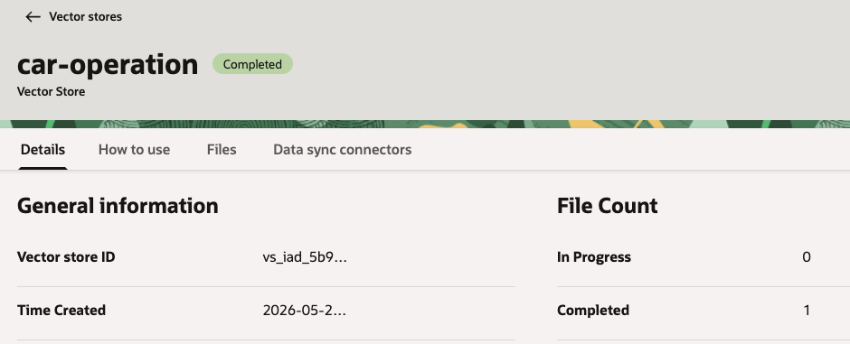

# Unstructured RAG

## Introduction

In this lab, you create the unstructured retrieval source for the Example Motors support agent. Your environment already includes an Object Storage bucket with instructions for Example Motor's infotainment bluetooth pairing guide in PDF format. You will create an OCI Enterprise AI project, create an unstructured vector store, and sync the existing PDF into the vector store. The app will query the vector store using the OCI Enterprise AI Responses API by leveraging the built in `file_search` tool.

Estimated Time: 20 minutes

### Objectives

In this lab, you will:

- Review the sandbox resource list
- Create the OCI Enterprise AI project
- Confirm the existing Object Storage bucket and infotainment pairing guide PDF
- Create an unstructured vector store
- Create and run a data sync connector
- Record the project and vector store OCIDs for the sample app

## Task 1: Review the sandbox resource list

The sandbox environment has already provisioned the OCI foundation resources for this workshop. Create a text file in your favorite editor and copy the following list of parameters into the file.
Update the parameters for which the sandbox environment provided values. You will update the rest of the parameters as you progress through the workshop.

```text
<copy>
Workshop compartment name:
Workshop compartment OCID:
Workshop region:
Object Storage bucket: car-manufacturer-manuals
Autonomous AI Database OCID:
Database user: ADMIN
Vault OCID:
Database Tools enrichment connection OCID:
Database Tools query connection OCID:
ADMIN password secret OCID:

Project OCID:
Unstructured vector store: car-operation
Unstructured vector store OCID:
Structured semantic store OCID:
</copy>
```

## Task 2: Create the OCI Enterprise AI project

OCI Generative AI projects organize conversations and responses under a shared set of settings. In a project, you define data retention periods, enable long-term memory, and enable short-term memory compaction.

When an application makes API requests against the OCI Enterprise AI service's responses/conversations APIs, referencing the project in the API call tells the service to use this the configuration defined in the project for this call.

Each project supports separate lifecycle and compliance boundaries. Reference the project OCID in API and SDK calls to apply project settings at runtime.

1. In the Console navigation menu, go to **Analytics & AI**, then **Generative AI**.

2. Under **Generative AI**, select **Projects**.

    

3. Click **Create project**.

4. Enter the following values:

    ```text
    Name: car-manufacturer
    Description: Example Motors support agent project
    Compartment: <workshop-compartment>
    ```

    Use the workshop compartment from your sandbox resource list.

    

5. Configure response and conversation retention for the workshop.

    Use the console defaults unless your organization requires shorter retention.

    

6. Click **Create**.

7. Open the project, copy the project OCID, and record it as the value for `Project OCID`.

## Task 3: Confirm the vehicle manuals bucket

The sandbox already includes the Object Storage bucket that stores the source document for unstructured retrieval. The data sync connector will read this bucket and ingest the PDF into the vector store.

1. In the Console navigation menu, go to **Storage**, then **Buckets**.

2. Select the workshop compartment from your sandbox resource list.

3. Open the bucket named in your sandbox resource list.

    The default workshop bucket name is `car-manufacturer-manuals`.

    

4. Click the **Objects** tab.

5. Confirm that the bucket contains the infotainment pairing guide PDF.

    

## Task 4: Create the unstructured vector store

The unstructured vector store scans files, splits them into chunks, embeds the chunks for semantic search, and stores the results. The support agent can use the vector store content to answer user questions.

1. In the Console navigation menu, go to **Analytics & AI**, then **Generative AI**.

2. Select **Vector stores**.

    

3. Click **Create vector store**.

4. Enter the following values:

    ```text
    Name: car-operation
    Description: Example Motors infotainment and operation manuals
    ```

    - If you choose a different name for the vector store, update the `Unstructured vector store` value in your notes.
    - Select the workshop compartment from your sandbox resource list.
    - Under **Data source type**, select **Unstructured data**.

    

5. Click **Create**.

6. Wait until the vector store status is `Completed`. The vector store might take a short while to appear on the list.

    

7. Open the vector store details page.

    

8. Copy the vector store ID and record it as the value for `Unstructured vector store OCID`.

## Task 5: Create the data sync connector

The data sync connector facilitates the processing pipeline where files are read from the storage bucket and processed into the vector store. Starting a Data Sync Job in the connector starts the ingestion process.

1. In the vector store, select the **Data sync connectors** tab.

2. Click **Create data sync connector**.

    

3. Data sync connector configuration:

    ```text
    Name: car-manuals
    Compartment: Select the workshop compartment from your sandbox resource list.
    Bucket: Select the bucket from your sandbox resource list. The default workshop bucket name is `car-manufacturer-manuals`.
    Turn Select all in bucket on.
    ```

    

4. Click **Create**.

5. Confirm that the data sync connector appears in the list in an **Active** state.

    

6. Open the data sync connector details page.

    

7. Open the **Data sync** tab.

    

8. Under the **Data Sync Jobs** list, click **Perform Data Sync**.

9. Name the data sync job: `car-manuals`

    

10. Click **Perform**.

11. Wait until the data sync job reaches a **Succeeded** state.

    

12. Return to the vector store details page.

13. Confirm that the completed file count is `1`.

    

At this point, we have populated our vector store with the PDF stored in the Object Storage bucket. The Data Sync Job read the file, broke it into chunks, embedded each chunk for search, and stored the results in the vector store. The service manages this process so your code does not have to.

You may now **proceed to the next lab**.

## Learn More

- [Managing Object Storage buckets](https://docs.oracle.com/en-us/iaas/Content/Object/Tasks/managingbuckets.htm)
- [Uploading objects to Object Storage](https://docs.oracle.com/en-us/iaas/Content/Object/Tasks/managingobjects.htm)
- [OCI Generative AI QuickStart for vector stores and file search](https://docs.oracle.com/en-us/iaas/Content/generative-ai/get-started-agents.htm)

## Acknowledgements

- **Author** - Julien Lehmann - Product Marketing Manager, Yanir Shahak - Senior Principal Software Engineer
