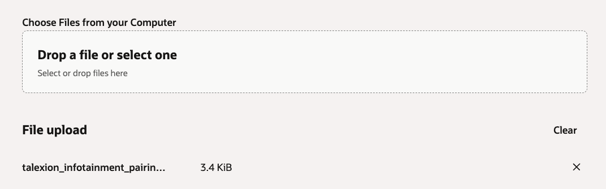
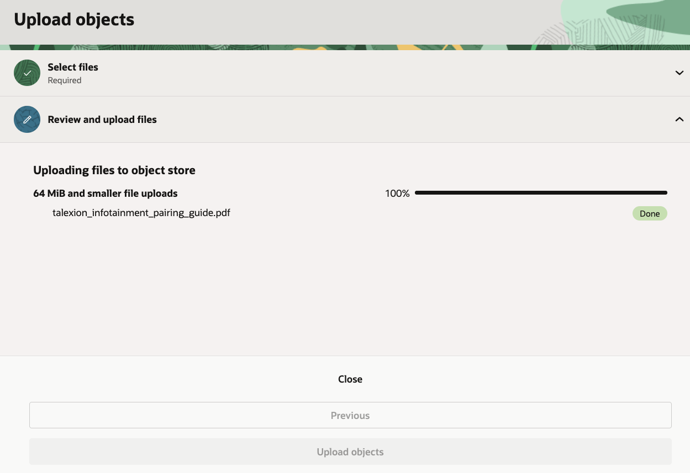
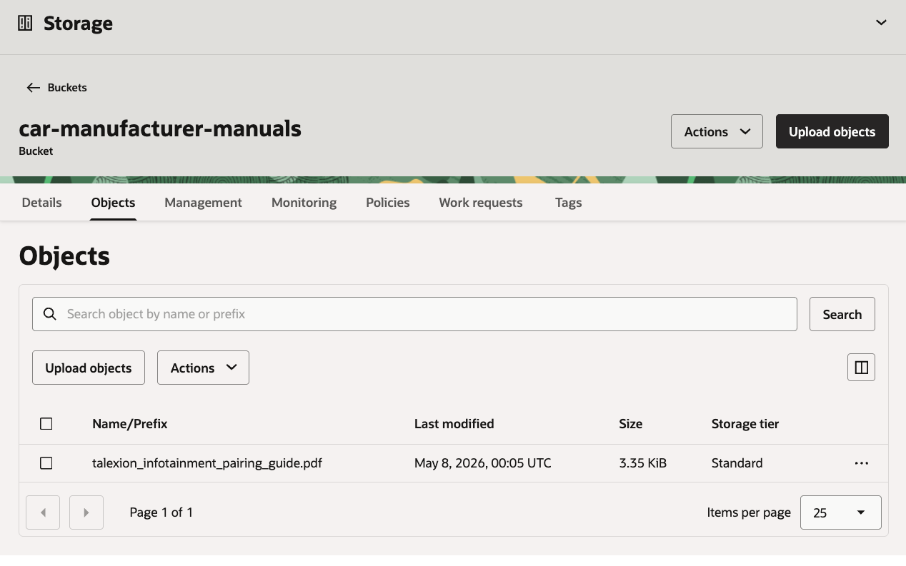
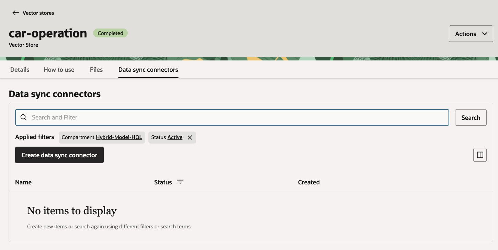
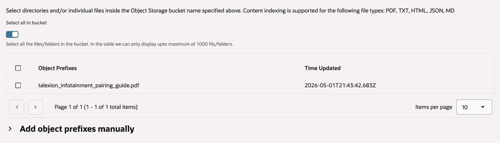
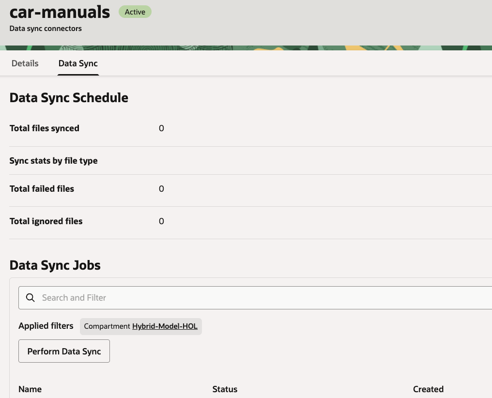

# Unstructured RAG

## Introduction

In this lab, you create the unstructured retrieval source for the Example Motors support agent. You will seed the vector store created in this section with a source document. This PDF document is a mobile bluetooth pairing guide for the Example Motors infotainment system. The app will query the vector store using the OCI Enterprise AI Responses API by leveraging the the built in `file_search` tool.

Estimated Time: 25 minutes

### Objectives

In this lab, you will:

- Create the OCI Enterprise AI project
- Create an Object Storage bucket for storing vehicle manuals
- Upload the infotainment pairing guide PDF
- Create an unstructured vector store
- Create and run a data sync connector
- Record the vector store ID for the sample app

### Prerequisites

This lab assumes you have:

- Completed the Setup lab

## Task 1: Create the OCI Enterprise AI project

OCI Generative AI projects organize conversations and responses under a shared set of settings. In a project, you define how long data is retained, enable long-term memory to persist context across conversations, and enable short-term memory compaction to optimize how conversation history is processed.

Projects are isolated from each other to support lifecycle management and compliance boundaries. Reference the project OCID in API and SDK calls to apply project settings at runtime.

1. In the Console navigation menu, go to **Analytics & AI**, then **Generative AI**.

2. Under **Generative AI**, select **Projects**.

    

3. Click **Create project**.

4. Enter the following values:

    ```text
    Name: car-manufacturer
    Description: Example Motors support agent project
    Compartment: <workshop-compartment>
    ```

    

5. Configure response and conversation retention for the workshop.

    Use the console defaults unless your organization requires shorter retention.

    

6. Click **Create**.

7. Open the project, copy the project OCID and record it in our text file as the value for `Project OCID`.

## Task 2: Create the vehicle manuals bucket

The files we upload to this storage bucket will serve as the content the support agent will be able to search through when the user will ask it questions.

1. In the Console navigation menu, go to **Storage**, then **Buckets**.

2. Select the workshop compartment.

3. Click **Create bucket**.

4. Name the bucket: `car-manufacturer-manuals` (update the text file if you choose a different name).

    

5. Click **Create bucket**.

6. Open the bucket from the bucket list.

    

## Task 3: Upload the infotainment PDF

1. In the `car-manufacturer-manuals` bucket, click **Upload objects**.

2. Upload the PDF file

    - Download the [manual file](./files/talexion-infotainment-pairing-guide.pdf).
    - Drag the file from your **Download** folder to the **Drop a file or select one** section.
    - Click **Next**.

    

3. Review the file upload list.

    

4. Click **Upload objects**.

5. Wait for the upload to complete & click **Close**.

    

6. Confirm that the bucket contains the PDF by clicking the **Objects** tab.

    

## Task 4: Create the unstructured vector store

The unstructured vector store is a managed data store which will scan our files, split them into various chunks (for large files), embed them (which will make semantic search over their content possible) and store this information. The support agent will be able to use the content in the vector store to answer the user's questions.

1. In the Console navigation menu, go to **Analytics & AI**, then **Generative AI**.

2. Select **Vector stores**.

    

3. Click **Create vector store**.

4. Enter the following values:

    ```text
    Name: car-operation
    Description: Example Motors infotainment and operation manuals
    ```

    - If you chose a different name for the vector store, please update the `Unstructured vector store` parameter in our text file.
    - Select the workshop compartment.
    - Under **Data source type** Select **Unstructured data**.

    

5. Click **Create**.

6. Wait until the vector store status is `Completed`.

    

7. Open the vector store details page.

    

8. Copy the vector store ID & update the value for `Unstructured vector store OCID` in the text file.

## Task 5: Create the data sync connector

The data sync connector will facilitate the processing pipeline where files will be read from the storage bucket and processed into the vector store. Starting a Data Sync Job in the connector will kick-start the ingestion process.

1. In the vector store, select the **Data sync connectors** tab.

2. Click **Create data sync connector**.

    

3. Data sync connector configuration:

    - Name: car-manuals
    - Compartment: Select the workshop compartment.
    - Bucket: car-manufacturer-manuals
    - Turn **Select all in bucket** on.

    

4. Click **Create**.

5. Confirm that the data sync connector appears in the list in an **Active** state.

    

6. Open the data sync connector details page.

    

7. Open the **Data sync** tab.

    

8. Under the **Data Sync Jobs** list, click **Perform Data Sync**.

9. Name the data sync job: `car-manuals`

    

10. Click **Perform**.

11. Wait until the data sync job reaches a completed state.

    

12. Return to the vector store details page.

13. Confirm that the file count is `1`.

At this point, we have populated our vector store with the information from the text file uploaded to the storage bucket. The Data Sync Job read the file, broke it into chunks, embedded each chunk so they will be searchable and stored the results in the vector store. All of this is managed by the service so your code doesn't have to.

You may now **proceed to the next lab**.

## Learn More

- [Managing Object Storage buckets](https://docs.oracle.com/en-us/iaas/Content/Object/Tasks/managingbuckets.htm)
- [Uploading objects to Object Storage](https://docs.oracle.com/en-us/iaas/Content/Object/Tasks/managingobjects.htm)
- [OCI Generative AI QuickStart for vector stores and file search](https://docs.oracle.com/en-us/iaas/Content/generative-ai/get-started-agents.htm)

## Acknowledgements

- **Author** - Julien Lehmann - Product Marketing Manager, Yanir Shahak - Senior Principal Software Engineer
