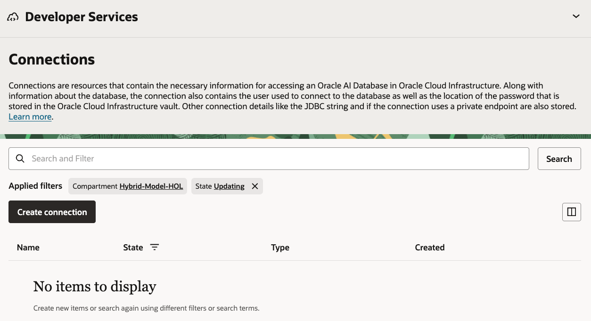
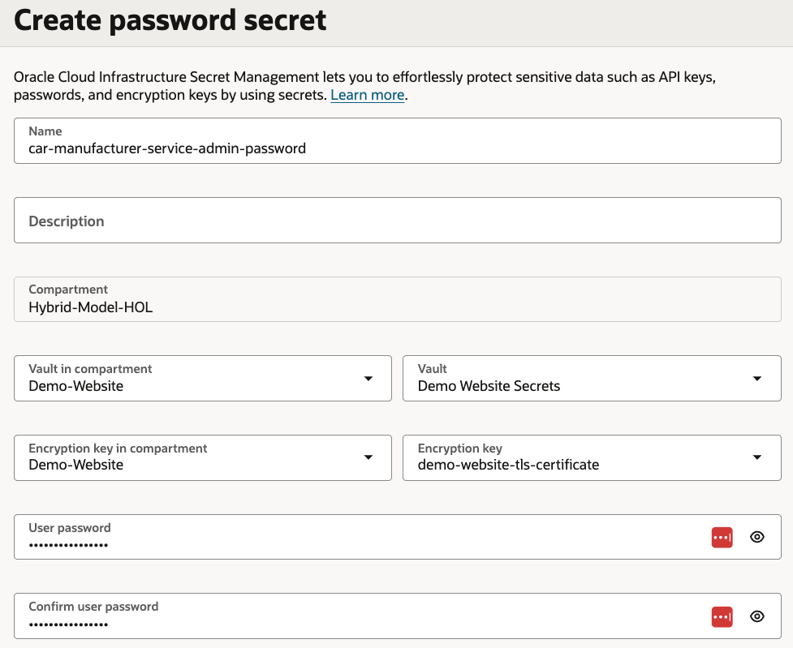
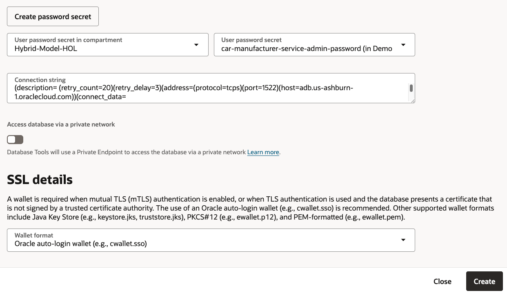
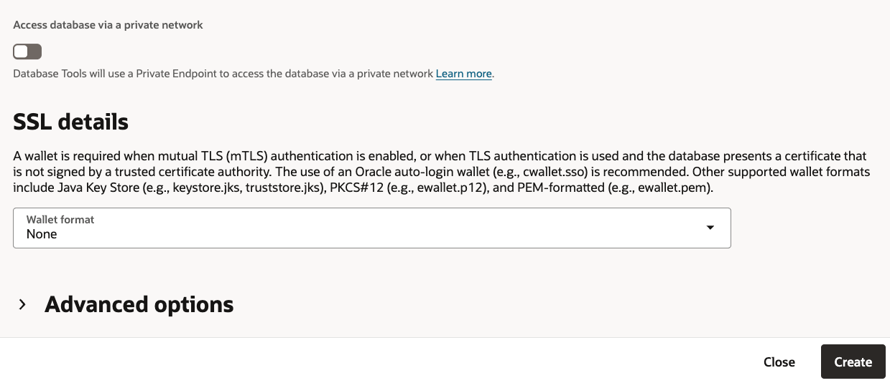
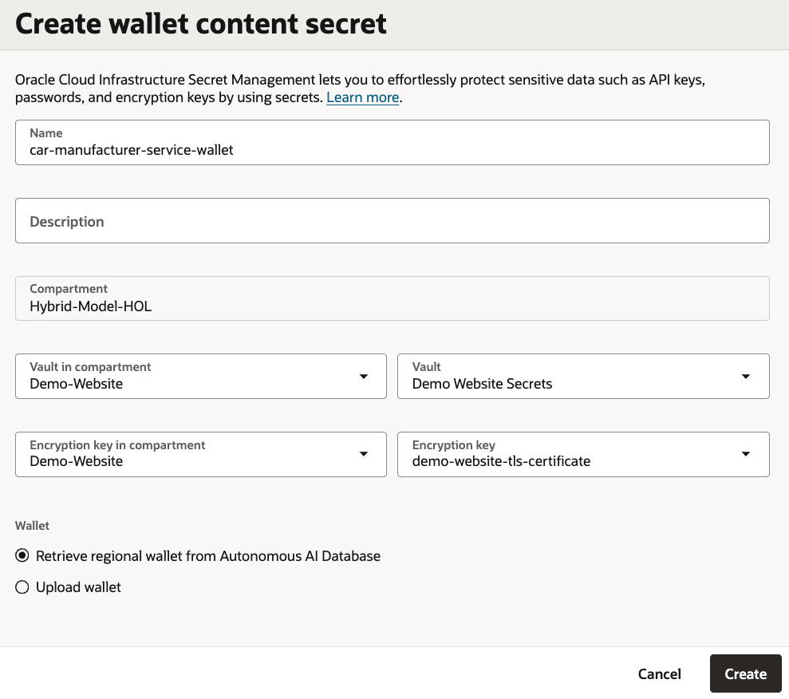
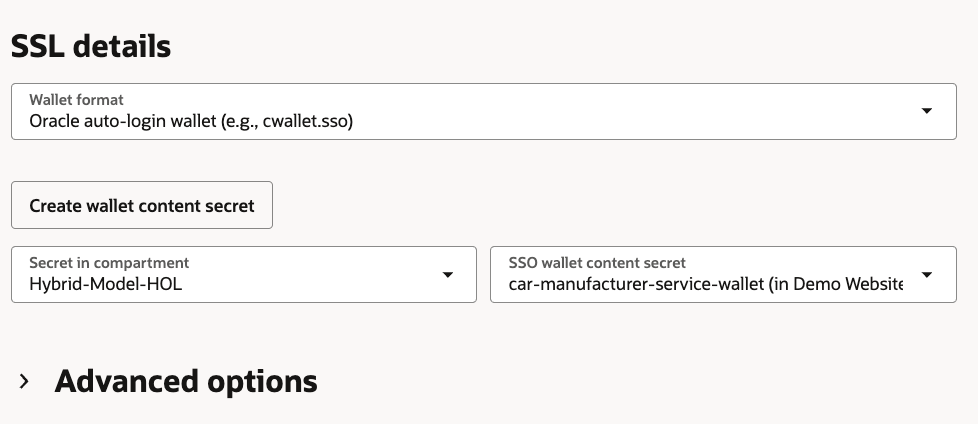
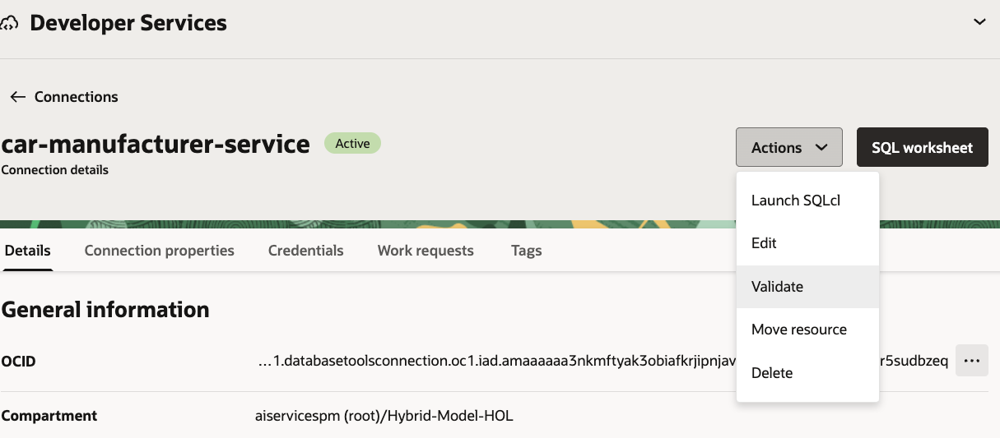
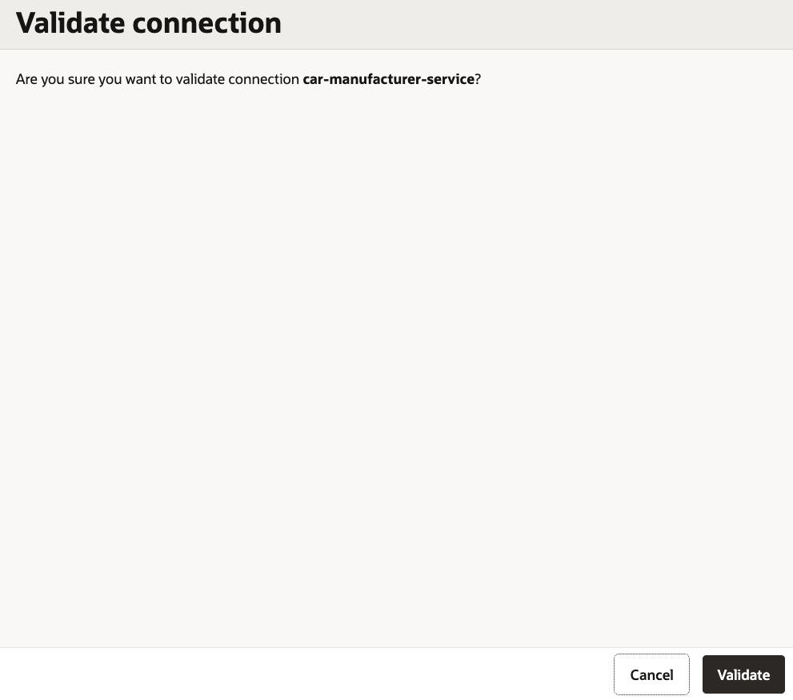
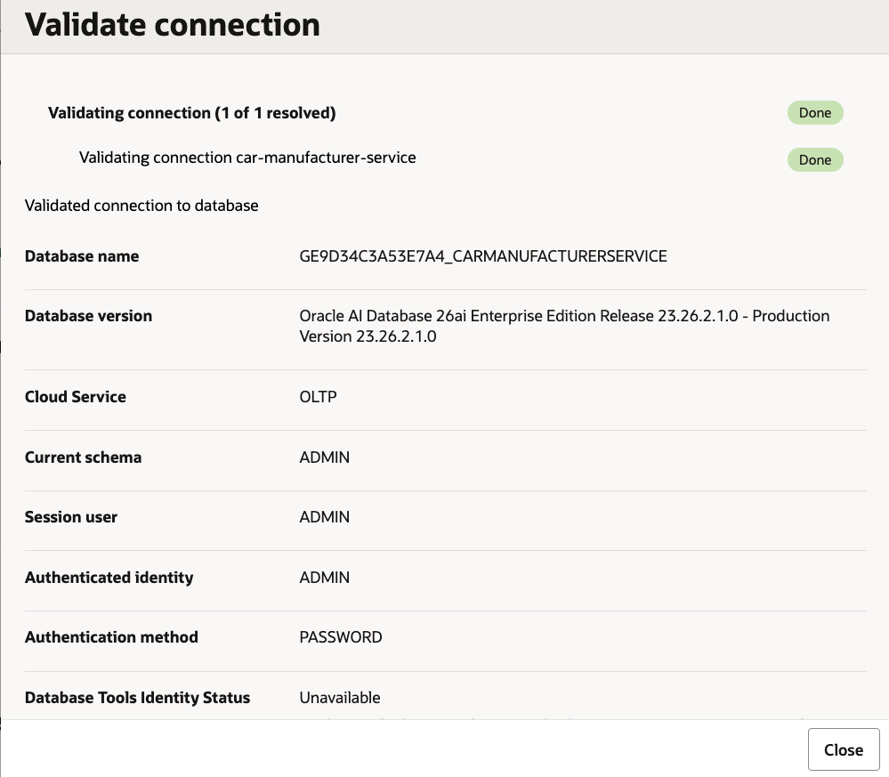
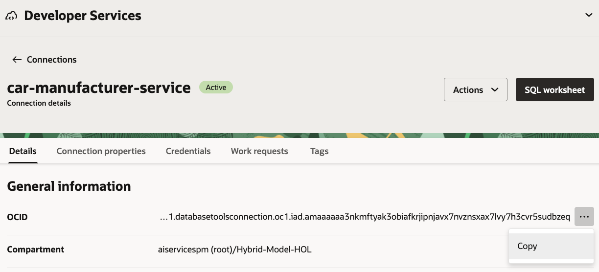

# Database Tools and Vault

## Introduction

In this lab, you store the `ADB_MCP_USER` password in OCI Vault and create Database Tools connections for the structured semantic store. The semantic store uses one connection for enrichment and one for query-time access. The sample app uses the password secret to request an ADB MCP bearer token.

Estimated Time: 20 minutes

### Objectives

In this lab, you will:

- Create a Vault secret for the database user password
- Create a wallet content secret when Database Tools requires one
- Create enrichment and query Database Tools connections
- Validate the connections
- Record the connection OCIDs and password secret OCID

### Prerequisites

This lab assumes you have:

- Completed the Service Database lab
- The `ADB_MCP_USER` database password
- An available Vault and encryption key, or permission to create them

## Task 1: Create the password secret

1. In the Console navigation menu, go to **Developer Services**, then **Database Tools**.

2. Select **Connections**.

    

3. Click **Create connection**.

4. Enter the following values:

    ```text
    Name: car-service-enrichment
    Compartment: <workshop-compartment>
    Database details: Select database
    Database cloud service: Oracle Autonomous AI Database
    Autonomous AI Database: car-service
    Username: ADB_MCP_USER
    ```

    

5. In the password field, click **Create password secret**.

6. Enter the following values:

    ```text
    Name: car-manufacturer-service-adb-password
    Compartment: <workshop-compartment>
    Vault: <workshop-vault>
    Encryption key: <workshop-key>
    User password: <ADB_MCP_USER-password>
    ```

    

7. Confirm the password and click **Create**.

    

8. Record the created secret OCID.

    You will use it later as:

    ```text
    OCI_ADB_MCP_PASSWORD_SECRET_OCID
    ```

## Task 2: Configure connection security

1. Return to the Database Tools connection wizard.

2. Select the password secret you created.

    

3. In **SSL details**, choose the wallet format required by your Autonomous AI Database connection.

    For the workshop, use the Oracle auto-login wallet when prompted.

    

4. If the wizard asks for a wallet content secret, click **Create wallet content secret**.

    

5. Enter the following values:

    ```text
    Name: car-manufacturer-service-wallet
    Compartment: <workshop-compartment>
    Vault: <workshop-vault>
    Encryption key: <workshop-key>
    Wallet source: Retrieve regional wallet from Autonomous AI Database
    ```

    

6. Select the created wallet content secret in the connection wizard.

    

7. Click **Create**.

## Task 3: Validate and record the enrichment connection

1. Open the `car-service-enrichment` connection details page.

2. From **Actions**, select **Validate**.

    

3. Click **Validate**.

    

4. Confirm that the validation result is successful.

    

5. Copy the connection OCID.

    

6. Record it as:

    ```text
    Enrichment connection OCID=<car-service-enrichment connection OCID>
    ```

## Task 4: Create the query connection

1. Create a second Database Tools connection.

2. Use the same database and secret values as the enrichment connection.

3. Enter the following connection name:

    ```text
    car-service-query
    ```

4. Validate the connection.

5. Copy the connection OCID.

6. Record it as:

    ```text
    Query connection OCID=<car-service-query connection OCID>
    ```

7. For this workshop, both connections can use `ADB_MCP_USER`.

    In production, use separate users and privileges for enrichment, query, and MCP execution.

## Task 5: Confirm values for the next labs

1. Confirm that you have these values:

    ```text
    OCI_ADB_MCP_PASSWORD_SECRET_OCID=<password secret OCID>
    Enrichment connection OCID=<car-service-enrichment connection OCID>
    Query connection OCID=<car-service-query connection OCID>
    ```

2. Confirm that your workshop user can read the password secret bundle.

    The sample app reads the current version of the secret at runtime.

You may now **proceed to the next lab**.

## Learn More

- [Database Tools console tasks](https://docs.oracle.com/en-us/iaas/database-tools/doc/using-oracle-cloud-infrastructure-console.html)
- [Create a Vault secret](https://docs.oracle.com/iaas/Content/KeyManagement/Tasks/managingsecrets_topic-To_create_a_new_secret.htm)
- [Vault key management](https://docs.oracle.com/en-us/iaas/Content/KeyManagement/Tasks/managingkeys.htm)

## Acknowledgements

- **Author** - Julien Lehmann, Product Marketing Manager, Yanir Shahak, Senior Principal Software Engineer
