# Sample Application

## Introduction

In this lab, you extract, configure, and run the Example Motors support app on your own computer. The app is a Streamlit chat interface that uses OCI Generative AI Responses API, the unstructured vector store for PDF-based file search, the structured semantic store for NL2SQL, and ADB MCP Server for service-record retrieval.

Estimated Time: 30 minutes

### Objectives

In this lab, you will:

- Extract the sample app archive
- Configure OCI API key authentication
- Configure the sample app environment
- Install Python dependencies
- Run the Streamlit app
- Test the vector store, database retrieval, and image prompts
- Capture the values needed for model optimization

### Prerequisites

This lab assumes you have:

- Completed the Semantic Store lab
- Have python installed on your computer or be able to install it
- Be comfortable with running terminal/command line commands to copy, rename, edit text files, create folders etc.
- Be able to download the zip archive for the sample application, unzip it and run it as a python script
- Be able to install python dependencies with `pip`

## Task 1: Install Python

> **Note:** If your computer already has Python installed and `python3 --version` on Mac or `py -3 --version` on Windows shows a Python version, move to Task 2.

1. Download Python from [python.org/downloads](https://www.python.org/downloads/).

1. Run the installer.

    On Mac, open the downloaded `.pkg` file and complete the installer. It adds `python3` to PATH for new terminal windows.

    On Windows, select **Add python.exe to PATH**, click **Customize installation**, keep the defaults, click **Next**, select **Install Python for all users** and **Add Python to environment variables**, then click **Install**.

1. Open a new terminal or PowerShell window and verify Python.

    On Mac:

    ```bash
    <copy>
    python3 --version
    </copy>
    ```

    On Windows PowerShell:

    ```powershell
    <copy>
    py -3 --version
    </copy>
    ```

## Task 2: Extract the sample application

1. Download [sample-app.zip](files/sample-app.zip).

1. Open a terminal window.

    On Mac:

    - Command + Spacebar
    - Type terminal
    - Press Return.

    On Windows:

    - Press the Windows Key
    - Type PowerShell
    - Press Enter.

1. In the terminal, go to the directory where you downloaded `sample-app.zip` (typically `Downloads`).

    On Mac:

    ```bash
    <copy>
    cd ~/Downloads
    </copy>
    ```

    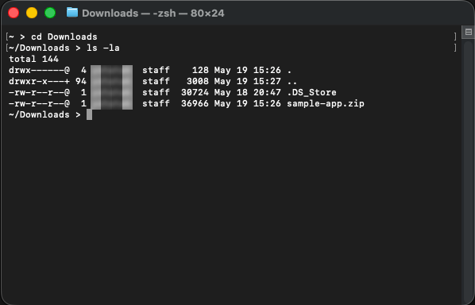

    On Windows:

    ```powershell
    <copy>
    cd $HOME\Downloads
    </copy>
    ```

    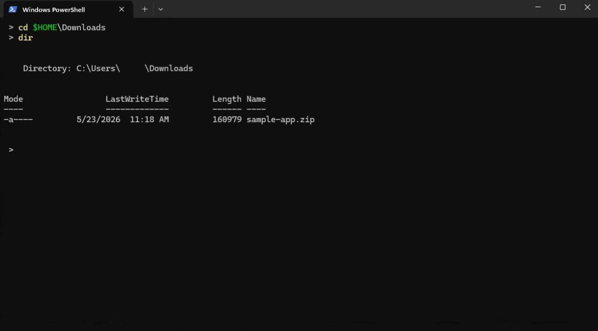

1. Extract the sample application archive.

    On Mac:

    ```bash
    <copy>
    unzip sample-app.zip
    </copy>
    ```

    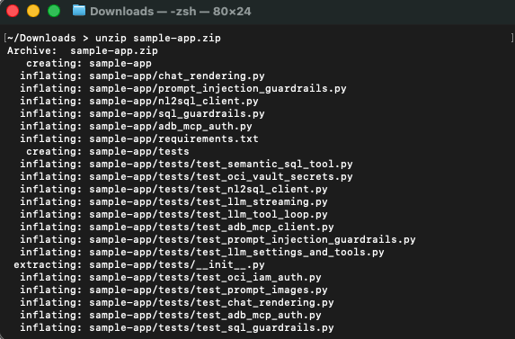

    On Windows PowerShell:

    ```powershell
    <copy>
    Expand-Archive -Path .\sample-app.zip -DestinationPath . -Force
    </copy>
    ```

    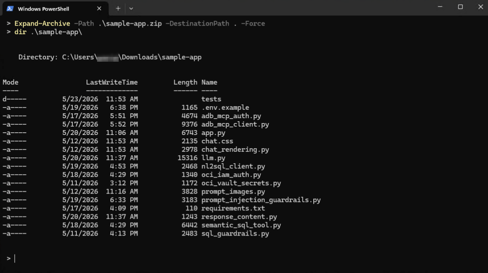

1. Confirm that the extraction created the `sample-app` directory.

    On Mac:

    ```bash
    <copy>
    ls sample-app
    </copy>
    ```

    On Windows PowerShell:

    ```powershell
    <copy>
    Get-ChildItem .\sample-app
    </copy>
    ```

## Task 3: Configure OCI API key authentication

1. Make sure to select the region you've been using up until now.

1. In the OCI Console, open the **Profile** menu (on the top right), then click your user name.

    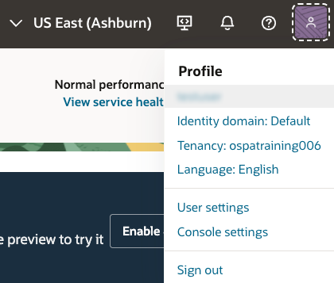

1. Select the **Tokens and keys** tab.

1. Under API keys click **Add API key**.

    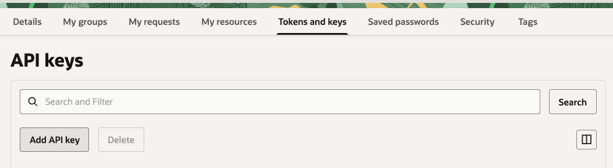

1. Select **Generate API key pair**.

1. Click **Download private key** and save the private key file.

    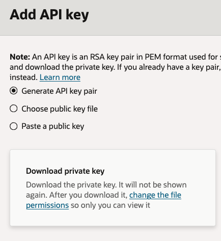

1. Click **Add**.

1. Copy the generated configuration file preview. Save this information in your notes.

    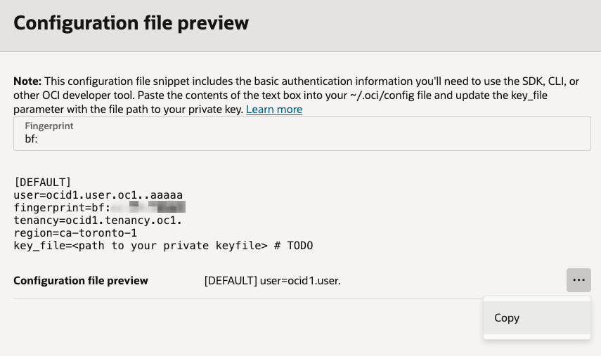

1. Back in the terminal screen, create the `.oci` directory.

    > **Note:** If you already have an `.oci` folder and a `config` file in it, then you can re-use this file. Skip the creation steps and jump to the part where we update the file. Keep the updates at the end of the file so you do not overwrite the existing configuration.

    On Mac:

    ```bash
    <copy>
    mkdir -p ~/.oci
    </copy>
    ```

    On Windows PowerShell:

    ```powershell
    <copy>
    New-Item -ItemType Directory -Force $HOME\.oci
    </copy>
    ```

    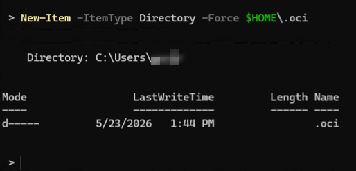

1. Move the downloaded private key into the `.oci` directory and name it `oci_hybrid_hol_api_key.pem`.

    On Mac, replace `<downloaded-private-key-file>` with the path to the downloaded key. It is typically similar to `~/Downloads/<username>-<date-and-time>.pem`.

    ```bash
    <copy>
    mv <downloaded-private-key-file> ~/.oci/oci_hybrid_hol_api_key.pem
    chmod 600 ~/.oci/oci_hybrid_hol_api_key.pem
    </copy>
    ```

    On Windows PowerShell, replace `<downloaded-private-key-file>` with downloaded key file name. It is typically similar to `<user-name>-<date-time>.key`.

    ```powershell
    <copy>
    Move-Item $HOME\Downloads\<downloaded-private-key-file> $HOME\.oci\oci_hybrid_hol_api_key.pem
    </copy>
    ```

1. Open the OCI config file. You can use your favorite text editor or `nano` for Mac and `Notepad` for Windows as described below.

    As mentioned above, if this file already exists, scroll down past all of the existing values and take care not to change or overwrite anything existing in the file.

    On Mac:

    ```bash
    <copy>
    nano ~/.oci/config
    </copy>
    ```

    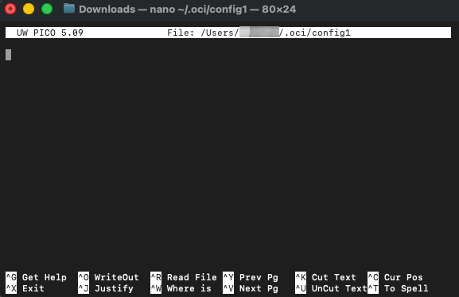

    Example of a pre-existing file:

    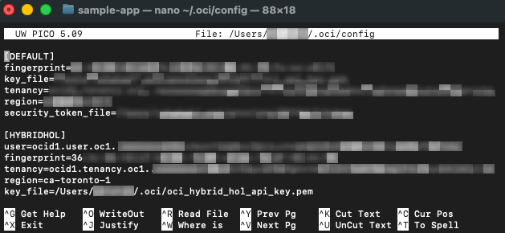

    On Windows PowerShell:

    ```powershell
    <copy>
    notepad $HOME\.oci\config.
    </copy>
    ```

    > **Note:** Please pay attention to the dot at the end of the file name! If we didn't add it at the end of the file name, Notepad would create a file called config.txt by default. Also, if notepad is asking if you wish to create a new file, click **Yes**.

1. Paste the configuration file preview into the file. If you already have content in the file, paste the new configuration at the end of the file. In addition, if you already have a `DEFAULT` profile in this file, rename this new profile, for example to: `[HYBRIDHOL]`, and remember to change the profile name in the app `.env` file.

    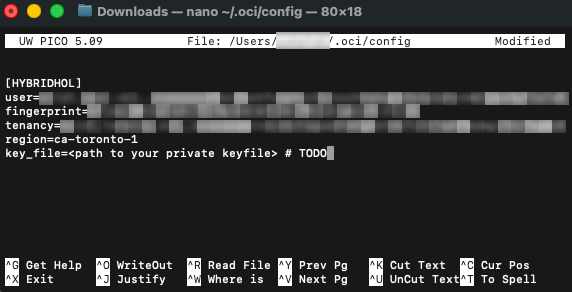

    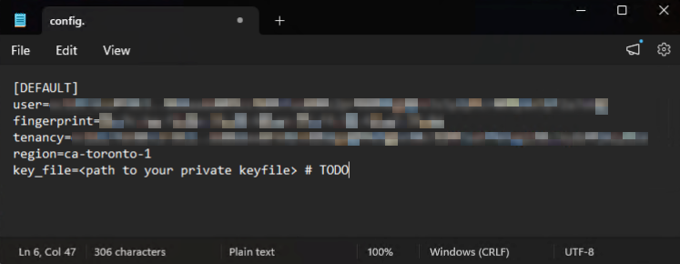

1. Update the `key_file` line to point to the API private key we've downloaded and moved to the `.oci` folder. In the `key_file` value, specify the full path of your home folder. Do not use shortcuts such as `~` on Mac or `$HOME`, `%USERPROFILE%`, or other environment variables on Windows.

    If you don't know your home directory, run these commands in the terminal, then use the printed path when you edit the `key_file` value.

    On Mac:

    ```text
    cd ~
    pwd
    ```

    On Windows:

    ```text
    cd $HOME
    pwd
    ```

    Specify the full path to the API private key file:

    On Mac:

    ```text
    <copy>
    key_file=/Users/<user-name>/.oci/oci_hybrid_hol_api_key.pem
    </copy>
    ```

    On Windows:

    ```text
    <copy>
    key_file=C:\Users\<user-name>\.oci\oci_hybrid_hol_api_key.pem
    </copy>
    ```

    > **Note:** Please make sure to remove the `# TODO` comment from the `key_file` line if it was left there.

1. Save the file.

    On Mac:

    - Ctrl + X
    - Answer the questions with: Y for Yes
    - Press Return

    On Windows:

    - Ctrl + S

1. Confirm that the config file exists.

    On Mac:

    ```bash
    <copy>
    ls ~/.oci/config ~/.oci/oci_hybrid_hol_api_key.pem
    </copy>
    ```

    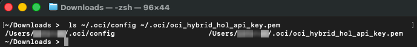

    On Windows PowerShell:

    ```powershell
    <copy>
    Get-ChildItem $HOME\.oci\config, $HOME\.oci\oci_hybrid_hol_api_key.pem
    </copy>
    ```

    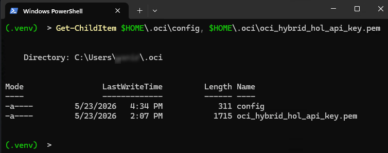

## Task 4: Create the app environment file

1. Change into the app directory.

    On Mac:

    ```bash
    <copy>
    cd sample-app
    </copy>
    ```

    On Windows PowerShell:

    ```powershell
    <copy>
    Set-Location .\sample-app
    </copy>
    ```

2. Rename the environment template to `.env`.

    On Mac:

    ```bash
    <copy>
    mv .env.example .env
    </copy>
    ```

    On Windows PowerShell:

    ```powershell
    <copy>
    Rename-Item .env.example .env
    </copy>
    ```

3. Open the parameter text file you updated throughout the previous labs.

4. Open `.env` in your editor, either `nano` for Mac or `notepad` for Windows.

5. Replace the blank OCID values in `.env` with the values from your parameter text file.

    ```text
    <copy>
    OCI_GENAI_GUARDRAILS_COMPARTMENT_OCID=<Workshop compartment OCID>
    OCI_GENAI_PROJECT_OCID=<Project OCID>
    OCI_GENAI_VECTOR_STORE_IDS=<Unstructured vector store OCID>
    OCI_ADB_DATABASE_OCID=<Autonomous AI Database OCID>
    OCI_ADB_MCP_PASSWORD_SECRET_OCID=<ADMIN password secret OCID>
    OCI_GENAI_SEMANTIC_STORE_OCID=<Structured semantic store OCID>
    </copy>
    ```

6. Set each region value to the `Workshop region` value from your parameter text file.

    ```text
    <copy>
    OCI_ADB_MCP_REGION=<Workshop region>
    OCI_ADB_MCP_PASSWORD_SECRET_REGION=<Workshop region>
    OCI_GENAI_REGION=<Workshop region>
    </copy>
    ```

7. Set the OCI config path and profile. Update the `OCI_CONFIG_PROFILE` if you changed it from `DEFAULT`. In the `OCI_CONFIG_FILE` value, use the absolute path of your home directory. Do not use shortcuts such as `~` on Mac or `$HOME`, `%USERPROFILE%`, or other environment variables on Windows.

    On Mac:

    If you don't know your home directory, run these commands in the terminal, then append `/.oci/config` to the printed path.

    ```text
    cd ~
    pwd
    ```

    ```text
    OCI_CONFIG_FILE=/Users/<user-name>/.oci/config
    OCI_CONFIG_PROFILE=DEFAULT
    ```

    On Windows:

    If you don't know your home directory, run these commands in PowerShell, then append `\.oci\config` to the printed path.

    ```text
    cd $HOME
    pwd
    ```

    ```text
    OCI_CONFIG_FILE=C:\Users\<user-name>\.oci\config
    OCI_CONFIG_PROFILE=DEFAULT
    ```

8. Keep the advanced defaults unless your workshop region requires different model IDs.

    If your selected workshop region does not support the default model IDs, update these two values to models available in that region:

    ```text
    <copy>
    OCI_GENAI_MODEL=<vision-capable model available in your workshop region>
    OCI_GENAI_CHEAPER_MODEL=<fast text model available in your workshop region>
    </copy>
    ```

    End result on Mac:

    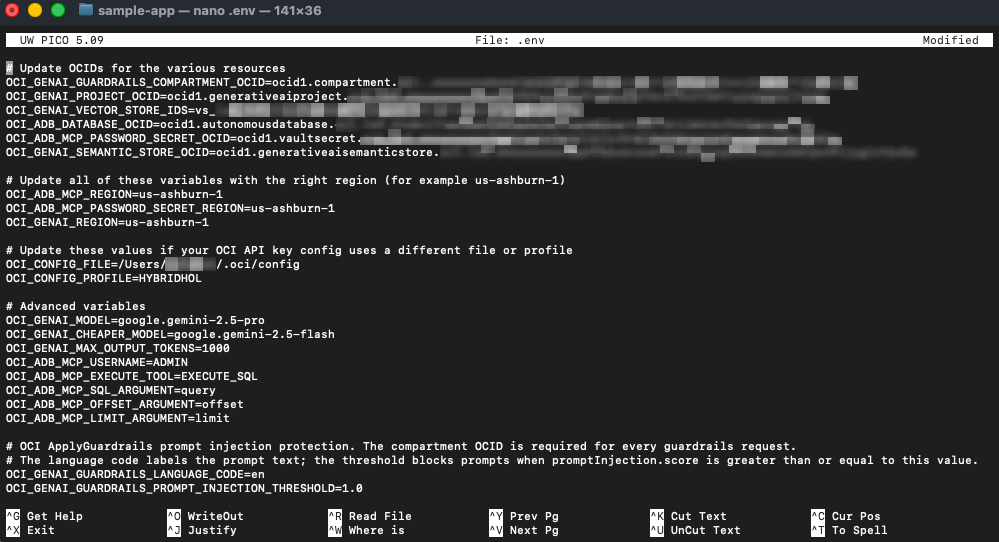

    End result on Windows:

    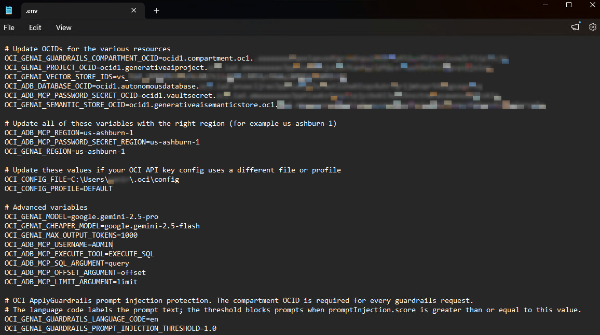

9. Save `.env` and exit the file editor.

## Task 5: Install dependencies

1. Create a Python virtual environment.

    > **Note:** Make sure that you are in the `sample-app` folder.

    On Mac:

    ```bash
    <copy>
    python3 -m venv .venv
    </copy>
    ```

    On Windows PowerShell:

    ```powershell
    <copy>
    py -3 -m venv .venv
    </copy>
    ```

2. Activate the environment.

    On Mac:

    ```bash
    <copy>
    source .venv/bin/activate
    </copy>
    ```

    On Windows PowerShell:

    ```powershell
    <copy>
    .\.venv\Scripts\Activate.ps1
    </copy>
    ```

    If PowerShell blocks script activation, run this command in the same PowerShell window and activate the environment again:

    ```powershell
    <copy>
    Set-ExecutionPolicy -Scope Process -ExecutionPolicy Bypass
    </copy>
    ```

    On Mac:

    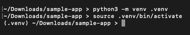

    Windows:

    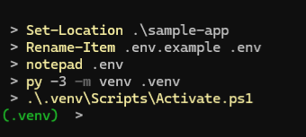

3. Install the dependencies.

    ```bash
    <copy>
    pip install -r requirements.txt
    </copy>
    ```

## Task 6: Run the app

1. Start Streamlit.

    > **Note:** If Streamlit is asking for an email address, just press Return/Enter to skip it.

    ```bash
    <copy>
    streamlit run app.py
    </copy>
    ```

2. If Streamlit does not automatically open your default browser to show the sample app, leave the terminal running and open the local URL shown by Streamlit.

3. You should see the sample application UI:

    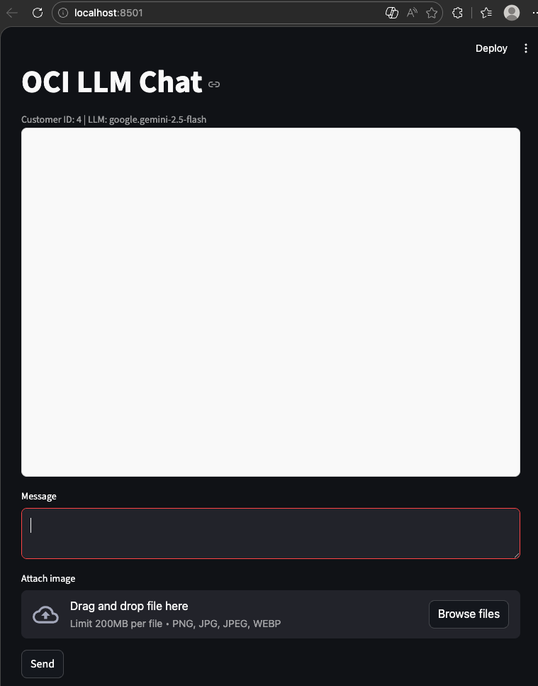

4. Note the displayed `Customer ID`.

    The app randomly assigns a customer ID from `1` through `10` for each Streamlit session. The app scopes database questions to this customer.

## Task 7: Test the unstructured vector store

1. Ask this question:

    ```text
    <copy>
    How do I pair my phone with the Example Motors infotainment system?
    </copy>
    ```

2. Confirm that the app answers from the infotainment pairing guide.

    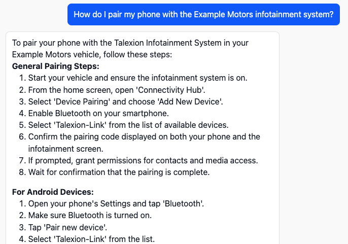

3. If the app says it does not have enough information, verify:

    - The `OCI_GENAI_VECTOR_STORE_IDS` variable value in `.env`
    - Data sync job status
    - Vector store file count

4. Notice the steps the application took to generate the response as described in the terminal.

    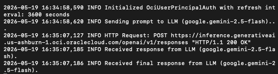

## Task 8: Test service-record retrieval

1. Ask this question:

    ```text
    <copy>
    What service appointments do you have for my vehicle, and how much did I pay?
    </copy>
    ```

2. Watch the assistant status messages. Review the output in the terminal as it will outline the entire chain of tools the application is using to generate the response.

    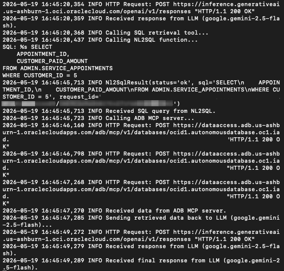

3. If SQL retrieval fails, verify:

    ```text
    <copy>
    OCI_CONFIG_FILE
    OCI_CONFIG_PROFILE
    OCI_GENAI_SEMANTIC_STORE_OCID
    OCI_ADB_DATABASE_OCID
    OCI_ADB_MCP_USERNAME
    OCI_ADB_MCP_PASSWORD_SECRET_OCID
    </copy>
    ```

## Task 9: Test an image prompt

1. Save the [sample service receipt image](/8-model-optimization/files/example-motors-service-receipt.png) to your computer (usually done with Cmd + S on Mac or Ctrl + S on Windows).

1. In the chat input, attach the downloaded image and add the following prompt:

    ```text
    <copy>
    Summarize the service receipt in this image.
    </copy>
    ```

    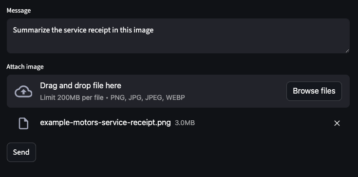

1. Confirm that the app responds using the image contents.

At this stage we have a running sample application which touches every part of our architecture. It queries our Unstructured Vector Store to retrieve information from our operation manuals, queries our database using the Semantic Store and the ADB MCP, and interacts with the LLM managed by the OCI Enterprise AI service.

You may now **proceed to the next lab**.

## Learn More

- [OCI Generative AI QuickStart for Responses API](https://docs.oracle.com/en-us/iaas/Content/generative-ai/get-started-agents.htm)
- [Required keys and OCIDs](https://docs.oracle.com/en-us/iaas/Content/API/Concepts/apisigningkey.htm)
- [Streamlit documentation](https://docs.streamlit.io/)

## Acknowledgements

- **Author** - Julien Lehmann, Product Marketing Manager, Yanir Shahak, Senior Principal Software Engineer
