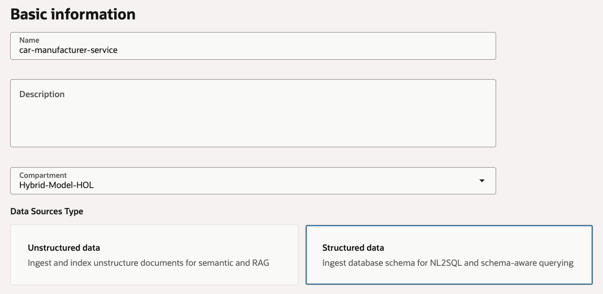
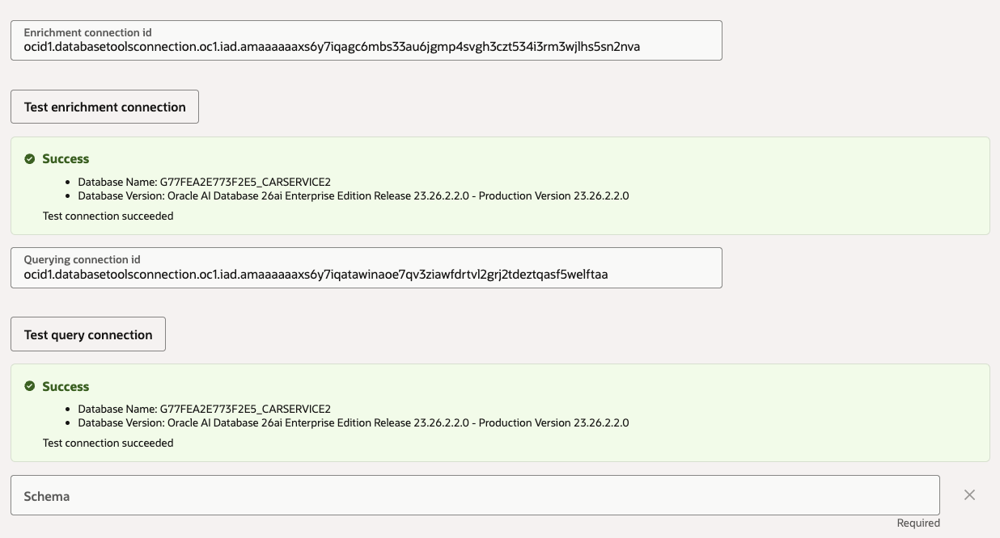

# Semantic Store

## Introduction

In this lab, you create the structured semantic store for service appointment questions. The semantic store connects OCI Enterprise AI to the Autonomous AI Database through the Database Tools connections we created in the previous lab. The sample app sends customer-scoped natural language questions to the NL2SQL API for this semantic store, validates the generated SQL, and executes it through the ADB MCP Server.

Estimated Time: 20 minutes

### Objectives

In this lab, you will:

- Create a structured semantic store
- Connect the semantic store to the service database
- Run the semantic enrichment
- Record the semantic store OCID for the sample app

### Prerequisites

This lab assumes you have:

- Completed the Database Tools and Vault lab

## Task 1: Create the structured semantic store

1. In the Console navigation menu, go to **Analytics & AI**, then **Generative AI**.

1. Select **Vector stores**.

1. Select the workshop compartment.

1. Click **Create vector store**.

1. Enter the following values:

    ```text
    <copy>
    Name: car-manufacturer-service
    Description: Example Motors service appointment semantic store
    Compartment: <workshop-compartment>
    Data source type: Structured data
    Connection type: OCI Database too
    </copy>
    ```

    

    ```text
    <copy>
    Connection type: OCI Database tool
    Enrichment connection ID: The value for "Database Tools enrichment connection OCID" from our text file
    Querying connection id: The value for "Database Tools query connection OCID" from our text file
    Schema: ADMIN
    Automation: On create
    </copy>
    ```

1. Click **Test enrichment connection** to make sure the semantic store can use the connection to connect to the database.

1. Click **Test query connection** to make sure the semantic store can use the connection to connect to the database.

    

1. Click **Create**.

1. Wait for the `car-manufacturer-service` semantic store to be at the `Active` state.

1. Copy the semantic store OCID and save it as the value for `Structured semantic store OCID` in the text file.

You may now **proceed to the next lab**.

## Learn More

- [OCI Generative AI QuickStart for semantic stores and NL2SQL](https://docs.oracle.com/en-us/iaas/Content/generative-ai/get-started-agents.htm)
- [Database Tools console tasks](https://docs.oracle.com/en-us/iaas/database-tools/doc/using-oracle-cloud-infrastructure-console.html)

## Acknowledgements

- **Author** - Julien Lehmann - Product Marketing Manager, Yanir Shahak - Senior Principal Software Engineer
