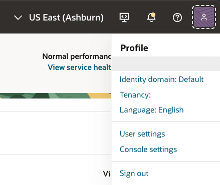

# Sample Application

## Introduction

In this lab, you extract, configure, and run the Example Motors support app on your own computer. The app is a Streamlit chat interface that uses OCI Generative AI Responses API, the unstructured vector store for PDF-based file search, the structured semantic store for NL2SQL, and ADB MCP Server for service-record retrieval.

Estimated Time: 30 minutes

### Objectives

In this lab, you will:

- Extract the sample app archive
- Configure OCI API key authentication
- Configure the sample app environment
- Install Python dependencies
- Run the Streamlit app
- Test PDF retrieval, database retrieval, and image prompts
- Capture the values needed for model optimization

### Prerequisites

This lab assumes you have:

- Completed the Semantic Store lab

## Task 1: Extract the sample application

1. Download [sample-app.zip](files/sample-app.zip).

1. Open a terminal in the directory where you downloaded `sample-app.zip` (typically `Downloads`).

1. Extract the sample application archive.

    On Mac:

    ```bash
    <copy>
    unzip sample-app.zip
    </copy>
    ```

    On Windows PowerShell:

    ```powershell
    <copy>
    Expand-Archive -Path .\sample-app.zip -DestinationPath . -Force
    </copy>
    ```

1. Confirm that the extraction created the `sample-app` directory.

    On Mac:

    ```bash
    <copy>
    ls sample-app
    </copy>
    ```

    On Windows PowerShell:

    ```powershell
    <copy>
    Get-ChildItem .\sample-app
    </copy>
    ```

## Task 2: Configure OCI API key authentication

1. In the OCI Console, open the **Profile** menu (on the top right), then click your user name.

    

1. Select the **Tokens and keys** tab.

1. Under API keys click **Add API key**

1. Select **Generate API key pair**.

1. Click **Download private key** and save the private key file.

1. Click **Add**.

1. Copy the generated configuration file preview. You can save it in your text file.

    > **Note:** If you already have an `.oci` folder and a `config` file in it, then yo you don't have to create the file. Skip the creation steps and jump to the part where we update the file. Keep the updates at the end of the file as not to overwrite the existing configuration.

1. Back in the terminal screen, create the `.oci` directory.

    On Mac:

    ```bash
    <copy>
    mkdir -p ~/.oci
    </copy>
    ```

    On Windows PowerShell:

    ```powershell
    <copy>
    New-Item -ItemType Directory -Force $HOME\.oci
    </copy>
    ```

1. Move the downloaded private key into the `.oci` directory and name it `oci_api_key.pem`.

    On Mac, replace `<downloaded-private-key-file>` with the path to the downloaded key (typically would be similar to: `~/Downloads/<username>-<date and time>.pem`):

    ```bash
    <copy>
    mv <downloaded-private-key-file> ~/.oci/oci_api_key.pem
    chmod 600 ~/.oci/oci_api_key.pem
    </copy>
    ```

    On Windows PowerShell, replace `<downloaded-private-key-file>` with the path to the downloaded key (typically would be similar to: `C:\Users\<user name>\Downloads\api-key-date.key`):

    ```powershell
    <copy>
    Move-Item <downloaded-private-key-file> $HOME\.oci\oci_api_key.pem
    </copy>
    ```

1. Open the OCI config file.

    On Mac:

    ```bash
    <copy>
    nano ~/.oci/config
    </copy>
    ```

    On Windows PowerShell:

    ```powershell
    <copy>
    notepad $HOME\.oci\config
    </copy>
    ```

1. Paste the configuration file preview into the file (if you already have content in the file, make sure to paste the new configuration at the end of the file).

1. Update the `key_file` line to point to the private key you saved.

    On Mac:

    ```text
    <copy>
    key_file=/Users/<your-user-name>/.oci/oci_api_key.pem
    </copy>
    ```

    On Windows:

    ```text
    <copy>
    key_file=C:\Users\<your-user-name>\.oci\oci_api_key.pem
    </copy>
    ```

1. Save the file.

1. Confirm that the config file exists.

    On Mac:

    ```bash
    <copy>
    ls ~/.oci/config ~/.oci/oci_api_key.pem
    </copy>
    ```

    On Windows PowerShell:

    ```powershell
    <copy>
    Get-ChildItem $HOME\.oci\config, $HOME\.oci\oci_api_key.pem
    </copy>
    ```

## Task 3: Create the app environment file

1. Change into the app directory.

    On Mac:

    ```bash
    <copy>
    cd sample-app
    </copy>
    ```

    On Windows PowerShell:

    ```powershell
    <copy>
    Set-Location .\sample-app
    </copy>
    ```

2. Rename the environment template to `.env`.

    On Mac:

    ```bash
    <copy>
    mv .env.example .env
    </copy>
    ```

    On Windows PowerShell:

    ```powershell
    <copy>
    Rename-Item .env.example .env
    </copy>
    ```

3. Open the parameter text file you updated throughout the previous labs.

4. Open `.env` in your editor.

5. Replace the blank OCID values in `.env` with the values from your parameter text file.

    ```text
    <copy>
    OCI_GENAI_PROJECT_OCID=<Project OCID>
    OCI_GENAI_VECTOR_STORE_IDS=<Unstructured vector store OCID>
    OCI_ADB_DATABASE_OCID=<Autonomous AI Database OCID>
    OCI_ADB_MCP_PASSWORD_SECRET_OCID=<ADMIN password secret OCID>
    OCI_GENAI_SEMANTIC_STORE_OCID=<Structured semantic store OCID>
    </copy>
    ```

6. Set each region value to the `Workshop region` value from your parameter text file.

    ```text
    <copy>
    OCI_ADB_MCP_REGION=<Workshop region>
    OCI_ADB_MCP_PASSWORD_SECRET_REGION=<Workshop region>
    OCI_GENAI_REGION=<Workshop region>
    </copy>
    ```

7. Set the OCI config path and profile.

    On Mac:

    ```text
    <copy>
    OCI_CONFIG_FILE=~/.oci/config
    OCI_CONFIG_PROFILE=DEFAULT
    </copy>
    ```

    On Windows:

    ```text
    <copy>
    OCI_CONFIG_FILE=C:\Users\<your-user-name>\.oci\config
    OCI_CONFIG_PROFILE=DEFAULT
    </copy>
    ```

8. Keep the advanced defaults unless your workshop region requires different model IDs.

    If your selected workshop region does not support the default model IDs, update these two values to models available in that region:

    ```text
    <copy>
    OCI_GENAI_MODEL=<vision-capable model available in your workshop region>
    OCI_GENAI_CHEAPER_MODEL=<fast text model available in your workshop region>
    </copy>
    ```

9. Save `.env`.

## Task 4: Install dependencies

1. Create a Python virtual environment.

    > **Note:** Please make sure that you are in the `sample-app` folder.

    On Mac:

    ```bash
    <copy>
    python3 -m venv .venv
    </copy>
    ```

    On Windows PowerShell:

    ```powershell
    <copy>
    py -3 -m venv .venv
    </copy>
    ```

2. Activate the environment.

    On Mac:

    ```bash
    <copy>
    source .venv/bin/activate
    </copy>
    ```

    On Windows PowerShell:

    ```powershell
    <copy>
    .\.venv\Scripts\Activate.ps1
    </copy>
    ```

    If PowerShell blocks script activation, run this command in the same PowerShell window and activate the environment again:

    ```powershell
    <copy>
    Set-ExecutionPolicy -Scope Process -ExecutionPolicy Bypass
    </copy>
    ```

3. Install the dependencies.

    ```bash
    <copy>
    pip install -r requirements.txt
    </copy>
    ```

## Task 5: Run the app

1. Start Streamlit.

    ```bash
    <copy>
    streamlit run app.py
    </copy>
    ```

2. Leave the terminal running and open the local URL shown by Streamlit.

3. Confirm that the page title is:

    ```text
    <copy>
    OCI LLM Chat
    </copy>
    ```

4. Note the displayed `Customer ID`.

    The app randomly assigns a customer ID from `1` through `10` for each Streamlit session. The app scopes database questions to this customer.

## Task 6: Test PDF retrieval

1. Ask this question:

    ```text
    <copy>
    How do I pair my phone with the Example Motors infotainment system?
    </copy>
    ```

2. Confirm that the app answers from the infotainment pairing guide.

3. If the app says it does not have enough information, verify:

    ```text
    <copy>
    OCI_GENAI_VECTOR_STORE_IDS
    Data sync job status
    Vector store file count
    </copy>
    ```

## Task 7: Test service-record retrieval

1. Ask this question:

    ```text
    <copy>
    What service appointments do you have for my vehicle, and how much did I pay?
    </copy>
    ```

2. Watch the assistant status messages.

    You should see the app call the SQL retrieval path:

    ```text
    <copy>
    Calling SQL retrieval tool...
    Calling NL2SQL function...
    Calling ADB MCP server...
    </copy>
    ```

3. Confirm that the answer includes only records for the displayed customer ID.

4. If SQL retrieval fails, verify:

    ```text
    <copy>
    OCI_CONFIG_FILE
    OCI_CONFIG_PROFILE
    OCI_GENAI_SEMANTIC_STORE_OCID
    OCI_ADB_DATABASE_OCID
    OCI_ADB_MCP_USERNAME
    OCI_ADB_MCP_PASSWORD_SECRET_OCID
    OCI_ADB_MCP_EXECUTE_TOOL
    </copy>
    ```

## Task 8: Test an image prompt

1. Download the [sample service receipt image](./files/example-motors-service-receipt.png).

1. In the chat input, attach this image from the repository:

1. Ask this question:

    ```text
    <copy>
    Summarize the service receipt in this image.
    </copy>
    ```

1. Confirm that the app responds using the image contents.

You may now **proceed to the next lab**.

## Learn More

- [OCI Generative AI QuickStart for Responses API](https://docs.oracle.com/en-us/iaas/Content/generative-ai/get-started-agents.htm)
- [Required keys and OCIDs](https://docs.oracle.com/en-us/iaas/Content/API/Concepts/apisigningkey.htm)
- [Streamlit documentation](https://docs.streamlit.io/)

## Acknowledgements

- **Author** - Julien Lehmann, Product Marketing Manager, Yanir Shahak, Senior Principal Software Engineer
