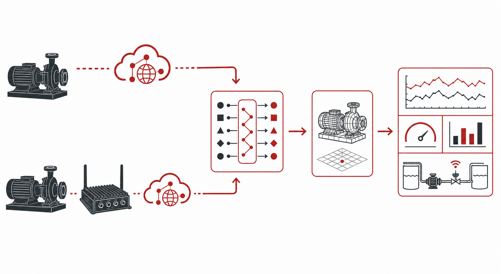

# Get Started with OCI Internet of Things Platform

## Introduction

This workshop introduces OCI Internet of Things Platform through a beverage bottling plant scenario. You will model water pumps, connect their telemetry, and examine the resulting digital twin data.

Estimated Workshop Time: 4 hours 30 minutes

```quiz-config
badge: images/completion-badge.svg
```

### Objectives

In this workshop, you will:

- Identify the core OCI IoT Platform concepts used in the workshop.
- Explain how devices, gateways, adapters, models, instances, and relationships work together.
- Model, connect, and monitor water-pump digital twins.

### Prerequisites

- An OCI tenancy in a region that supports OCI Internet of Things Platform.
- An OCI user account that can access the tenancy. Lab 2 requires tenancy-administrator access.
- A current web browser. Later labs use OCI Cloud Shell or a locally installed OCI CLI.

> **Note:** This workshop creates an OCI IoT Platform developer instance, which is a paid OCI service. The developer instance helps minimize charges while you complete the lab. Follow the cleanup procedures in Lab 8 and delete the IoT domain and related resources when you finish the workshop.

## Task 1: Review the terminology

1. Review these terms before you begin. Each term supports a different part of the solution architecture.

    **Digital Twin Definition Language (DTDL)**

    DTDL is a modeling language for describing digital entities, their properties, commands, and relationships. It provides a consistent contract that digital twin models can use to represent physical assets. [Learn more about digital twin models in OCI IoT Platform](https://docs.oracle.com/en-us/iaas/Content/internet-of-things/digital-twin-models.htm).

    **Digital twin model**

    A digital twin model is a reusable blueprint for an asset type. In this workshop, the *WaterPump* model defines the properties that all supported pumps share, regardless of vendor. [Learn more about digital twin models in OCI IoT Platform](https://docs.oracle.com/en-us/iaas/Content/internet-of-things/digital-twin-models.htm).

    **Digital twin adapter**

    A digital twin adapter transforms or maps source telemetry into the property names and data types defined by a model. It can modify payload shape, convert units, and use JQ functions to process incoming telemetry so the result meets the model requirements. This lets the platform normalize payloads from different pump vendors before updating an instance. [Learn more about digital twin adapters in OCI IoT Platform](https://docs.oracle.com/en-us/iaas/Content/internet-of-things/digital-twin-adapters.htm).

    **Digital twin instance**

    A digital twin instance is the digital representation of one physical asset that conforms to a model. For example, the Line 2 rinse-station pump is an instance of the *WaterPump* model. [Learn more about digital twin instances in OCI IoT Platform](https://docs.oracle.com/en-us/iaas/Content/internet-of-things/digital-twin-instances.htm).

    **Digital twin relationship**

    A digital twin relationship connects one twin to another twin or to its operating context. Relationships let the solution show that a pump belongs to a production line, supports a rinse station, or serves a clean-in-place system. [Learn more about digital twin relationships in OCI IoT Platform](https://docs.oracle.com/en-us/iaas/Content/internet-of-things/digital-twin-relationships.htm).

    **Directly connected device**

    A directly connected device communicates with OCI IoT Platform without an intermediary gateway. It can send its telemetry directly when it has the required network connection and credentials. [Learn more about directly connected devices in OCI IoT Platform](https://docs.oracle.com/en-us/iaas/Content/internet-of-things/create-digital-twin-instance.htm).

    **Indirectly connected device**

    An indirectly connected device communicates through a gateway rather than connecting to OCI IoT Platform itself. This pattern suits plant equipment that uses industrial control networks or cannot independently establish a cloud connection. [Learn more about indirectly connected devices in OCI IoT Platform](https://docs.oracle.com/en-us/iaas/Content/internet-of-things/gateway-instance.htm).

    **Gateway**

    A gateway collects data from one or more indirectly connected devices and forwards it to OCI IoT Platform. It can bridge plant protocols and networks to the cloud-facing telemetry path. [Learn more about gateways in OCI IoT Platform](https://docs.oracle.com/en-us/iaas/Content/internet-of-things/gateway-instance.htm).

    **Telemetry**

    Telemetry is the time-stamped operational data that a device or gateway reports. The water-pump scenario uses flow rate, pressure, motor temperature, vibration, and power consumption as telemetry. [Learn more about sending structured telemetry in OCI IoT Platform](https://docs.oracle.com/en-us/iaas/Content/internet-of-things/structured-default-https.htm).

## Task 2: Understand an OCI IoT Platform solution architecture

1. **Water pump model and telemetry flow**

    DTDL describes the *WaterPump* model, which defines the shared telemetry contract for every water-pump instance. The Line 2 rinse-station pump is one instance of this model, and its relationships identify the production line and process context that help operations teams interpret its data.

    Telemetry can arrive from a directly connected device or from an indirectly connected device through a gateway. The digital twin adapter maps either payload path to the *WaterPump* model, updates the matching instance, and makes the normalized telemetry available with its relationship context.

    

## Task 3: Check your understanding

1. Answer the following questions. Select one answer for each question and review the explanation before continuing.

    ```quiz
    Q: Why does the solution use a shared WaterPump digital twin model?
    * It provides one normalized property contract for pumps from different vendors.
    - It removes the need to create a digital twin instance for each physical pump.
    - It allows the gateway to operate without network connectivity.
    - It replaces all relationships in the bottling plant.
    > A shared model gives every supported pump the same telemetry vocabulary, regardless of the telemetry format sent by each particular make and model of pump, or the context in which the pump is deployed.

    Q: Which telemetry path is appropriate for a pump that cannot connect to OCI IoT Platform on its own?
    - The pump must become a directly connected device before it can report data.
    * The pump reports to a gateway, which forwards its telemetry to the adapter path.
    - The pump writes values directly into a relationship record.
    - The pump updates the DTDL definition whenever its flow rate changes.
    > An indirectly connected device uses a gateway to bridge its plant-side connection to the cloud telemetry path.

    Q: What does a digital twin relationship add to the Line 2 rinse-station pump instance?
    - It changes the model property names for that pump vendor.
    - It converts vibration readings into power-consumption readings.
    * It identifies the pump's line and process context so teams can interpret its data.
    - It sends telemetry without a gateway or adapter.
    > Relationships describe the operational context around a twin, such as the production line and system that the pump supports.

    Q: Which adapter capability helps telemetry meet the WaterPump model requirements when a device sends a different payload shape or unit?
    * It can reshape the payload, convert units, and apply JQ functions before updating the model.
    - It must create a new digital twin model for every telemetry sample.
    - It replaces the digital twin instance with the incoming device payload.
    - It removes the need to define telemetry properties in the model.
    > An adapter can transform incoming data into the model's expected structure and units, including by using JQ functions to process values.
    ```

    You may now **proceed to the next lab**.

## Acknowledgements

* **Author** - Pete St. Pierre, Director, Product Management
* **Last Updated By/Date** - Pete St. Pierre, August 2026
