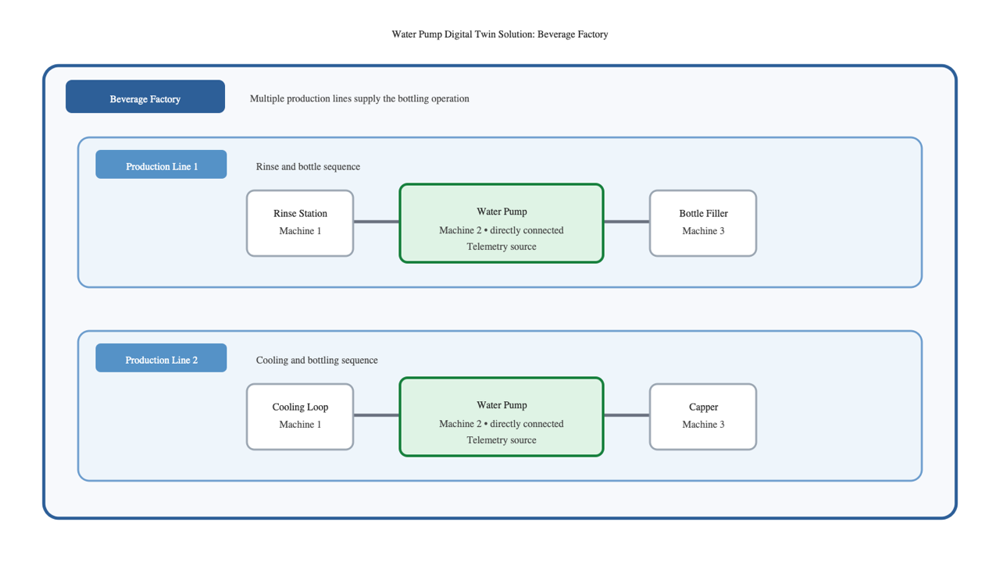

# Lab 1: Review the Water Pump Use Case

## Introduction

A beverage factory operates multiple production lines that bottle and rinse products. Water pumps supply rinse stations, cooling loops, and clean-in-place systems across the factory. This lab introduces the industry scenario without presenting payload or JSON details.

The solution models the relationship between the factory, its production lines, and its water pumps. Two water pumps connect directly to OCI IoT Platform. For this learning environment, the devices use basic authentication; production deployments should use certificates instead.

Estimated Time: 15 minutes

### Objectives

In this lab, you will:

- Identify the factory, production lines, water pumps, and their relationships.
- Explain why the solution uses a shared *WaterPump* model. Lab 4 shows how to build this model.
- Describe the work that the following labs complete.

## Prerequisites

- Complete the Introduction section.
- Access to the OCI Console in the region selected for this workshop.

## Task 1: Explore the factory use case

1. Review the solution diagram.

    

2. The factory contains multiple production lines. Each line uses water pumps for rinse stations, cooling loops, or clean-in-place systems.

3. The two water pumps in this workshop connect directly to OCI IoT Platform. They report flow rate, pressure, motor temperature, vibration, and power consumption.

## Task 2: Implementing the solution with OCI IoT Platform

1. The digital twin solution captures how the factory contains production lines and how each production line uses water pumps. These relationships provide the operating context for the telemetry that applications display.

2. A shared *WaterPump* model gives the two pump devices one consistent representation. A digital twin adapter maps each incoming device payload to that model.

3. The solution uses two adapters. A default adapter processes telemetry from a device when its payload already matches the model. A custom adapter processes telemetry from a device that sends data in a different shape.

4. The following labs set up tenancy access, create the relationships and *WaterPump* model, create the default and custom adapters, connect the directly connected devices, create digital twin instances, and send telemetry to inspect the results.

5. You can run the OCI CLI commands in the following labs from [OCI Cloud Shell](https://docs.oracle.com/en-us/iaas/Content/API/Concepts/cloudshellintro.htm) or from a local machine. Cloud Shell is available from the OCI Console and includes a pre-authenticated OCI CLI; select the intended region in the Console before you start Cloud Shell. To run the commands locally, install and configure the OCI CLI by using [Quickstart: Install and configure the OCI CLI](https://docs.oracle.com/en-us/iaas/Content/API/SDKDocs/cliinstall.htm).

    You can also complete the same actions through the OCI IoT Platform user interface, which is available from the IoT Domain details page in the OCI Console. Use the Console when you prefer a guided visual workflow; use the CLI when you want repeatable commands and values that later labs can reuse.

You may now **proceed to the next lab**.

## Acknowledgements

* **Author** - Pete St. Pierre, Director, Product Management
* **Last Updated By/Date** - Pete St. Pierre, August 2026
