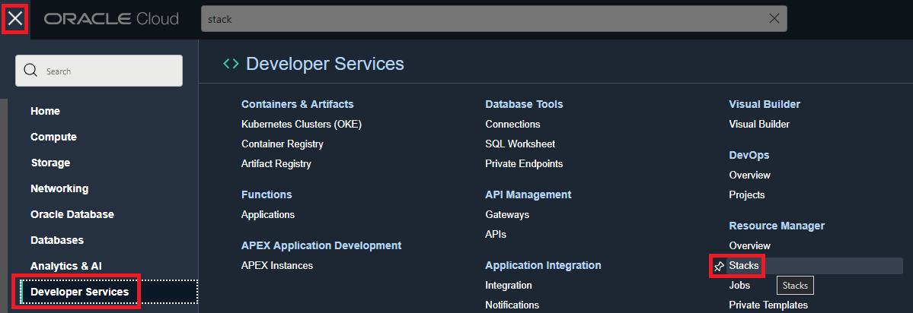
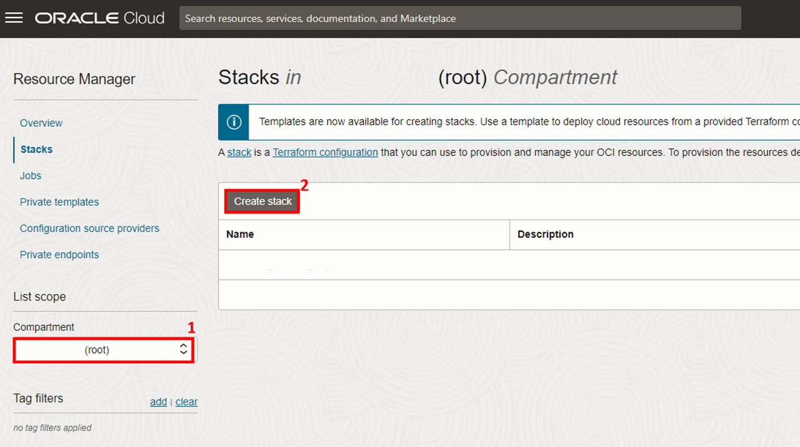
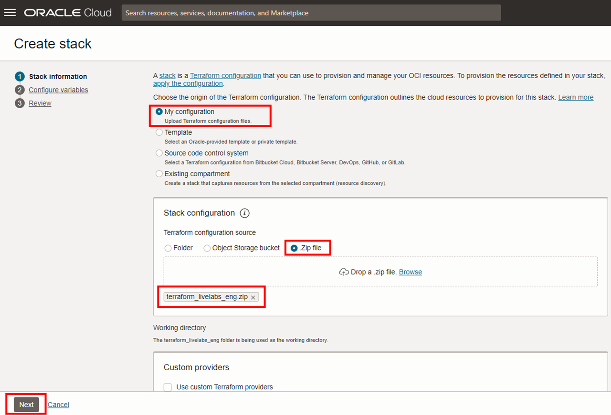
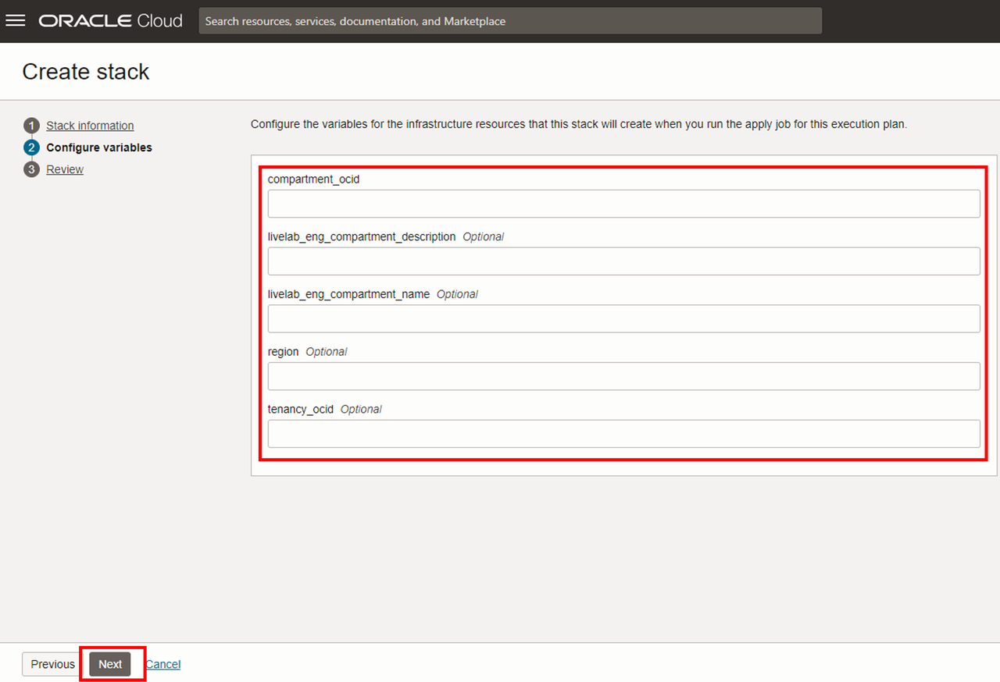
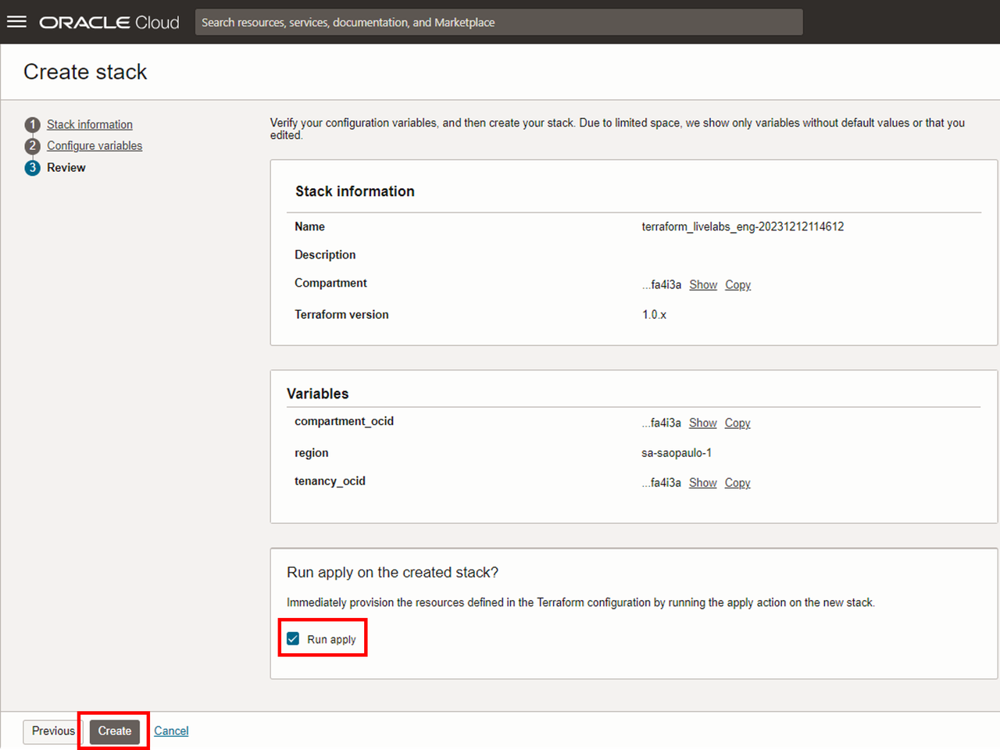

# Pré Requisito - Provisionar Recursos

## Introdução

Nesta etapa, você irá provisionar recursos dentro da OCI utilizando Terraform com o serviço **Resource Manager**!

- 🌀 [Página oficial do Resource Manager](https://www.oracle.com/br/devops/resource-manager/)
- 🧾 [Documentação do Resource Manager](https://docs.oracle.com/pt-br/iaas/Content/ResourceManager/home.htm)

Os recursos provisionados serão:

- Compartimento
- Object Storage - Buckets
- Data Catalog
- Metastore
- Data Science
- Data Flow - SQL Endpoint

*Tempo estimado para o Lab:* 20 Minutos
- - -

## Tarefa 1: Download do repositório

Como primeiro passo, devemos fazer o download do arquivo (zip).

 1. Para isso, acesse o [link](https://objectstorage.us-ashburn-1.oraclecloud.com/p/lZw8rKAwT7PbC1Y13z4KGQhJUMy3TQXWcMphLqszmCQyA3Ni7_8Nm1h9fx4lWEUn/n/id3kyspkytmr/b/bucket-fast-track/o/terraform_livelabs_eng.zip) para fazer o download **Download ZIP**.

- - -

## Tarefa 2: Upload do terraform no Resource Manager

1. Faça o [login](https://www.oracle.com/cloud/sign-in.html) em sua conta na OCI.

2. No 🍔 menu de hambúrguer, acesse: **Developer Services** → **Resource Manager** → **Stacks**.

3. Nesta nova janela, certifique que está no compartment "root" e clique em **Create Stack**.

4. Selecione a opção "Zip file", clique em "browse" e arraste o arquivo (.zip), que contém os arquivos .tf. O Resource Manager irá preencher todos os campos.

5. Clique em **Next**, para Verificarmos se todos os campos da imagem abaixo estão preenchidos.

6. Clique em **Next**.

7. Selecione a opção "Run apply" e clieque em "Create"

8. O provisionamento dos recursos deverá durar em torno de 10 minutos.

10. Após finalizar o Apply com sucesso, podemos conferir o provisionamento dos nossos recursos!

## Conclusão

### Ambientes provisionados com sucesso! Você provisionou recursos usando Terraform na OCI! Você terminou os pré-requisitos! Você pode seguir para o próximo Lab.

##  Autoria

- **Autores** - Thais Henrique, Heloisa Escobar, Isabelle Anjos
- **Último Update Por/Date** - Isabelle Anjos, Dez/2023