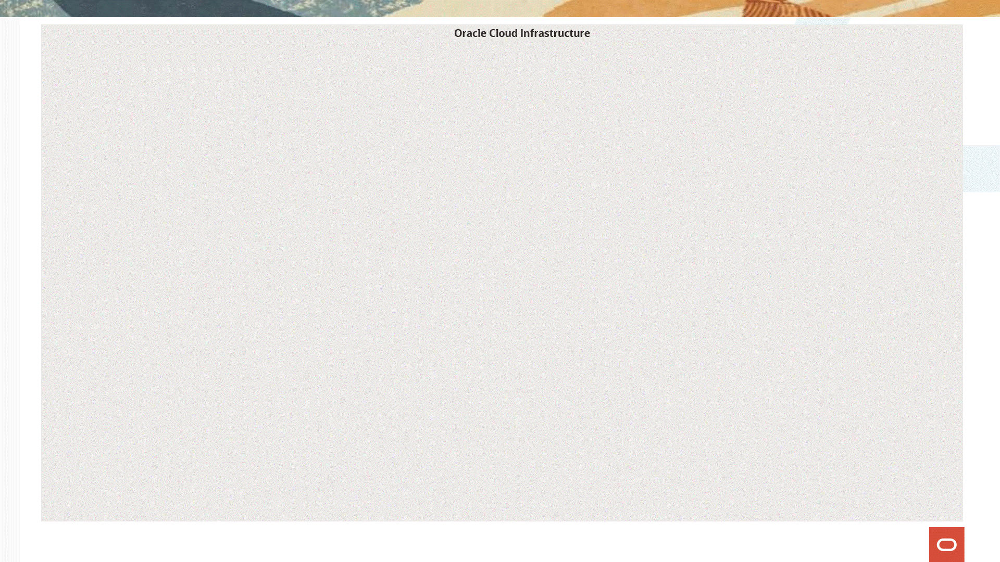

# Oracle Cloud Infrastructure Fast Track - For Data Engineering

## *Arquitetura Medalhão*

Na era atual, onde dados são um dos ativos mais valiosos para as empresas, a capacidade de aproveitar uma vasta e diversificada gama de fontes de dados tornou-se crucial para o sucesso nos negócios. Organizar os dados em uma arquitetura de medalhão é essencial para maximizar a eficácia e eficiência dos processos de tomada de decisão e operações baseadas em dados em uma determinada empresa. 

Neste laboratório você aprenderá a transformar dados brutos em informações valiosas, seguindo três etapas fundamentais para o aprimoramento de dados conhecidas como: **Bronze, Prata e Ouro**. Cada etapa apresenta, progressivamente, maiores níveis de qualidade e importância no ciclo de vida dos dados.

---
🥉 Bronze

**Descrição:**  Imagine a coleta de dados como o início da mineração, onde o objetivo é extrair metais diretamente da terra. Neste estágio inicial, os dados são reunidos em sua forma mais bruta e autêntica, sem qualquer tipo de edição ou filtragem. Assim como na mineração, os dados são capturados de fontes diversas e abundantes — desde sensores que captam informações em tempo real até registros detalhados de transações e atividades online.

**Processos:** Neste ponto inicial, os dados são simplesmente armazenados com segurança, aguardando etapas futuras onde serão refinados e transformados para uso.

---
🥈 Prata

**Descrição:** Similarmente ao refinamento de metais, a purificação de dados transforma informações brutas em um conjunto mais limpo e organizado. Este processo é vital para remover erros e redundâncias, assegurando dados de alta qualidade para análise.

**Processos:** Nesta fase crítica, os dados passam por uma rigorosa revisão, eliminando inconsistências e duplicações, e padronizando formatos para melhor precisão e utilidade no uso posterior.

---
🥇 Ouro

**Descrição:** Na última etapa da metalurgia, o metal é refinado até alcançar sua forma mais valiosa e útil, muitas vezes combinado com outros metais para criar uma liga com propriedades desejáveis. Analogamente, os dados em sua fase "ouro" são enriquecidos e transformados em informações de alto valor. Eles são aprimorados através da integração com outros dados, análises profundas e modelagem para extrair insights críticos e fornecer suporte à tomada de decisão estratégica.

**Processos:** Neste estágio, utiliza-se técnicas de mineração de dados - explorar grandes conjuntos de dados para encontrar padrões consistentes ou relações sistemáticas entre variáveis - assim como business intelligence e aprendizado de máquina para transformar os dados em conhecimento prático, prevendo tendências e orientando decisões estratégicas dentro de uma organização.

| Camada | Nome        | Objetivo |
|--------|-------------|----------|
| Bronze | Dados Brutos         | • Recolhimento de dados em estado puro de múltiplas fontes.   • Armazenamento em sistemas robustos, mantendo a integridade original.   • Preservação da forma bruta para rastreabilidade e conformidade. |
| Prata  | Dados Processados     | • Limpeza de anomalias e redundâncias nos dados.   • Transformação para estruturação e padronização.   • Organização com objetivo de facilitar o acesso e manipulação subsequente. |
| Ouro   | Dados Otimizados    | • Inclusão de informações externas para fornecer mais contexto aos dados.   • Combinação de dados para criar resumos claros e práticos.   • Análise de dados aplicando métodos avançados para geração de insights. |

## *Vantagens da Arquitetura Medalhão*

Em suma, a arquitetura medalhão viabiliza um ecossistema de dados robusto, confiável e escalável, essencial para alavancar o potencial de tecnologias avançadas de inteligência artificial e análise de dados, permitindo uma vantagem competitiva no mercado orientado por dados. Nesse contexto, a implementação da arquitetura medalhão apresenta as seguintes vantagens:

**Segregação de Dados Brutos e Processados:** A segregação clara entre dados brutos, intermediários e refinados (Bronze, Prata e Ouro, respectivamente) garante que diferentes níveis de análise e consumo possam ocorrer simultaneamente sem conflitos ou dependências desnecessárias.

**Melhoria da Qualidade e Integridade dos Dados:** Cada estágio da arquitetura garante que os dados passem por um processo de validação e limpeza, melhorando significativamente a sua qualidade e integridade antes de serem usados para insights ou alimentar sistemas mais complexos.

**Otimização para Modelos de IA:** A estrutura permite que os modelos de Inteligência Artificial recebam dados já tratados, enriquecidos e de alta qualidade, o que é crucial para a precisão dos modelos. Dados bem preparados diminuem a latência e aumentam a eficiência durante o treinamento e a inferência.

**Dashboards Eficientes:** Com dados no estágio Ouro, a criação de dashboards torna-se mais eficiente e confiável, pois eles se baseiam em conjuntos de dados já consolidados e otimizados para exibir métricas e KPIs, garantindo que a visualização seja tanto de alta qualidade quanto de atualização rápida, reduzindo a latência na tomada de decisões.

**Escalabilidade e Governança:** Uma estrutura de medalhão favorece a escalabilidade, pois permite expandir e modificar cada camada de forma independente. Além disso, fortalece a governança dos dados, com clareza sobre como os dados evoluem e são utilizados ao longo do tempo.

**Prontidão Analítica:** Ao final do processo, os dados estão prontos para análise, permitindo que os times extraiam insights valiosos com menos esforço e maior precisão, já que os dados no estágio Ouro são mais representativos e confiáveis.

### *Sobre o Oracle Cloud Infrastructure Data Flow*

O principal serviço que usaremos nesse workshop será o OCI Data Flow:

O OCI Data Flow é uma plataforma de análise de dados na nuvem que simplifica processos para desenvolvedores e cientistas de dados trabalhando com Apache Spark em larga escala. Funcionando inteiramente na nuvem, ela descarta a complexidade de gerenciar infraestruturas de dados, como clusters, permitindo aos profissionais focar no desenvolvimento e execução de seus projetos. A solução se adapta perfeitamente a ambientes de dados distribuídos, permitindo análises de big data diretamente nas fontes de dados, sem preocupações com a configuração e manutenção de clusters.

O OCI Data Flow é construído para executar tarefas de processamento de dados em paralelo, aproveitando a infraestrutura distribuída do Apache Spark. Além disso, sua usabilidade do Data Flow é reforçada por uma interface de usuário intuitiva e a possibilidade de integração via API, o que facilita a inclusão da plataforma em fluxos de trabalho já existentes. Com suporte a Spark Streaming, o serviço oferece também a capacidade de processar dados em tempo real, permitindo operações de transformação de dados contínuas e atualizadas, e impulsionando a eficiência e a integração de processos analíticos.

### ***Arquitetura dp Workshop***

### *Resumo*

A arquitetura medalhão é uma estrutura de gestão de dados que facilita a conversão de dados brutos em informações valiosas, apoiando a tomada de decisões e alimentando modelos de Inteligência Artificial com dados de alta qualidade. Ela é dividida em etapas (Bronze, Prata e Ouro), cada uma dedicada a diferentes processos de refinamento de dados, desde a limpeza inicial até a geração de insights avançados.

Integrando essa abordagem está o Oracle Cloud Infrastructure Data Flow, uma solução sem servidor baseada em Apache Spark que permite aos desenvolvedores e cientistas de dados realizar análises complexas de big data com facilidade e eficiência. Graças à sua capacidade de processamento de dados em tempo real e uma interface de usuário amigável, o Data Flow maximiza a produtividade e suporta um workflow ágil, reforçando a escalabilidade e a governança dos dados nas empresas.

### *Sobre esse Workshop*

O objetivo principal deste laboratório é capacitar e aperfeiçoar as competências associadas à utilização de serviços de **Lakehouse para lidar com Big Data**, abrangendo todas as etapas desde a **aquisição inicial dos dados** até a sua transformação em **insights avançados** e **relatórios detalhados**.

Adotando a estrutura de arquitetura medalhão, que se segmenta nas camadas **Bronze , Prata (Silver) e Ouro (Gold)**, os participantes serão encorajados a investigar, ajustar e aperfeiçoar os dados durante as diversas fases do seu ciclo de vida.

**Todas as práticas estão descritas em detalhes e não necessitam de qualquer conhecimento prévio para serem executadas.**

É importante citar que esse Fast Track faz parte de um conjunto de treinamentos mais amplo, que inclui o [Fast Track - For Data Analysts](https://apexapps.oracle.com/pls/apex/f?p=133:180:115710339199463::::wid:3519), presente no LiveLabs, e o Fast Track – For Data Scientists, que estará disponível em breve.

Em caso de dúvidas ou necessidade de suporte, os participantes poderão entrar em contato com a equipe responsável pela criação e edição dos laboratórios, com informações de contato disponíveis ao final de cada etapa.

***Tempo estimado para o Workshop:* 4 Horas**

*Objetivos*

Por meio deste guia, iremos fornecer laboratórios práticos de:

- Configuração e Implementação do Ambiente
- Configuração do Data Flow Studio
- Manipulação de Dados
- Consumo de Dados no Data Lake
- Visualização de Dados

## Saiba Mais

Português:
- [Documentação do Oracle Cloud Infrastructure Data Flow](https://docs.oracle.com/pt-br/iaas/data-flow/using/home.htm)

Inglês:
- [Documentação do Oracle Cloud Infrastructure Data Flow](https://docs.oracle.com/en-us/iaas/data-flow/using/home.htm)
- [Saiba mais sobre o Data Flow - Vídeo](https://www.oracle.com/br/big-data/data-flow/?ytid=U-8TRHD_UOc)
- [O que há de novo](https://docs.oracle.com/en-us/iaas/releasenotes/services/data-flow/)
- [Arquiteturas de referência](https://docs.oracle.com/en/solutions/oci-big-data-flow/index.html#GUID-D84476CE-4063-4884-B2EC-793A921A4638)

## Autoria

- **Autores** - Thais Henrique, Heloisa Escobar, Isabelle Anjos
- **Último Update Por/Date** - Isabelle Anjos, Jan/2024
