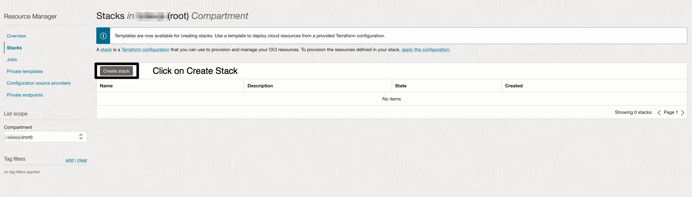
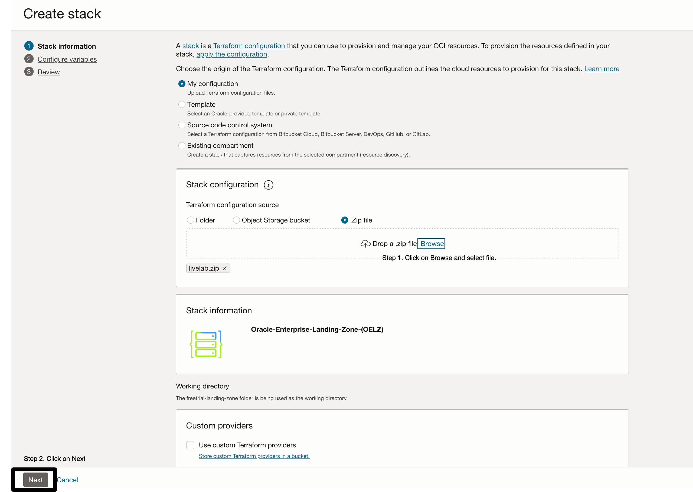
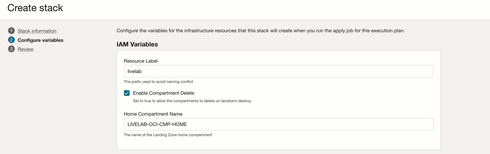
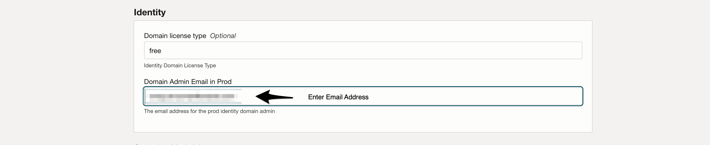
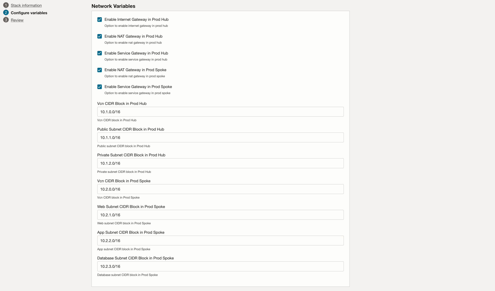
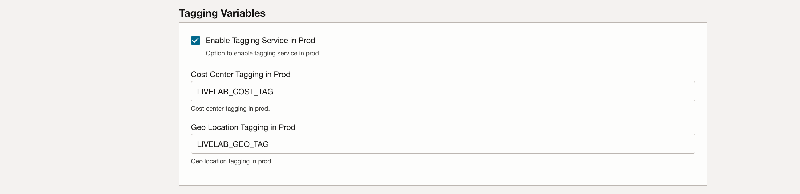
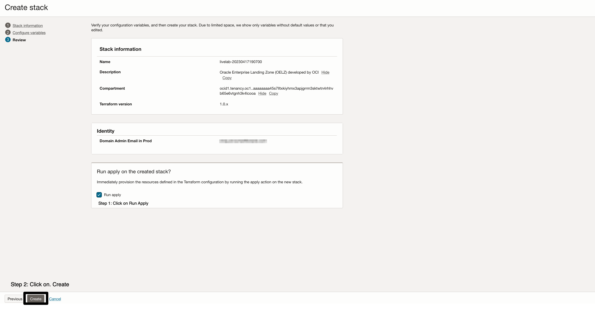
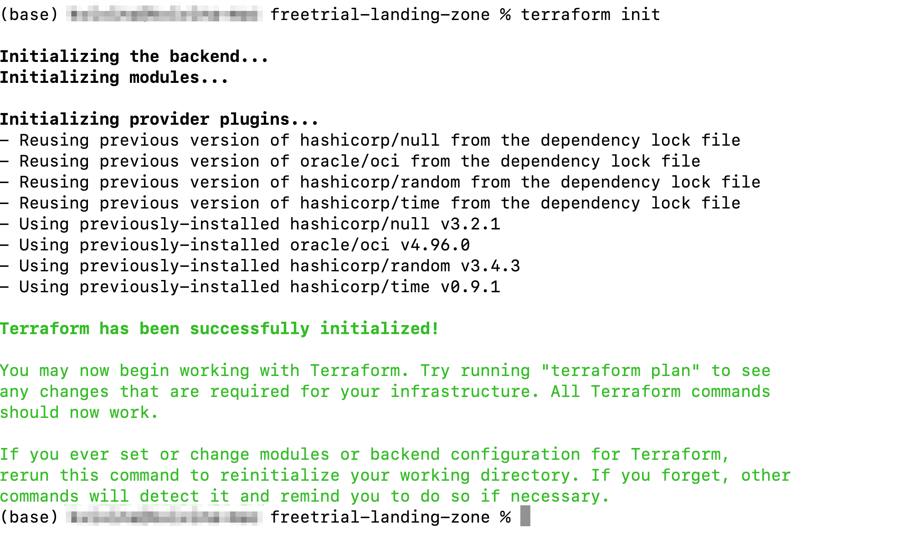
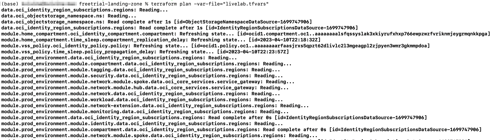
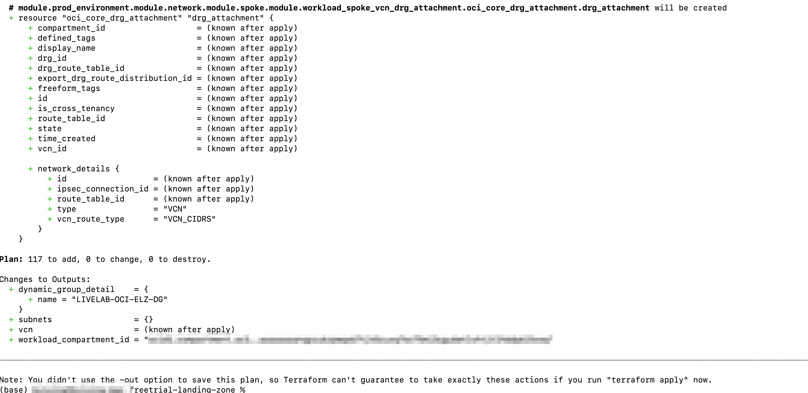

# Provision Oracle Enterprise Landing Zone Infrastructure.

## Introduction

In this lab exercise, you will provision all the Infrastructure resources used by your applications through Infrastructure As Code (IaC) using [Terraform](https://www.terraform.io) on [Oracle Cloud Infrastructure Resource Manager service (ORM)](https://docs.oracle.com/en-us/iaas/Content/ResourceManager/Concepts/resourcemanager.htm).  

#### Terraform
Terraform is an open-source tool that allow you to write infrastructure as code using declarative configuration files that will represent the state of your infrastructure. 

The Landing Zone is written entirely in Terraform and can be extended by modifying the stack or writing additional Terraform that builds upon the base configuration.

#### Resource Manager
OCI Resource Manager allows you to share and manage Terraform configurations and state files across multiple teams and platforms. 

You will use it in this lab to deploy terraform stacks without needing to install any tools locally.

Estimated time: 30 minutes

Watch the video below for a quick walk-through of the lab. 
[Deploy Baseline Landing Zone](videohub:1_mf98gcul)

### Objectives

In this lab, you can deploy OLEZ stack via 2 method(use one)

* Create OELZ stack via ORM.
* Create OELZ stack via CLI.

### Prerequisites
---
* An Oracle Free Tier(Trial), Paid or LiveLabs Cloud Account
* User that belongs to the Administrator group or has granted privileges to manage multiple OCI resources (IAM, ORM, Network, etc).


## Task 1: Create OELZ stack via ORM
---
The first step is to create a OCI Resource Manager Stack. The Stack is a collection of Oracle Cloud Infrastructure resources corresponding to a given Terraform configuration. Each stack resides in the compartment you specify, in a single region; however, resources on a given stack can be deployed across multiple regions. An OCID (unique identifier) is assigned to each stack.

1. Open up Resource Manager service. You can click directly on Resource Manager in the navigation path menu, otherwise, Go back to the main Navigation Menu -> Developer Services -> Resource Manager.

2. In the stack section, click create stack and choose template as the origin of the Terraform configuration.
    |Varibale Name|Value|
    |--|--|
    |Parent compartment name|`OELZ_Demo`|
    |Create in Compartment| tenancy (root)|
    |Terraform Version| leave the default option if you have the option to select it|
    
    

3. Click on the zip file and select the saved zip file.
    
    
4. Click on next button.
    
    
5. Configure Variables. Most of the default value are pre-defined , only the default domain email need to updated. 
    
5.1  Enter IAM Variables : IAM lets you control who has access to specific cloud resources and what type of access a group of users can have. The OELZ provisions IAM groups with established roles and access levels. The group names listed are the default names but can be overridden by updating using the Terraform variables. 
    
5.2  Enter Identity Variables : The identity module is responsible for creating the identity domain "free", federation and the resources related to the domain.The identity module will create the identity domain,users, groups and policies.
    
5.3  Enter Security Variables : Enter Security variables for Bastion.
    
5.4  Enter Budget Variables : The budgets module is responsible for deploying the budget component in an environment.
    
5.5  Enter Network Variables : Network module  will deploy a type of network called "hub & spoke" that will allow the various workloads to interconnect with each other. 
    
5.6  Enter Tagging Variables : Tagging allows you to add metadata to resources, which enables you to define keys and values and associate them with resources.
    
    

6. Create the Stack.
    
    
7. Wait for the atleast ten minutes and then the Stack Jobs Status. 

8. Gather the Provisioned Resources OCID Value. 
    * Hamburger-->Resource Manager-->Stacks-->Stacks Detail-->Resource-> Select Output 

### Verification
---


## Task 2: Create OELZ stack via CLI
---
### Prerequisites
To deploy the OELZ from the terraform cli you will need the following prerequisites.
- [Latest Version of Terrafom](https://developer.hashicorp.com/terraform/downloads)
- [OCI Terraform provider](https://registry.terraform.io/providers/oracle/oci/latest/docs) v4.109.0 or later
- [oci - cli](https://github.com/oracle/oci-cli)

## User
The OELZ should be deployed by a user who is a member of the Administrators group for the tenancy. This user need to have an api key entry defined as decribed [here](https://docs.oracle.com/en-us/iaas/Content/API/SDKDocs/terraformproviderconfiguration.htm). Once the user and API Key are defined your oci-cli config should resemble.

```text
[DEFAULT]
user=ocid1.xxxxxx.xxxxxx.xxxxxx.....  #ocid of the user
fingerprint=xx:xx:xx:xx:xx:xx:xx:xx:xx:xx:xx:xx:xx:xx:xx:xx #user api key fingerprint
tenancy=ocid1.xxxxxx.xxxxxx.xxxxxx..... #tenancy ocid
region=us-phoenix-1 #or desired region
key_file=<path to your private keyfile> # TODO
```
## Region
The OELZ should be deployed to the tenancy's Home Region.

## Tenancy
The tenancy you intend to deploy the OELZ to.

1) Clone the OELZ Terraform templates from the [oelz_github](https://github.com/oracle-quickstart/oci-landing-zones/tree/master).
2) Go to Directory landing-zones/templates/freetrial-landing-zone.
3) Configure Variables on the file landing-zones/templates/freetrial-landing-zone/livelab.tfvars and save the file.

* Variables Values Used. 
    |Variable|Value|
    |--|--|
    |current_user_ocid|`ocid1.xxxxxx.xxxxxx.xxxxxx.....`|
    |region|`us-phoenix-1 #or desired region`|
    |tenancy_ocid|`ocid1.xxxxxx.xxxxxx.xxxxxx.....`|
    |api_fingerprint|`xx:xx:xx:xx:xx:xx:xx:xx:xx:xx:xx:xx:xx:xx:xx:xx`|
    |api_private_key_path|`<path to your private keyfile>`|
    |resource_label|`LIVELAB_ALERT`|
    |enable_compartment_delete|`false`|
    |prod_domain_admin_email|`example@domain.com`|
    |home_compartment_name|`LIVELAB-OCI-CMP-HOME`|
    |enable_cloud_guard|`false`|
    |cloud_guard_target_tenancy|`false`|
    |prod_enable_bastion|`true`|
    |prod_bastion_client_cidr_block_allow_list|10.0.0.0/16, 10.0.0.0/24|
    |prod_budget_alert_rule_message|`LIVELAB_ALERT`|
    |prod_budget_alert_rule_threshold|`1000000`|
    |prod_budget_amount|`10000000`|
    |prod_enable_budget|`true`|
    |is_create_alarms|`false`|
    |domain_license_type|`free`|
    |onboard_log_analytics|`false`|
    |prod_enable_vpn|`false`|
    |prod_cost_center_tagging|`LIVELAB_COST_TAG`|
    |prod_geo_location_tagging|`LIVELAB_GEO_TAG`|
    |prod_enable_internet_gateway_hub|`true`|
    |prod_enable_nat_gateway_hub|`true`|
    |prod_enable_service_gateway_hub|`true`|
    |prod_enable_nat_gateway_spoke|`true`|
    |prod_enable_service_gateway_spoke|`true`|
    |prod_hub_vcn_cidr_block|10.1.0.0/16|
    |prod_hub_public_subnet_cidr_block|10.1.1.0/24|
    |prod_hub_private_subnet_cidr_block|10.1.2.0/24|
    |prod_spoke_vcn_cidr|10.1.2.0/24|
    |prod_spoke_subnet_web_cidr_block|10.1.2.0/24|
    |prod_spoke_subnet_app_cidr_block|10.1.2.0/24|
    |prod_spoke_subnet_db_cidr_block|10.1.2.0/24|
    
 4) Validate the changes . Issue the command "terraform validate".
    
 6) Initializes Terraform Configuration files via "terraform init".
    
 8) Preview the changes that Terraform will to make to your infrastructure via "terraform plan -var-file=\"livelab.tfvars\"".
    
    
 10) Executes the changes defined by your Terraform configuration to create or update resources via "terraform apply -var-file=\"livelab.tfvars\"" and wait for atleast 10 min to finish provisioning.
     
 12) Destroy the terraform configuration resources via "terraform destory".

## Acknowledgements
---
* **Author** - LiveLabs Team
* **Contributors** - LiveLabs Team, Arabella Yao
* **Last Updated By/Date** - Arabella Yao, September 2022

