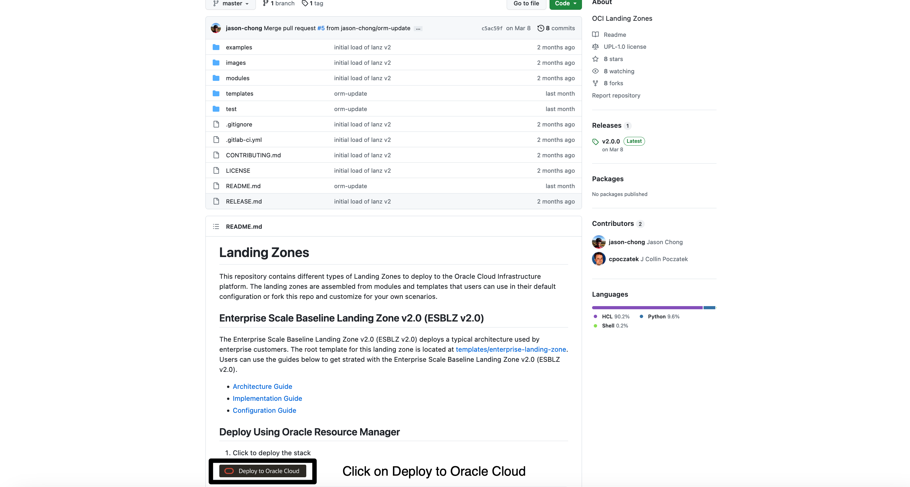
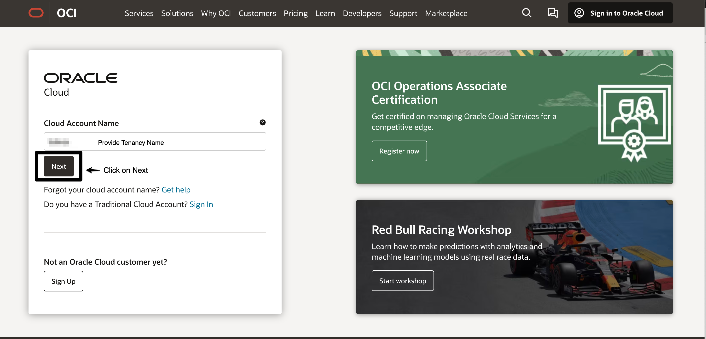
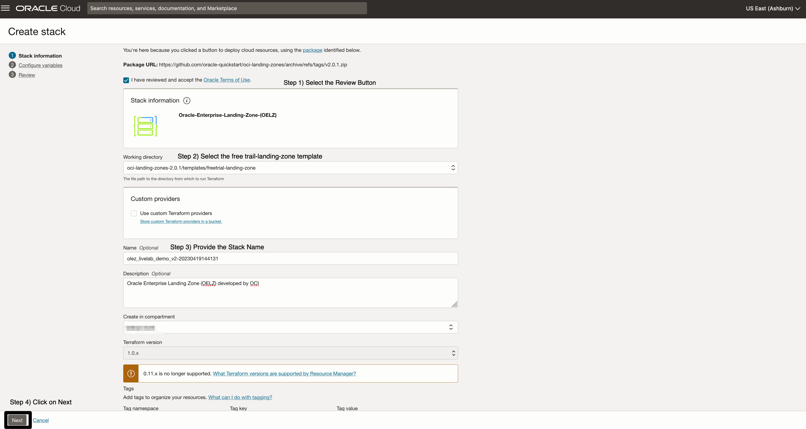
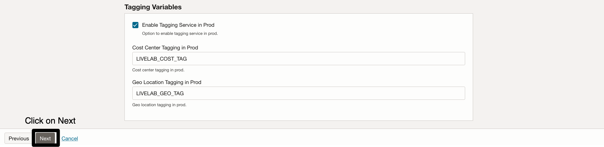
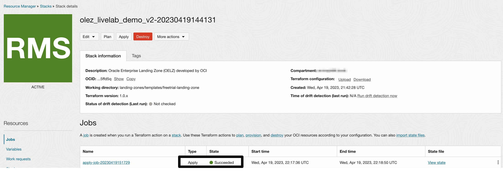

# Provision Oracle Enterprise Landing Zone Infrastructure.

## Introduction

In this lab exercise, you will provision all the Infrastructure resources used by your applications through Infrastructure As Code (IaC) using [Terraform](https://www.terraform.io) on [Oracle Cloud Infrastructure Resource Manager service (ORM)](https://docs.oracle.com/en-us/iaas/Content/ResourceManager/Concepts/resourcemanager.htm).  

#### Terraform
Terraform is an open-source tool that allow you to write infrastructure as code using declarative configuration files that will represent the state of your infrastructure. 

The Landing Zone is written entirely in Terraform and can be extended by modifying the stack or writing additional Terraform that builds upon the base configuration.

#### Resource Manager
OCI Resource Manager allows you to share and manage Terraform configurations and state files across multiple teams and platforms. 

You will use it in this lab to deploy terraform stacks without needing to install any tools locally.

Estimated time: 30 minutes

Watch the video below for a quick walk-through of the lab. 
[Deploy Baseline Landing Zone](videohub:1_mf98gcul)

### Objectives

In this lab, you can deploy OLEZ stack via 2 method(use one)

* Create OELZ stack via ORM.
* Create OELZ stack via CLI.

### Prerequisites
---
* An Oracle Free Tier(Trial), Paid or LiveLabs Cloud Account
* User that belongs to the Administrator group or has granted privileges to manage multiple OCI resources (IAM, ORM, Network, etc).


## Task 1: Create OELZ stack via ORM
---
The first step is to create a OCI Resource Manager Stack. The Stack is a collection of Oracle Cloud Infrastructure resources corresponding to a given Terraform configuration. Each stack resides in the compartment you specify, in a single region; however, resources on a given stack can be deployed across multiple regions. An OCID (unique identifier) is assigned to each stack.

1. Go to the [`oelz`](https://github.com/oracle-quickstart/oci-landing-zones/tree/master).
2. Click on Deploy to Oracle Cloud button.
    
3. Enter the Tenancy Name and click on next.
    
4. Select the identity domain and click on next.
    
5. Provide Tenancy User Credential (make sure user have administrator privilege) and Sign in.
     
6. Select the freetrail-landing-zone under Working Directory and click Next.
     
7. IAM Variable are pre-defined and nothing to add here.
     
8. Identity Variables are pre-defined and nothing to add here.
    
9. Security Variables are pre-defined and nothing to add here.
    
10. Budget Variables are pre-defined and nothing to add here.
    
11. Network Variables are pre-defined and nothing to add here.
    
12. Tagging Variables are pre-defined and nothing to add here, Please click Next.
    
13. Review the variables , select on apply and click on create.
    
14. Wait for atleast 10 minutes for full deployment then check the Stack Jobs Status.
    
    
15. Gather the Provisioned Resources OCID Value. 
    * Hamburger-->Resource Manager-->Stacks-->Stacks Detail-->Resource-> Select Output
    
  
16. Go to Mushop Deployment.

## Task 2: Create OELZ stack via CLI (Optional Not Needed if Task 1 is used)
---
### Prerequisites
To deploy the OELZ from the terraform cli you will need the following prerequisites.
- [Latest Version of Terrafom](https://developer.hashicorp.com/terraform/downloads)
- [OCI Terraform provider](https://registry.terraform.io/providers/oracle/oci/latest/docs) v4.109.0 or later
- [oci - cli](https://github.com/oracle/oci-cli)

## User
The OELZ should be deployed by a user who is a member of the Administrators group for the tenancy. This user need to have an api key entry defined as decribed [here](https://docs.oracle.com/en-us/iaas/Content/API/SDKDocs/terraformproviderconfiguration.htm). Once the user and API Key are defined your oci-cli config should resemble.

```text
[DEFAULT]
user=ocid1.xxxxxx.xxxxxx.xxxxxx.....  #ocid of the user
fingerprint=xx:xx:xx:xx:xx:xx:xx:xx:xx:xx:xx:xx:xx:xx:xx:xx #user api key fingerprint
tenancy=ocid1.xxxxxx.xxxxxx.xxxxxx..... #tenancy ocid
region=us-phoenix-1 #or desired region
key_file=<path to your private keyfile> # TODO
```
## Region
The OELZ should be deployed to the tenancy's Home Region.

## Tenancy
The tenancy you intend to deploy the OELZ to.

1) Clone the OELZ Terraform templates from the [oelz_github](https://github.com/oracle-quickstart/oci-landing-zones/tree/master).
2) Go to Directory landing-zones/templates/freetrial-landing-zone.
3) Configure Variables on the file landing-zones/templates/freetrial-landing-zone/livelab.tfvars and save the file.

* Variables Values Used. 
    |Variable|Value|
    |--|--|
    |current_user_ocid|`ocid1.xxxxxx.xxxxxx.xxxxxx.....`|
    |region|`us-phoenix-1 #or desired region`|
    |tenancy_ocid|`ocid1.xxxxxx.xxxxxx.xxxxxx.....`|
    |api_fingerprint|`xx:xx:xx:xx:xx:xx:xx:xx:xx:xx:xx:xx:xx:xx:xx:xx`|
    |api_private_key_path|`<path to your private keyfile>`|
    |resource_label|`LIVELAB_ALERT`|
    |enable_compartment_delete|`false`|
    |prod_domain_admin_email|`example@domain.com`|
    |home_compartment_name|`LIVELAB-OCI-CMP-HOME`|
    |enable_cloud_guard|`false`|
    |cloud_guard_target_tenancy|`false`|
    |prod_enable_bastion|`true`|
    |prod_bastion_client_cidr_block_allow_list|10.0.0.0/16, 10.0.0.0/24|
    |prod_budget_alert_rule_message|`LIVELAB_ALERT`|
    |prod_budget_alert_rule_threshold|`1000000`|
    |prod_budget_amount|`10000000`|
    |prod_enable_budget|`true`|
    |is_create_alarms|`false`|
    |is_service_connector_limit|`true`|
    |domain_license_type|`free`|
    |onboard_log_analytics|`false`|
    |prod_enable_vpn|`false`|
    |prod_cost_center_tagging|`LIVELAB_COST_TAG`|
    |prod_geo_location_tagging|`LIVELAB_GEO_TAG`|
    |prod_enable_internet_gateway_hub|`true`|
    |prod_enable_nat_gateway_hub|`true`|
    |prod_enable_service_gateway_hub|`true`|
    |prod_enable_nat_gateway_spoke|`true`|
    |prod_enable_service_gateway_spoke|`true`|
    |prod_hub_vcn_cidr_block|10.1.0.0/16|
    |prod_hub_public_subnet_cidr_block|10.1.1.0/24|
    |prod_hub_private_subnet_cidr_block|10.1.2.0/24|
    |prod_spoke_vcn_cidr|10.1.2.0/24|
    |prod_spoke_subnet_web_cidr_block|10.1.2.0/24|
    |prod_spoke_subnet_app_cidr_block|10.1.2.0/24|
    |prod_spoke_subnet_db_cidr_block|10.1.2.0/24|
    
 4) Validate the changes . Issue the command "terraform validate".
    
 5) Initializes Terraform Configuration files via "terraform init".
    
 6) Preview the changes that Terraform will to make to your infrastructure via "terraform plan -var-file=\"livelab.tfvars\"".
    
    
 7) Executes the changes defined by your Terraform configuration to create or update resources via "terraform apply -var-file=\"livelab.tfvars\"" and wait for atleast 10 min to finish provisioning.
    
    
    
 8) Destroy the terraform configuration resources via "terraform destroy -var-file=\"livelab.tfvars\"".
    
    

### Task 3: Verify OELZ Resources
---

1) Go to Hamburger-->Identity & Security-->Compartments and click on "LIVELAB-OCI-CMP-HOME" compartment and you can see the compartment struture defined on the introduction section.


2) Hub VCN : Go to Hamburger-->Networking-->Virtual Cloud Networks(VCN). GO to compartment tab and select the "OCI-ELZ-L-SRD-NET" compartment.


## Acknowledgements
---
* **Author** - LiveLabs Team
* **Contributors** - LiveLabs Team, Arabella Yao
* **Last Updated By/Date** - Arabella Yao, September 2022

