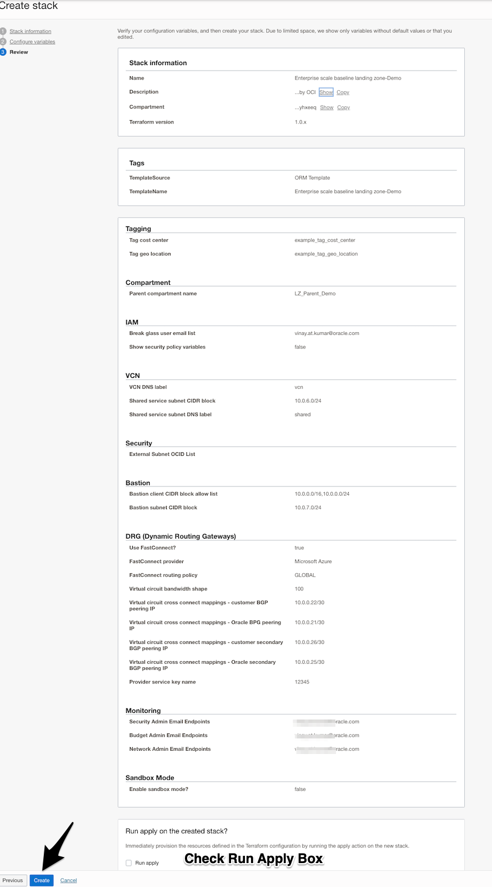
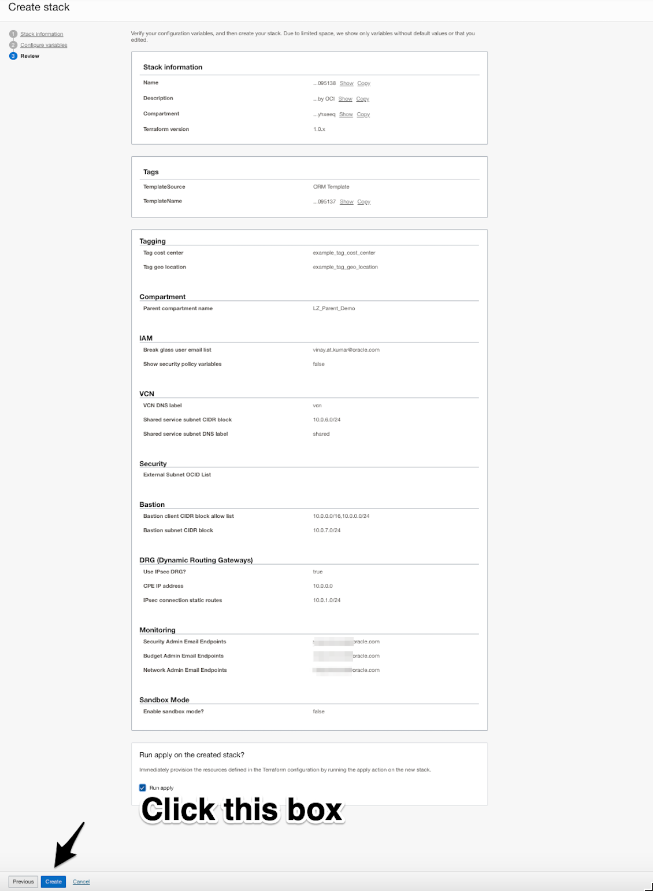
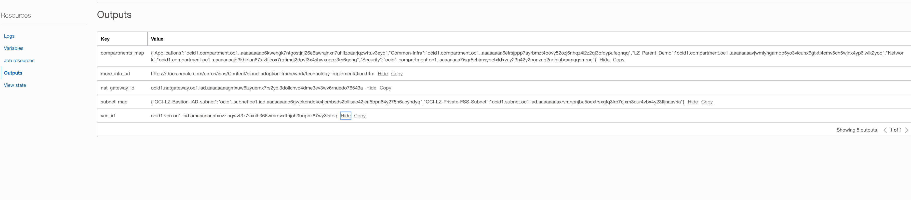
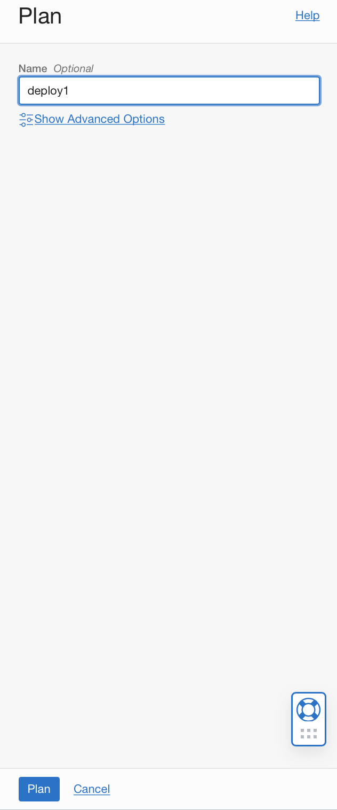

# Provision Oracle Enterprise Landing Zone Infrastructure.

## Introduction

In this lab exercise, you will provision all the Infrastructure resources used by your applications through Infrastructure As Code (IaC) using [Terraform](https://www.terraform.io) on [Oracle Cloud Infrastructure Resource Manager service (ORM)](https://docs.oracle.com/en-us/iaas/Content/ResourceManager/Concepts/resourcemanager.htm).  

#### Terraform
Terraform is an open-source tool that allow you to write infrastructure as code using declarative configuration files that will represent the state of your infrastructure. 

The Landing Zone is written entirely in Terraform and can be extended by modifying the stack or writing additional Terraform that builds upon the base configuration.

#### Resource Manager
OCI Resource Manager allows you to share and manage Terraform configurations and state files across multiple teams and platforms. 

You will use it in this lab to deploy terraform stacks without needing to install any tools locally.

Estimated time: 30 minutes

Watch the video below for a quick walk-through of the lab. 
[Deploy Baseline Landing Zone](videohub:1_mf98gcul)

### Objectives

In this lab, you can deploy OLEZ stack via 2 method(use one)

* Create OELZ stack via ORM.
* Create OELZ stack via CLI.

### Prerequisites

* An Oracle Free Tier(Trial), Paid or LiveLabs Cloud Account
* User that belongs to the Administrator group or has granted privileges to manage multiple OCI resources (IAM, ORM, Network, etc).

## Task 1: Create OELZ stack via ORM

The first step is to create a OCI Resource Manager Stack. The Stack is a collection of Oracle Cloud Infrastructure resources corresponding to a given Terraform configuration. Each stack resides in the compartment you specify, in a single region; however, resources on a given stack can be deployed across multiple regions. An OCID (unique identifier) is assigned to each stack.

1. Open up Resource Manager service. You can click directly on Resource Manager in the navigation path menu, otherwise, Go back to the main Navigation Menu -> Developer Services -> Resource Manager.

2. In the stack section, click create stack and choose template as the origin of the Terraform configuration.
    |Varibale Name|Value|
    |--|--|
    |Parent compartment name|`OELZ_Demo`|
    |Create in Compartment| tenancy (root)|
    |Terraform Version| leave the default option if you have the option to select it|
    
    

3. Click on the zip file and select the saved zip file.
    
    
4. Click on next button.
    
    
5. Configure Variables. Most of the default value are pre-defined , only the default domain email need to updated. 

* Sample Variable Values Used  
    |Defination|Variable|Value|
    |--|--|--|
    ||resource_label|`Example_tag_cost_center`|
    ||prod_domain_admin_email|`example@domain.com`|
    ||home_compartment_name|`LIVELAB-OCI-CMP-HOME`|
    ||prod_cost_center_tagging|`LIVELAB_COST_TAG`|
    ||prod_geo_location_tagging|`LIVELAB_GEO_TAG`|
    ||prod_enable_internet_gateway_hub|`true`|
    ||prod_enable_nat_gateway_hub|`true`|
    ||prod_enable_service_gateway_hub|`true`|
    ||prod_enable_nat_gateway_spoke|`true`|
    ||prod_enable_service_gateway_spoke|`true`|
    ||prod_hub_vcn_cidr_block|10.1.0.0/16|
    ||prod_hub_public_subnet_cidr_block|10.1.1.0/24|
    ||prod_hub_private_subnet_cidr_block|10.1.2.0/24|
    ||prod_spoke_vcn_cidr|10.1.2.0/24|
    ||prod_spoke_subnet_web_cidr_block|10.1.2.0/24|
    ||prod_spoke_subnet_app_cidr_block|10.1.2.0/24|
    ||prod_spoke_subnet_db_cidr_block|10.1.2.0/24|
    ||Bastion client CIDR block allow list|10.0.0.0/16, 10.0.0.0/24|
    
* Enter Variables

    * The tag fields correspond to freeform tags that are applied to resources created within the template. These can be used to identify the cost center and location of the resources. Each resource created is also given a default assigned value for the Description tag.
    * The parent compartment and other compartment name variables are used to rename the compartment structure. This includes the parent level compartment, security, network, and workload-specific compartments.

    

2. Enter IAM Vars including break glass user email list. Group name variables can be left as default.

    * The break glass user is an IAM user created with full administrator permissions. Entering a valid email here will create the user and send an email allowing access.
    * IAM lets you control who has access to specific cloud resources and what type of access a group of users can have. The Baseline Landing Zone provisions IAM groups with established roles and access levels. The group names listed are the default names but can be overridden by updating using the Terraform variables. 

    

3. Enter Networking variables for the VCN and subnet configuration

    * The landing zone provisions a VCN, nat gateway, internet gateway, and shared services subnets. You will need to input cidr blocks and dns labels.
    * The landing zone also provides options for connectivity using an Ipsec tunnel or a Fastconnect connection. In this lab however, it can remain disabled.

    

4. Enter Security variables for Cloud Guard, Vulnerability Scanning Service, VCN Flow Logging, and Audit Logs.

    * Cloud Guard is an OCI resource that detects misconfigured resources and insecure activity across tenants. It enables security administrators to triage and resolve cloud security issues. Security inconsistencies can be automatically resolved with out-of-the-box security recipes.
    * VCN Flow Logs for the provisioned VCN subnets can be viewed in the Logging Analytics Dashboard. You can also enter subnet ocids to log traffic for externally created subnets. Audit Logging can also be enabled using the same variable which enables logging and stores them in an archive bucket.
    * The bastion provides restricted and time-limited access to cloud resources without public-facing endpoints. There are two types of bastion sessions, managed SSH and port forwarding, which depends on the type of target resource. Input the cidr of the bastion subnet as well as the cidr blocks the bastion can connect to.

    

5. Enter the sample variables for creation of Bastions, Dynamic Routing Gateway(DRG) and Monitoring. 

    
    
    

6. Create the Stack.
    
    
7. Wait for the atleast ten minutes and then the Stack Jobs Status. 

8. Gather the Provisioned Resources OCID Value. 
    * Hamburger-->Resource Manager-->Stacks-->Stacks Detail-->Resource-> Select Output 

## Task 3: Provisioning the Infrastructure

1. After creating the Stack, you can perform some Terraform operations that are also known as `Jobs` in OCI. By clicking on `Plan` button and defining a name for your plan, e.g. `deploy1` Resource Manager will parse your Terraform configuration and creates an execution plan for the associated stack. The execution plan lists the sequence of specific actions planned to provision your Oracle Cloud Infrastructure resources. The execution plan is handed off to the apply job, which then executes the instructions.
    
    

2. Once the job state is `Succeeded`, click on `Stack Details` navigation menu on the top of the page to go back to the previous page. 
    

3. Then, click `Apply` and enter a name (e.g `deploy1`), select the Apply Job Plan resolution that was previously created (`deploy1`). This will apply the execution plan to create (or modify) your Oracle Cloud Infrastructure resources. This operation will take some time to complete (15-20 minutes) as it is going to provision all infrastructure resources needed by this lab (IAM, Network, Logging, OKE).

4. After that, if you want to make any change to the variables, you can go back to the Stack details page, click on `Edit` button to change them. Then, you need to run Plan and Apply jobs to make these changes into the infrastructure. Always review the execution plan as some resources are immutable and they can be completely destroyed and recreated by Terraform/ORM after hitting `Apply`.

Note: in case of quota/service limit/permission issues, Apply job will fail and partial resources will be provisioned. Click on Destroy button will trigger the job to remove provisioned resources. 

You may now proceed to the next lab.

## Acknowledgements

* **Author** - LiveLabs Team
* **Contributors** - LiveLabs Team, Arabella Yao
* **Last Updated By/Date** - Arabella Yao, September 2022

