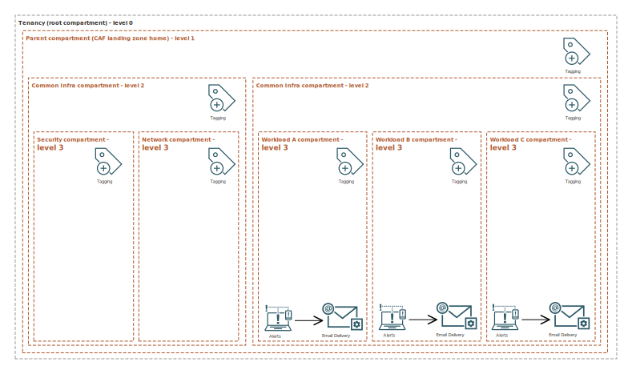
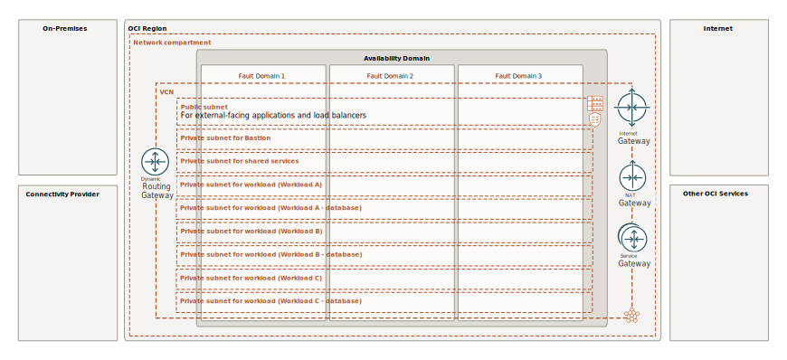
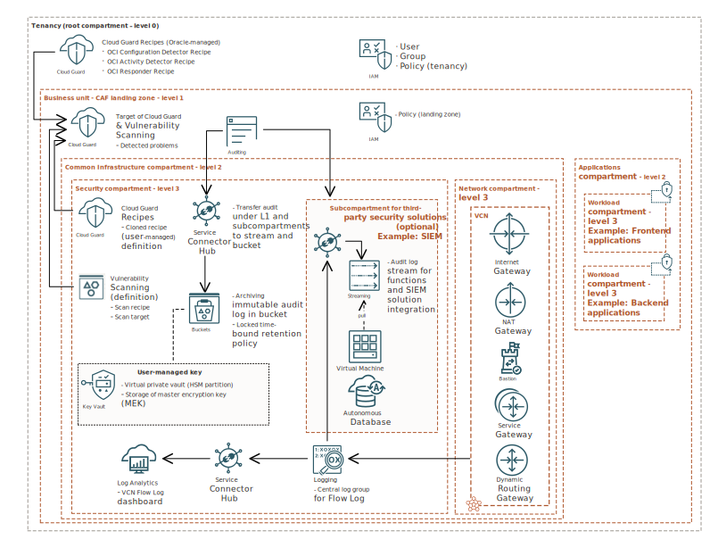

# Introduction

Get hands-on learning with training labs about Oracle cloud solutions. The workshops featured cover various solutions, skill levels, and categories based on Oracle Cloud Infrastructure (OCI).

Estimated time: 60 minutes

## Oracle Enterprise Scale Baseline Landing Zone v2.0 (ESBLZ v2.0)

The ESBLZ v2.0 landing zone provides the baseline architectural framework for your organization to deploy new projects and workloads on OCI. The landing zone consists of Terraform modules, the architectural documentation, and an implementation guide. The landing zone helps you quickly and securely create a foundation for your cloud deployment based on Oracle recommendations, customer experience, and industry-standard best practices.

ESBLZ v2.0 is a set of Terraform modules that are designed to make it easy to set up a secure and compliant multi-account infrastructure on OCI. Some common use cases for OCI Enterprise Scale Baseline Landing Zone include:

- Governance and compliance: The ESBLZv2 provides a set of pre-built policies and guardrails that help ensure that your OCI environment is compliant with industry standards, such as ISO27001 and PCI DSS (these and other compliance standards will be part of ongoing releases).
- Automation and scalability: The Landing Zone can be used to automate the creation of new accounts, users, and resources on OCI, making it easy to scale your infrastructure as your organization grows.

## Architecture Overview

The ESBLZv2 creates an architectural framework that's ready for you to launch new projects and workloads on OCI.

- Compartments: Use compartments to organize and isolate your resources to make it easier to manage and secure access to them.
- Tags: Use tags to organize and list resources based on your business needs.
- Budgets and alerts: Use budgets to set soft limits on your OCI spending, and use alerts to let you know when you might exceed your budget.
- Oracle Cloud Infrastructure Identity and Access Management (IAM): Use IAM to control access to your cloud resources on OCI.
- Networking and connectivity: Create a virtual cloud network (VCN), subnets, and other networking and connectivity resources that are required to run your  workloads.
- Security: Enable a strong security posture by enabling OCI security services such as Oracle Vulnerability Scanning Service, and Oracle Cloud Infrastructure Bastion.

The following diagram illustrates the ESBLZv2.0 reference architecture.

The CAF landing zone creates an architectural framework that's ready for you to launch new projects and workloads on OCI.

- Compartments: Use compartments to organize and isolate your resources to make it easier to manage and secure access to them.
    

- Tags: Use tags to organize and list resources based on your business needs.

- Budgets and alerts: Use budgets to set soft limits on your OCI spending, and use alerts to let you know when you might exceed your budget.

- Oracle Cloud Infrastructure Identity and Access Management (IAM): Use IAM to control access to your cloud resources on OCI.

- Networking and connectivity: Create a virtual cloud network (VCN), subnets, and other networking and connectivity resources that are required to run your workloads and connect to the internet or your on-premises network.
    

- Security: Enable a strong security posture by enabling OCI security services such as Oracle Cloud Guard, Oracle Vulnerability Scanning Service, and Oracle Cloud Infrastructure Bastion.
    

## Additional Recommended Resources

1. [OCI Training](https://cloud.oracle.com/en_US/iaas/training)
2. [Familiarity with OCI console](https://docs.us-phoenix-1.oraclecloud.com/Content/GSG/Concepts/console.htm)
3. [Overview of Networking](https://docs.us-phoenix-1.oraclecloud.com/Content/Network/Concepts/overview.htm)
4. [Familiarity with Compartments](https://docs.us-phoenix-1.oraclecloud.com/Content/GSG/Concepts/concepts.htm)

*Please proceed to the next lab*

<!-- ## Acknowledgements

- **Author** - Kay Malcolm, Director, Product Management
- **Adapted by** -  Yaisah Granillo, Cloud Solution Engineer, NA Cloud
- **Contributors** - LiveLabs QA Team (Arabella Yao, Product Manager Intern | Isa Kessinger, QA Intern)
- **Last Updated By/Date** - Kay Malcolm, October 2020 -->

