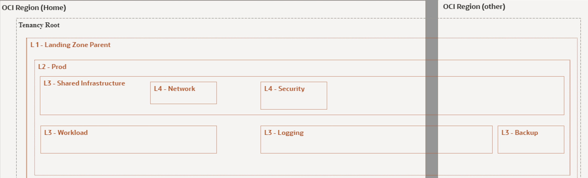

# Introduction

Get hands-on learning with training labs about Oracle cloud solutions. The workshops featured cover various solutions, skill levels, and categories based on Oracle Cloud Infrastructure (OCI).

Estimated time: 60 minutes

## Oracle Enterprise Landing Zone (OELZ)

The OELZ provides the baseline architectural framework for your organization to deploy new projects and workloads on OCI. The landing zone consists of Terraform modules, the architectural documentation, and an implementation guide. The landing zone helps you quickly and securely create a foundation for your cloud deployment based on Oracle recommendations, customer experience, and industry-standard best practices.

OELZ is a set of Terraform modules that are designed to make it easy to set up a secure and compliant multi-account infrastructure on OCI. Some common use cases for Oracle Enterprise Landing Zone (OELZ) include:

- Governance and compliance: The OELZ provides a set of pre-built policies and guardrails that help ensure that your OCI environment is compliant with industry standards, such as ISO27001 and PCI DSS (these and other compliance standards will be part of ongoing releases).
- Automation and scalability: The Landing Zone can be used to automate the creation of new accounts, users, and resources on OCI, making it easy to scale your infrastructure as your organization grows.

## Architecture Overview

The OELZ creates an architectural framework that's ready for you to launch new projects and workloads on OCI.

- Compartments: Use compartments to organize and isolate your resources to make it easier to manage and secure access to them.
- Tags: Use tags to organize and list resources based on your business needs.
- Budgets: Use budgets to set soft limits on your OCI spending.
- Oracle Cloud Infrastructure Identity and Access Management (IAM): Use IAM to control access to your cloud resources on OCI.
- Networking and connectivity: Create a virtual cloud network (VCN), subnets, and other networking and connectivity resources that are required to run your  workloads.
- Security: Enable a strong security posture by enabling OCI security services such as Oracle Vulnerability Scanning Service, and Oracle Cloud Infrastructure Bastion.

The following diagram illustrates the OELZ reference architecture.

## Compartments Overview

You use compartments to organize and isolate your resources to make it easier to manage and secure access to them.
The OELZ creates a compartment structure for your organization. You control access to compartment by creating policies that specify what actions groups of users can take on the resources in those compartments. The following diagram shows the compartment structure that is created by the landing zone:

The compartments module only creates the compartment structure for a single environment which include the following compartments:

- L2 Environment: The encapsulating compartment for an environment.
- L3 Shared infrastructure : compartment containing the shared infrastructure:
   - L4: Network : The compartment that will hold the Hub component of the network.
   - L4 Security : The compartment holding the security and identity components.
- L3 Workload compartment that will hold a spoke connecting to the hub.
- L3 Logging : Compartment that will hold a bucket to store the log files from the environment.
- L3 Backup : A backup compartment that will contain the configuration and state file.

## Identity Overview
The identity module creates and configures an identity domain in an environment in the landing zone.
In order to isolate access between resources, groups are created together with policies in order to restrict access to certain resources.

- Network Admin : User group that have access to the network resources inside your environment
- SecOps Admin  : User group that have access to the security related resources inside your environment
- Identity Admin: User group that can manage the identity related resources
- Platform Admin: User group that have access to usage reports and can manage budgets
- Ops Admin     : User group that have access to the metrics, events and alerts in your environment
- Log Admin     : User group that have access to the logs of your environment

## Network Overview

The network module includes two main Functional Modules, the first will deploy a type of network called "Hub & Spoke" (H&P) that will allow the various workloads to interconnect with each other. The second one called "Network Extension Module" will extend connectivity with the on-premises network as well using the H&P created previously.
By default, the OELZ will deploy the H&P module within the " L2 - OCI-ELZ-<Environment Name>". Also, the Network Extension Module will be an optional module and it will only be allowed to be deployed in the production environment. As a result, it will be shared between the two environments prod and non-prod.
The main components that the Hub module will have been as follows:

- A VCN which will host the different subnets of the HUB deployed in the L4 - Network compartment
- A public subnet to host all internet-facing servers and resources, including load balancers, Web Servers...This subnet must be secured with the correct Cloud Guard recipes and other security features, as described in Security paragraph.
- A private subnet to host all common or shared services that your environment uses such as Network Virtual Appliance, Internal Jump Box Server.
- A DRG which will enable routing between the VNC Hub and other application VCNs (spokes), deployed in the L4 - Network compartment
- A Internet Gateways [Optional] which allows traffic between the public subnets in a VCN and the public internet, deployed in the L4 - Network compartment
- A NAT Gateways [Optional] which enables private resources in a VCN to access hosts on the internet, without exposing those resources to incoming internet connections, deployed in the L4 - Network compartment
- A Service gateway [Optional] which provides access from a VCN to other services, such as Oracle Cloud Infrastructure Object Storage. The traffic from the VCN to the Oracle service travels over the Oracle network fabric and never traverses the internet, deployed in the L4 - Network compartment.

The main components that the Spoke module will have are as follows:
- A VCN which will host the different subnets of the Spoke deployed in the L3 - Workload compartment
- Three private subnets to host all components of your application using different tier such as Web, App and DB.
- A VCN Attachments which will be connected to the DRG of the HUB.
- A NAT Gateways [Optional] which enables private resources in a VCN to access hosts on the internet, without exposing those resources to incoming internet connections, deployed in the L3 - Workload compartment
- A Service gateway [Optional] which provides access from a VCN to other services, such as Oracle Cloud Infrastructure Object Storage. The traffic from the VCN to the Oracle service travels over the Oracle network fabric and never traverses the internet, deployed in the L3 - Workload compartment.

## Security Overview

Oracle Cloud Infrastructure (OCI) is a Security-first Cloud Service that helps organizations reduce the risk of security threats for cloud workloads by putting our customers' Data Security and Privacy first.  This is achieved via the automation of security operations with simple, prescriptive, and integrated cloud-native security capabilities built into the OCI platform.  Oracle helps customers easily adopt OIC services and secure their cloud infrastructure, data, and applications.

The OELZ further supports Oracle's Security-First Cloud strategy tenets:

- Security should be simple—easy to use, deploy, and operate
- Security tools should offer guidance to help customers achieve strong security more easily

## Workloads

Workloads are the "shell" for you to deploy an application or service into. They provide infrastructure such as a compartment you can place application resources in, user groups to manage the application, network and logging infrastructure, etc. The OELZ will set up one initial workload configuration in prod Environment. Workload Compartment will be used to deploy Mushop Application.

## Additional Recommended Resources

1. [OCI Training](https://cloud.oracle.com/en_US/iaas/training)
2. [Familiarity with OCI console](https://docs.us-phoenix-1.oraclecloud.com/Content/GSG/Concepts/console.htm)
3. [Overview of Networking](https://docs.us-phoenix-1.oraclecloud.com/Content/Network/Concepts/overview.htm)
4. [Familiarity with Compartments](https://docs.us-phoenix-1.oraclecloud.com/Content/GSG/Concepts/concepts.htm)

*Please proceed to the next lab*

<!-- ## Acknowledgements

- **Author** - Kay Malcolm, Director, Product Management
- **Adapted by** -  Yaisah Granillo, Cloud Solution Engineer, NA Cloud
- **Contributors** - LiveLabs QA Team (Arabella Yao, Product Manager Intern | Isa Kessinger, QA Intern)
- **Last Updated By/Date** - Kay Malcolm, April 2023 -->

