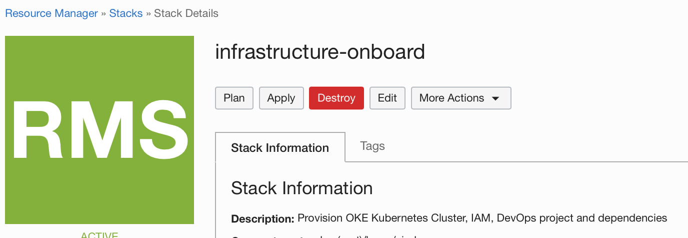
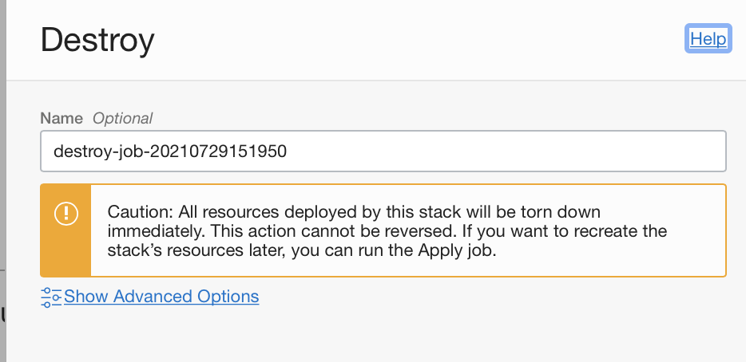
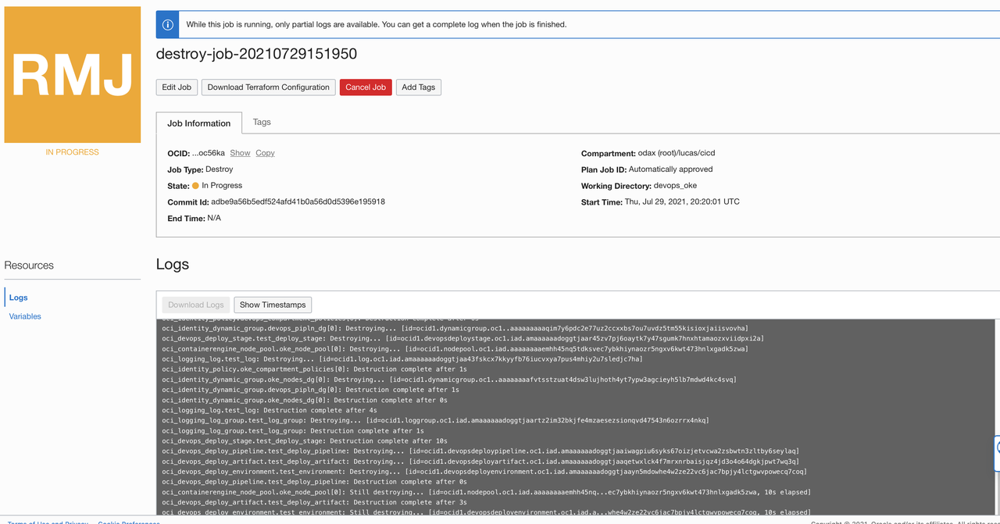
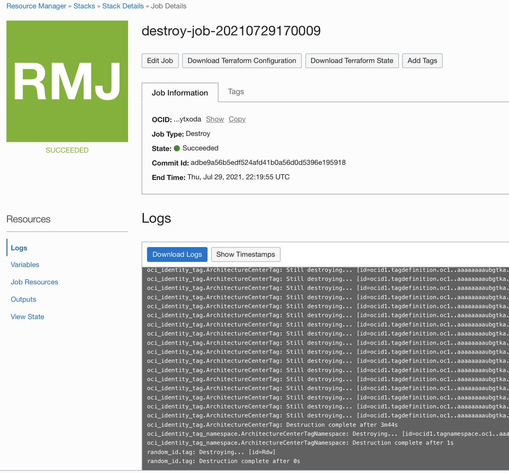
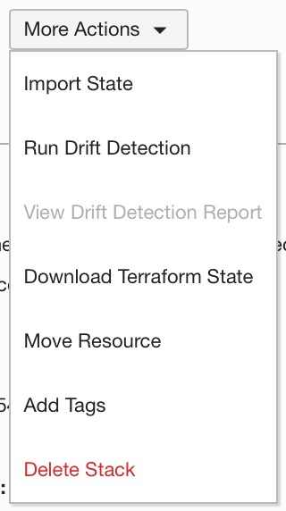

# Provision the Infrastructure using Resource Manager

## Introduction

In this lab exercise, you will walk through the next steps in the Landing Zone life cycle - using and extending the landing zone. You will simulate a business running their workload on OCI and see how different roles can within a business can leverage the Landing Zone. The Enterprise Scale Landing Zone provisions administrative groups for Security, Operations, IAM, Platform, and Network.

Estimated time: 10 minutes

### Objectives

In this lab, you will:

* Inspect the resources created by the Landing Zone.
* Learn the capabilities and functions of the roles created by the Landing Zone.

### Prerequisites

* An Oracle Free Tier(Trial), Paid or LiveLabs Cloud Account
* User that belongs to the Administrator group or has granted privileges to manage multiple OCI resources (IAM, ORM, Network, etc).

## Task 1: Security Resources

The Security Admin is the user role responsible for encryption related resources such as the keys and vaults as well as monitoring resources such as Cloud Guard and VSS. It has the following permissions.

* Ability to associate an Object Storage bucket, Block Volume volume, File Storage file system, Kubernetes cluster, or Streaming stream pool with a specific key
* Ability to do all things with secrets in a specific vault
* Ability to list, view, and perform cryptographic operations with all keys in compartment
* Admin access to VSS
* Admin access to Cloud Guard

### Logging

   1. Open up the Logging service by going to the Navigation Menu (aka "Hamburger" menu on the top left side of the page ) -> Observability and Management -> Logging -> Log Groups 
   2. Select the `landing_zone_parent/common-infra/security` compartment to see the created log groups within it.
    
   3. Clicking on the `_Audit` group allows you to explore audit logs while clicking on the `central_logging_group` allows you to explore flow logs.
   4. Navigate to the Logging Analytics service by going to the Navigation Menu (aka "Hamburger" menu on the top left side of the page ) -> Observability and Management -> Logging Analytics -> Dashboards -> VCN Flow Logs
      * Here network logs can be analyzed and visualized. The dashboards and the queries can customized to suite your needs. As you add more instances and resources that generate traffic to the monitored subnets, the logs will populate the dashboard.
        

   5. Open up the Object Storage service by going to the Navigation Menu (aka "Hamburger" menu on the top left side of the page ) -> Storage -> Object Storage and Archive Buckets -> Buckets.
   6.  Select the `landing_zone_parent/common-infra/security` compartment to see the archive bucket with audit logs.
        * The bucket can be used for compliance purposes and is protected with a retention rule and set to archive.
        

### Monitoring

1. View the Cloud Guard resources by navigating to Identity & Security -> Cloud Guard -> Overview
   * The Cloud Guard service allows you to view and create detector recipes besides the 3 Oracle Managed lists. You can also set and create responder recipes by cloning an existing recipe from the root compartment
   * The Landing Zone sets the parent compartment as the target for scanning. You can view the detected problems for the selected target on the problems page.

    

## Task 2: Workload Resources
The Network Admin is the user role responsible for managing network related resources such as the Bastion, Load Balancer, and VCN. It has the following permissions.

* Ability to manage all resources in the Bastion service in all compartments
* Access to all components in Load-balancing
* Ability to manage virtual network family 

The Workload Admin is the user role responsible for deployment of workload compute resources. It has the following permissions.

* Ability to do everything with custom images and compute instances
* Ability to do all things with instance configurations, instance pools, and cluster networks
* If resources used by the instance pool contain default tags, add the following  to give the group permission to the tag namespace Oracle-Tags
* Ability to create, update, and delete autoscaling configurations
* Ability to manage Instance Console Creation
* Ability to create and list subscriptions to images in the partner Image catalog.
* Ability to create, update and delete dedicated Virtual Machine Hosts
* The policy in Let users launch compute instances includes the ability to enable and disable individual plugins, as well as start and stop all plugins on an instance
* Ability to use virtual network family resources.

### Networking
1. Open up the Networking service by going to the Navigation Menu (aka "Hamburger" menu on the top left side of the page Networking -> Virtual Cloud Networks -> Logging 
2. Select the `landing_zone_parent/common-infra/network` compartment to see the created VCN.
3. Clicking on the `Primary-VCN`, you can modify the provisioned networking resources.

## Task 3: Deployment

* Before the Start of the Section . Please Gather the Application Compartment OCID and Network Compartment OCID from the Lab 2 Deployment. 

   * Application Compartment OCID
   * Network Compartment OCID

* Get the Application Compartment OCID. 
   * Hamburger-->Networking-->Virtual Cloud Networks-->Select the LZ_Parent_Demo Compartent--> Select the Application

* Get the Network Compartment OCID.
   * Hamburger-->Networking-->Virtual Cloud Networks-->Select the LZ_Parent_Demo Compartent--> Select the Network 

* Get the VCN Compartment OCID.
   * Hamburger-->Networking-->Virtual Cloud Networks-->Virtual Cloud Network Details

* Get the NAT Gateway OCID.
   * Hamburger-->Networking-->Virtual Cloud Networks-->Select the LZ_Parent_Demo Compartent--> Select the NAT Gateway 

* Sample Variable Value
    |Variable|Value|
    |--|--|
    |Tag cost center|`WBLZ_Demo`|
    |Tag geo location|`WBLZ_Demo_Geo`|
    |Applications compartment OCID |Enter the Application OCID|
    |Workload compartment name|`WBLZ_Demo_Username`|
    |Network compartment name|`WBLZ_Network_Compartment_Demo`|
    |Network compartment OCID|Enter the Network Compartment OCID|
    |VCN OCID|Enter the VCN OCID|
    |NAT gateway OCID|Enter the NAT Gateway OCID|
    |Private subnet CIDR blocks|10.0.2.0/24|
    |Private subnet DNS labels|private0|
    |Database subnet CIDR blocks|10.0.4.0/24|
    |Database subnet DNS labels|database0|
    
* Open up Resource Manager service. You can click directly on Resource Manager in the navigation path menu, otherwise, Go back to the main Navigation Menu -> Developer Services -> Resource Manager.

In the stack section, click create stack and choose template as the origin of the Terraform configuration. 

* Use the Sample Variable Value and captured OCID to fill the Tagging , Compartment, Workload compartment and VCN information.
 

* Wait for atleast ten minutes and check the stack status.

## Task 4: Clean Up 

Congratulations, you completed the workshop. You may want to release the cloud resources created through this workshop. We will we use ORM to delete resources managed through Infrastructure As Code/Terraform.

All resources provisioned during this workshop that were managed exclusively via Resource Manager can be destroyed running a `Destroy` job associated with your Stack `infrastructure-onboard`.

1. Open the navigation menu and click Developer Services. Under Resource Manager, click Stacks.

2. Choose the `cicd` compartment if you haven't selected before. The page updates to display only the resources in that compartment. 

3. Click the name of the stack `infrastructure-onboard`.

4. The Stack Details page is displayed.

5. Click Destroy.
    

6. In the Destroy panel, you can enter a name for the job and click Destroy again to confirm your action.
    

    You can monitor the status and review the results of a destroy job by viewing the state or the logs.
        

    To view the Terraform state file (shows the state of your resources after running the job), click the name of the job to display the Job Details page, then click View State under Resources.

    To view the logs for the job, click the name of the job to display the Job Details page, then click Logs under Resources.

7. At the end, the Destroy job succeeds and your resources were released.
    

8. You can go back to the Stack Details page, and delete the Stack by clicking on `More Actions -> Delete Stack` and click again to confirm your action. 
      
