# Install the components

## Introduction
In this lab, you will prepare OCI to use generative AI and large language models.

Optionally, you will import an open-weight model into a Dedicated AI Cluster (DAC).

DAC-hosted models run on dedicated infrastructure in your tenancy. Use a DAC-hosted model when you need production-grade control over model hosting and inference. DACs provide flexibility, isolation, predictable latency, fine-tuning support, cost efficiency at scale, deployment near data, and simplified management.

Estimated time: 30 min

### Objectives

- Configure OCI Generative AI access, Visual Studio Code, and Cline, then generate a Hello World app.

### Prerequisites

- An OCI account with sufficient credits for completing the lab. (Some of the services used in this lab are not part of the *Always Free* program.)
- Check that your tenancy has access to a Generative AI region, such as **Frankfurt, London, Chicago, Abu Dhabi, Riyadh, or Osaka**. See the full list here: https://docs.oracle.com/en-us/iaas/Content/generative-ai/regions.htm
    - **For Paid Tenancy**
        - Click the region selector at the top of the screen.
        - Check that your tenancy is subscribed to one of the above regions.
        - If not, click **Manage Regions** to add it to your regions list. You need tenancy administrator rights for this.
        - For example, click on the US Midwest (Chicago).
        - Click **Subscribe**.

    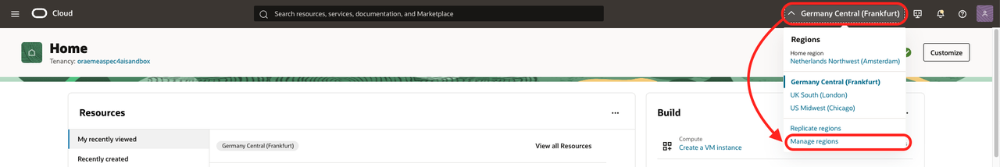

    - **For Free Trial**, the home region should be one where Generative AI On Demand is available.
- This lab uses Cloud Shell with Public Network access.

    The lab assumes that you have access to OCI Cloud Shell with Public Network access.
    To check whether you have it, start Cloud Shell. You should see **Network: Public** at the top. If not, try changing to **Public Network**. If it works, there is nothing else to do.
    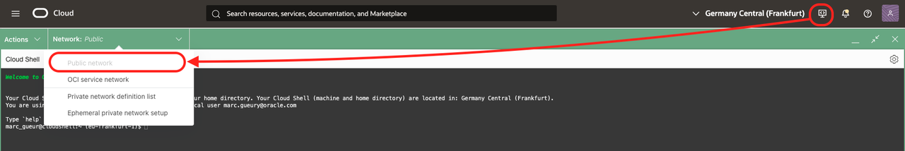

    OCI administrators have this permission automatically, or your administrator may have already added the required policy.
    - **Solution:**

        If not, ask your administrator to follow this document:
        
        https://docs.oracle.com/en-us/iaas/Content/API/Concepts/cloudshellintro_topic-Cloud_Shell_Networking.htm#cloudshellintro_topic-Cloud_Shell_Public_Network

        They need to add a policy to your tenancy:

        ```
        <copy>
        allow group <GROUP-NAME> to use cloud-shell-public-network in tenancy
        </copy>        
        ```

## Task 1: Prepare to save configuration settings

1. Open a text editor and copy and paste this text into a file on your local computer. These are the variables used during the lab.

    ```
    <copy>
    List of ##VARIABLES##
    =====================
    REGION=(SAMPLE) eu-frankfurt-1
    COMPARTMENT_OCID=(SAMPLE) ocid1.compartment.oc1.xxxxxxx
    api-key1=(SAMPLE) sk-xxxxxxxxxxxxxx
    api-key2=(SAMPLE) sk-xxxxxxxxxxxxxx
    OBJECT_STORAGE_NAME=(SAMPLE) bucket-123456
    OPENWEATHER_API_KEY=(SAMPLE) xxxxxx
    
    Optional
    ========
    hugging-face-token=(SAMPLE) hf_xxxxxxxxxxxxxxxxxxxx
    BASE_URL=(sample) https://inference.generativeai.eu-frankfurt-1.oci.oraclecloud.com/openai/v1/chat/completions
    GENAI_DAC_ENDPOINT_OCID=(SAMPLE) ocid1.generativeaiendpoint.oc1.xxxxxxxxxx


    -----------------------------------------------------------------------
    </copy>
    ```  

## Task 2: Create a Compartment

The compartment will be used to contain all the components of the lab.

You can:
- Use an existing compartment to run the lab.
- Create a new one (recommended).

1. Log in to your OCI account/tenancy.
2. Double-check that you are in a region with GenAI available.
3. Go to the 3-bar/hamburger menu of the console, then Identity & Security > Compartments.
    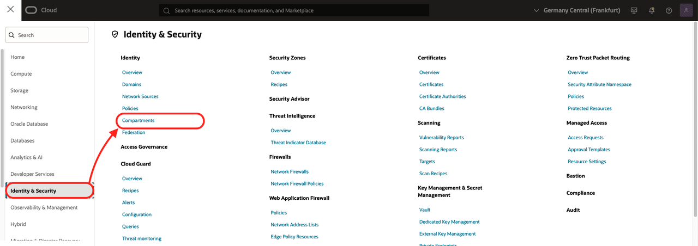
4. Click ***Create Compartment***.
    - Give it a name, for example, ***VIBE-AI***.
    - Click ***Create Compartment*** again.
    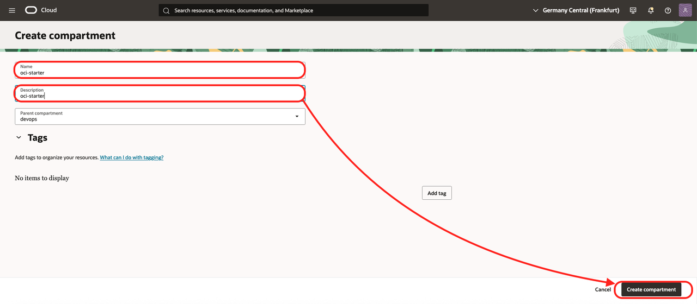
5. When the compartment is created, copy the compartment OCID, ##COMPARTMENT_OCID##, and add it to your notes.

## Task 3: Create a Policy 

- Go to the OCI Console menu and choose *Identity & Security* / *Policies*.
    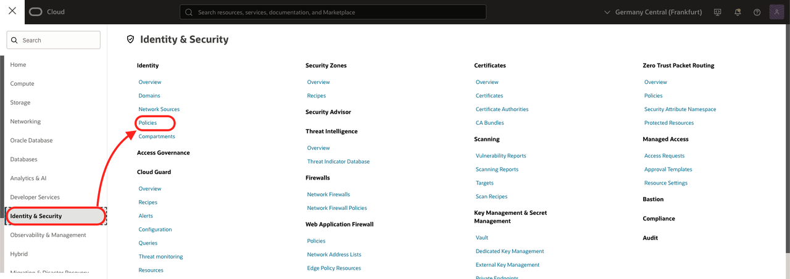
- Click *Create Policy*.
- Name: *policy-vibe*
- Description: *policy-vibe*
- Click *Show Manual editor*.
- Copy the following, replacing ##COMPARTMENT\_OCID## with your value:
    ```
    allow any-user to manage generative-ai-family in compartment id ##COMPARTMENT_OCID##
    ```
- Click *Create*.
    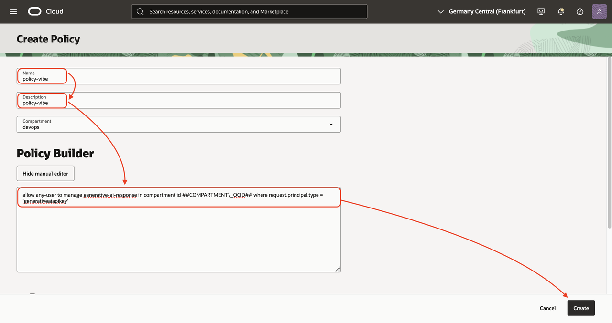

## Task 4: Create an API Key - Optional

First, create an OpenAI-compatible API key.
1. Log in to the OCI Console. Record the region name in your notes as ##REGION##. You should be in a region with Generative AI. See the full list here: https://docs.oracle.com/en-us/iaas/Content/generative-ai/regions.htm
2. Click the hamburger menu / AI & Analytics / Generative AI.

    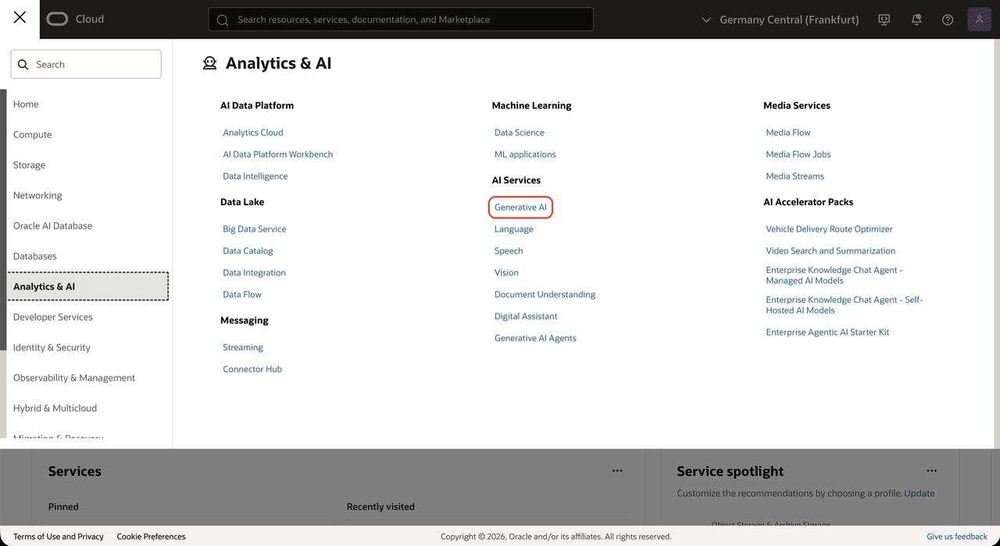

3. Go to **API Keys** on the right side.
4. Click **Create API key**.

    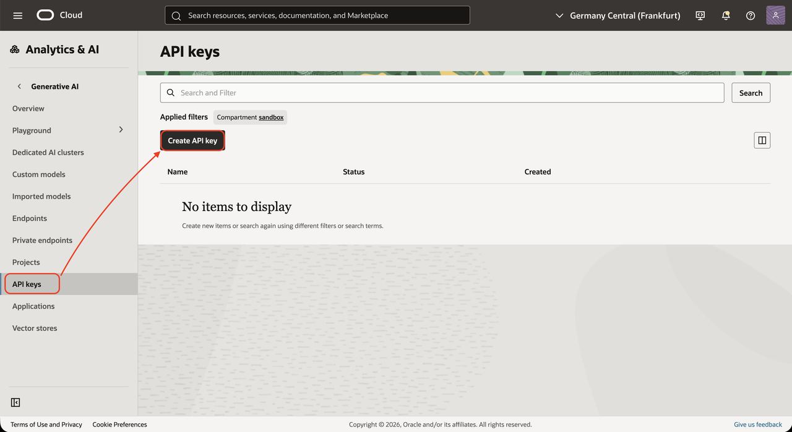

5. Fill in the following:
    - Name: **api-key**
    - Key one name: **api-key1**
    - Key one expiration date: **7/20/2030** (a date far in the future)
    - Key two name: **api-key2**
    - Key two expiration date: **7/20/2030** (a date far in the future)
    - Click *Create*.

    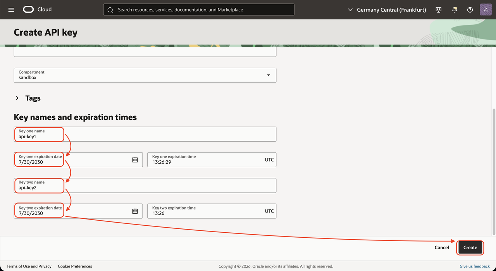

6. Copy the values of the two keys in your notes (##api-key1##, ##api-key2##).
    - api-key1=sk-xxxxxxxxx
    - api-key2=sk-xxxxxxxxx
    - Click **Close**.
Although you can choose any model from any provider to continue the lab, this guide covers several models available in OCI.

## Task 4: Create a Policy - Optional

- Go to the OCI Console menu and choose *Identity & Security* / *Policies*.
    
- Click *Create Policy*.
- Name: *policy-vibe*
- Description: *policy-vibe*
- Click *Show Manual editor*.
- Copy the following, replacing ##COMPARTMENT\_OCID## with your value:
    ```
    allow any-user to manage generative-ai-family in compartment id ##COMPARTMENT_OCID## where request.principal.type = 'generativeaiapikey'
    ```
- Click *Create*.
    

## Task 5: Install a Dedicated AI Cluster (DAC) - Optional

⚠️ This optional task starts a GPU for at least one hour, so it may cost several euros per hour. Do not forget to stop the DAC after testing.

We will follow this process: https://docs.oracle.com/en-us/iaas/Content/generative-ai/imported-models.htm

DAC-hosted models run on dedicated infrastructure in your tenancy. Use a DAC-hosted model when you need production-grade control over model hosting and inference. DACs provide several advantages:

- **Flexibility:** Import supported Hugging Face-format models from Hugging Face or Object Storage, test imported models with shorter commitments, choose fine-tuned or quantized versions, and right-size based on visible hardware specifications.
- **Isolation:** Run workloads on dedicated GPU resources inside your tenancy, which helps protect sensitive data, avoids shared-resource contention, and supports regulated workloads.
- **Predictable latency:** Dedicated infrastructure can provide more stable time-to-first-token and inference response times than shared model endpoints, especially for scaling production applications.
- **Fine-tuning support:** Host fine-tuned models alongside base models, run multiple fine-tuned models on a single cluster, and control model lifecycle and upgrade cadence.
- **Cost efficiency at scale:** For inference-heavy workloads, DACs can reduce effective price per token by keeping dedicated resources highly utilized and hosting multiple models on one cluster.
- **Deployment near data:** Deploy in supported OCI regions, including regulated regions where available, to support data residency, lower latency, and simpler security reviews.
- **Simplified management:** OCI manages the infrastructure while you manage model deployment, scaling, fine-tuning, and application integration.

Documentation: https://docs.oracle.com/en-us/iaas/Content/generative-ai/import-model-from-hugging-face.htm#top

1. Create a Hugging Face token.
    - Open https://huggingface.co/ in your browser.
    - Log in or sign up.
    - Go to Hugging Face / Settings / Access Tokens.
    - Click **Create new token**.
        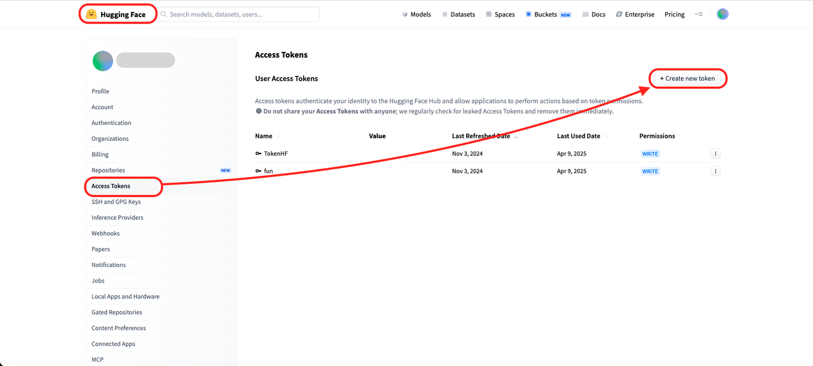    
    - Use either a read token (easier) or, preferably for production, a fine-grained token scoped to the model repository.
    - Copy the token into your notes as ##hugging-face-token##.
        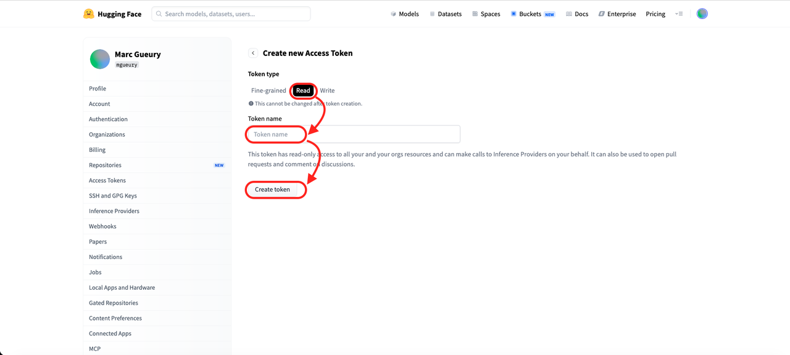    
2. In OCI Console, go to Analytics & AI / Generative AI / Imported models.
3. Click **Create Imported model**.
    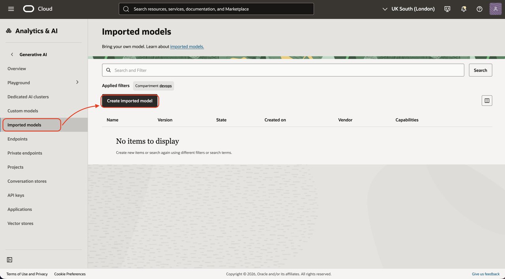 
4. Enter model metadata:
    - Available models may differ by the time you complete this lab. Choose the model that best suits your needs. This lab uses the following NVIDIA model: https://docs.oracle.com/en-us/iaas/Content/generative-ai/imported-nvidia-models.htm
    - Name: **NVIDIA-Nemotron-3-Nano-30B-A3B-FP8**
    - Description (optional): **Imported directly from Hugging Face**
    - Vendor (optional): **NVIDIA**
    - Version (optional): **1.0**
5. In Import configuration:
    - Data source type: **HuggingFace**
    - Model ID: **nvidia/NVIDIA-Nemotron-3-Nano-30B-A3B-FP8**
    - HuggingFace Token: paste the copied token ##hugging-face-token##
        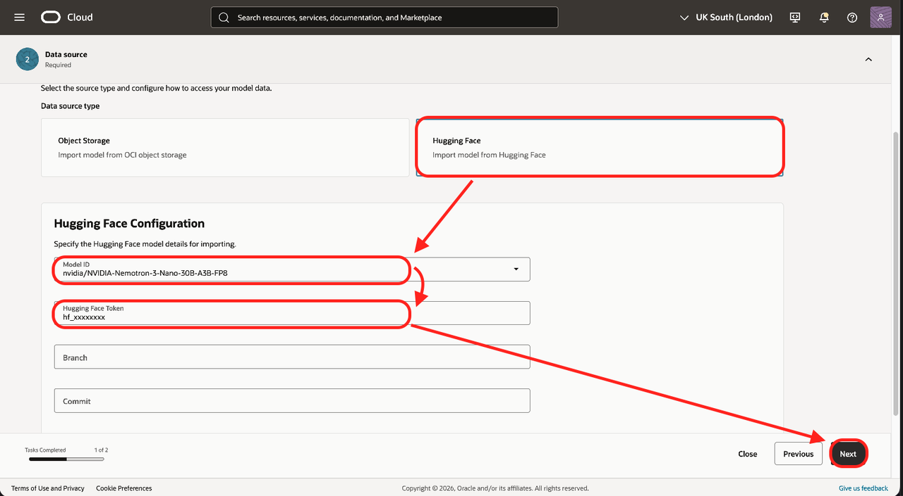  
6. Click **Next**, then **Save**, and wait until the imported model is active. For this model, it takes about three minutes.
7. In the left-hand menu, go to **Dedicated AI clusters**.
8. Click **Create dedicated AI cluster**.
    - Name: **dac-vibe***
    - Base model: **nvidia/NVIDIA-Nemotron-3-Nano-30B-A3B-FP8**
    - Unit shape: **H100 X4** (or **H100 X2** if you accept slower performance)
    - Model replica: **1**
    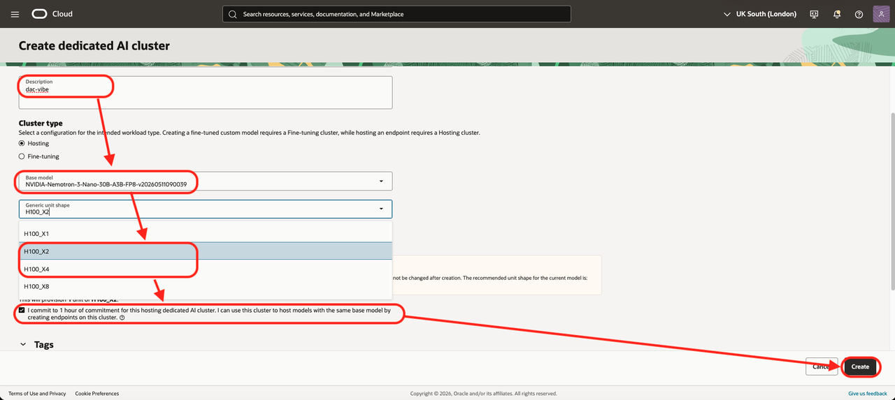     
9. Wait until the DAC is active.
10. Go to **Endpoints**.
    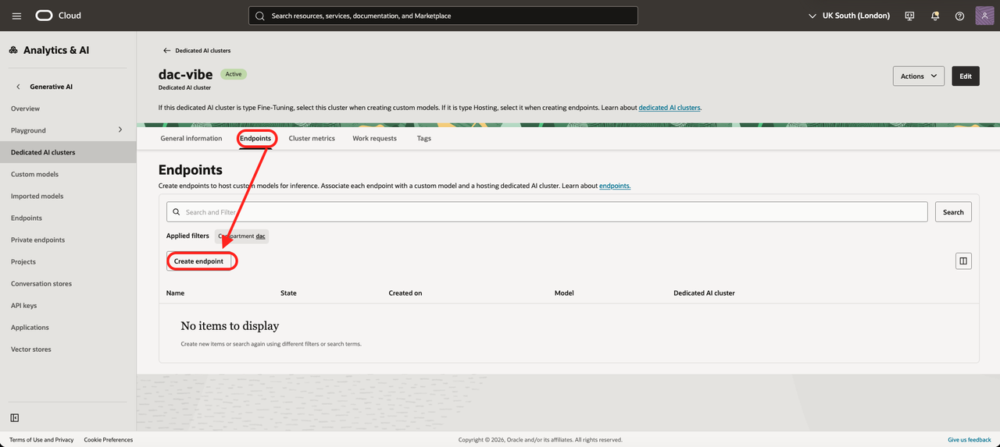 
11. Click **Create endpoint**.
    - Name: **dac-endpoint***
    - Model: **NVIDIA-Nemotron-3-Nano-30B-A3B-FP8**
    - Click **Create**.
    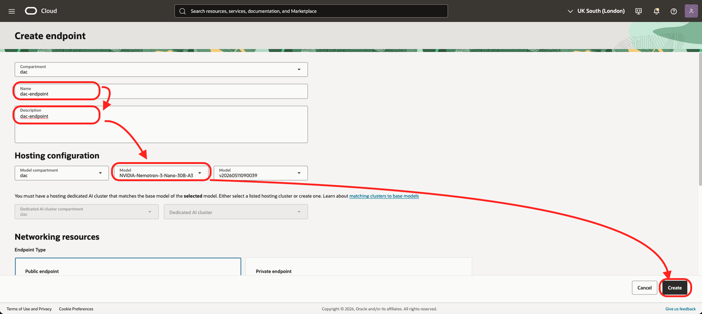     
    - Open the endpoint, copy the endpoint OCID, and add it to your notes as ##GENAI_DAC_ENDPOINT_OCID##.
12. When the endpoint is active (which can take 15 minutes or more, depending on the model size), try it using **View in Playground** in the top-left corner. Try “tell me a joke” or “who are you?”
    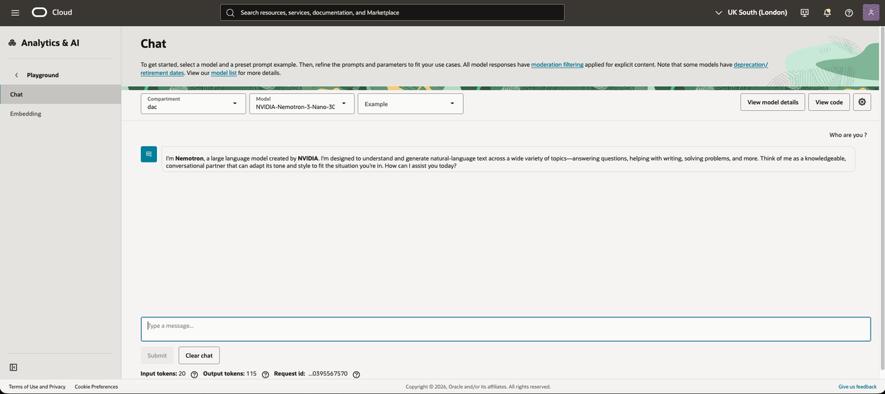 


## Known Issue

- None

## Acknowledgements

- **Author**
    - Marc Gueury, AI Agents Black Belt
    - Ilayda Temir, Generative AI Black Belt
