# Explore and Test

## Introduction

In this lab, we will download, explore and test the LangGraph and LangChain examples.

Each example uses OCI Generative AI and runs locally in Cloud Shell.

We will cover the following agent architectures:


Estimated time: 20 min

### Objectives

- Explore a LangGraph agent with tools.
- Test conversation history, reusable tools, agent reflection, and a supervisor pattern.

We will test the following architecture:

1. Agent built using a graph
2. Agent (React)
3. Agent with tracing
4. Reflection (2 agents working as a team)
5. Supervisor: a main agent that calls other agents and loops until it finds a satisfactory answer

### Download the examples

Let's install the examples in Cloud Editor.

1. Go to your OCI Home page.
2. Start *Cloud Editor*.
3. Double-check that the network is *Public*. If not, change it to *Public*.
4. In the *Terminal* menu, click *New Terminal*.
5. In the terminal, clone the example directory. Review `install.sh`, then run it to install a new Python version and the libraries used by the examples.

    ```
    <copy>
    cd $HOME
    wget https://livelabs.oracle.com/cdn/oci/oci-langchain-dac-lab/2-test/files/oci-langchain-dac.zip
    unzip oci-langchain-dac.zip
    cd oci-langchain-dac
    cp .env.example .env
    cat install.sh
    ./install.sh
    source .venv/bin/activate
    </copy>
    ```

    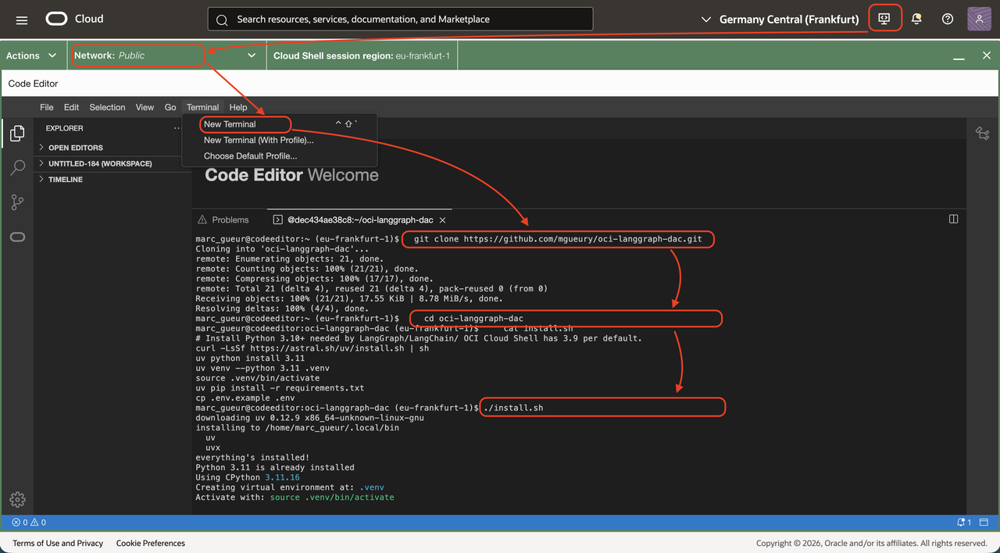

    If you have issue with the above link, you can also clone from the original git repo.
    ````
    <copy>    
    cd $HOME
    git clone https://github.com/mgueury/oci-langchain-dac.git
    ...
    </copy>    
    ````

6. After installation, the command *"source .venv/bin/activate"* activates the Python virtual environment. It must remain active to run any of the examples.

    If you close and restart Cloud Editor, reactivate the virtual environment by running:

    ````
    <copy>
    cd $HOME/oci-langchain-dac
    source .venv/bin/activate
    </copy>
    ````

7. Open the directory *oci-langchain-dac*

    - In the menu, click *File/Open*
    - Choose the directory *oci-langchain-dac*
    - Click *Open*
    - You will see the directory with the example on the left.

    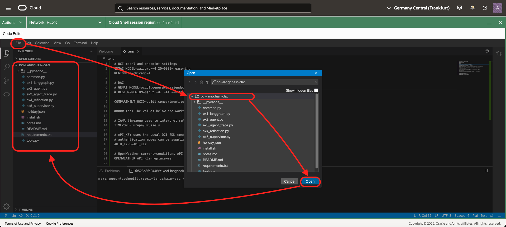

8. Configure based on your notes taken in the first lab.

    - In the menu, click *File/Open*
    - In the dialog box, check *Show hidden files*     
    - Choose the file *.env*
    - Click *Open*

    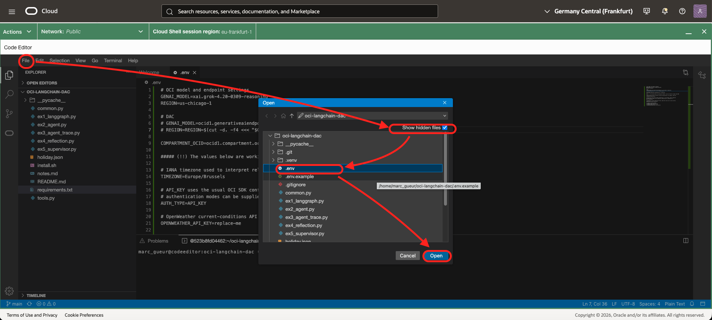

9. Edit the file and enter the values from your notes.

    The configuration depends on whether you installed a DAC or your instructor gave you access to one.

    With DAC:
    ```
    <copy>
    GENAI_MODEL=##GENAI_DAC_ENDPOINT_OCID##
    ex: GENAI_MODEL=ocid1.generativeaiendpoint.oc1.xxxxxxxxxx
    REGION=##REGION##
    ex: REGION=us-chicago-1
    COMPARTMENT_OCID=##COMPARTMENT_OCID##
    ex: COMPARTMENT_OCID=ocid1.compartment.oc1.xxxxxxxxxx
    </copy>      
    ```

    

    Without a DAC (for example, if you have access to the Chicago region):
    ```
    <copy>    
    GENAI_MODEL=xai.grok-4.20-0309-reasoning
    REGION=us-chicago-1
    COMPARTMENT_OCID=##COMPARTMENT_OCID##
    ex: COMPARTMENT_OCID=ocid1.compartment.oc1.xxxxxxxxxx
    </copy>      
    ```

    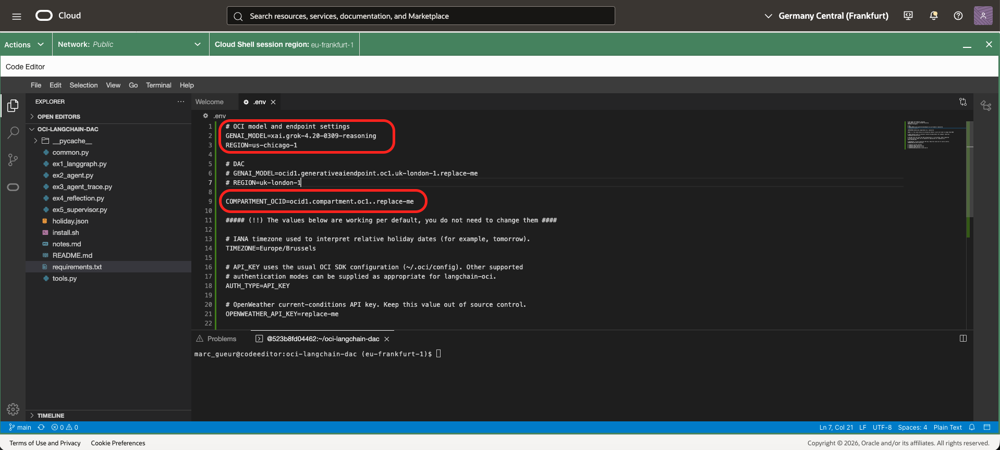

## Task 1: LangGraph Agent

Let's look at our first agent. It uses a LangGraph workflow, an OCI Generative AI model, and a weather tool to recommend clothing. 

1. Open `ex1_langgraph.py` in Cloud Shell Editor or VS Code.
2. Check the `get_current_weather` tool. It calls OpenWeather and returns structured weather data.
3. Check how the graph is built. The flow is **model → tool → model**:

    ```python
    graph.add_node("assistant", call_model)
    graph.add_node("tools", ToolNode(tool_list))
    graph.add_edge(START, "assistant")
    graph.add_conditional_edges("assistant", tools_condition, {"tools": "tools", END: END})
    graph.add_edge("tools", "assistant")
    ```

    The conditional edge sends a request to the tool only when the model has made a tool call. Otherwise, the graph ends. This is the way that agents work. They are based on execution graphs. With LangGraph, it is defined explicitly. 
    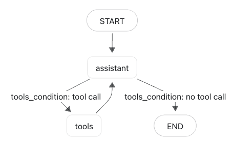

4. Run the example:

    ```
    <copy>
    cd $HOME/oci-langchain-dac
    source .venv/bin/activate    
    python3 ex1_langgraph.py
    </copy>
    ```

    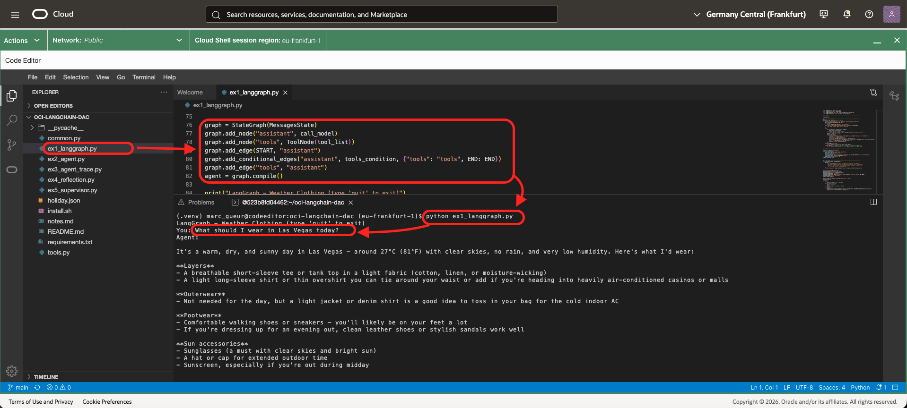

5. Run the following questions:

    - *What should I wear in Las Vegas today?*
    - *Should I take an umbrella in London, GB?*

6. Notice that the agent calls the weather tool before giving weather-dependent advice. Type `quit` or CTRL+C to leave the program.

## Task 2: Agent

In the previous sample, the graph is written explicitly. This example uses LangChain's prebuilt *Agent* loop and keeps the chat history in the local `conversation` list. Basically, this is the same than previous example. Here with the new Agent syntax.

1. Open `ex2_agent.py`.
2. Check the agent definition. `create_agent` creates the ReAct loop and receives the OCI model, weather tool, and system prompt.

    ```python
    agent = create_agent(model, [get_current_weather], system_prompt=(...))
    ```

3. Check the last lines of the program. After every turn, the returned messages replace `conversation`; the next invocation includes those messages.

    ```python
    conversation = agent.invoke(
        {"messages": [*conversation, HumanMessage(question)]}
    )["messages"]
    ```

    The history is kept in memory only. Restarting the program starts a new conversation.

4. In the terminal, run the following command:

    ```
    <copy>
    python3 ex2_agent.py
    </copy>
    ```

    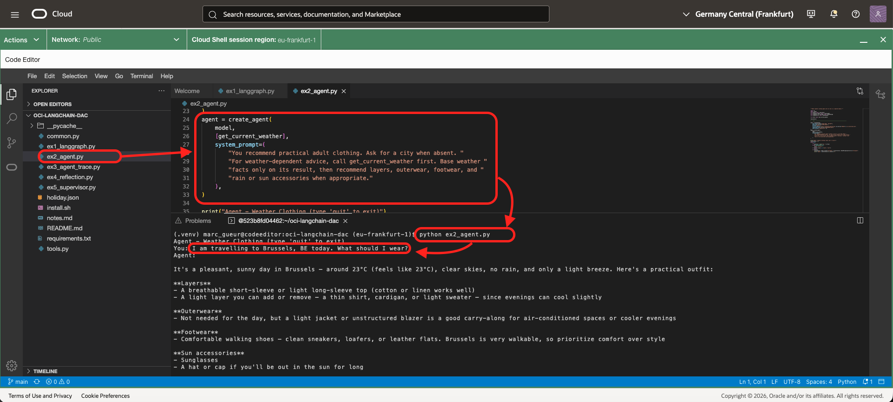    

5. Run the following questions in the same conversation:

    - *I am travelling to Brussels, BE today. What should I wear?*
    - *What about footwear?*

    Notice that the second answer can use the city and weather context from the previous turn.

6. Type `quit` to leave the program.

## Task 3: Agent with tracing 

In this version of the lab, 
- tracing is enabled, 
- and reusable tools are separated from the agent. 
This is the building block used later by the supervisor to route requests to specialist agents. The explicit human-confirmation step is exercised in Task 5.

1. Open `ex3_agent_trace.py` and `tools.py`.
2. Notice that the agent imports `get_current_weather` from `tools.py` rather than defining the tool in the application file.

    ```python
    from tools import get_current_weather
    ```

    This structure lets several agents use the same tool implementation while keeping the agent code small.

3. Run the example:

    ```
    <copy>
    python3 ex3_agent_trace.py
    </copy>
    ```
    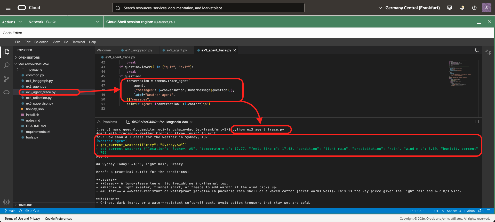      

4. Run the following questions:

    - *How should I dress for the weather in Sydney, AU?*

5. Type `quit` to leave the program.

## Task 4: Reflection

Here we will use two agents that work together.

- One agent produces a Markdown document from an English Wikipedia page.
- The other agent checks grammar and structure. The document is shown only when the reviewer approves it.

1. Open `ex4_reflection.py`.
2. Check `writer_agent` and `reviewer_agent`.
    - The writer must call `get_wikipedia_page` before writing.
    - The reviewer returns a structured `DocumentReview` with `approved` and `feedback` fields.
3. Check the revision loop. The writer can revise a draft up to three times:

    ```python
    for attempt in range(MAX_REVISIONS):
        review = review_document(draft)
        if review.approved:
            ...
        draft = write_document(...)
    ```

4. Run the example:

    ```
    <copy>
    python3 ex4_reflection.py
    </copy>
    ```

    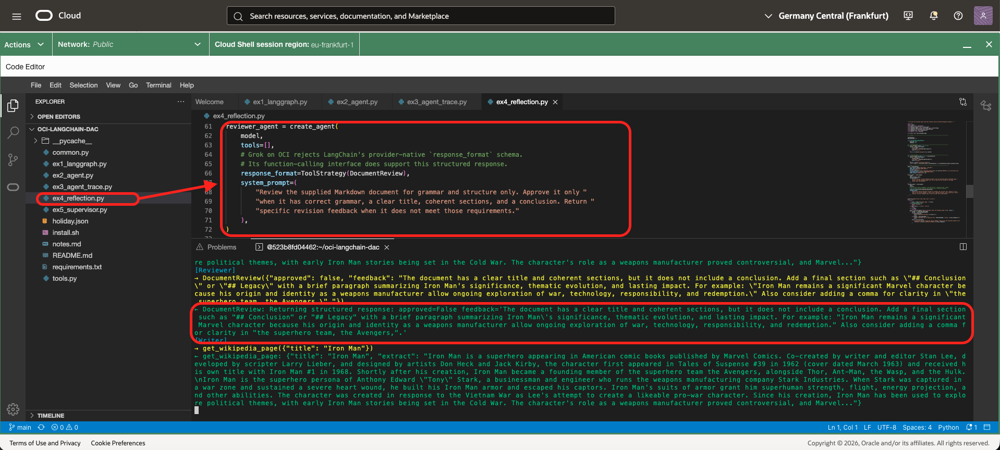      

5. Enter one of the following Wikipedia page titles:

    - *Iron Man*

6. Notice that the reviewer and writer speaks between themselves before to give the final document. Type `quit` to leave the program.

## Task 5: Supervisor

Here, we will use a group of agents working together with a supervisor to coordinate their work.

The supervisor has two tasks:

- Route HR policy questions to the HR FAQ specialist.
- Route holiday booking and balance requests to the booking specialist.

The booking specialist introduces a human-in-the-loop step: it proposes exact dates first and writes the booking only after the user explicitly confirms it.

1. Open `ex5_supervisor.py` and review the three agents:
    - `hr_agent` uses `search_hr_faq`.
    - `booking_agent` uses the holiday tools.
    - `holiday_agent` is the supervisor. It uses `ask_hr_agent` and `ask_booking_agent` to route the request.
2. Check the booking-agent prompt. It permits `confirm_holiday_booking` only after an explicit confirmation.
3. Run the example:

    ```
    <copy>
    python3 ex5_supervisor.py
    </copy>
    ```

    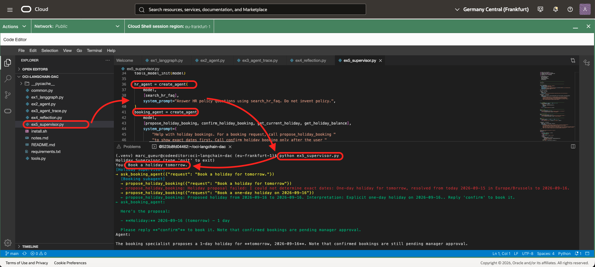      

4. Run the following questions in order:

    - *Book a holiday tomorrow.*
    - *Confirm.*
    - *Send a mail with my holiday balance to test@oracle.com*

5. Notice that the supervisor calls subagents using natural-language requests. For example, it asks the booking subagent to book a holiday. Tools, by contrast, are called with parameters. During the process, the user is asked to confirm the booking. This is called **human-in-the-loop**.
6. Notice that, for complex questions, the agent calls the tools and subagents it needs before answering. For example, it can first collect data through subagents and then call its own tools.

    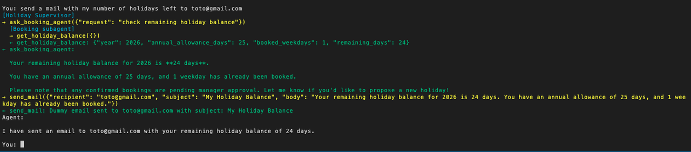      

7. Type `quit` to leave the program.

## END

Congratulations! You have finished the lab!!
We hope you have learned something useful.

## Known issues

- When starting an example, you have this error:
    ```
    <copy>
    Traceback (most recent call last):
    File "/home/marc_gueur/oci-langchain-dac/ex1_langgraph.py", line 5, in <module>
        import common
    File "/home/marc_gueur/oci-langchain-dac/common.py", line 9, in <module>
        from langchain_core.messages import AIMessage, ToolMessage 
    ModuleNotFoundError: No module named 'langchain_core'
    </copy>
    ```
    Solution: The python virtual env is not activated. Run 
    ```
    <copy>
    source .venv/bin/activate
    </copy>
    ```
- `OPENWEATHER_API_KEY` must be valid for Tasks 1–3. If it is missing, the weather tool reports that configuration issue instead of returning weather data.
- The examples need outbound network access to OCI Generative AI. Tasks 1–3 also call OpenWeather; Task 4 calls English Wikipedia.
- `holiday.json` is created by Task 5 after a confirmed booking. Delete that file manually before rerunning the task if you need a completely empty booking history.

## Acknowledgements

- **Author**
    - Marc Gueury, Oracle Generative AI Platform
