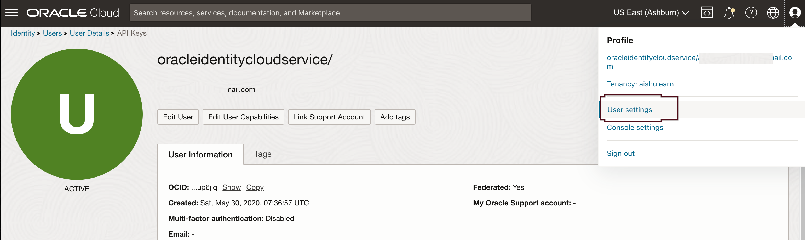

# Setup OCI CLI - Command Line Interface

## Introduction

In this Lab, we will set up the OCI command line interface. This will help us upload images to the Object storage bucket. Later, we will use details such as User OCID, Fingerprint and others in the Oracle APEX front-end development lab.  

[Youtube video on Installing OCI CLI](youtube:nqMAXuqtlW8:large)

### About OCI CLI

The CLI is a small-footprint tool you can use on its own or with the Console to complete Oracle Cloud Infrastructure tasks. The CLI provides the same core functionality as the Console, plus additional commands. Some of these, such as the ability to run scripts, extend Console functionality.

Estimated time: 20 minutes

### Objectives

In this lab, you will:

* Get User's OCID
* Add User's API Key
* Generate and Download RSA Key Pair in PEM format
* Install OCI Command Line Interface on the compute instance launched in the previous lab
* Update OCI Configuration file
* List all Buckets in a Compartment using OCI CLI

### Prerequisites

This lab assumes:
* You have completed all the previous labs
* You can use an Linux editor such as `vi`

> **Note:** Please refer [Quickstart Installation guide on OCI CLI](https://docs.oracle.com/en-us/iaas/Content/API/SDKDocs/cliinstall.htm) for various operating systems, you can **optionally skip this Lab** if you have already installed OCI CLI on your laptop or desktop machine.


## Task 1: Get User's OCID

1. After logging into cloud console, click on User Settings under top right navigation, this will take to **User Details** page,
Copy the OCID into a text file we will need this later.

   

## Task 2: Add User's API Key

1. Under the same page click on **Add API Key** button

   

## Task 3: Generate and Download RSA Key Pair in PEM format

1. Choose an Option to Generate a new key pair, if you already have keys generated you can upload them here, most important is when you generate the key pair download both of them, Click **Add** button

   

> **Note:** Please do not use a key with a passphrase for this lab series, tools such as Rclone does not currently support API keys with a passphrase..

2. You should now be able to see the Configuration file, copy paste this into a file we will need it later in Task 5 below.

   

Click on **Close** button

3. We can now see our newly created fingerprint

   

## Task 4: Login to Compute Instance with Cloud Shell

You are assumed to have generated your SSH Keys in the *Cloud Shell* from the earlier lab.

1. Return to your Cloud Shell window, if you disconnected from the compute instance created in the previous lab, `ssh` to the instance again

   ```
   ssh -i <SSH_Key_Name> opc@<PUBLIC_IP_OF_COMPUTE>
   ```

    *Hint: If 'Permission denied error' is seen, ensure you are using '-i' in the ssh command. You MUST type the command, do NOT copy and paste ssh command.*

2.  Enter 'yes' when prompted for security message.

   

3.  Verify opc@COMPUTE\_INSTANCE\_NAME appears on the prompt.

## Task 5: Install OCI Command Line Interface (CLI)

The CLI is a small-footprint tool that you can use on its own or with the Console to complete Oracle Cloud Infrastructure tasks. The CLI provides the same core functionality as the Console, plus additional commands. Some of these, such as the ability to run scripts, extend Console functionality.

1. Install OCI CLI on the Oracle Linux 9 compute instance where file storage mount is setup:

   ```
   <copy>
   sudo dnf -y install oraclelinux-developer-release-el9
   sudo dnf install python39-oci-cli
   </copy>
   ```
> **Note:** The directions above will for for Oracle Linux 9 installs in general.

### Optional task: Install the OCI Command Line on Your Laptop or Workstation

#### For Linux and Unix

Open a terminal.

To run the installer script, run the following command.
  ```
  <copy>
  bash -c "$(curl -L https://raw.githubusercontent.com/oracle/oci-cli/master/scripts/install/install.sh)"
  </copy>
  ```
Respond to the Installation Script prompts.

#### For Oracle Linux 8

Use dnf to install the CLI.
  ```
  <copy>
  sudo dnf -y install oraclelinux-developer-release-el8
  sudo dnf install python36-oci-cli
  </copy>
  ```
#### For Oracle Linux 7

Use yum to install the CLI.
  ```
  <copy>
  sudo yum install python36-oci-cli
  </copy>
  ```

#### Mac OS X
To install the CLI on Mac OS X with [Homebrew](https://docs.brew.sh/Installation):

  ```
  <copy>
  brew update && brew install oci-cli
  </copy>
  ```
#### Windows
Open the PowerShell console using the **Run as Administrator** option.

The installer enables auto-complete by installing and running a script. To allow this script to run, you must enable the RemoteSigned execution policy.

To configure the remote execution policy for PowerShell, run the following command.

  ```
  <copy>
  Set-ExecutionPolicy RemoteSigned
  </copy>
  ```

Force PowerShell to use TLS 1.2 for Windows 2012 and Windows 2016: [Net.ServicePointManager]::SecurityProtocol = [Net.SecurityProtocolType]::Tls12

Download the installer script:

  ```
  <copy>
  Invoke-WebRequest https://raw.githubusercontent.com/oracle/oci-cli/master/scripts/install/install.ps1 -OutFile install.ps1
  </copy>
  ```

Run the installer script with or without prompts:
To run the installer script with prompts, run the following command:

  ```
  <copy>
  iex ((New-Object System.Net.WebClient).DownloadString('https://raw.githubusercontent.com/oracle/oci-cli/master/scripts/install/install.ps1'))
  </copy>
  ```
To run the installer script without prompting the user, accepting the default settings, run the following command:

  ```
  <copy>
  install.ps1 -AcceptAllDefaults
  </copy>
  ```

2. Verifying the OCI CLI Installation

   ```
   <copy>oci --version</copy>
   ```

Output will be similar to this version number might vary

   ```
   <copy>3.23.4</copy>
   ```

## Task 6: Update OCI Configuration file

1. Update DEFAULT values as per your OCI parameters

   ```
    <copy>vi ~/.oci/config</copy>
    ```
    
    ```
    <copy>[DEFAULT]
    user=< user OCID >
    fingerprint=< finger print >
    key_file=< Path to .pem Private Key file generated from Task 3>
    tenancy=< Tenancy OCID >
    region=< region >
    </copy>
    ```
> **Note:** Feel free to use a different editor such as `vim` , `pico`, or `nano`, etc.

The completed file should look similar to the example below, please replace the User OCID, fingerprint, Tenancy OCID, Home region, key_file as per your tenancy and local file path for the key file

   ```
   <copy>[DEFAULT]
   user=ocid1.user.oc1..aaaaaaaaompu-user-ocid-x63smy6knndy5q
   fingerprint=ad:a7:73:a2:23:-user-fingerprint-:0c:a9:22:bb
   tenancy=ocid1.tenancy.oc1..aaaaaaaa6v-tenancy-ocid-sdd6ahdouq
   region=us-ashburn-1
   key_file=/Users/-user-name-/.oci/oci_api_key.pem
   </copy>
   ```

## Task 7: List all Buckets in a Compartment using OCI CLI

1. Check if we can get the object storage namespace for the tenancy to verify the configuration file setup: 

   ```
   <copy> 
   oci os ns get
   </copy>
   ```

If successful, the following will be returned, with xx as your unique namespace.

  ```
  <copy>
  {
    "data": "xx"
  }
  </copy>
  ```

## Task 8: Make note of OCI CLI configuration file

1. We will be using this config file path and OCIDs here in later labs, please make a note of them  

  ```
  <copy>
  cat ~/.oci/config
  </copy>
  ```

In other operating systems you can open the file using text editor such as Notepad or `vi` editor.

    > **Congratulations:** You have now completed the setup for the **OCI Command Line Interface**, which is required for following parts and labs. Now you can proceed to any other Parts of this workshop. 

## Troubleshooting

1. Unable to get object storage namespace for the OCI tenancy through OCI CLI
   
Check for all the OCIDs and Fingerprint in the configuration file if it matches with the one in the tenancy settings.

You may now **proceed to the next lab**.

## Learn More
 
* [OCI Documentation](https://docs.oracle.com/en-us/iaas/Content/home.htm)
* [Data Labeling Service](https://docs.oracle.com/en-us/iaas/data-labeling/data-labeling/using/about.htm)
* [Configure OCI CLI](https://docs.oracle.com/en-us/iaas/Content/API/SDKDocs/cliconfigure.htm)
* [Install Brew on Mac](https://brew.sh/)

## Acknowledgements

* **Authors** - Madhusudhan Rao B M, Principal Product Manager, Oracle Database; Melinda Centeno, Senior Principal Product Manager
* **Last Updated By/Date** - 17 July 2024
