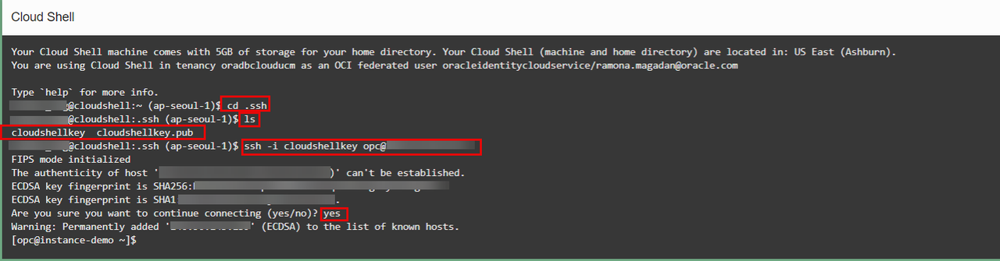

# Installing and Using Rclone

## Introduction
Rclone is a versatile command line program that synchronizes files and directories to and from various cloud storage providers or between on-premises to cloud. Rclone is an effective tool for migrating data to OCI Object Storage. It is known for its simplicity, efficiency, and wide support for numerous cloud services, including OCI Object Storage. 

Estimated time: 30 min

### Objectives

In this lab you will:
- Install Rclone on an Oracle Linux compute instance
- Configure Rclone with OCI Object Storage
- Use Rclone to create test files for migration
- Migrate test files from local laptop to OCI Object Storage and OCI File Storage destinations 

### Prerequisites

This lab assumes you have:
* Successfully created all previous labs
* Ability to create files and directories, edit files, and move to different directories on Linux

## Task 1: Login to Your Compute Instance with Cloud Shell

You are assumed to have created an instance in the file system storage service lab and generated your SSH Keys in the *Cloud Shell* from the earlier lab.

1. Return to your Cloud Shell window, if you disconnected from the compute instance created in the previous lab, `ssh` to the instance again

  ```
  ssh -i <SSH_Key_Name> opc@<PUBLIC_IP_OF_COMPUTE>
  ```

 *Hint: If 'Permission denied error' is seen, ensure you are using '-i' in the ssh command. You MUST type the command, do NOT copy and paste ssh command.*

2.  Enter 'yes' when prompted for security message.

   

3.  Verify opc@COMPUTE\_INSTANCE\_NAME appears on the prompt.

## Task 2: Install Rclone

1. Install Rclone on the Oracle Linux compute instance you have logged into via `ssh`

  ```
  <copy>
  sudo -v ; curl https://rclone.org/install.sh | sudo bash
  </copy>
  ```

> **Note:** These directions can also be used to install Rclone on Linux and BSD systems.

2. **Optional** Install Rclone on your laptop or workstation

#### For Mac OS X
Install Rclone on Mac OS X with [Homebrew](https://docs.brew.sh/Installation):

  ```
  <copy>
  brew update && brew install rclone
  </copy>
  ```

#### For Windows
Download the correct binary for your processor type by clicking on the links below.

  [Intel/AMD - 64 Bit](https://downloads.rclone.org/rclone-current-windows-amd64.zip)
  [Intel/AMD - 32 Bit](https://downloads.rclone.org/rclone-current-windows-386.zip)
  [ARM - 64 Bit](https://downloads.rclone.org/rclone-current-windows-arm64.zip)

Extract the file and add the extracted file to Windows system PATH environment variable for easy command line access.

## Task 3: Configure Rclone

1. Gather the following information from items created in the previous labs:

  * The name of the bucket you created in the previous object storage lab
  * The full path to your OCI Command Line configuration file, usually in your home directory or folder under `.oci` called `config`. For example: `/home/opc/.oci/config`
  * View the file with the editor of your choice and take note of the region name and the tenancy ocid
 
   

2. Use the OCI CLI to get tenancy namespace name:

  ```
  <copy>
  oci os ns get
  </copy>
  ```

3. Create the directories where the Rclone configuration file will be created

  ```
  <copy>
  mkdir -p $HOME/.config/rclone/
  </copy>
  ```

5. Create the Rclone configuration file:

Change to the rclone directory created above:

  ```
  <copy>
  cd $HOME/.config/rclone
  </copy>
  ```

Using the editor of your choice, create a rclone.conf file, this example uses the Vi imporved editor

  ```
  <copy>
  vim rclone.conf
  </copy>
  ```

Add the following contents to the file:

  ```
  <copy>
  [oci]
  type = oracleobjectstorage
  provider = user_principal_auth
  namespace = <namespace>
  compartment = <tenancy or compartment OCID>
  region = <region>
  config_file = < Full path to OCI Command Line Configuration file>
  </copy>
  ```
> **Note:** The first line in square brackets is the name of remote, in this case we used oci to identify we are using a remote that is in Oracle Cloud Infrastructure. You reference the remote name when making Rclone commands.

A completed file would look similar to the example below. Please replace the namespace, compartment or tenancy OCID, home region, and OCI Command Line Configuration path to match your tenancy and environment:

  ```
  <copy>
  [oci]
  type = oracleobjectstorage
  provider = user_principal_auth
  namespace = namespace
  compartment = ocid1.tenancy.oc1..aaaaaaaa6v-tenancy-ocid-sdd6ahdouq
  region = us-ashburn-1
  config_file = /home/opc/.oci/config
  </copy>
  ```

The Rclone configuration file should look something like this:

   

6. Verify you can see the bucket created in the previous object storage lab, run:
    ```
    <copy>
    rclone lsd oci:
    </copy>
    ```

> **Note:** If you cannot see the bucket, take another look at your `rclone.conf` file and make sure all the parameters are setup correctly for your tenancy and your OCI Command Line configuration file path.

## Task 4:
2. Use Rclone to create some test files to migrate into OCI Object Storage

## Task 5: More info

## Acknowledgements

* Author - 
* Contributors - Ewan Slater 
* Last Updated - Nov, 2th 2023

