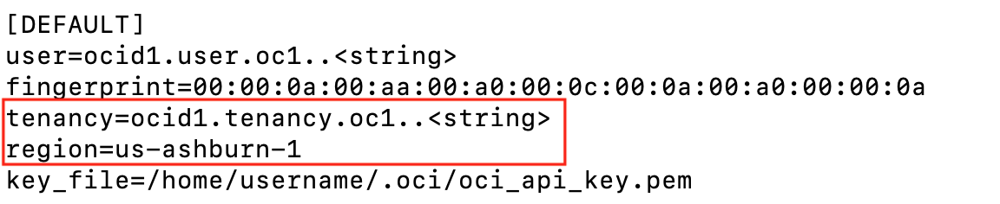

# Installing and Using Rclone

## Introduction
Rclone is a versatile command line program that synchronizes files and directories to and from various cloud storage providers or between on-premises to cloud. Rclone is an effective tool for migrating data to OCI Object Storage. It is known for its simplicity, efficiency, and wide support for numerous cloud services, including OCI Object Storage. 

Estimated time: 30 min

### Objectives

In this lab you will:
- Install Rclone on your laptop or workstation
- Configure Rclone with OCI Object Storage
- Use Rclone to create test files for migration
- Migrate test files from local laptop to OCI Object Storage

### Prerequisites

This lab assumes you have:
* Completed all previous labs
* You have OCI Command Line installed with a working configuration file
* You can change directories/ folders, create/edit files, create directories/folder , run commands, and install software on your laptop or workstaion
* Have at least 1 GiB of free space on your laptop or workstation to create test files


## Task 1: Install Rclone

1. Install Rclone on your laptop or workstation

> **Note:** If you already have a networking environment set up in your tenancy with VCN and networks and can launch compute intances, you can run this lab on an OCI compute instance. Oracle Linux would be recommended, follow relevant directions below.
 
#### For Mac OS X

Open a terminal window and install Rclone on Mac OS X with [Homebrew](https://docs.brew.sh/Installation):

  ```
  <copy>
  brew update && brew install rclone
  </copy>
  ```

#### For Windows

Download the correct binary for your processor type by clicking on the links below.

  * [Intel/AMD - 64 Bit](https://downloads.rclone.org/rclone-current-windows-amd64.zip)
  * [Intel/AMD - 32 Bit](https://downloads.rclone.org/rclone-current-windows-386.zip)
  * [ARM - 64 Bit](https://downloads.rclone.org/rclone-current-windows-arm64.zip)

Extract the file and add the extracted file to Windows system PATH environment variable for easy command line access.

#### For Linux and BSD Systems

Open a terminal
  ```
  <copy>
  sudo -v ; curl https://rclone.org/install.sh | sudo bash
  </copy>
  ```

## Task 2: Configure Rclone

1. Gather the following information from items created in the previous labs:

  * The full path to your OCI Command Line (CLI) configuration file, usually in your home directory or folder under `.oci` called `config`. For example: `/home/opc/.oci/config`
  * View the file with the editor of your choice and take note of the region name and the tenancy ocid
 
   

2. Use the OCI CLI to get tenancy namespace name:

  ```
  <copy>
  oci os ns get
  </copy>
  ```

3. Create the directories where the Rclone configuration file will be created

  ```
  <copy>
  mkdir -p $HOME/.config/rclone/
  </copy>
  ```

4. Create the Rclone configuration file:

Change to the rclone directory created above:

  ```
  <copy>
  cd $HOME/.config/rclone
  </copy>
  ```

Using the editor of your choice, create a rclone.conf file, this example uses the Vi improved editor

  ```
  <copy>
  vim rclone.conf
  </copy>
  ```

Add the following contents to the file:

  ```
  <copy>
  [oci]
  type = oracleobjectstorage
  provider = user_principal_auth
  namespace = <namespace>
  compartment = <tenancy or compartment OCID>
  region = <region>
  config_file = < Full path to OCI Command Line Configuration file>
  </copy>
  ```
> **Note:** The first line in square brackets is the name of remote, in this case we used oci to identify we are using a remote that is in Oracle Cloud Infrastructure. You reference the remote name when making Rclone commands.

A completed file would look similar to the example below. Please replace the namespace, compartment or tenancy OCID, home region, and OCI Command Line Configuration path to match your tenancy and environment:

  ```
  <copy>
  [oci]
  type = oracleobjectstorage
  provider = user_principal_auth
  namespace = namespace
  compartment = ocid1.tenancy.oc1..aaaaaaaa6v-tenancy-ocid-sdd6ahdouq
  region = us-ashburn-1
  config_file = /home/opc/.oci/config
  </copy>
  ```

The Rclone configuration file should look something like this:

   

5. Create a new bucket using rclone:

  ```
  <copy>
  rclone mkdir oci:migration-lab
  </copy>
  ```

Verify you can see the bucket created in the previous step, run:
  ```
  <copy>
  rclone lsd oci:
  </copy>
  ```
Successful output should look like this:
  ```
   rclone lsd oci:
    -1 2024-07-17 19:49:12        -1 migration-lab
  ```

> **Note:** If you could not create or list the bucket, take another look at your `rclone.conf` file and make sure all the parameters are setup correctly for your tenancy and your OCI Command Line configuration file path.

## Task 3: Use Rclone to create some test files to migrate into OCI Object Storage

1. Create a test directory or folder to stage the test files on your laptop or workstation

  ```
  <copy>
  mkdir migration-files
  </copy>
  ```

2. Use the `test makefiles` Rclone command to create test files

Create 6 test files using Rclone

  ```
  <copy>
  rclone test makefiles migration-files --files 6 --files-per-directory 2 --max-depth 2 --max-file-size 250M --min-file-size 1K
  </copy>
  ```
The above command will create 6 random files and a few directories in the migration-files directory/ folder spread across 3 directories, it should consume less than 1GiB of space.

> **Note:** If you have closer to 15-20GiB of free  space on your laptop or workstation, you can use the following command to create more files and some larger files:

  ```
  <copy>
  rclone test makefiles files --files 12 --files-per-directory 4 --max-depth 2 --max-file-size 2G --min-file-size 1K 
  </copy>
 ```

Change into the `migration-files` directory/ folder and familiarize yourself with the contents then move up 1 directory

  ```
  <copy>
  cd <path to migration-files>
  ls
  cd ..
  </copy>
  ```
Change the path to the full path of the directory for your command, example:

  ```
  cd /home/username/migration-files
  ls
  cd ..
  ```

4. Check the size of files in the `migration-files` directory

  ```
  <copy>
  rclone size migration-files/
  </copy>
 ```

Your output should show you how many files and directories total and the total size of the directory/ folder. It should look something like the output below:

  ```
  Total objects: 6
  Total size: 698.654 MiB (732591655 Byte)
  ```

> **Note:** Since file generation is random, the size of your directory/ folder will vary from the output above.

## Task 4: Migrating Data into an OCI Object Storage Bucket Using Rclone

1. Copy the data from the local file system directory `migration-files` into the OCI Object Storage bucket created in Task 2 named `migration-lab` 

  ```
  <copy>
  rclone copy --progress --transfers=20 migration-files oci:migration-lab
  </copy>
  ```

* The `progress` flag displays the progress of the copy
* The `transfer` flag is the number of file transfers to run in parallel, on larger systems you can push a higher number of files in parallel
  
> **Note:** This same command can be used for on-prem local file systems, on-prem NFS file systems, and on an OCI compute instance with OCI File System Storage NFS mounts to move data from OCI File System Storage into an OCI Object Storage Bucket

Command output should look similar to this:

  ```
  Transferred:   	  698.654 MiB / 698.654 MiB, 100%, 2.384 MiB/s, ETA 0s
  Transferred:            6 / 6, 100%
  Elapsed time:      4m45.8s
  ```

2. Check that the files in the `migration-files` directory are now in the bucket `migration-lab`

Use the OCI CLI to list the objects in the `migration-lab` bucket

  ```
  <copy>
  oci os object list --bucket-name migration-lab --fields name --output table
  </copy>
  ```
  
Successful output should show the same files listed in the `migration-files` directory/ folder in Task 3

3. Add files to the `migration-files` directory/ folder
   
Use an editor or command  of your choice and add 1-2 files to the `migration-files` directory/ folder. Example command:

  ```
  <copy>
  cd <path to migration-files>
  echo  test1 > file1.txt
  echo test2 > file2.txt
  cd ..
  </copy>
 ```

Change the path to the `migration-files` directory/ folder, example:

  ```
  cd /home/username/migration-files
  echo test1 > file1.txt
  echo test2 > file2.txt
  cd ..
 ```

4. Re-run the Rclone copy command to sync the local directory to the OCI Object Storage bucket

  ```
  <copy>
  rclone copy --progress --transfers=20 migration-files oci:migration-lab
  </copy>
  ```

5. Check that the new files have been copied into the `migration-lab` bucket

Re-run the OCI CLI command from Step 2 above, or use Rclone.

  ```
  <copy>
  rclone ls oci:migration-lab
  </copy>
  ```

You should now see `file1.txt` and `file2.txt` with the previously migrated files. It should look something like this:

  ```
  rclone ls oci:migration-lab
  121617779 duhatam2fif
          6 file1.txt
          6 file2.txt
  105135531 kacak/josi
   62519776 kozemof/wulonug3raq
  168538372 riboqex6taf
  178765140 wocojom9ra
   96015057 zeloj
  ```
  
## Task 5 Migrate Data from OCI Object Storage to a Local File System

1. Create a new directory/ folder on your laptop or workstation

  ```
  <copy>
  mkdir migration-target
  </copy>
  ```

2. Use Rclone to move the data from the `migration-lab` bucket to the `migration-target` directory/ folder

  ```
  <copy>
  rclone copy --progress --transfers=20 oci:migration-lab migration-target
  </copy>
  ```

> **Note:** The command above can be used for on-prem local file systems, on-prem NFS file systems, and on an OCI compute instance with an OCI File System Storage NFS mount to move the data from OCI File System Storage Service into an OCI Object Storage bucket

Output should look similar to the following:

  ```
  Transferred:   	  698.654 MiB / 698.654 MiB, 100%, 3.302 MiB/s, ETA 0s
  Transferred:            8 / 8, 100%
  Elapsed time:      2m51.5s
  ```

3. List the files in the `migration-target` directory/ folder and see that the contents match Task 4, Step 5

  ```
  <copy>
  cd <path to migration-target>
  ls
  </copy>
  ```

Example:
  ```
  cd /home/username/migration-target
  ls
  ```

You should now see the bucket objects in the local file system directory.
   
## Task 6: Lab Clean Up

This is an optional lab to clean up all created items.

1. Remove Objects 

Use Rclone to remove all objets in the `migration-lab` bucket

  ```
  <copy>
  rclone delete oci:migration-lab
  </copy>
 ```

2. Delete the Bucket

Use Rclone to delete the `migration-lab` bucket

  ```
  <copy>
  rclone rmdir oci:migration-lab
  </copy>
  ```

3. Remove the Test Migration Files and Directories

 #### Mac OS, Linux, and BSD Systems

  ```
  <copy>
  rm -rf <path to migration-files>
  rm -rf <path to migration-target>
  </copy>
  ```

Example:

  ```
  rm -rf /home/username/migration-files
  rm -rf /home/username/migration-target
  ```

#### Windows

Drag and drop the `migration-files` and `migration-target` folders to the trash

## Learn More

* [OCI Object Storage](https://docs.oracle.com/en/learn/migrate-data-to-oci-object-storage/index.html#introduction)
* [Install Brew on Mac](https://brew.sh/))
* [Rclone website](https://rclone.org/)
* [Rclone and OCI Object Storage](https://rclone.org/oracleobjectstorage/)
* [Move data to object storage in the cloud using Rclone](https://docs.oracle.com/en/solutions/move-data-to-cloud-storage-using-rclone/configure-rclone-object-storage.html)
* [Migrate Data to Oracle Cloud Infrastructure Object Storage Using Rclone](https://docs.oracle.com/en/learn/migrate-data-to-oci-object-storage/index.html#introduction)

## Acknowledgements

* **Author** - Melinda Centeno, Senior Principal Product Manager
* **Last Updated** - Melinda Centeno, 21 July 2024

