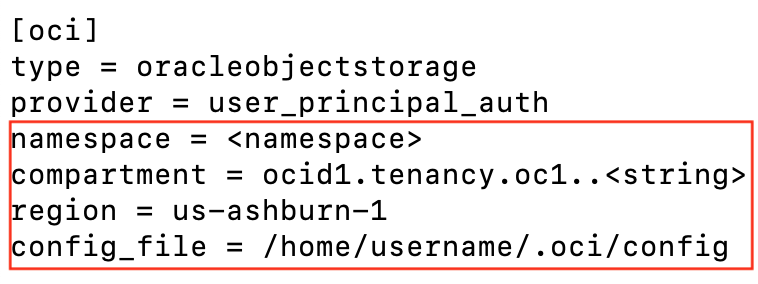

# Create Cloud Native Applications on Compute

## Introduction

Estimated time: 30 min

### Objectives

In this lab you will:
- Install Rclone on a local laptop
- Configure Rclone with OCI Object Storage
- Use Rclone to create test files for migration
- Migrate test files from local laptop to OCI Object Storage and OCI File Storage destinations 

### Prerequisites

This lab assumes you have:
* An Oracle Cloud account
* All previous labs successfully completed
* Understand how to install software on your laptop/ workstation using common tools
* Understand how to set up a PATH environment on your laptop/ workstation
* Understand where your users home directory or folder is on your laptop/ workstation
* Know how to use the command line on your laptop/ workstation 
* Ability to create files and directories/ folders, edit files, and move to different directories and folders on your laptop/ workstation and Linux

## Task 1: Install Rclone

#### For Mac OS X
Install Rclone on Mac OS X with [Homebrew](https://docs.brew.sh/Installation):

  ```
  <copy>
  brew update && brew install rclone
  </copy>
  ```

#### For Linux
Install Rclone on Linux systems run:

  ```
  <copy>
  sudo -v ; curl https://rclone.org/install.sh | sudo bash
  </copy>
  ```

> **Note:** These directions can also be used to install Rclone on an instance in OCI. If you would prefer, you can install Rclone on the instance created in the file storage service lab

#### For Windows
Download the correct binary for your processor type by clicking on the links below.

  [Intel/AMD - 64 Bit](https://downloads.rclone.org/rclone-current-windows-amd64.zip)
  [Intel/AMD - 32 Bit](https://downloads.rclone.org/rclone-current-windows-386.zip)
  [ARM - 64 Bit](https://downloads.rclone.org/rclone-current-windows-arm64.zip)

Extract the file and add the extracted file to Windows system PATH environment variable for easy command line access.

## Task 2: Configure Rclone

1. Gather the following information from items created in the previous labs:
  * The name of the bucket you created in the previous object storage lab
  * The public IP address of the compute instance you created in the previous file storage service lab
  * The full path to your OCI Command Line configuration file, usually in your home directory or folder under `.oci` called `config`. For example: `/home/opc/.oci/config`
  * View the file with the editor of your choice and take note of the region name and the tenancy ocid
 
   

2. Use the OCI CLI to get tenancy namespace name:

  ```
  <copy>
  oci os ns get
  </copy>
  ```

3. Create the directories where the Rclone configuration file will be created

Check your home directory for a directory or folder named `.config`:

  ```
  <copy>
  ls .config
  </copy>
  ```

If the `.config` directory or folder doesn't exist, create it:

  ```
  <copy>
  mkdir .config
  </copy>
  ```

4. Create an  Rclone directory or folder:

Change to the `.config` directory or folder:

  ```
  <copy>
  cd .config
  </copy>
  ```

Create the rclone directory or folder:

  ```
  <copy>
  mkdir rclone
  </copy>
  ```

5. Create the Rclone configuration file:

Change to the rclone directory:

  ```
  <copy>
  cd rclone
  </copy>
  ```

Using the editor of your choice, create a rclone.conf file. It should contain the following contents:

   

> **Note:** Use the namespace and region parameters for your tenancy collected in step 1. Use the tenancy ocid from step one for the compartment line in the file. Make sure to update the config_file path to the full path where your config file lives on your laptop.

## Using Rclone

1. Verify you can see the bucket created in the previous lab, run:
    ```
    <copy>
    rclone lsd oci:
    </copy>
    ```

> **Note:** If you cannot see the bucket, take another look at your `rclone.conf` file and make sure all the parameters are setup correctly for your tenancy and your OCI Command Line configuration file path.

2. Use Rclone to create some test files to migrate into OCI Object Storage
    - All running in a Compute 
    - You have HTML pages in NGINX doing REST calls 
    - To a Java SpringBoot backend
    - That backend gets data from the Autonomous database. 
    

## Task 4: More info

### Customize

Please also check the  "Lab 6 - How to Customize" to see how to customize this sample to your needs

### SSH

During the build, it has generated 2 files:
- id\_starter\_rsa : a ssh private key to login to the compute and bastion
- id\_starter\_rsa.pub : the public ssh private key installed in the compute and bastion

You can login to the compute by running:
```
<copy>
bin/ssh_compute.sh
</copy>
```

The interesting directories are:
- $HOME/app with the compiled application
- /usr/share/nginx/html/ with the HTML pages

### Cleanup

1. To clean up, run 
    ```
    <copy>
    ./destroy.sh
    </copy>
    ```

    ```
    <copy>
    cd ..
    rm -R starter
    </copy>
    ```

## Acknowledgements

* Author - Marc Gueury
* Contributors - Ewan Slater 
* Last Updated - Nov, 2th 2023

