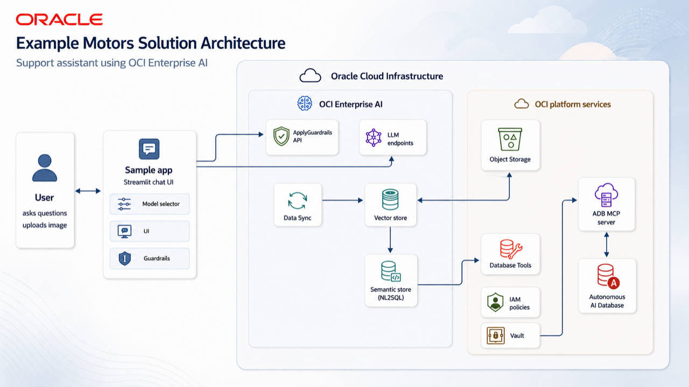

# The Economics of AI: Why Model Routing Matters

## Introduction

Building an AI-powered product can be fast. Running it at scale, with predictable cost and latency, is harder.

In this workshop, you will build a customer support assistant for a car dealership. The assistant will help answer questions from sales and service teams, such as vehicle availability, service policies, warranty details, financing guidance, and customer support requests. To make those answers useful, the application will use OCI Enterprise AI features for retrieval-augmented generation, or RAG, and vector search.

The goal is not only to make the assistant answer questions. The goal is to make the assistant choose the right model for the job. Some questions need a stronger frontier model because they involve reasoning, planning, or several steps. Other questions are narrow and factual, so a smaller and lower-cost model can answer them well when it has the right retrieved context.

You will use a hybrid inference pattern:

- Use RAG and vector search to ground answers in dealership-specific information.
- Route simple, bounded questions to lower-cost models.
- Route complex questions to stronger models when the task needs deeper reasoning.
- Compare model behavior, response quality, latency, and cost.
- Build a pattern you can reuse for production AI applications.

By the end of the workshop, you will understand how multi-model routing helps an AI application stay useful for users while controlling inference cost.

Estimated Time: 1 hour 30 minutes

### Objectives

In this workshop, you will learn how to:

- Set up the OCI resources required for an Enterprise AI application.
- Build a RAG workflow that answers questions from dealership-specific content.
- Use vector search to retrieve relevant information for each user question.
- Connect a customer support assistant web application to OCI Enterprise AI.
- Test different models against the same support questions.
- Route questions to cost-effective models based on task complexity.
- Review security guardrails and cost optimization options for an AI application.

### Prerequisites

In order to successfully complete this workshop you will need:

- General familiarity with the OCI console
- Have python installed on your computer or be able to install it
- Be comfortable with running terminal/command line commands to edit text files, create folders etc.
- Be able to download the zip archive for the sample application, unzip it and run it as a python script
- Be able to install python dependencies with `pip`.

## Solution Architecture

The workshop application uses OCI Enterprise AI as the foundation for a dealership support assistant.

The diagram below shows the end-state solution architecture and runtime interactions.

At a high level, the architecture includes:

- A knowledge base with dealership content, such as vehicle information, support guidance, and service-related documents.
- OCI vector capabilities to store and search embeddings for relevant context.
- A RAG flow that retrieves the most useful dealership information before the model generates an answer.
- A model routing layer that sends each question to the lowest-cost model that is suitable for the task.
- A web application that lets users ask questions and compare the results across available models.
- Guardrails and cost review steps so the assistant is practical for real production use.

This design separates the work into two layers. Retrieval gives the model trusted context from the dealership knowledge base. Model routing then decides how much model capability each request needs. Together, these layers reduce unnecessary calls to expensive models without removing access to stronger models when the question requires them.

## Learn More

- [OCI Enterprise AI information](https://www.oracle.com/artificial-intelligence/enterprise-ai/)
- [Enterprise AI Agents in OCI Generative AI](https://docs.oracle.com/en-us/iaas/Content/generative-ai/agents.htm)
- [API Reference](https://docs.oracle.com/en-us/iaas/Content/generative-ai/home.htm)

## Acknowledgements

- **Author** - Julien Lehmann - Product Marketing Manager, Yanir Shahak - Senior Principal Software Engineer
