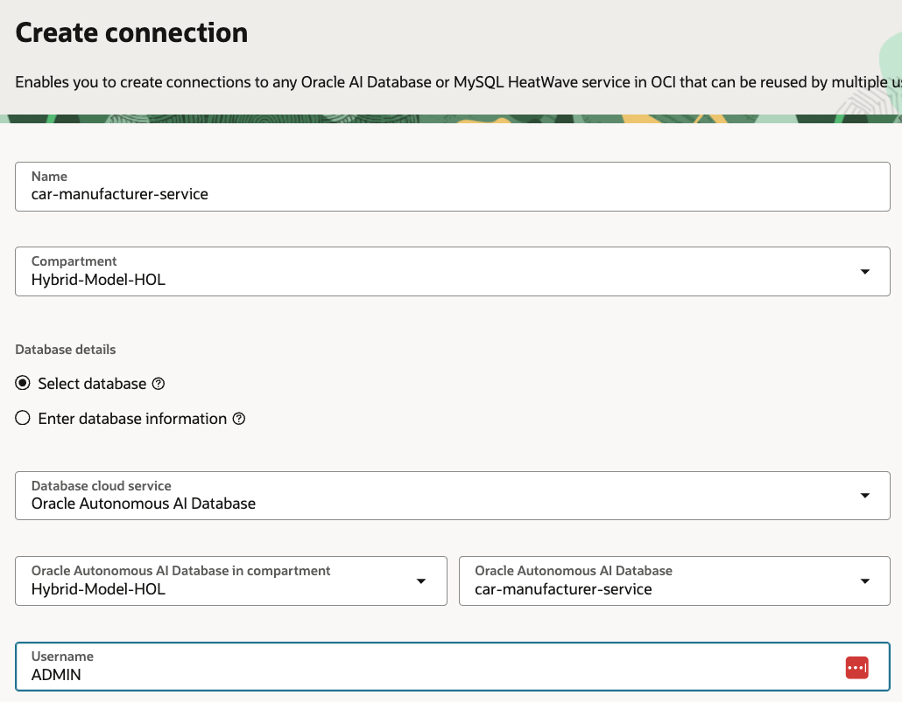
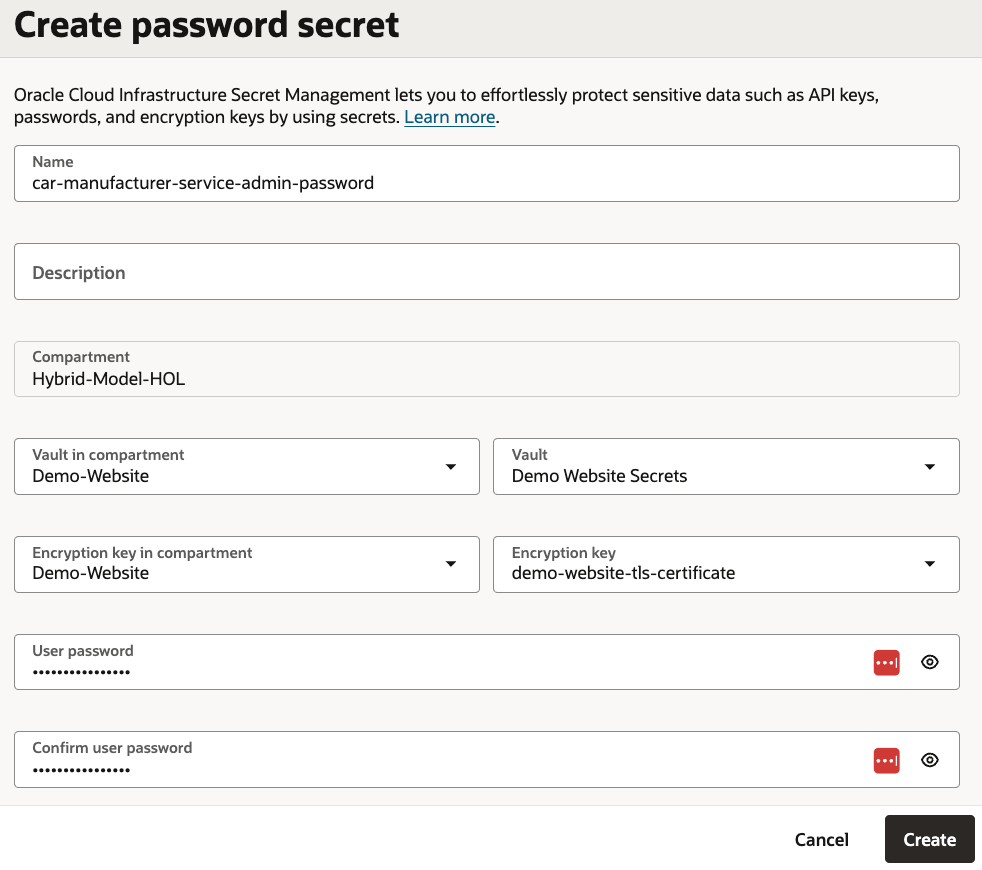
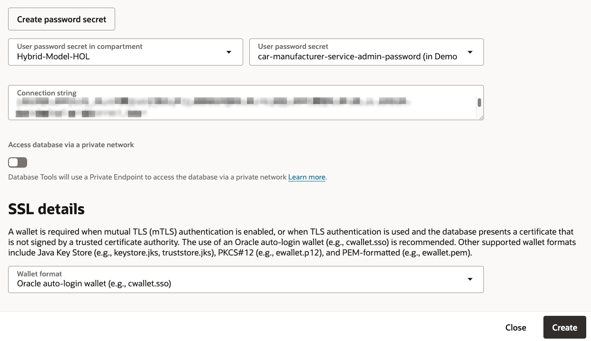
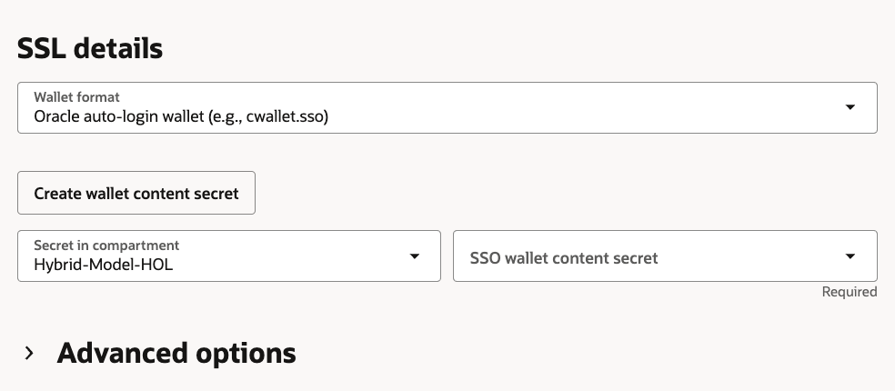
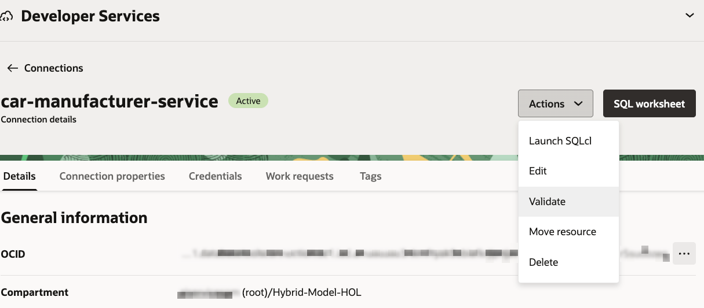
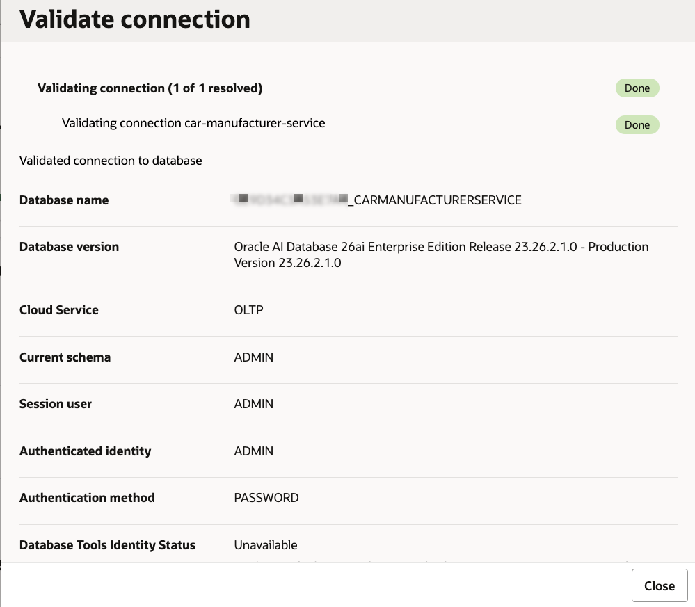
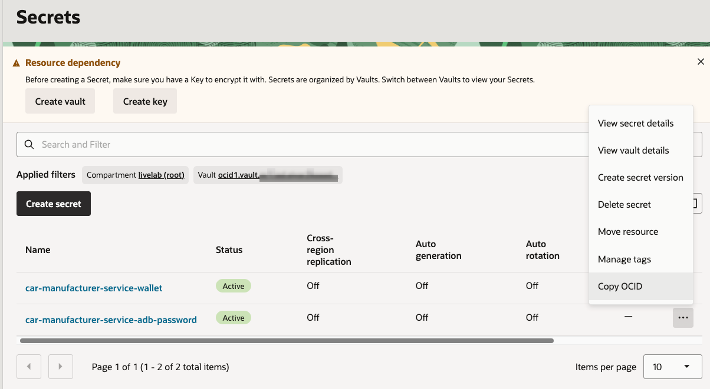

# Database Tools and Vault

## Introduction

In this lab, you create an OCI Vault and encryption key, then create two Database Tools connections that connect the Semantic Store, will be created in the next lab, to the database.

Estimated Time: 25 minutes

### Objectives

In this lab, you will:

- Create an OCI Vault and encryption key
- Create Enrichment and Query Database Tools connections (which also require creating secrets to store credentials)
- Validate the connections
- Record the OCIDs for the vault, connection, and password secret

### Prerequisites

This lab assumes you have:

- Completed the Service Database lab
- The `ADMIN` database password
- Permission to create Vault, key, secret, and Database Tools resources in the workshop compartment

## Task 1: Create the OCI Vault and encryption key

1. Confirm that the OCI Console is set to the same region where you created the workshop resources.

1. In the Console navigation menu, go to **Identity & Security**, then **Vault**.

1. Select the workshop compartment.

1. Click **Create Vault**.

1. Enter the following values and keep the remaining defaults:

    ```text
    Compartment: <workshop-compartment>
    Name: car-service-vault
    ```

1. Click **Create Vault**.

1. Wait until the vault lifecycle state changes to **Active**.

1. In the `car-service-vault` vault details page, copy the Vault's OCID and paste it into our text file as the value for `Vault OCID`.

1. Select the **Master encryption keys** tab.

1. Click **Create Key**.

1. Enter the following values and keep the remaining defaults:

    ```text
    Compartment: <workshop-compartment>
    Name: car-service-key
    ```

1. Click **Create Key**.

1. Wait until the key lifecycle state changes to **Enabled**.

## Task 2: Create the database connections

1. In the Console navigation menu, go to **Developer Services**, then under **Database Tools** select **Connections**.

    

1. Make sure you are in the workshop's compartment.

1. Click **Create connection**.

1. Enter the following values:

    ```text
    Name: car-service-enrichment
    Compartment: <workshop-compartment>
    Database details: Select database
    Database cloud service: Oracle Autonomous AI Database
    Oracle Autonomous AI Database in compartment: <workshop-compartment>
    Autonomous AI Database: car-service
    Username: ADMIN
    ```

    

1. Click **Create password secret**.

1. Enter the following values:

    ```text
    Name: car-manufacturer-service-adb-password
    Vault in compartment: <workshop-compartment>
    Vault: car-service-vault
    Encryption key: car-service-key
    User password: <ADMIN-password>
    ```

    

1. Confirm the password and click **Create**.

    

1. Back in the Create connection wizard page, select the password secret you created (it might be auto-selected).

    

1. In **SSL details**, choose **Oracle auto-login wallet** in the **Wallet format** field.

1. Click **Create wallet content secret**.

    

1. Enter the following values:

    ```text
    Name: car-manufacturer-service-wallet
    Vault in compartment: <workshop-compartment>
    Vault: car-service-vault
    Encryption key: car-service-key
    Wallet source: Retrieve regional wallet from Autonomous AI Database
    ```

    

1. Click **Create**.

1. Back in the **Create connection** page, select the created wallet content secret (it might be auto-selected).

    

1. Click **Create**.

1. Copy the **Enrichment** connection OCID and update the value for the `Database Tools enrichment connection OCID` parameter.

1. We are going to create another database connection, the **Query** connection, which will be very similar to the **Enrichment** connection but with a few tiny differences:

    - Go back to the **Connections** page.
    - Click **Create connection**.
    - Use the exact same instructions to create this connection but change the following:

        - Connection name: car-service-query
        - Repeat the steps to select the database and fill in the user name as described for the **Enrichment** connection.
        - Instead of creating new secrets for the **User password secret** password and **SSO wallet content secret**, select the same ones we've already created for the **Enrichment** connection (`car-manufacturer-service-adb-password` for the **User password secret** password and `car-manufacturer-service-wallet` for the **SSO wallet content secret**).
        - Click **Create**.

1. Copy the **Query** connection OCID and update the value for the `Database Tools query connection OCID` parameter.

## Task 3: Validate connections

You are now going to validate that the connections have been configured correctly and provide access to the database.

1. Open the `car-service-enrichment` connection details page.

2. From **Actions**, select **Validate**.

    

3. Click **Validate**.

    

4. Confirm that the validation result is successful.

    

5. Do the same for the `car-service-query` connection.

## Task 4: Obtain the ADMIN password secret OCID

The test app which you will use to test the solution needs to connect to the database. In order for the app to provide authentication information to establish this connection, we need to retrieve the ADMIN user password secret we created for our database connections.

1. In the Console navigation menu, go to **Identity & Security**, then **Vault**.

1. Click **Go to Secrets Management**.

1. In the secrets list, locate the `car-manufacturer-service-adb-password` secret, click the "three dots"/ellipsis menu and select **Copy OCID**.

1. Save the OCID as the value for `ADMIN password secret OCID` in our text file.

    

At this stage, we have a pair of connections which we will use to connect our Semantic Store to the database. We also have a pair of secrets in a Vault which will keep our credentials safe and out of our code.

You may now **proceed to the next lab**.

## Learn More

- [Database Tools console tasks](https://docs.oracle.com/en-us/iaas/database-tools/doc/using-oracle-cloud-infrastructure-console.html)
- [Create a Vault](https://docs.oracle.com/iaas/Content/KeyManagement/Tasks/managingvaults_topic-To_create_a_new_vault.htm)
- [Create a master encryption key](https://docs.oracle.com/en-us/iaas/Content/KeyManagement/Tasks/managingkeys_topic-To_create_a_new_key.htm)
- [Create a Vault secret](https://docs.oracle.com/iaas/Content/KeyManagement/Tasks/managingsecrets_topic-To_create_a_new_secret.htm)
- [Vault key management](https://docs.oracle.com/en-us/iaas/Content/KeyManagement/Tasks/managingkeys.htm)

## Acknowledgements

- **Author** - Julien Lehmann, Product Marketing Manager, Yanir Shahak, Senior Principal Software Engineer
