# Lab 1: Unstructured RAG

## Introduction

In this lab, you create the unstructured retrieval source for the Seer Construction Intelligence assistant. Your environment already includes an Object Storage bucket with an Austin structural engineering specification in PDF format. You will create an OCI Enterprise AI project, create an unstructured vector store, and sync the specification into the vector store. The app will query the vector store through the OCI Enterprise AI Responses API and its built-in `file_search` tool.

Estimated Time: 15 minutes

> **Screenshots:** Some console images have been adapted to illustrate the Construction Engineering resource names. Use your reservation-specific compartment and bucket; example identifiers and timestamps are not values to copy.

### Objectives

In this lab, you will:

- Review the sandbox resource list
- Create the OCI Enterprise AI project
- Confirm the existing construction evidence bucket and structural engineering specification
- Create an unstructured vector store
- Create and run a data sync connector
- Record the project OCID and Vector store ID for the sample app

## Task 1: Review the sandbox resource list

1. The sandbox environment has already provisioned the OCI foundation resources for this workshop. You will be able to see the OCIDs and other resource values in the sandbox environment alongside the login and tenancy information. We will use this information as we progress through the workshop.

    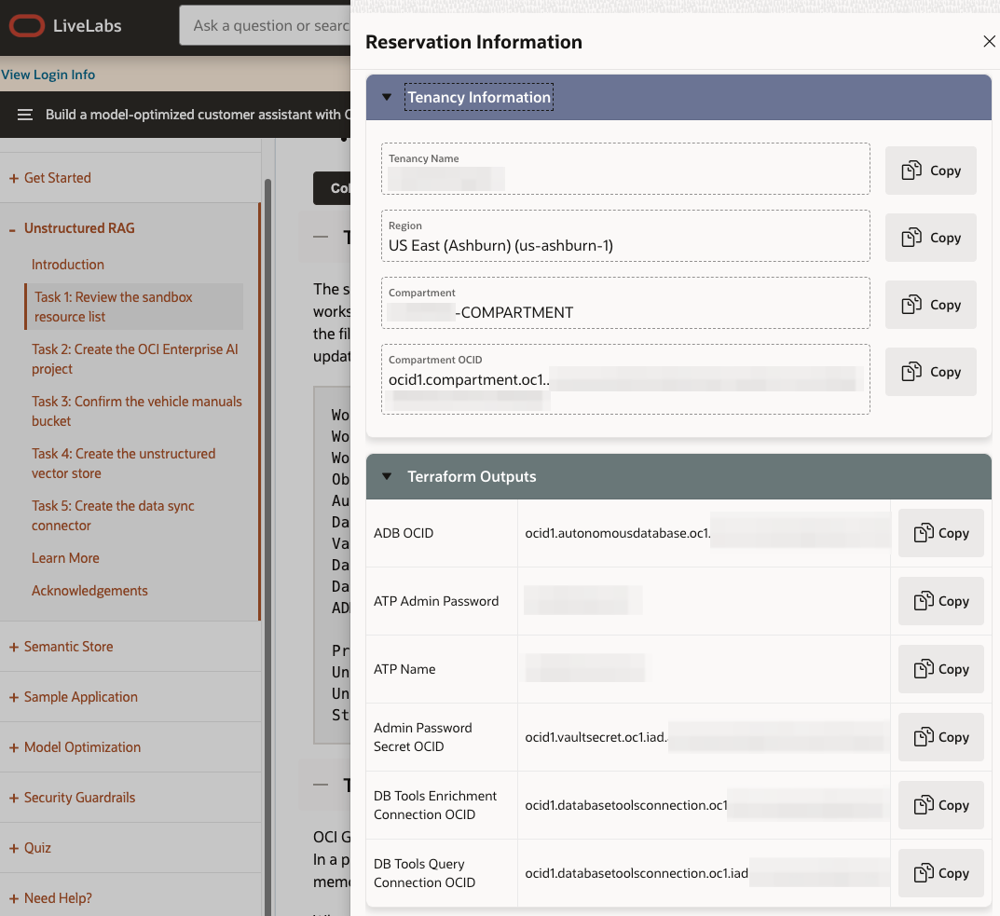

2. When any task asks you to select a compartment, expand **LiveLabs** and select the reservation-specific child compartment named like `LL<reservation>-COMPARTMENT`. Do not select the parent **LiveLabs** compartment.

3. Use your favorite editor to create a simple worksheet for the values used by the sample app and Gen AI tools.

    | Value | Where to get it | Later `.env` variable | Where value is needed |
    | --- | --- | --- | --- |
    | Workshop compartment OCID | Sandbox resource list | `OCI_GENAI_GUARDRAILS_COMPARTMENT_OCID` | `.env` |
    | Workshop region | Sandbox resource list | `OCI_ADB_MCP_REGION`, `OCI_ADB_MCP_PASSWORD_SECRET_REGION`, `OCI_GENAI_REGION` | `.env` |
    | Autonomous AI Database OCID | Sandbox resource list | `OCI_ADB_DATABASE_OCID` | `.env` |
    | Database Tools enrichment connection OCID | Sandbox resource list |  | Semantic Store configuration |
    | Database Tools query connection OCID | Sandbox resource list |  | Semantic Store configuration |
    | CONSTRUCTION_ENGINEERING password secret OCID | Generated sample app `.env` or Launch helper | `OCI_ADB_MCP_PASSWORD_SECRET_OCID` | `.env` |
    | Project OCID | Project created in this lab | `OCI_GENAI_PROJECT_OCID` | `.env` |
    | Unstructured Vector store ID | Vector store created in this lab | `OCI_GENAI_VECTOR_STORE_IDS` | `.env` |
    | Structured semantic store OCID | Semantic Store lab | `OCI_GENAI_SEMANTIC_STORE_OCID` | `.env` |
    | Configured sample app PAR | Sandbox resource list |  | Build path download |
    | Launch helper PAR | Sandbox resource list |  | Launch path download |
    | OCI config file path | Build path | `OCI_CONFIG_FILE` | `.env` |
    | OCI config profile | Build path | `OCI_CONFIG_PROFILE` | `.env` |

    Copy the following worksheet into your text file. Fill in the values available in the Sandbox Resource List. Add the project and vector-store identifiers after creating those resources. The same workshop region fills all three region entries.

    > **Important:** The resource list may show only the **Admin Password Secret OCID**. This is not the application schema secret. The configured sample app and Launch helper already contain the secret for the `CONSTRUCTION_ENGINEERING` database user. Preserve that generated value; do not replace it with the ADMIN secret or copy the secret password into your worksheet.

    ```
    <copy>
    (Sandbox Resource List)     OCI_GENAI_GUARDRAILS_COMPARTMENT_OCID=
    (Sandbox Resource List)     OCI_ADB_MCP_REGION=
    (Sandbox Resource List)     OCI_ADB_MCP_PASSWORD_SECRET_REGION=
    (Sandbox Resource List)     OCI_GENAI_REGION=
    (Sandbox Resource List)     OCI_ADB_DATABASE_OCID=
    (Generated configuration)  OCI_ADB_MCP_PASSWORD_SECRET_OCID=
    (OCI Gen AI)                OCI_GENAI_PROJECT_OCID=
    (OCI Gen AI)                OCI_GENAI_VECTOR_STORE_IDS=
    (OCI Gen AI)                OCI_GENAI_SEMANTIC_STORE_OCID=
    (Sandbox Resource List)     CONFIGURED_SAMPLE_APP_PAR=
    (Sandbox Resource List)     LAUNCH_HELPER_PAR=
    (Sample Application Lab)    OCI_CONFIG_FILE=
    (Sample Application Lab)    OCI_CONFIG_PROFILE=

    </copy>
    ```

    As we progress through the following tasks and labs, you will fill in the missing values that we will use for the sample app in a later lab.

## Task 2: Create the OCI Enterprise AI project

OCI Generative AI projects organize conversations and responses under a shared set of settings. In a project, you define data retention periods, enable long-term memory, and enable short-term memory compaction.

When an application makes API requests against the OCI Enterprise AI service's responses/conversations APIs, referencing the project in the API call tells the service to use the configuration defined in the project for this call.

Each project supports separate lifecycle and compliance boundaries. Reference the project OCID in API and SDK calls to apply project settings at runtime.

1. Make sure to select the sandbox region if it is not selected by default.

1. In the Console navigation menu, go to **Analytics & AI**, then **Generative AI**.

1. Under **Generative AI**, select **Projects**.

    > **Console navigation:** If the overview does not show **Projects**, select **Applications** and expand the left navigation. Select **Projects** there. Use the same navigation to reach **Vector stores** in Task 4 and Lab 2.

    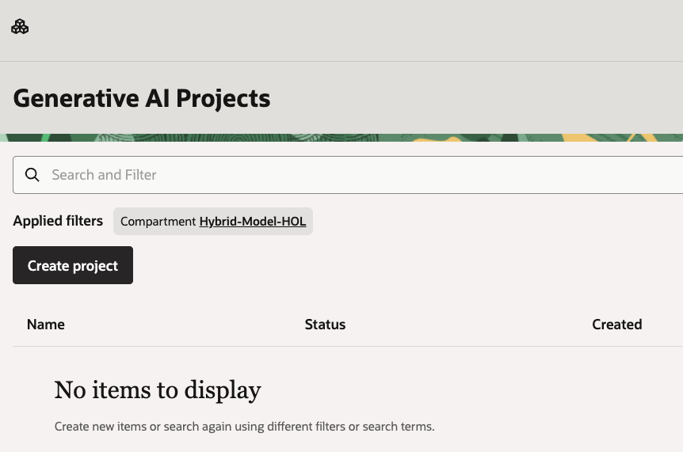

1. Make sure that your reservation-specific child compartment is selected in **Applied filters**.

1. Click **Create project**.

1. Enter the following values:

    ```text
    Name: seer-construction
    Description: Seer Construction Intelligence project
    Compartment: <workshop-compartment>
    ```

    Use the reservation-specific child compartment from your sandbox resource list.

    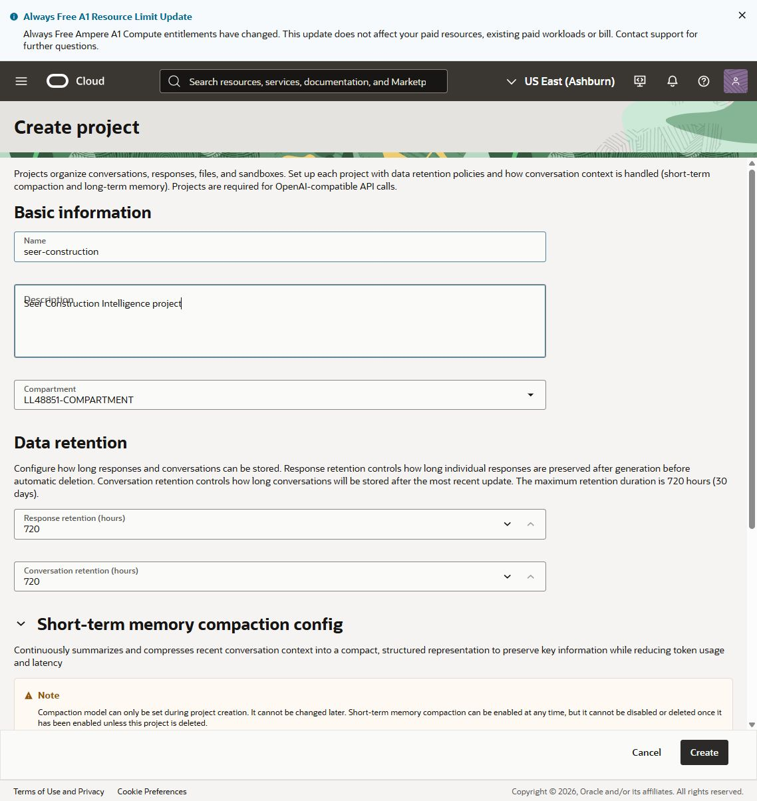

1. Observe the response and conversation retention for the workshop.

    For this workshop we will leave those values at their default values, but this setting can be configured to control how long the system will retain responses and conversations sent over the Responses and Conversations APIs.

    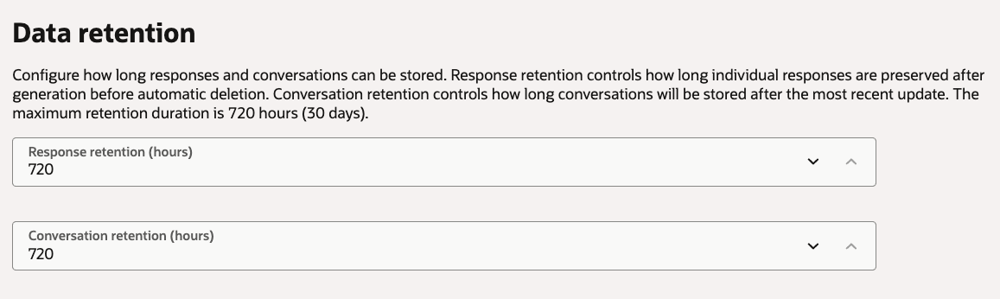

1. Click **Create**.

1. Open the project, copy the project OCID, and record it as the value for `Project OCID` in your text file.

    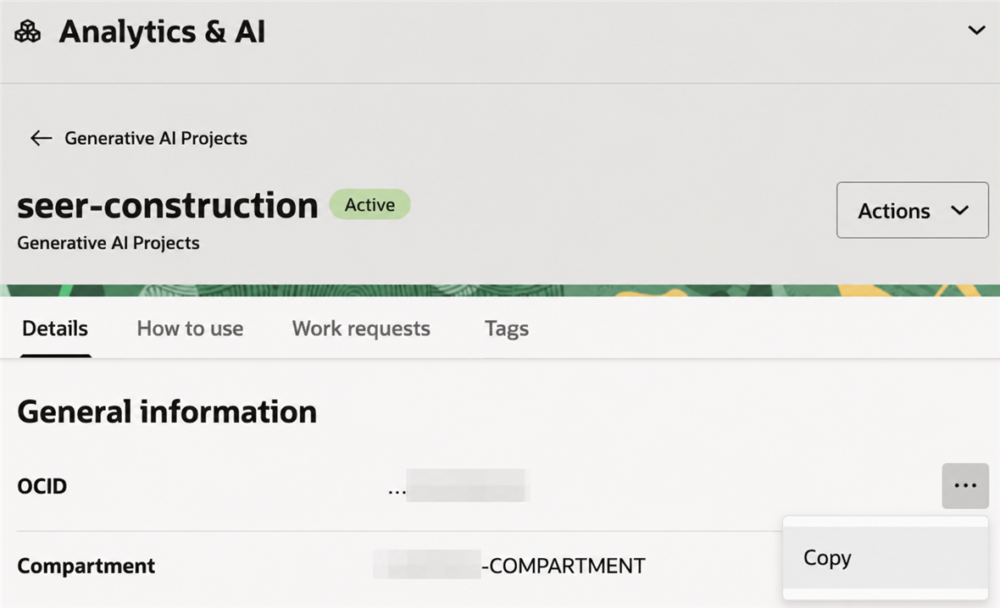

## Task 3: Confirm the construction evidence bucket

The sandbox already includes the Object Storage bucket that stores the source document for unstructured retrieval. The data sync connector will read this bucket and ingest the PDF into the vector store.

1. In the Console navigation menu, go to **Storage**, then **Buckets**.

2. Select the reservation-specific child compartment from your sandbox resource list.

3. Open the bucket named in your sandbox resource list.

4. Click the **Objects** tab.

5. Confirm that the bucket contains `austin_structural_engineering_specification.pdf`.

    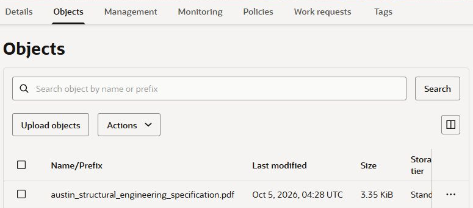

## Task 4: Create the unstructured vector store

The unstructured vector store scans files, splits them into chunks, embeds the chunks for semantic search, and stores the results. The support agent can use the vector store content to answer user questions.

1. In the Console navigation menu, go to **Analytics & AI**, then **Generative AI**.

2. Select **Vector stores**.

    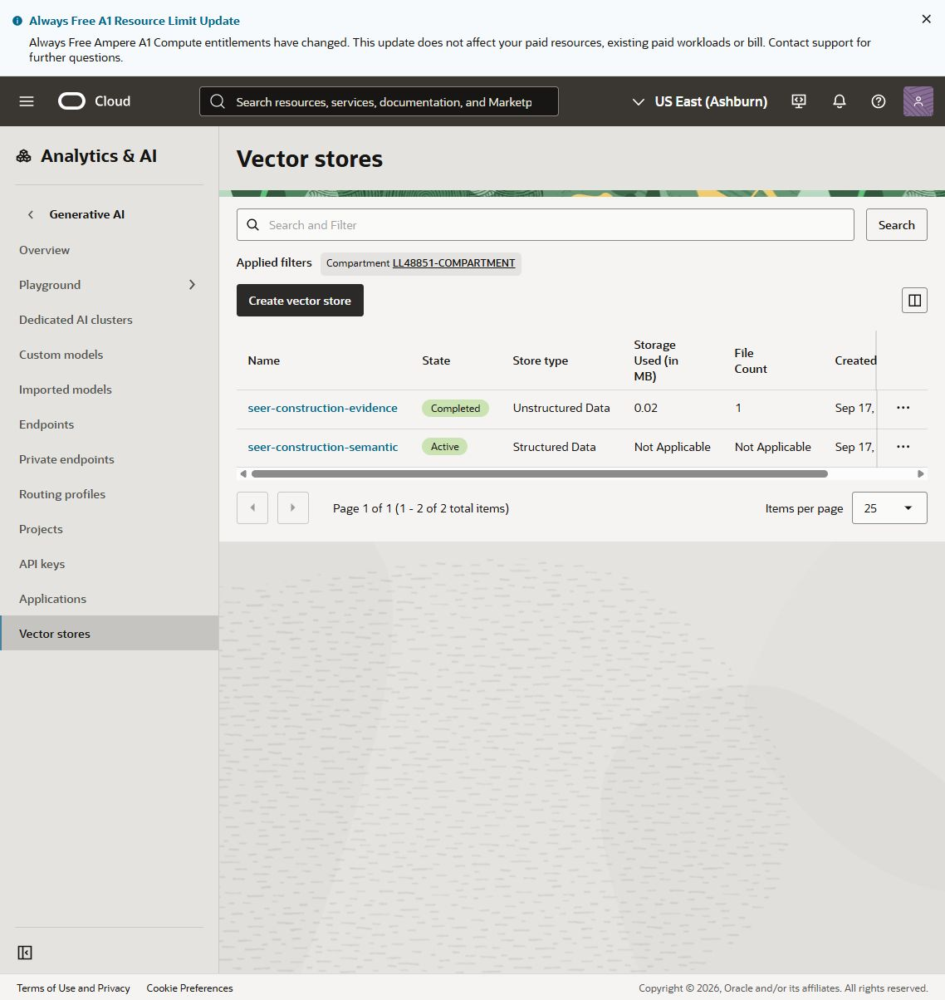

3. Click **Create vector store**.

4. Enter the following values:

    ```text
    Name: seer-construction-evidence
    Description: Construction specifications and governed project evidence
    ```

    - Select the reservation-specific child compartment from your sandbox resource list.
    - Under **Data source type**, select **Unstructured data**.

    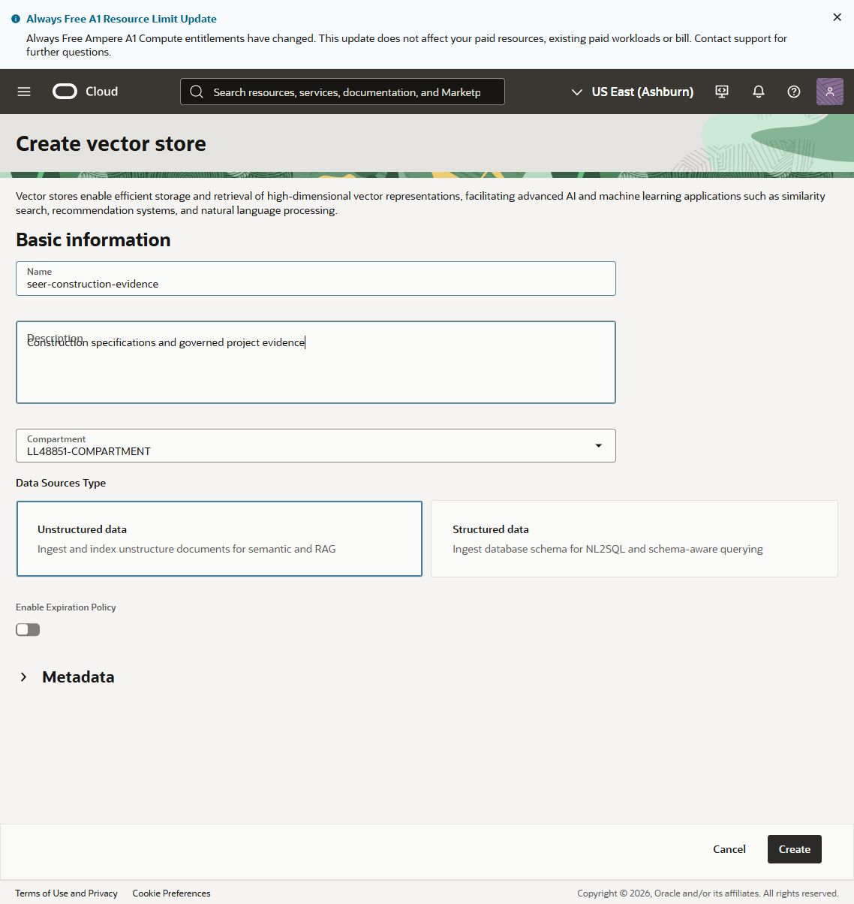

5. Click **Create**.

6. Wait for the vector store to appear in the list, then open it. An empty vector store can remain **In progress** until its first ingestion finishes. Continue with connector creation in Task 5; do not wait for an empty store to become **Completed**. The final readiness check follows the data sync.

7. Open the vector store details page.

    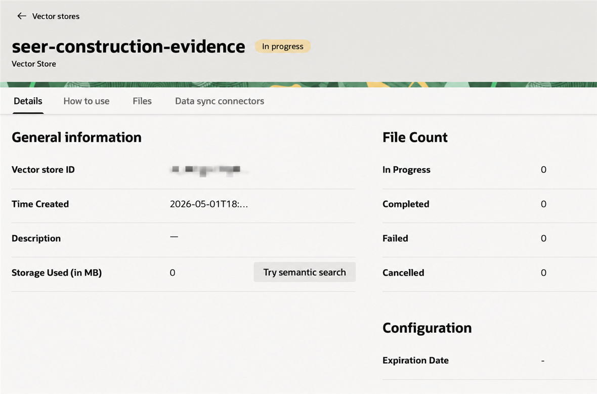

8. Copy the **Vector store ID** and record it as the value for `Unstructured Vector store ID`. The value should look like `vs_iad_3vw620r...`.

## Task 5: Create the data sync connector

The data sync connector facilitates the processing pipeline where files are read from the storage bucket and processed into the vector store. Starting a Data Sync Job in the connector starts the ingestion process.

1. In the vector store, select the **Data sync connectors** tab.

2. Click **Create data sync connector**.

    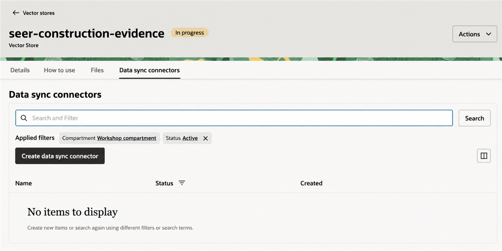

3. Data sync connector configuration:

    ```text
    Name: construction-evidence
    Compartment: Select the reservation-specific child compartment from your sandbox resource list.
    Bucket: The bucket name is `seer-construction-evidence-...`.
    Turn Select all in bucket on.
    ```

    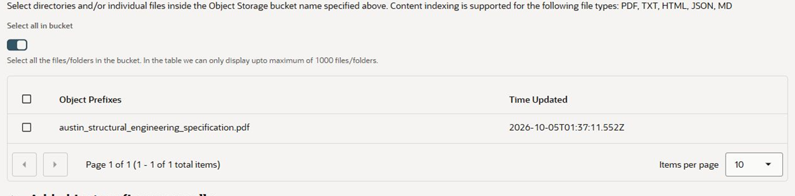

4. Click **Create**.

5. Confirm that the data sync connector appears in the list in an **Active** state.

    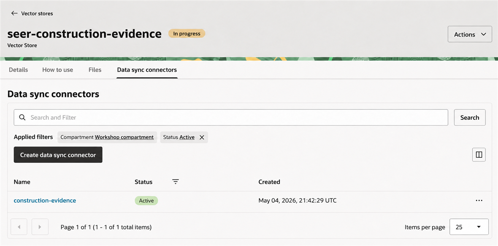

6. Open the data sync connector details page.

    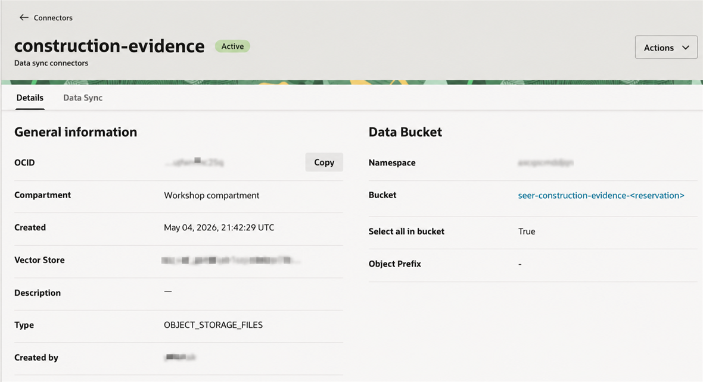

7. Open the **Data sync** tab.

    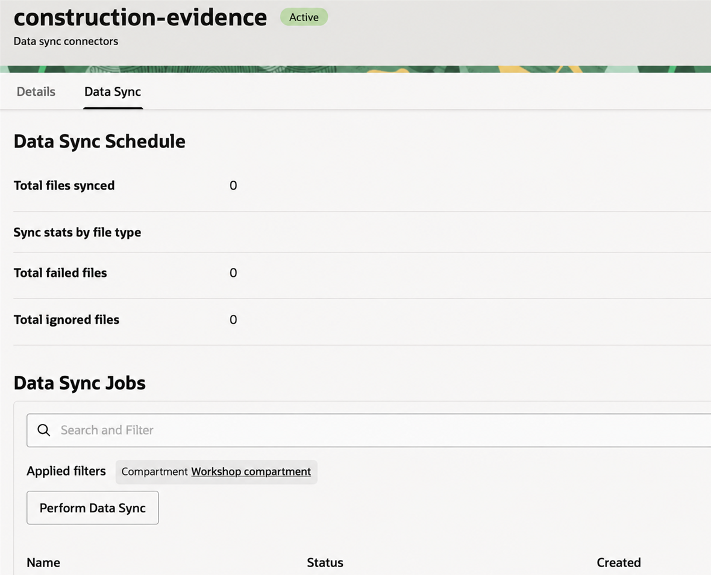

8. Under the **Data Sync Jobs** list, click **Perform Data Sync**.

9. Name the data sync job: `construction-evidence`

    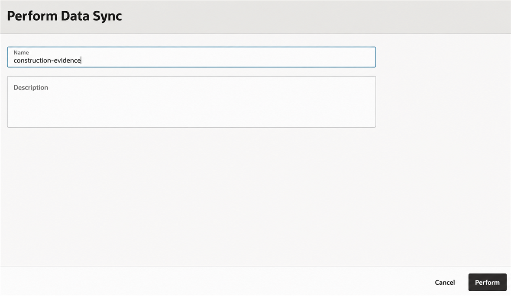

10. Click **Perform**.

11. Wait until the data sync job reaches a **Succeeded** state.

    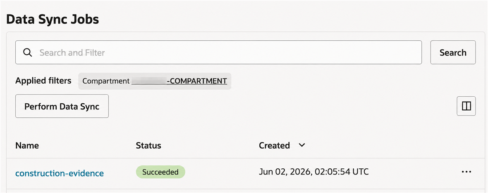

12. Return to the vector store details page.

13. Confirm that the completed file count is `1`. Do not continue until the data sync job is **Succeeded**, the vector store is **Completed**, and the processed file count is nonzero.

    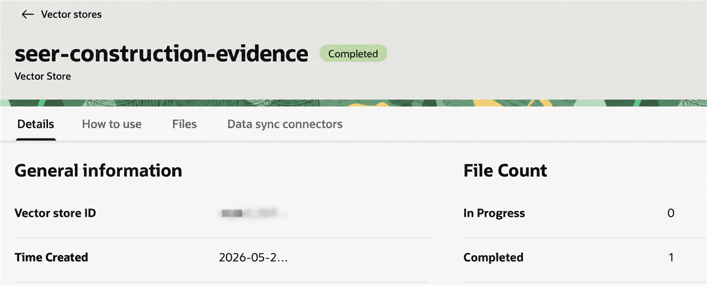

At this point, we have populated our vector store with the PDF stored in the Object Storage bucket. The Data Sync Job read the file, broke it into chunks, embedded each chunk for search, and stored the results in the vector store. The service manages this process so your code does not have to.

You may now **proceed to the next lab**.

## Learn More

- [Managing Object Storage buckets](https://docs.oracle.com/en-us/iaas/Content/Object/Tasks/managingbuckets.htm)
- [Uploading objects to Object Storage](https://docs.oracle.com/en-us/iaas/Content/Object/Tasks/managingobjects.htm)
- [OCI Generative AI QuickStart for vector stores and file search](https://docs.oracle.com/en-us/iaas/Content/generative-ai/get-started-agents.htm)

## Acknowledgements

- **Author** — Julien Lehmann - Product Marketing Manager, Yanir Shahak - Senior Principal Software Engineer
- **Contributors** — Oracle LiveLabs Platform Team
- **Last Updated By/Date** — Eli Schilling, October 2026
