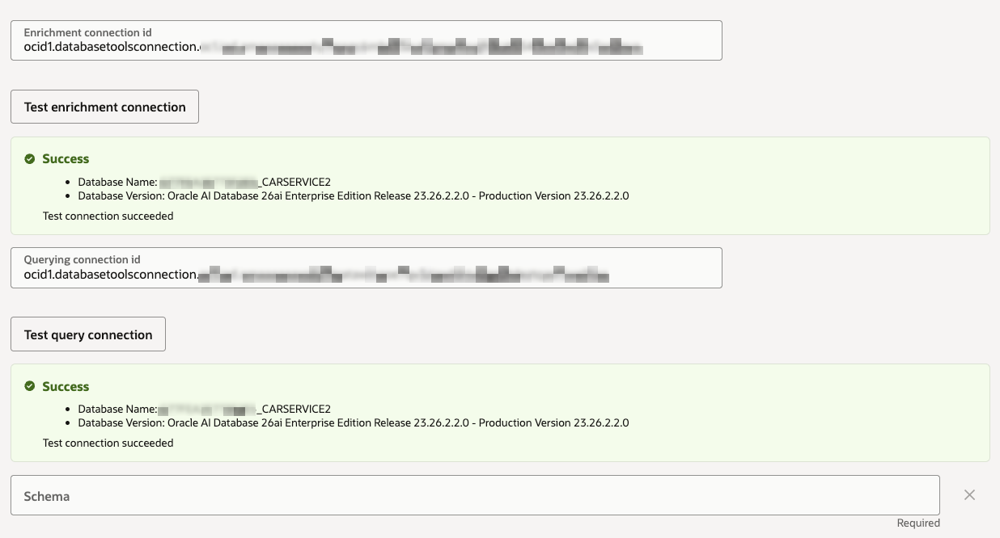

# Semantic Store

## Introduction

In this lab, you create the structured semantic store for Example Motor's service appointment questions. The environment already includes the Autonomous AI Database, schema, seed data, Vault secret, and Database Tools connections. The semantic store connects OCI Enterprise AI to that database through the provided Database Tools connections. The sample app sends natural language questions to the NL2SQL API for this semantic store, validates the generated SQL, and retrieves the data through the ADB MCP Server.

Estimated Time: 10 minutes

### Objectives

In this lab, you will:

- Create a structured semantic store
- Connect the semantic store to the pre-created service database
- Run the semantic enrichment
- Record the semantic store OCID for the sample app

### Prerequisites

This lab assumes you have:

- Completed the Unstructured RAG lab

## Task 1: Create the structured semantic store

1. In the Console navigation menu, go to **Analytics & AI**, then **Generative AI**.

1. Select **Vector stores**.

1. Select the workshop compartment from your sandbox resource list.

1. Click **Create vector store**.

1. Enter the following values:

    ```text
    <copy>
    Name: car-manufacturer-service
    Description: Example Motors service appointment semantic store
    Compartment: <workshop-compartment>
    Data source type: Structured data
    Connection type: OCI Database tool
    </copy>
    ```

    

    Use the connection OCIDs from your sandbox resource list:

    ```text
    <copy>
    Enrichment connection ID: <Database Tools enrichment connection OCID>
    Querying connection id: <Database Tools query connection OCID>
    Schema: ADMIN
    Automation: On create
    </copy>
    ```

1. Click **Test enrichment connection** to make sure the semantic store can use the connection to connect to the database.

1. Click **Test query connection** to make sure the semantic store can use the connection to connect to the database.

    

1. Click **Create**.

1. Wait for the `car-manufacturer-service` semantic store to be at the `Active` state.

1. Copy the semantic store OCID and record it as the value for `Structured semantic store OCID`.

At this stage, we have a Semantic Store connected to the sandbox database. The Semantic Store will help us generate SQL queries from natural language for retrieving relevant information from the database.

You may now **proceed to the next lab**.

## Learn More

- [OCI Generative AI QuickStart for semantic stores and NL2SQL](https://docs.oracle.com/en-us/iaas/Content/generative-ai/get-started-agents.htm)

## Acknowledgements

- **Author** - Julien Lehmann - Product Marketing Manager, Yanir Shahak - Senior Principal Software Engineer
